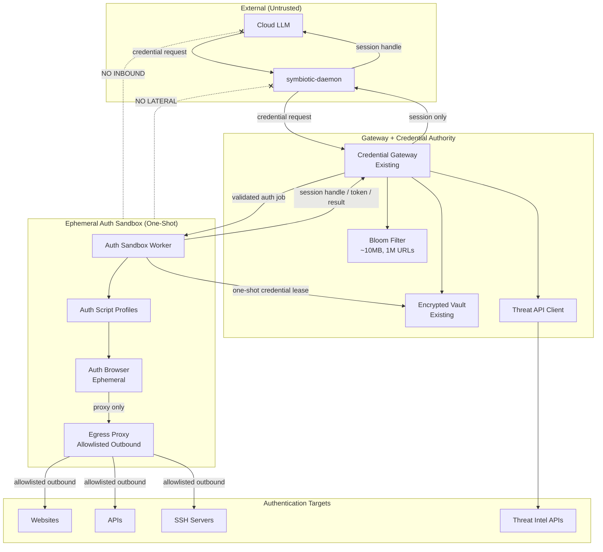
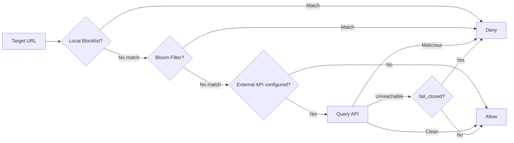
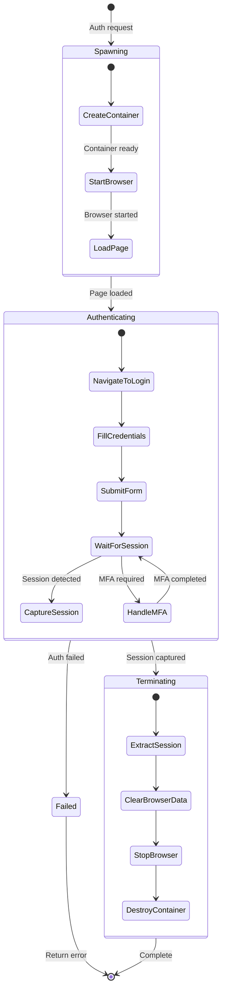
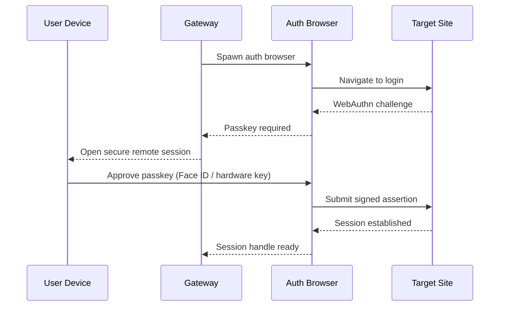
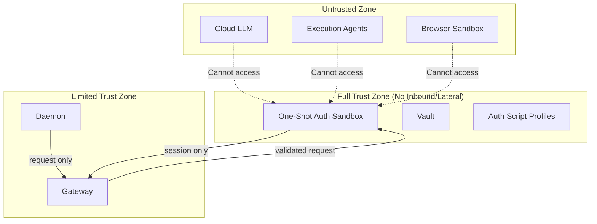
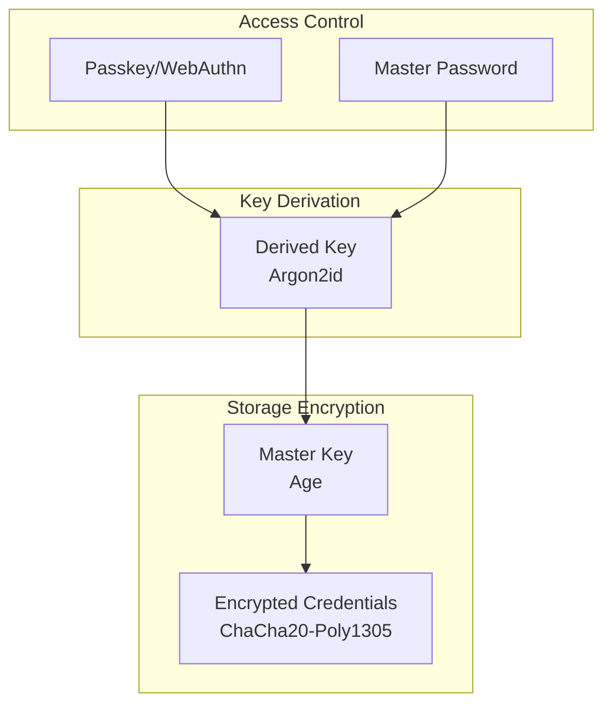
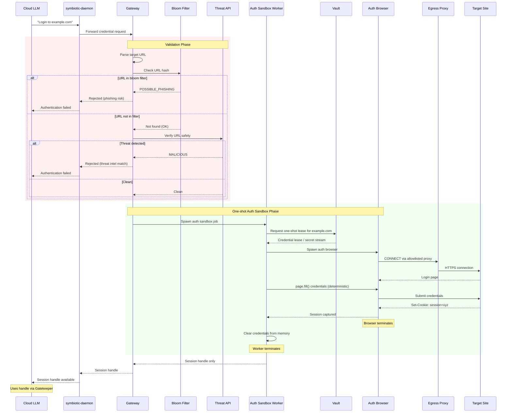
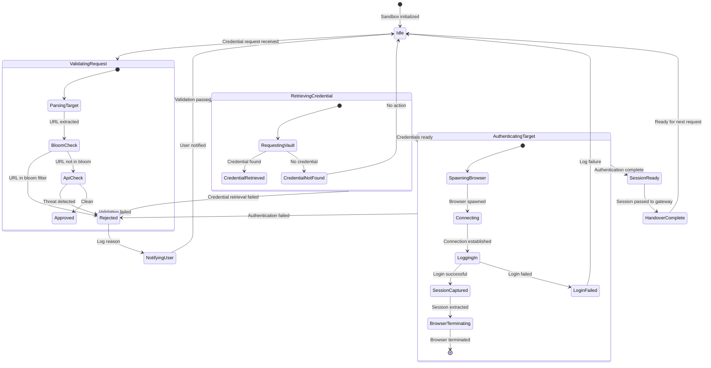

# Credential Sandbox Design (Planned)


> Current implementation: see `docs/architecture/credential-sandbox.md`

**Status**: Planned (Approved)
**Task**: T41 (Local-Only Credential Handling)
**Depends on**: T67 (Privacy & Security Layer)

> Approved follow-through for runner-backed first-login auth now lives in `docs/design/credential-auth-bridge.md`.

## Overview

This document describes planned features for the credential sandbox that extend the current MVP implementation. The MVP provides session handles, encrypted vault storage (`svlt2` AEAD), static threat checking, and the gateway API. This design covers the remaining security layers needed for a fully sealed credential runtime.

The primary contract remains unchanged: normal callers receive session handles, not raw secrets. When raw credentials are unavoidable for first-login or protocol bootstrap, they must be used only inside a short-lived, single-purpose auth sandbox. They must never be exposed to cloud models, the general agent runner, or any long-lived execution service.

## Planned Components

| Component | Status | Purpose |
|-----------|--------|---------|
| **Bloom Filter** | Not implemented | Fast local phishing/compromised URL checking |
| **Threat API Client** | Not implemented | External threat intelligence (Google Safe Browsing, VirusTotal) |
| **Auth Sandbox Worker** | Not implemented | One-shot, target-scoped worker allowed to touch raw credentials only for a single auth/protocol job |
| **Auth Browser** | Not implemented | Ephemeral browser for authentication flows inside the auth sandbox |
| **Auth Script Profiles** | Not implemented | Deterministic scripts used inside the auth sandbox, never by the general runner |
| **Egress Proxy** | Not implemented | Allowlisted outbound proxy for auth browser |
| **Remote Login Session** | Not implemented | noVNC session for passkey/MFA/card entry |
| **Sealed Runtime** | Not implemented | Container isolation with no inbound/lateral access |
| **Advanced Credential Types** | Not implemented | Passkeys, payment cards, SSH keys, password manager import |

## Target Architecture

When fully implemented, the credential sandbox adds network isolation, dynamic threat checking, and a strict exception path for raw-secret use. The `Vault` remains storage and policy. Any unavoidable raw-secret use happens only in a short-lived auth sandbox worker.



> **Note:** Deterministic auth scripts remain the right primitive, but they must run only inside the ephemeral auth sandbox worker. The general runner and cloud models never receive raw credentials. See `docs/design/compute-tiers.md` for the broader rationale.

## Credential Use Policy

### Default Path

- Return session handles, proxy results, or daemon-side enriched tool outputs.
- Prefer OAuth/device flows, cookies, scoped tokens, or provider-side authenticated actions.
- Keep raw credentials out of the general runner, tool env vars, logs, and cloud model context.

### Exception Path

- Raw credentials are allowed only for a short-lived auth sandbox worker.
- The worker must be target-scoped, purpose-scoped, and destroyed after one job.
- The worker may use deterministic browser/protocol scripts, but not a general LLM loop.
- Output must be a session handle, token, cookie jar, or structured result, not the raw secret.

### Forbidden Path

- No raw credentials to cloud models.
- No raw credentials to `symbiotic-agent-runner`.
- No raw credentials in generic tool execution sandboxes.
- No raw credentials in logs, archives, crash dumps, or persistent sandbox filesystems.

## Bloom Filter

The bloom filter provides microsecond-level local checking for known bad URLs, serving as the first tier of validation before more expensive API checks.

### Parameters

| Parameter | Value | Rationale |
|-----------|-------|-----------|
| **Capacity (n)** | 1,000,000 URLs | Covers major public threat feeds |
| **False positive rate (p)** | 0.1% (0.001) | Low enough to avoid blocking legitimate sites |
| **Bit array size (m)** | ~14.4 Mbit (~1.8 MB) | Computed: `m = -n*ln(p)/(ln2)^2` |
| **Hash functions (k)** | 10 | Computed: `k = (m/n)*ln2` |
| **Hash algorithm** | XXH3 (128-bit) | Fast non-cryptographic hash; split into k slices |
| **URL normalization** | Lowercase host, strip trailing slash, remove query params | Consistent matching |

### Design

```rust
use xxhash_rust::xxh3::xxh3_128;

struct BloomFilter {
    /// ~1.8 MB for 1M URLs at 0.1% false positive rate
    bits: Vec<u64>,       // bit array as u64 words
    num_bits: u64,        // 14_377_588
    num_hashes: u32,      // 10
}

impl BloomFilter {
    fn new(capacity: u64, fp_rate: f64) -> Self {
        let num_bits = Self::optimal_bits(capacity, fp_rate);
        let num_hashes = Self::optimal_hashes(num_bits, capacity);
        let words = ((num_bits + 63) / 64) as usize;
        Self {
            bits: vec![0u64; words],
            num_bits,
            num_hashes,
        }
    }

    fn contains(&self, url: &str) -> bool {
        let normalized = normalize_url(url);
        let hash = xxh3_128(normalized.as_bytes());
        let (h1, h2) = (hash as u64, (hash >> 64) as u64);
        (0..self.num_hashes).all(|i| {
            let bit = (h1.wrapping_add((i as u64).wrapping_mul(h2))) % self.num_bits;
            self.get_bit(bit)
        })
    }

    fn insert(&mut self, url: &str) {
        let normalized = normalize_url(url);
        let hash = xxh3_128(normalized.as_bytes());
        let (h1, h2) = (hash as u64, (hash >> 64) as u64);
        for i in 0..self.num_hashes {
            let bit = (h1.wrapping_add((i as u64).wrapping_mul(h2))) % self.num_bits;
            self.set_bit(bit);
        }
    }

    fn update_from_feeds(&mut self, feeds: &[ThreatFeed]) {
        for feed in feeds {
            for url in feed.urls() {
                self.insert(&normalize_url(url));
            }
        }
    }

    fn optimal_bits(n: u64, p: f64) -> u64 {
        (-(n as f64) * p.ln() / (2.0_f64.ln().powi(2))).ceil() as u64
    }

    fn optimal_hashes(m: u64, n: u64) -> u32 {
        ((m as f64 / n as f64) * 2.0_f64.ln()).round() as u32
    }
}
```

### URL Normalization

```rust
fn normalize_url(url: &str) -> String {
    // 1. Parse URL, default to https:// if no scheme
    // 2. Lowercase the host
    // 3. Remove default ports (80, 443)
    // 4. Strip trailing slash from path
    // 5. Remove query parameters and fragments
    // 6. Return "host/path" string for hashing
}
```

### Feed Sources

- PhishTank (phishing URLs)
- URLhaus (malware URLs)
- OpenPhish (phishing URLs)
- Internal blocklist

### Refresh Cadence

- Incremental feed sync every 6 hours
- Full rebuild every 24 hours
- Emergency rebuild on feed corruption detection

## Threat API Client

The threat API client provides external threat intelligence verification as the second validation tier, catching recently-added threats that the bloom filter has not yet ingested.

### Tiered Check Strategy

The threat check pipeline runs in order, short-circuiting on first match:

1. **Local blocklist** (always, no network): Static list at `policies/blocklists/domains.txt`, one domain per line. Checked before bloom filter. Updated manually or via feed sync.
2. **Bloom filter** (always, no network): Catches known-bad URLs from aggregated feeds.
3. **External API** (optional, network required): VirusTotal or Google Safe Browsing for URLs that pass local checks.



### Design

```rust
struct ThreatApiClient {
    /// External threat intelligence APIs (optional, empty = local-only)
    apis: Vec<ThreatIntelApi>,
    timeout: Duration,           // default: 5s per API
    cache: LruCache<String, ThreatResult>,
    cache_capacity: usize,       // default: 10_000
}

#[derive(Debug, Clone)]
pub enum ThreatIntelApi {
    /// VirusTotal URL scan (4 req/min on free tier)
    VirusTotal {
        /// API key stored in vault under "threat_intel/virustotal"
        api_key_vault_path: String,
        rate_limit: RateLimit,     // default: 4/min
    },
    /// Google Safe Browsing Lookup API v4
    GoogleSafeBrowsing {
        api_key_vault_path: String,
        rate_limit: RateLimit,     // default: 10_000/day
    },
}

impl ThreatApiClient {
    async fn check(&self, url: &str) -> Result<ThreatResult> {
        if let Some(cached) = self.cache.get(url) {
            return Ok(cached.clone());
        }

        if self.apis.is_empty() {
            // No external APIs configured -- local-only mode
            return Ok(ThreatResult::Clean);
        }

        // Query APIs in parallel with per-API timeout
        let results = join_all(
            self.apis.iter().map(|api| {
                tokio::time::timeout(self.timeout, api.check(url))
            })
        ).await;

        for result in &results {
            match result {
                Ok(Ok(r)) if r.is_malicious() => {
                    self.cache.put(url.to_string(), ThreatResult::Malicious);
                    return Ok(ThreatResult::Malicious);
                }
                _ => continue,
            }
        }

        // If all APIs timed out or errored, check fail_closed policy
        let any_succeeded = results.iter().any(|r| matches!(r, Ok(Ok(_))));
        if !any_succeeded {
            return Ok(ThreatResult::Unavailable);
        }

        self.cache.put(url.to_string(), ThreatResult::Clean);
        Ok(ThreatResult::Clean)
    }
}
```

### API Sources (MVP)

| Source | Type | Rate Limit | Cost | Purpose |
|--------|------|------------|------|---------|
| **Local blocklist** | File | Unlimited | Free | Known-bad domains, manually curated |
| **Bloom filter** | Local | Unlimited | Free | Aggregated feed data |
| **VirusTotal** | API (optional) | 4 req/min (free) | Free tier | URL reputation check |
| **Google Safe Browsing** | API (optional) | 10k/day | Free | Phishing/malware detection |

### Configuration

```toml
[threat_intel]
required_sources = ["google_safe_browsing", "secondary"]
cache_ttl_clean_secs = 1800
cache_ttl_malicious_secs = 21600
bloom_incremental_sync_secs = 21600
bloom_full_rebuild_secs = 86400
fail_closed = true
```

- API credentials stored in the vault under `threat_intel/*` keys, mounted into gateway env at runtime only.
- Minimum source set: `google_safe_browsing` + one secondary provider.
- `fail_closed = true`: if all APIs are unreachable, requests are denied.

## Auth Browser

The auth browser is an ephemeral browser instance spawned per authentication request, destroyed after session capture. It provides automated login without exposing credentials outside the sandbox.

### Lifecycle



### Key Properties

- **Ephemeral**: fresh container per request, destroyed after session capture
- **No persistent state**: no browser history, cookies, or cache between sessions
- **Outbound via proxy only**: connects to targets exclusively through the egress proxy
- **Memory clearing**: credentials cleared from browser process memory after form submission

### Integration Boundary with Gateway

The auth browser is controlled exclusively by the one-shot auth sandbox worker. The gateway never interacts with the browser directly, and the general runner never receives raw credential material.

```
Gateway <--> Auth Sandbox Worker <--> Auth Browser <--> Egress Proxy <--> Target
   ^                                                                         |
   |_______________________ session handle / token / result _________________|
```

**Boundary contract:**
- Gateway sends a `ValidatedAuthRequest` to the auth sandbox launcher (target domain, credential ID, auth profile)
- The launcher creates a one-shot auth sandbox worker for that request only
- The auth sandbox worker obtains a one-shot credential lease, drives deterministic scripts, then destroys its process state
- The gateway receives only a `SessionCaptureResult` (session handle or error), never a reusable raw secret export

```rust
/// Gateway -> Auth sandbox launcher
pub struct ValidatedAuthRequest {
    pub request_id: Uuid,
    pub target_domain: String,
    pub credential_id: Uuid,
    pub auth_profile: String,
    pub session_type: SessionType,
    pub timeout: Duration,          // default: 60s
}

/// Launcher -> auth sandbox worker
pub struct OneShotCredentialLease {
    pub lease_id: Uuid,
    pub credential_id: Uuid,
    pub target_domain: String,
    pub expires_at: DateTime<Utc>,
}

/// Auth sandbox worker -> Gateway
pub enum SessionCaptureResult {
    Success {
        request_id: Uuid,
        session_handle: SessionHandle,
    },
    MfaRequired {
        request_id: Uuid,
        mfa_type: MfaType,           // TOTP, WebAuthn, SMS
        remote_session_url: Option<String>, // noVNC URL if user interaction needed
    },
    Failed {
        request_id: Uuid,
        error: AuthError,
    },
}
```

## Auth Sandbox Worker

The auth sandbox worker replaces the idea of doing raw-auth work inside the long-lived credential authority. It uses deterministic Playwright or protocol-specific scripts to handle login/bootstrap flows inside a fresh one-shot sandbox. No AI reasoning is used for raw-secret handling.

### Components

- **Per-site auth profiles:** Site-specific deterministic scripts for known login flows (e.g. `scripts/auth/x.com.ts`, `scripts/auth/github.com.ts`)
- **Generic fallback:** Standard form-detection script that handles `input[type=password]` + submit patterns (covers 95%+ of login forms)
- **TOTP generator:** Pure math from vault-stored TOTP secrets — no LLM needed
- **SMS 2FA handler:** Sends push notification to user, waits for code input
- **Remote session (noVNC):** For CAPTCHAs, WebAuthn, and non-standard flows requiring user interaction

### Requirements

- Playwright/runtime dependencies must be available inside the auth sandbox image
- Auth profiles are loaded by the launcher, not by the general runner
- Fallback: if the auth sandbox system is unavailable, credential operations enter `blocked` state and raise `auth.failed` + `#alerts`
- Cloud models are never used for sandbox credential operations

### Responsibilities

- Receive validated credential requests from the gateway
- Receive a one-shot credential lease scoped to one request
- Drive the auth browser through login flows via deterministic scripts (`page.fill()`, `page.click()`)
- Generate TOTP codes from stored secrets
- Escalate to user remote session for CAPTCHAs/WebAuthn/non-standard flows
- Extract session handles after successful authentication
- Clear credentials from memory after use
- Terminate the worker/container after the single auth job completes

## Egress Proxy with Allowlist

The egress proxy constrains all outbound traffic from the sealed sandbox to an explicit allowlist of targets.

### Design

- Only the auth browser routes traffic through the proxy
- Allowlist is per-request: only the validated target domain is permitted
- All other outbound connections are dropped
- Proxy logs all connections for audit

### Isolation

| Mechanism | Purpose |
|-----------|---------|
| **Egress proxy allowlist** | Sandbox outbound only via proxy, no inbound/lateral access |
| **No volume sharing** | Sandbox containers do not share filesystem with others |
| **Gateway as only bridge** | Single controlled entry/exit point |

## Remote Login Session

For authentication flows that require user interaction (passkeys, hardware MFA, payment card entry), the gateway exposes a remote session.

### Flow



### Implementation

- noVNC over Tailscale (private network only)
- User completes passkey/MFA/card entry on their own device
- Sandbox captures only the session handle after authentication
- Browser is destroyed after session capture

## Advanced Credential Types

### Passkeys

- Device-resident; vault stores only metadata (RP ID, label)
- Authentication requires remote login session for user interaction
- Phishing-resistant (bound to domain)

### Payment Cards

- Cards stored encrypted in vault
- Card data never sent to cloud LLMs
- Card use requires explicit user approval per transaction
- CVV is never stored; user supplies via remote login session when required
- Preferred flow: use remote login session for checkout

### SSH Keys

- Keys stored in vault, never exported to cloud
- Prefer short-lived SSH certificates or agent signing
- Access gated by capability token with TTL

### API Keys

- Stored per-domain in vault
- Granted only via capability tokens with strict scopes
- Tokens never forwarded to cloud LLMs

### Password Manager Import

- One-time import from 1Password/Bitwarden/etc.
- Gateway normalizes and stores entries in the vault
- Vault remains the active source of truth after import

### Planned Credential Schema

```rust
struct StoredCredential {
    id: Uuid,
    domain: String,
    credential_type: CredentialType,

    /// Encrypted with master key
    encrypted_data: Vec<u8>,

    /// When credential was last used
    last_used: Option<DateTime<Utc>>,

    /// When credential expires (if known)
    expires_at: Option<DateTime<Utc>>,
}

enum CredentialType {
    Password { username: String },
    ApiKey { key_name: String },
    OAuth { provider: String },
    SshKey { key_type: String },
    Cookie { domain: String },
    PaymentCard { brand: String, last4: String },
    Passkey { rp_id: String },
}

struct CredentialData {
    /// The actual secret (password, key, etc.)
    secret: SecretString,

    /// Optional TOTP secret for 2FA
    totp_secret: Option<SecretString>,

    /// Additional metadata
    notes: Option<String>,
}

struct CardData {
    /// Primary account number (PAN), encrypted
    pan: SecretString,
    exp_month: u8,
    exp_year: u16,
    billing_zip: Option<String>,
}
```

**Note:** CVV is never stored. If required, the user supplies it via the remote login session.

**Note:** Passkeys are device-resident. The vault stores only metadata (RP ID, label).

## Sealed Sandbox Runtime

The full production target adds container isolation around the credential sandbox components.

### Trust Boundaries



### Container Isolation

- Sandbox containers have no inbound or lateral network access
- Outbound traffic only via the egress proxy
- No shared volumes with other containers
- Ephemeral containers destroyed after each auth session

### Encryption Layers (Production Target)



The production target adds external KMS/escrow, key rotation workflows, and Argon2id key derivation on top of the existing `svlt2` AEAD encryption.

## Full Credential Flow (Target)



## Validation State Machine (Target)



## Error Handling (Planned)

### Validation Errors

| Error | User Notification | Logging |
|-------|-------------------|---------|
| Bloom filter match | "URL flagged as potential phishing" | Log URL, timestamp, source |
| Threat API match | "URL flagged by threat intelligence" | Log URL, API source, details |
| All APIs unreachable | "Threat validation unavailable, request denied" | Log connectivity failure |

### Authentication Errors

| Error | User Notification | Logging |
|-------|-------------------|---------|
| Login failed | "Authentication to {domain} failed" | Log attempt, error page if visible |
| MFA timeout | "MFA verification timed out" | Log timeout duration |
| Session capture failed | "Could not capture session" | Log browser state |
| Auth sandbox unavailable | "Credential operations blocked" | Raise `auth.failed` + `#alerts` |

## Key Decisions

### 1. Two-Tier Validation (Bloom + API)

**Decision:** Fast local bloom filter first, then API verification for URLs that pass the bloom check.

**Rationale:**
- Bloom filter catches 99%+ of known threats in microseconds
- API catches recently-added threats and provides certainty
- Reduces API calls and latency for most requests
- `fail_closed` policy: if APIs are unreachable, requests are denied

### 2. Deterministic Auth Profiles in a One-Shot Sandbox

**Decision:** Raw credential use is allowed only inside a one-shot auth sandbox worker running deterministic scripts. Cloud models and the general runner never receive raw credentials.

**Rationale:**
- Deterministic scripts (`page.fill()`) keep credentials in a narrow, auditable process — no LLM context window exposure
- A one-shot worker is safer than running raw-auth logic inside the long-lived credential authority
- An LLM (even local) creates a prompt injection attack surface where credentials enter the context
- Industry consensus (1Password, Anthropic Computer Use, Skyvern): credential injection is a scripting problem, not a reasoning problem
- Removes local LLM from base tier requirements, reducing VPS cost from $15–30/mo to $3–5/mo
- Script-based approach handles 95%+ of login scenarios; remaining 5% (CAPTCHAs, WebAuthn) require user interaction in any design

### 3. Ephemeral Auth Browser

**Decision:** Auth browser spawns fresh for each request, terminates after session capture.

**Rationale:**
- No persistent state that could leak credentials
- No browser history or cookies from previous sessions
- Clean slate prevents cross-contamination

### 4. No Inbound/Lateral Access for Sealed Runtime

**Decision:** The sealed sandbox has no inbound or lateral network access. Outbound is only via the allowlisted egress proxy.

**Rationale:**
- Even if sandbox is compromised, outbound is constrained to allowlisted targets
- Only the auth browser can egress, and only via the proxy
- Gateway is the only inbound bridge between networks

### 5. Passkey-First for Target Sites

**Decision:** Prefer WebAuthn/Passkey for target-site login when available, with password fallback.

**Rationale:**
- Hardware-backed authentication is more secure
- Phishing-resistant (bound to domain)
- Remote login session supports passkeys on user devices

## Related Components

| Component | Relationship |
|-----------|--------------|
| [Credential Sandbox (Architecture)](../architecture/credential-sandbox.md) | Current MVP implementation |
| [Session Handles](../architecture/session-handles.md) | Session handle contract |
| [VPS Deployment](../architecture/vps-deployment.md) | Container hosting for sealed runtime |
| [Trust & Capabilities](../architecture/trust-capabilities.md) | Trust boundaries |
| [Agent Orchestration](../architecture/agent-orchestration.md) | Credential request source |
| [Matrix Channels](../architecture/matrix-channels.md) | User notification delivery |

## Future Enhancements

1. **Hardware Security Module (HSM):** Store master key in HSM for additional protection
2. **Credential Rotation:** Automatic rotation for API keys with provider integration
3. **Audit Dashboard:** Web interface for reviewing credential access logs
4. **Multi-Factor Policies:** Per-domain MFA requirements
5. **Credential Sharing:** Secure sharing between multiple local Symbiotic instances
