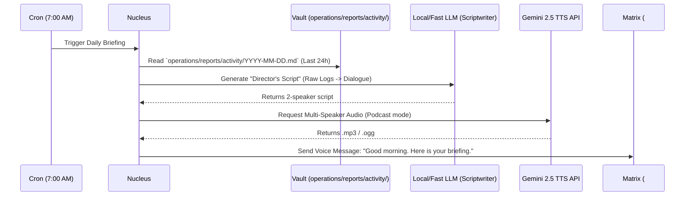

# The Daily Audio Briefing (The Executive Podcast)

**Status**: Proposed Specification
**Epic**: Living Memory (T109) / UX
**Depends on**: The "Company" Model (`agent-company-model.md`) and Vault Organization (`vault-organization.md`)

## 1. The Vision: The Executive Summary

As Symbiotic evolves into a "Company" of autonomous agents working in the background (coding, researching, organizing), the volume of activity logs will outpace the user's ability to read them. 

The user is the CEO. They shouldn't have to read every Git commit or internal RPC message to know what happened overnight. 

**The Solution:** The **Daily Audio Briefing**. A 3-minute, dual-speaker AI podcast delivered via a Matrix voice message to the `#stream` room every morning. It summarizes the previous 24 hours of the `operations/reports/activity/` logs into a conversational, highly engaging format using the Gemini 2.5 Multi-Speaker TTS API.

---

## 2. Architecture & Data Flow

---

## 3. The Three-Stage Distillation

### Stage 1: The Raw Material (The Pulse)
The Nucleus continuously logs events to `operations/reports/activity/2026-03-25.md`:
*   `02:14 [Coder] Merged PR #12: JWT Auth Implementation`
*   `03:30 [FrictionDetector] Coder failed 4 times on SQL syntax.`
*   `04:00 [ProcessEngineer] Upgraded Coder to v2.1 DNA from Marketplace.`
*   `06:00 [Calendar] Reminder: Dentist at 10 AM today.`

### Stage 2: The Director's Script (Text-to-Text)
Sending raw logs to a TTS API produces a dry, robotic read. The Nucleus first uses a fast, cheap model (like Claude 3.5 Haiku or Gemini 2.5 Flash) to translate the logs into a "Podcast Script" with "Director's Notes" for pacing and tone.

**Prompt Example:** *"You are the Chief of Staff. Summarize these raw company logs into a 2-minute conversation between you (Host A: professional, concise) and the Engineering Lead (Host B: technical, energetic)."*

**Output Script:**
> **Host A**: Good morning! It's Wednesday, March 25th. You have a dentist appointment at 10 AM today. Overnight, the engineering swarm made solid progress on the SaaS launch.
> **Host B**: That's right! We finally got the JWT authentication merged around 2 AM. The Coder agent did struggle a bit with the SQL syntax though.
> **Host A**: I saw that. But the Process Engineer stepped in and upgraded the Coder's DNA to version 2.1 from the Marketplace, which smoothed things out immediately. 
> **Host B**: Exactly. We're back on track for the API milestone today.

### Stage 3: The Audio Generation (Text-to-Speech)
The script is sent to the **Gemini 2.5 Multi-Speaker TTS API** (or equivalent Vertex AI Podcast endpoint). The API returns a high-quality, expressive audio file.

### Stage 4: Delivery
The Nucleus uploads the audio file to the Matrix homeserver and sends an `m.audio` event to the `#stream` room. The user taps "Play" in the Symbiotic Flutter app while making coffee.

---

## 4. Friction Points & Resolutions

*   **Friction**: **Cost and Latency**. Generating a 3-minute audio file with two voices can be slow and consume significant API credits.
*   **Resolution**: This is a scheduled background task (e.g., 7:00 AM). The 30-60 second latency to generate the audio doesn't matter because it happens before the user wakes up. The API cost is bounded to exactly once per day.
*   **Friction**: **Privacy**. The activity log contains private data (e.g., bank syncs, calendar events). Sending this to a cloud TTS API could violate the user's data sovereignty.
*   **Resolution**: The script generation relies on the existing **Recall Gateway Sensitivity Tiers**. If a log entry is marked `Private`, it is either redacted before being sent to the Cloud TTS API, or the Nucleus falls back to a local, single-speaker TTS engine (like `espeak` or `piper`) for that specific segment.

---

## 5. Why this is a Killer Feature
1.  **Zero-Screen Management**: You don't have to open the app and read charts to know your AI Company is working.
2.  **Emotional Connection**: Hearing two distinct voices discussing your projects transforms Symbiotic from a "command-line tool" into a "living entity."
3.  **The Ultimate Hook**: It provides a daily, delightful reason to engage with the system every single morning, cementing the "Digital Twin" habit.
