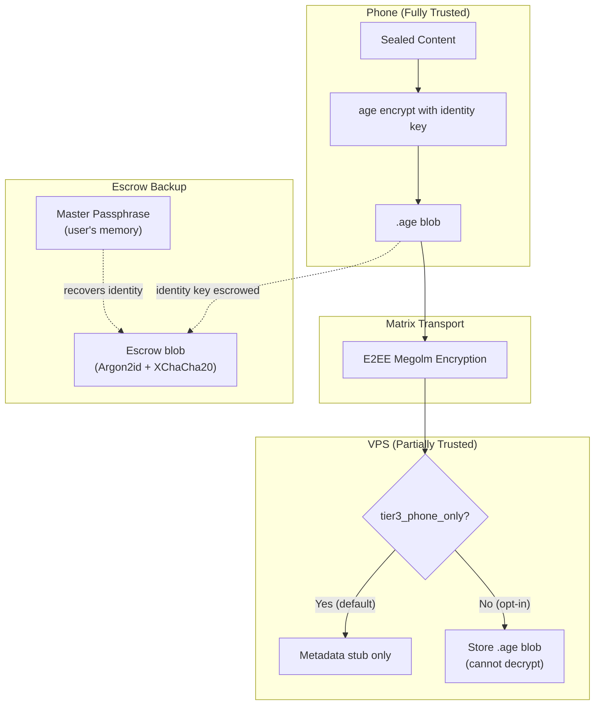
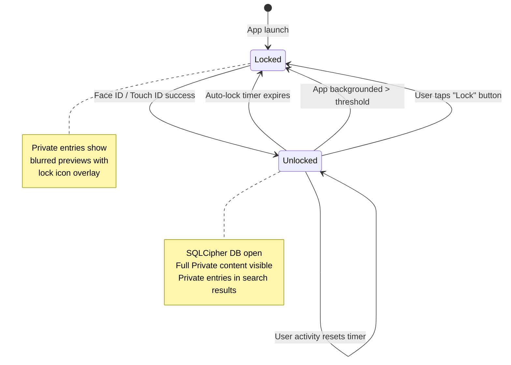
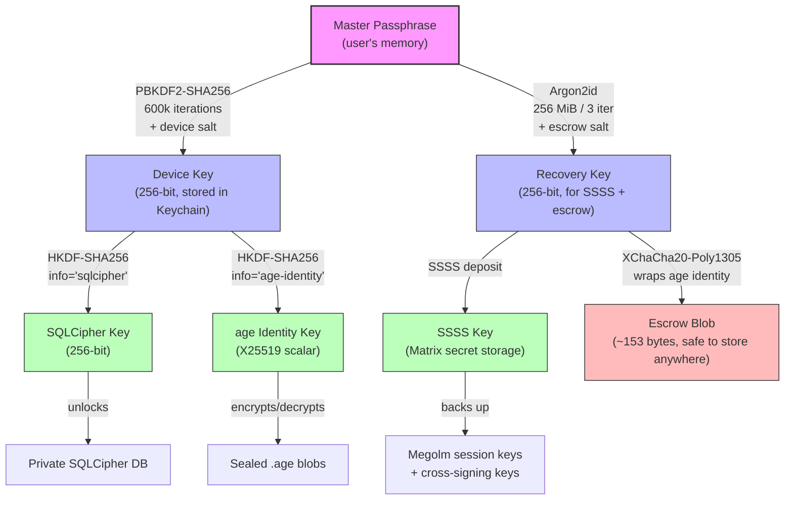

# Data Sensitivity Tiers


> **Status**: Design (extends T104 implementation)
> **Priority**: P1
> **Task**: [T104 -- Tiered Data Protection](../../tasks/TASKS.md)
> **Depends on**: T104 (core implemented), T101 (AI Provider Management), T82 (Redaction Policy), T59 (Trust Level Framework)
> **Companion docs**:
> - `docs/design/tiered-data-protection.md` (original Tier 1/2/3 design -- LUKS + age blobs)
> - `docs/design/blob-key-escrow.md` (disaster recovery)
> - `docs/design/trust-capabilities.md` (AccessBroker, CapabilityToken)
> - `docs/design/ai-provider-management.md` (ProviderRouter sensitivity filtering)

---

## 1. Overview

Symbiotic classifies all user data into three sensitivity tiers -- **Open**, **Private**, and **Sealed** -- that map directly to the existing `Sensitivity` enum (`Shareable`, `Restricted`, `Private`) in `symbiotic-core`. Each tier enforces progressively stronger encryption at rest, stricter LLM routing, tighter agent access controls, and more deliberate unlock UX.

| Tier | Enum Value | What lives here | One-line principle |
|------|-----------|-----------------|-------------------|
| **Open** | `Shareable` | Bookmarks, tech notes, public research, RSS feeds | Frictionless -- always accessible, any provider |
| **Private** | `Restricted` | Personal reflections, goals, relationship notes, work context, journal entries | Encrypted locally, local-only LLM processing, biometric session lock |
| **Sealed** | `Private` | Medical records, financial data, legal documents, credentials, identity documents | Per-item age encryption, passphrase-gated, never leaves device by default |

The tier system is the single policy axis that determines:

1. How data is stored (plain SQLite, SQLCipher, age-encrypted blobs)
2. How data travels (Matrix E2EE rooms, with or without content redaction)
3. How data is recovered (iCloud/Google backup, SSSS key backup, age escrow + passphrase)
4. How data is surfaced to agents (free access, per-access approval, CapabilityToken + passphrase)
5. How data influences the Neural Graph (full nodes, restricted abstract nodes, no graph presence)
6. Which LLM providers may process the data (any, local-only, never)

---

## 2. Encryption at Rest

### Open -- SQLite (Plain)

Open data is stored in a standard SQLite database with FTS5 full-text indexes. On VPS, LUKS2 full-disk encryption provides transparent at-rest protection. On mobile, iOS Data Protection (Class C) and Android file-based encryption cover the SQLite file.

```
data/
├── archive/
│   ├── records/{id}.md          # Plain Markdown
│   └── state.json               # Archive index
└── open.sqlite                  # FTS5 indexes, embeddings
```

No application-level encryption overhead. Any provider may read and process Open content.

### Private -- SQLCipher

Private data is stored in a SQLCipher-encrypted SQLite database. SQLCipher uses AES-256-CBC with HMAC-SHA512 page-level authentication. The SQLCipher key is derived from the Device Key (see Key Hierarchy, section 6).

```
data/
├── private.sqlcipher            # AES-256 encrypted SQLite
└── archive/
    └── records/{id}.md          # Plain .md (0600 perms), content also in SQLCipher
```

On VPS, this is a second layer on top of LUKS. On mobile, it is a second layer on top of OS file encryption. The SQLCipher database is unlocked at session start (Face ID / Touch ID) and locked on timeout or app background.

**Why SQLCipher instead of just LUKS?** LUKS protects at-rest only -- a runtime VPS compromise exposes all plain files. SQLCipher keeps Private data encrypted in the running process until explicitly unlocked. The application must hold the key in memory to query the database, limiting the exposure window.

### Sealed -- age Blobs

Sealed data is individually encrypted using age (X25519 + ChaCha20-Poly1305 AEAD) and stored as `.age` blob files. The age identity key is derived from the Master Passphrase (see Key Hierarchy). Decrypted content is held only in memory and never written to disk.

```
data/
├── blob-store/
│   ├── index.json               # Unencrypted metadata (title, tags, category)
│   ├── {id}.age                 # age-encrypted content
│   └── ...
└── archive/
    └── records/{id}.md          # YAML placeholder only
```

The archive `.md` file for a Sealed entry contains only a metadata stub:

```yaml
---
blob_id: {record_id}
status: encrypted
category: medical
title: Lab Results - 2026 Q1
---

> This entry is Sealed. Content is stored in the age-encrypted blob store.
```

### Tier Comparison

| Property | Open | Private | Sealed |
|----------|------|---------|--------|
| Storage engine | SQLite | SQLCipher (AES-256) | age blobs (X25519 + ChaCha20) |
| VPS disk layer | LUKS | LUKS + SQLCipher | LUKS + per-blob age |
| Mobile disk layer | OS encryption | OS + SQLCipher | OS + per-blob age |
| File permissions | 0644 | 0600 | 0600 |
| Unlock trigger | Always open | Face ID / session start | Passphrase prompt |
| Runtime VPS compromise | Exposed | Protected (need SQLCipher key) | Protected (need age identity) |
| Full-text search | Yes | Yes (within unlocked session) | Metadata only |

---

## 3. Backup & Sync

All inter-device sync flows through Matrix E2EE rooms. The tier determines what content is included in the sync envelope and how keys are backed up.

### Open -- Standard Matrix E2EE

Open data syncs as full-content events in encrypted Matrix rooms. The Matrix Megolm session keys are sufficient to protect content in transit and at the homeserver.

```
Phone ──E2EE──> Homeserver ──E2EE──> VPS
         │
         └── Full content in event body
```

### Private -- Matrix E2EE + SSSS Key Backup

Private data syncs as full-content E2EE events (content is encrypted by Megolm, readable only by verified devices). The SQLCipher key is device-specific and does not sync -- each device derives its own SQLCipher key from the Device Key.

**SSSS (Secure Secret Storage and Sharing)** backs up the Matrix cross-signing keys and Megolm session keys. This ensures a new device can decrypt historical Private events after verifying via the Recovery Key.

```
Phone ──E2EE──> Homeserver ──E2EE──> VPS
         │
         ├── Full content in event body (encrypted by Megolm)
         └── SSSS backup: cross-signing keys + Megolm sessions
              └── Protected by Recovery Key (derived from Master Passphrase)
```

### Sealed -- age Double-Encryption for Backup

Sealed data uses two independent encryption layers for backup:

1. **age encryption** -- Content is encrypted with the age identity key before it touches any transport.
2. **Matrix E2EE** -- The already-encrypted `.age` blob is wrapped in an E2EE Matrix event for transport.

By default (`tier3_phone_only: true`), Sealed content does not sync to the VPS at all. The Matrix event body is redacted to `"[Sealed content -- phone only]"`. Only the metadata stub syncs.

When Sealed sync is explicitly enabled, the `.age` blob (not plaintext) is included in the Matrix event. The VPS stores the `.age` file but cannot decrypt it without the age identity key, which lives only on the phone (or in the passphrase-protected escrow blob).



### Key Backup Summary

| Key Material | Backup Method | Protected By |
|-------------|---------------|-------------|
| Matrix Megolm sessions | SSSS (homeserver) | Recovery Key (from Master Passphrase) |
| Matrix cross-signing keys | SSSS (homeserver) | Recovery Key |
| SQLCipher key | Not backed up (derived per-device) | Device Key derivation |
| age identity key | Escrow blob (VPS, USB, QR) | Master Passphrase via Argon2id |
| Master Passphrase | User's memory / paper backup | Not backed up (intentional) |

---

## 4. Recovery Scenarios

| Scenario | Open Data | Private Data | Sealed Data |
|----------|-----------|-------------|-------------|
| **New phone (have old phone)** | Re-syncs from VPS via Matrix | Re-syncs from VPS via Matrix; new SQLCipher key derived on new device; SSSS restores Megolm sessions | Transfer `.age` files via local network or re-encrypt to new device's age keypair; escrow not needed |
| **New phone (old phone lost)** | Re-syncs from VPS via Matrix | SSSS restores Megolm sessions on new device using Recovery Key (derived from Master Passphrase); Private data re-syncs | Recover age identity from escrow blob + Master Passphrase; decrypt `.age` files from backup (if Sealed sync was enabled) or from escrow blob storage |
| **Lost Master Passphrase (have device)** | No impact | No impact (SQLCipher key is in device Keychain) | Sealed data remains accessible on current device (age identity in Keychain); cannot recover escrow blob; **set a new passphrase immediately** |
| **Lost Master Passphrase + lost device** | Re-syncs from VPS | **Partial loss**: SSSS Recovery Key is unrecoverable; historical Megolm sessions lost; new sessions start fresh | **Total loss**: age identity unrecoverable; Sealed data permanently inaccessible; escrow blob useless without passphrase. **This is by design -- no backdoor.** |
| **VPS dies (have phone)** | Re-provision VPS; phone re-syncs all Open data | Re-provision VPS; phone re-syncs Private data via Matrix | No impact (Sealed is phone-only by default); if Sealed sync was enabled, re-sync `.age` blobs to new VPS |
| **VPS dies (no phone)** | **Total loss** unless Matrix homeserver has federation backups | Same as above | Same as above (escrow blob on VPS is also lost; need escrow from alternative storage) |
| **Everything dies (VPS + all devices)** | **Total loss** | **Total loss** | Recoverable **only if**: (a) escrow blob exists on external storage (USB, paper QR, password manager) AND (b) user remembers Master Passphrase AND (c) `.age` files exist on external backup |

### Mitigation Recommendations

1. **Always** store the escrow blob in at least two locations (VPS + USB/paper).
2. **Always** write down the Master Passphrase and store in a physically secure location.
3. **Consider** enabling Sealed sync to VPS for data that must survive phone loss (trades phone-only security for recoverability).
4. For truly critical Sealed data, export the raw age identity key (`AGE-SECRET-KEY-1...`) to paper and store in a safe.

---

## 5. Locking / Unlocking UX

### Open -- Always Accessible

Open data requires no unlock gesture. It is visible immediately on app launch. The app home screen (Identity Stream) shows Open entries without gating.

### Private -- Face ID Session Lock

Private data is gated by a biometric session lock. The session begins when the user authenticates via Face ID / Touch ID and expires after a configurable auto-lock timeout.

**Session lifecycle:**



**Configuration:**

| Setting | Default | Range |
|---------|---------|-------|
| Auto-lock timeout (Private) | 5 minutes | 1 min -- 1 hour / never |
| Lock on background | 30 seconds | Immediate -- 5 min / never |
| Biometric fallback | Device passcode | -- |

**UX details:**
- Private entries in the feed show a blurred preview card with a lock icon and the entry title.
- Tapping a locked Private entry triggers Face ID. On success, the entire Private session unlocks (not per-entry).
- Search results include Private entry titles but not content snippets when locked.
- The Neural Graph shows Private-derived nodes as dimmed with a lock badge.

### Sealed -- Passphrase Prompt

Sealed data requires the Master Passphrase to unlock. Face ID is not sufficient -- the passphrase is needed to derive the age identity key.

**Unlock flow:**

1. User navigates to a Sealed entry (or the "Sealed Vault" section in settings).
2. App presents a passphrase input screen with the entry title visible.
3. User enters Master Passphrase.
4. App derives the age identity key via the key hierarchy (PBKDF2 -> Recovery Key -> age identity, or direct escrow recovery).
5. Content is decrypted in memory and displayed.
6. On dismiss or timeout, plaintext is zeroed from memory.

**Configuration:**

| Setting | Default | Range |
|---------|---------|-------|
| Sealed session timeout | 2 minutes | 30 sec -- 10 min |
| Auto-clear on background | Immediate | Immediate / 10 sec / 30 sec |
| Show metadata without passphrase | Yes (title, tags, category) | Yes / No |

**UX details:**
- Sealed entries in the feed show only metadata (title, category icon, date). No preview, no blurred content.
- The passphrase input uses a secure text field (no autocomplete, no clipboard, screen capture disabled on Android).
- After unlock, a countdown timer is visible in the header showing remaining Sealed session time.
- Sealed content cannot be screenshot (iOS `UITextField.isSecureTextEntry` pattern applied to the containing view).

### Lock Precedence

Unlocking a higher tier automatically grants access to lower tiers:

| Action | Open | Private | Sealed |
|--------|------|---------|--------|
| App launch | Unlocked | Locked | Locked |
| Face ID success | Unlocked | Unlocked | Locked |
| Passphrase entry | Unlocked | Unlocked | Unlocked |

---

## 6. Key Hierarchy

All cryptographic keys derive from a single Master Passphrase chosen by the user during setup. The hierarchy ensures that losing the passphrase is the only catastrophic failure mode, and that each key serves exactly one purpose.



### Key Derivation Details

| Derivation Step | Algorithm | Input | Parameters | Output |
|----------------|-----------|-------|------------|--------|
| Master Passphrase -> Device Key | PBKDF2-SHA256 | passphrase + device_salt (32 bytes, stored in Keychain) | 600,000 iterations | 256-bit Device Key |
| Master Passphrase -> Recovery Key | Argon2id | passphrase + escrow_salt (32 bytes, generated once) | 256 MiB memory, 3 iterations, 4 lanes | 256-bit Recovery Key |
| Device Key -> SQLCipher Key | HKDF-SHA256 | Device Key | info="sqlcipher", no salt | 256-bit SQLCipher Key |
| Device Key -> age Identity Key | HKDF-SHA256 | Device Key | info="age-identity", no salt | 32-byte X25519 scalar |
| Recovery Key -> SSSS Key | Matrix SSSS spec | Recovery Key | Per Matrix spec (SSSS AES) | SSSS secret storage key |
| Recovery Key -> Escrow Blob | XChaCha20-Poly1305 | Recovery Key wraps age identity bytes | random nonce (24 bytes) | ~153-byte escrow blob |

### Key Storage Locations

| Key | Phone | VPS | Backup |
|-----|-------|-----|--------|
| Master Passphrase | User's memory only | Never | Paper / password manager |
| Device Key | iOS Keychain / Android KeyStore | Daemon config (key file) | Not backed up (re-derived) |
| Recovery Key | Ephemeral (derived on demand) | Never stored | Implicit in passphrase |
| SQLCipher Key | Derived from Device Key at session start | Derived from Device Key at daemon start | Not backed up (re-derived) |
| age Identity Key | iOS Keychain / Android KeyStore | Daemon config (key file) | Escrow blob |
| SSSS Key | Matrix SDK internal storage | Homeserver (encrypted) | Implicit in Recovery Key |
| Escrow Blob | App storage | Matrix `#system` room event | USB / QR code / password manager |

---

## 7. Agent Access

Agents interact with data through the AccessBroker (Gatekeeper). The tier of the target data determines the access policy.

### Open -- Free Access

Agents at any trust level (`ReadOnly` and above) can read Open data without special authorization. No CapabilityToken is required for read operations. Write operations require `ArchiveWrite` trust level.

```
Agent ──read──> Open Data     ✅ Always allowed
Agent ──write──> Open Data    ✅ Requires ArchiveWrite trust
```

### Private -- Per-Access Approval in Goal Chat

Agents need explicit user approval to access Private data. The approval prompt is delivered via the goal chat room in Matrix. The user sees what data the agent wants and why, and can approve or deny.

**Flow:**

1. Agent requests Private data access via `AccessBroker::request_grant()`.
2. AccessBroker checks trust level (minimum: `Standard` for read, `Trusted` for write).
3. If trust is sufficient, a consent request is posted to the goal chat room:
   ```
   🔒 Agent "research-assistant" requests access to Private data:
   - Resource: journal/2026-03-reflections
   - Permission: Read
   - Purpose: "Summarize recent reflections for weekly review goal"
   [Approve] [Deny] [Approve for this goal]
   ```
4. User responds. "Approve for this goal" creates a consent pattern scoped to the current goal, reducing future prompts within that goal's execution.
5. On approval, a time-bounded CapabilityToken is issued (default TTL: 15 minutes).
6. All access is logged in the audit trail.

**Consent persistence:**
- "Approve once" -- single use, expires after one read.
- "Approve for this goal" -- valid for the duration of the goal, revoked on goal completion.
- "Always approve for this agent" -- persistent pattern, requires `Trusted` level, revocable from settings.

### Sealed -- CapabilityToken + Passphrase

Sealed data requires the strongest access controls. An agent cannot access Sealed data without both:

1. A `CapabilityToken` with `CredentialAccess` trust level (the highest level, requiring explicit user grant).
2. The user entering their Master Passphrase to unlock the age identity key for the specific decryption.

**Flow:**

1. Agent requests Sealed data access via `AccessBroker::request_grant()`.
2. AccessBroker requires `CredentialAccess` trust level (only `FullyTrusted` agents or explicit manual grant).
3. A high-priority consent request is posted to the goal chat with a security warning:
   ```
   🔴 SEALED DATA ACCESS REQUEST
   Agent "financial-analyzer" requests access to Sealed data:
   - Resource: financial/tax-return-2025
   - Permission: Read
   - Purpose: "Extract deduction totals for tax planning goal"

   ⚠️ This will decrypt Sealed content. Enter your passphrase to approve.
   [Enter Passphrase] [Deny]
   ```
4. User must enter Master Passphrase (not just tap approve).
5. The passphrase unlocks the age identity key, which decrypts the specific blob.
6. Decrypted content is passed to the agent in memory. The agent processes it and returns results.
7. Plaintext is zeroed from memory after the agent completes.
8. A single-use, short-lived CapabilityToken is issued (TTL: 5 minutes, max_uses: 1).

**Sealed data never persists in agent context.** The agent receives the decrypted content for a single operation and cannot store, cache, or exfiltrate it. The CapabilityToken's scope constraint enforces this.

### Agent Access Summary

| Property | Open | Private | Sealed |
|----------|------|---------|--------|
| Minimum trust level | `ReadOnly` | `Standard` (read) / `Trusted` (write) | `CredentialAccess` |
| CapabilityToken required | No (read) / Yes (write) | Yes | Yes (single-use) |
| User approval | Not required | Consent prompt in goal chat | Passphrase entry required |
| Consent patterns | N/A | Goal-scoped or persistent | Never (always passphrase) |
| Token TTL | N/A / 1 hour | 15 minutes | 5 minutes |
| Content in agent memory | Persistent (agent context) | Duration of goal step | Single operation only |
| Audit level | Standard | Enhanced (all reads logged) | Full (tamper-evident) |

---

## 8. Graph Node Sensitivity Inheritance

The Neural Graph tracks relationships between entities (people, projects, topics, events). When a graph node is derived from Private or Sealed data, it inherits sensitivity restrictions.

### Inheritance Rules

| Source Data Tier | Graph Node Sensitivity | What is visible (unlocked) | What is visible (locked) |
|-----------------|----------------------|---------------------------|-------------------------|
| Open | **Open node** | Full: entity name, all relationships, all properties | Full (always unlocked) |
| Private | **Restricted node** | Full entity details, all relationships | Abstract: entity category + relationship type only (e.g., "Person -- mentioned in 3 journal entries") |
| Sealed | **Redacted node** | Not in graph by default | Not in graph |

### Restricted Nodes (from Private data)

When Private notes mention an entity, the graph creates a Restricted node. This node has two presentation modes:

**Locked (Private session inactive):**
- Node label: generic category (e.g., "Person", "Company", "Topic")
- Relationships: count only ("connected to 5 entries")
- Properties: hidden
- Visual: dimmed with lock badge

**Unlocked (Private session active via Face ID):**
- Full entity name, all properties, all relationships visible
- Behaves identically to an Open node during the session

**Example:**

A journal entry (Private) mentions "Dr. Sarah Chen" discussing a career change. The graph creates:

- Locked view: `[Person] -- mentioned in 2 journal entries, connected to [Topic]`
- Unlocked view: `[Dr. Sarah Chen] -- mentioned in "Career Reflections" and "Q1 Goals", connected to [Career Change]`

### Sealed -- No Graph Presence

Sealed data does not create graph nodes by default. This prevents metadata leakage -- even abstract relationship patterns could reveal sensitive information (e.g., the existence of a relationship with a medical specialist).

An opt-in setting (`sealed_graph_metadata: true`) allows Sealed entries to create Redacted nodes that show only the category icon and entry count, with no relationship edges.

### Sensitivity Promotion

If an entity appears in both Open and Private sources, the graph node is promoted to the highest sensitivity:

```
Open note mentions "Project Alpha" → Open node
Private journal mentions "Project Alpha" → Node promoted to Restricted

Promoted node shows full details when Private session is active,
but shows only category + count when locked.
```

This prevents a Private relationship from being inferred through the Open graph view.

---

## 9. Local Processing for Private Data

Private (and Sealed) data must never reach cloud LLM providers. The `ProviderRouter` in `symbiotic-providers` enforces this via sensitivity-aware candidate selection.

### Enforcement Mechanism

The existing `ProviderRouter::select_candidates()` filters providers by `ProviderClass`:

```rust
// routing.rs (existing implementation)
let sensitivity_filtered: Vec<RegisteredProvider> =
    if matches!(sensitivity, Sensitivity::Restricted | Sensitivity::Private) {
        candidates
            .into_iter()
            .filter(|p| p.base.provider_class() == ProviderClass::Local)
            .collect()
    } else {
        candidates
    };
```

When processing Private data, only `ProviderClass::Local` providers (e.g., Ollama, llama.cpp) are eligible. If no local provider is available, the operation fails with `ProviderError::SensitivityViolation` rather than falling back to a cloud provider.

### `model_class: "local"` Enforcement

Workflow templates that process Private data must declare `model_class: "local"` in their policy section:

```json
{
  "policy": {
    "model_class": "local",
    "sensitivity": "restricted"
  }
}
```

The agent executor validates this constraint before dispatching to any provider. A workflow that declares `model_class: "hybrid"` or `"cloud"` will be rejected if the input data is Private or Sealed.

### Ollama Sandbox

When processing Private data locally, Ollama runs in a sandboxed configuration:

1. **Network isolation**: Ollama binds to `127.0.0.1` only. No outbound network access during Private data processing.
2. **No telemetry**: `OLLAMA_NOPRUNE=1`, `OLLAMA_ORIGINS=""` -- no phone-home, no cross-origin requests.
3. **Ephemeral context**: The conversation context is cleared after each Private data operation. No KV cache persistence between requests.
4. **Model validation**: Only approved local models may process Private data. The model allowlist is configured in `providers.toml`:

```toml
[local_processing]
allowed_models = ["llama3.2:3b", "mistral:7b", "phi3:mini"]
# Models not on this list are rejected for Private/Sealed processing
```

### Processing Rules by Tier

| Operation | Open | Private | Sealed |
|-----------|------|---------|--------|
| Embedding generation | Any provider | Local only (Ollama) | Not embedded (metadata only) |
| Summarization | Any provider | Local only | Local only + passphrase |
| Entity extraction (Neural Graph) | Any provider | Local only | Opt-in, local only + passphrase |
| Full-text search | Cloud or local | Local FTS5 within SQLCipher | Metadata search only |
| Distillery pipeline | Any provider | Local only | Not processed (raw storage) |
| Agent reasoning (ReAct loop) | Any provider | Local only for data access steps | Local only, single-operation token |

### Cloud Provider Safeguards

Even if a bug or misconfiguration attempts to route Private data to a cloud provider:

1. **ProviderRouter** rejects the request (sensitivity filter).
2. **Redaction engine** (T82) strips PII from any content before it reaches a cloud provider, as a defense-in-depth layer.
3. **Matrix transport** never sends unredacted Private content to the homeserver (E2EE protects content, but the redaction layer adds belt-and-suspenders protection against Megolm key compromise).

---

## 10. Implementation Phases

### What Exists (Implemented)

| Component | Location | Status |
|-----------|----------|--------|
| `Sensitivity` enum (`Shareable`, `Restricted`, `Private`) | `symbiotic-core/src/lib.rs` | Implemented |
| `BlobStore` (age encrypt/decrypt/rotate/CRUD) | `symbiotic-vault-store/src/store.rs` | Implemented (24 tests) |
| `BlobCategory`, `BlobMetadata`, `EncryptedBlob` types | `symbiotic-vault-store/src/types.rs` | Implemented |
| Key escrow (`create_escrow`, `recover_escrow`, `change_passphrase`) | `symbiotic-vault-store/src/escrow.rs` | Implemented (20 tests) |
| `detect_blob_category()` keyword classification | `symbiotic-daemon/src/lib.rs` | Implemented |
| `route_private_to_blob_store()` intake routing | `symbiotic-daemon/src/lib.rs` | Implemented |
| Archive placeholder system (YAML stubs) | `symbiotic-archive` | Implemented |
| Matrix envelope sensitivity tagging | `symbiotic-matrix` (events) | Implemented |
| Phone-only mode (send-path redaction + receive-path filtering) | `symbiotic-daemon` + `symbiotic-matrix` | Implemented |
| `ProviderRouter` sensitivity filtering (`Local`-only for Restricted/Private) | `symbiotic-providers/src/routing.rs` | Implemented |
| `AccessBroker` + `CapabilityToken` with scope/expiry/subject checks | `symbiotic-trust/src/` | Implemented |
| `AgentTrustLevel` enum (`ReadOnly`/`ArchiveWrite`/`CredentialAccess`/`ExternalAct`) | `symbiotic-trust/src/` | Implemented |
| `harden_file_permissions()` (0600 enforcement) | `symbiotic-core/src/lib.rs` | Implemented |
| `VaultStoreError` with graceful degradation | `symbiotic-vault-store/src/error.rs` | Implemented |
| LUKS provisioning design | `docs/design/tiered-data-protection.md` | Designed (not scripted) |

### What is New (This Design)

| Component | Phase | Priority | Effort |
|-----------|-------|----------|--------|
| **SQLCipher integration** for Private tier | Phase 1 | P1 | Medium |
| **Key hierarchy** (Master Passphrase -> PBKDF2 -> Device Key -> HKDF -> SQLCipher/age) | Phase 1 | P1 | Medium |
| **Biometric session lock** (Face ID / Touch ID) for Private tier | Phase 2 | P1 | Medium |
| **Auto-lock timers** (configurable timeout, background lock) | Phase 2 | P1 | Small |
| **Passphrase unlock UX** for Sealed tier | Phase 2 | P1 | Medium |
| **Per-access agent approval** in goal chat (consent prompt for Private) | Phase 3 | P1 | Large |
| **CapabilityToken + passphrase** flow for Sealed agent access | Phase 3 | P1 | Large |
| **Graph node sensitivity inheritance** (Restricted nodes, sensitivity promotion) | Phase 4 | P2 | Medium |
| **Sealed graph opt-in** (redacted nodes) | Phase 4 | P2 | Small |
| **Ollama sandbox hardening** (network isolation, model allowlist) | Phase 3 | P2 | Small |
| **LUKS provisioning scripts** (`setup-luks.sh`) | Phase 5 | P2 | Medium |
| **Flutter escrow creation/recovery UI** | Phase 2 | P1 | Medium |
| **Sensitivity rename** (Shareable->Open, Restricted->Private, Private->Sealed) in UX layer | Phase 1 | P1 | Small |

### Phase 1 -- Foundation (Key Hierarchy + SQLCipher)

1. Implement PBKDF2 + HKDF key derivation chain in `symbiotic-vault-store`.
2. Add SQLCipher dependency to the runtime (via `rusqlite` with `bundled-sqlcipher` feature).
3. Create `PrivateStore` wrapper that opens/closes SQLCipher DB with derived key.
4. Wire key derivation into daemon startup and Flutter app init.
5. Map UX-facing names: Shareable -> "Open", Restricted -> "Private", Private -> "Sealed" (internal enum values unchanged).

### Phase 2 -- Unlock UX (Biometrics + Passphrase)

1. Implement Face ID / Touch ID session management in Flutter (`local_auth` package).
2. Build passphrase entry screen with secure text field and session timer.
3. Implement auto-lock timers (configurable, default 5 min Private / 2 min Sealed).
4. Build Flutter escrow creation flow in setup wizard.
5. Build Flutter recovery flow (import escrow blob + enter passphrase).

### Phase 3 -- Agent Access Controls

1. Implement consent prompt delivery via goal chat Matrix room.
2. Build consent pattern storage and matching in `AccessBroker`.
3. Implement single-use CapabilityToken for Sealed access with passphrase gate.
4. Add Ollama sandbox configuration (network isolation, model allowlist).
5. Wire audit trail for all Private/Sealed access events.

### Phase 4 -- Neural Graph Integration

1. Add sensitivity field to graph nodes (`NodeSensitivity` enum).
2. Implement locked/unlocked presentation modes for Restricted nodes.
3. Implement sensitivity promotion logic (highest source wins).
4. Add `sealed_graph_metadata` opt-in setting.

### Phase 5 -- VPS Hardening

1. Create `setup-luks.sh` semi-automated provisioning script.
2. Add LUKS verification to daemon startup health check.
3. Document self-hoster LUKS setup guide.
4. Add Tang/Clevis network-bound unlock option for managed hosting.

---

## Appendix A: Naming Mapping

The internal `Sensitivity` enum values remain unchanged for backward compatibility. The UX layer maps them to user-facing names:

| Internal Enum | UX Name | Icon | Color |
|--------------|---------|------|-------|
| `Shareable` | Open | Unlocked padlock | Green |
| `Restricted` | Private | Face ID shield | Blue |
| `Private` | Sealed | Vault door | Red |

This mapping lives in the Flutter presentation layer and does not affect any Rust code, Matrix envelopes, or stored data.

## Appendix B: Threat Model Summary

| Threat | Open | Private | Sealed |
|--------|------|---------|--------|
| Disk theft / VPS snapshot | LUKS | LUKS + SQLCipher | LUKS + age |
| Runtime VPS compromise (root) | Exposed | Protected (SQLCipher key not on VPS if phone-only) | Protected (age key not on VPS) |
| Cloud LLM data leak | N/A (shareable) | Never sent to cloud | Never sent to cloud |
| Network eavesdrop | Matrix E2EE | Matrix E2EE | Matrix E2EE + age (double encryption) |
| Prompt injection exfiltration | Content is public | Redaction + local-only processing | Content never reaches any LLM without passphrase |
| Phone theft (locked) | Biometric + OS encryption | Biometric + SQLCipher + OS | Passphrase + age + OS |
| Phone theft (unlocked) | Exposed | Exposed (within session timeout) | Protected (separate passphrase required) |
| Compromised Ollama model | N/A | Data processed locally, no exfiltration path | Data processed locally, single-operation token, no persistence |
