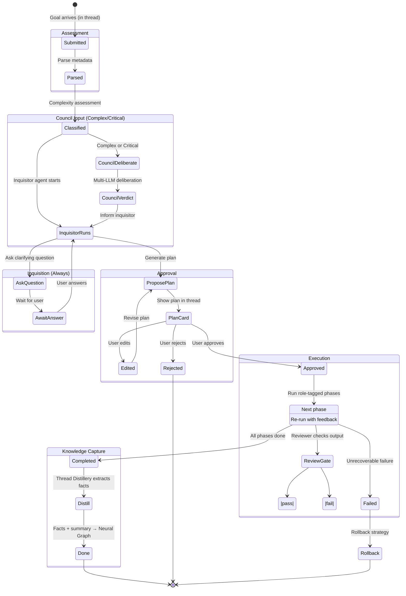
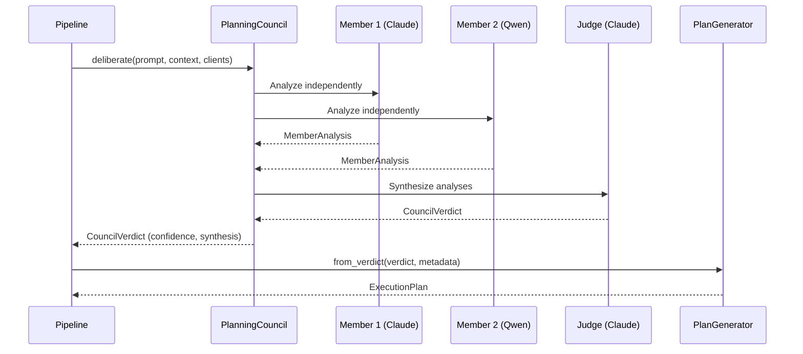
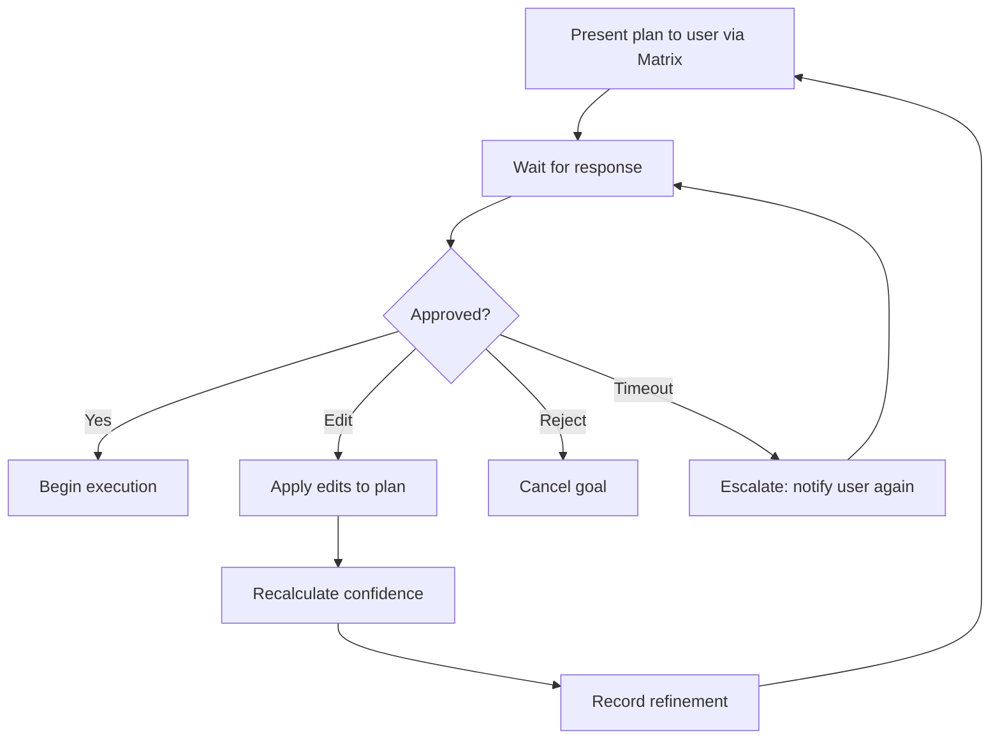
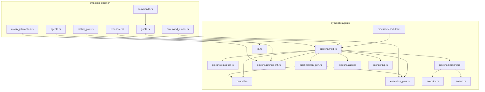

# Deliberation-First Goal Execution Pipeline

## Overview

The Deliberation-First Pipeline is the central decision engine that transforms Symbiotic from a collection of disconnected agent primitives into a coherent, decision-driven execution system. When a goal arrives — via Matrix command, API call, or Markdown manifest — this pipeline classifies its complexity, runs the **Inquisitor agent** (the goal architect/PM) for all goals, generates an execution plan, and drives that plan to completion through the existing agent infrastructure.

**Key principle: The Inquisitor always runs first.** There is no confidence-based auto-execution bypass. LLM confidence scores are unreliable (always return ≥98%). Instead, the Inquisitor adapts its depth based on complexity: simple goals get a brief plan with minimal questions, complex goals get deeper deliberation with optional council input.

The pipeline is the glue between `PlanningCouncil` (council.rs), `ExecutionPlan` (execution_plan.rs), `SwarmOrchestrator` (swarm.rs), `SecureAgentFramework` (lib.rs), `AgentMonitor` (monitoring.rs), and the daemon's goal state machine (goal_state.rs).

All goal events are emitted to `#thread-{slug}` — the thread where the goal lives. Goals are sub-entities of threads, not independent conversation spaces.

**Status**: In Progress (Design Phase)
**Task**: T105 (Deliberation-First Goal Execution Pipeline)
**Priority**: P0
**Depends on**: T66 (Goals), T70 (Agent Framework), T60 (Planning Council), T61 (PRD Execution), T103 (Architecture 2.0)

---

## 1. Goal Lifecycle



### Key Change: No Confidence-Based Auto-Execution

Previous designs routed goals based on LLM confidence scores (≥95% → auto-execute, 70-95% → show plan, <70% → inquisition). In practice, LLMs always return ≥98% confidence regardless of goal complexity. This made confidence gating useless — complex goals would auto-execute without questions.

**New model:** The Inquisitor always runs. Complexity assessment determines:
- **Simple:** Inquisitor asks 0-1 questions, proposes a brief plan
- **Moderate:** Inquisitor asks targeted questions, proposes a full plan
- **Complex:** Council deliberates first, findings inform the Inquisitor's plan proposal
- **Critical:** Same as Complex + mandatory human approval gate (cannot be waived)

---

## 2. Complexity Assessment

### Algorithm

The `GoalComplexityClassifier` scores incoming goals across multiple dimensions and maps the aggregate score to a complexity level.

### Scoring Factors

| Factor | Weight | Simple (0) | Moderate (1) | Complex (2) | Critical (3) |
|--------|--------|-----------|--------------|-------------|--------------|
| Domain count | 15% | 1 domain | 2 domains | 3+ domains | N/A |
| Phase count | 15% | 1 phase | 2-3 phases | 4+ phases | N/A |
| Workflow novelty | 20% | Known template | Minor adaptation | No template | N/A |
| External dependencies | 15% | None | API calls | Credential access | Financial/legal |
| Estimated cost (USD) | 10% | < $0.50 | $0.50-$5 | $5-$50 | > $50 |
| Security surface | 15% | Read-only | Write access | Credential scope | External act |
| Autonomy level | 10% | Auto | Semi | Manual | N/A |

### Thresholds

| Weighted Score | Classification |
|---------------|---------------|
| 0.0 - 0.30 | Simple |
| 0.31 - 0.60 | Moderate |
| 0.61 - 0.85 | Complex |
| 0.86 - 1.0 OR security_surface == Critical | Critical |

### Optional LLM Override

For ambiguous cases (score near a boundary, +/- 0.05), the classifier can optionally invoke an LLM for a second opinion. This is gated behind a `use_llm_classification` config flag and costs one Haiku-tier call.

### Rust Types

```rust
/// Complexity level of a goal.
#[derive(Debug, Clone, Copy, PartialEq, Eq, PartialOrd, Ord, Serialize, Deserialize)]
#[serde(rename_all = "snake_case")]
pub enum GoalComplexity {
    Simple,
    Moderate,
    Complex,
    Critical,
}

/// Individual scoring factor with its computed value.
#[derive(Debug, Clone, Serialize, Deserialize)]
pub struct ScoringFactor {
    pub name: String,
    pub weight: f32,
    pub raw_score: f32,      // 0.0 - 3.0 (maps to Simple..Critical)
    pub weighted_score: f32,  // weight * (raw_score / 3.0)
}

/// Result of complexity assessment.
#[derive(Debug, Clone, Serialize, Deserialize)]
pub struct ComplexityAssessment {
    pub complexity: GoalComplexity,
    pub aggregate_score: f32,
    pub factors: Vec<ScoringFactor>,
    pub llm_override: Option<GoalComplexity>,
    pub reasoning: String,
}

/// Classifies goal complexity from parsed metadata.
pub struct GoalComplexityClassifier {
    config: ClassifierConfig,
}

#[derive(Debug, Clone, Serialize, Deserialize)]
pub struct ClassifierConfig {
    /// Thresholds for each complexity level (ascending).
    pub thresholds: [f32; 3],  // [simple_max, moderate_max, complex_max]
    /// Whether to use LLM for borderline cases.
    pub use_llm_classification: bool,
    /// Boundary tolerance for LLM override trigger.
    pub boundary_tolerance: f32,  // Default: 0.05
}

impl Default for ClassifierConfig {
    fn default() -> Self {
        Self {
            thresholds: [0.30, 0.60, 0.85],
            use_llm_classification: false,
            boundary_tolerance: 0.05,
        }
    }
}

impl GoalComplexityClassifier {
    pub fn new(config: ClassifierConfig) -> Self;

    /// Classify a goal based on its parsed metadata.
    pub fn classify(&self, metadata: &GoalMetadata) -> ComplexityAssessment;

    /// Classify with optional LLM second opinion for borderline cases.
    pub async fn classify_with_llm(
        &self,
        metadata: &GoalMetadata,
        llm: &dyn LlmClient,
    ) -> ComplexityAssessment;
}

/// Parsed metadata extracted from a goal submission.
#[derive(Debug, Clone, Serialize, Deserialize)]
pub struct GoalMetadata {
    pub title: String,
    pub description: String,
    pub domains: Vec<String>,
    pub phases: Vec<String>,
    pub has_known_template: bool,
    pub template_name: Option<String>,
    pub external_dependencies: Vec<String>,
    pub required_scopes: Vec<String>,
    pub estimated_cost_usd: Option<f64>,
    pub autonomy_level: AutonomyLevel,
    pub constraints: Option<GoalConstraints>,
}
```

---

## 3. Decision Tree (Core Routing Logic)

```rust
/// The central pipeline that routes goals through the appropriate flow.
pub struct DeliberationPipeline {
    classifier: GoalComplexityClassifier,
    council: PlanningCouncil,
    plan_generator: PlanGenerator,
    plan_executor: PlanExecutorFactory,
    monitor: Arc<dyn AgentMonitor>,
    audit: AuditLog,
    config: PipelineConfig,
}

/// Configuration for the deliberation pipeline.
#[derive(Debug, Clone, Serialize, Deserialize)]
pub struct PipelineConfig {
    /// Whether to require human approval for all Critical goals.
    pub require_critical_approval: bool,  // Default: true
    /// Maximum concurrent goal executions.
    pub max_concurrent_goals: usize,  // Default: 5
    /// Execution backend to use.
    pub default_backend: ExecutionBackend,
    /// Whether to use council deliberation for Complex goals.
    pub use_council_for_complex: bool,  // Default: true
}

impl Default for PipelineConfig {
    fn default() -> Self {
        Self {
            require_critical_approval: true,
            max_concurrent_goals: 5,
            default_backend: ExecutionBackend::Native,
            use_council_for_complex: true,
        }
    }
}

/// The result of pipeline processing.
#[derive(Debug, Clone, Serialize, Deserialize)]
pub enum PipelineOutcome {
    /// Inquisitor is asking questions — waiting for user input.
    Inquisition {
        goal_id: String,
        thread_id: String,
        audit_id: String,
    },
    /// Plan proposed — waiting for user approval in thread.
    AwaitingApproval {
        plan: ExecutionPlan,
        thread_id: String,
        audit_id: String,
    },
    /// Goal is being deliberated by the council (Complex/Critical).
    Deliberating {
        council_session_id: String,
        audit_id: String,
    },
    /// Goal was executed and completed.
    Executed {
        plan_result: PlanResult,
        audit_id: String,
    },
    /// Goal was rejected by user or security policy.
    Rejected {
        reason: String,
        audit_id: String,
    },
}

impl DeliberationPipeline {
    pub fn new(
        classifier: GoalComplexityClassifier,
        council: PlanningCouncil,
        plan_generator: PlanGenerator,
        plan_executor: PlanExecutorFactory,
        monitor: Arc<dyn AgentMonitor>,
        audit: AuditLog,
        config: PipelineConfig,
    ) -> Self;

    /// Process a goal through the full deliberation pipeline.
    /// The Inquisitor always runs first. Complexity determines depth.
    pub async fn process_goal(
        &self,
        goal: &GoalSubmission,
        llm_clients: &[&dyn LlmClient],
    ) -> Result<PipelineOutcome> {
        let metadata = self.parse_metadata(goal)?;
        let assessment = self.classifier.classify(&metadata);

        self.audit.record(AuditEvent::ComplexityAssessed {
            goal_id: goal.id.clone(),
            assessment: assessment.clone(),
        });

        // For Complex/Critical: run council deliberation first to inform the Inquisitor
        let council_context = match assessment.complexity {
            GoalComplexity::Complex | GoalComplexity::Critical => {
                let verdict = self.council.deliberate(
                    &goal.description, &metadata, llm_clients
                ).await?;
                Some(verdict)
            }
            _ => None,
        };

        // Inquisitor always runs — complexity determines depth
        self.run_inquisitor(goal, &metadata, &assessment, council_context.as_ref()).await
    }

    /// Run the Inquisitor agent. It adapts its depth based on complexity:
    /// - Simple: 0-1 questions, brief plan
    /// - Moderate: targeted questions, full plan
    /// - Complex: deep questions informed by council verdict
    /// - Critical: same as Complex, plan requires mandatory approval
    async fn run_inquisitor(
        &self,
        goal: &GoalSubmission,
        metadata: &GoalMetadata,
        assessment: &ComplexityAssessment,
        council_context: Option<&CouncilVerdict>,
    ) -> Result<PipelineOutcome>;

    /// Execute approved plan with role-tagged phases and feedback loops.
    async fn execute_plan(
        &self,
        goal: &GoalSubmission,
        plan: &ExecutionPlan,
        thread_id: &str,
    ) -> Result<PipelineOutcome>;
}
```

---

## 4. Planning and Deliberation

### Plan Generation

The `PlanGenerator` creates `ExecutionPlan` instances from goal metadata, either from a known template or by LLM synthesis.

```rust
/// Generates execution plans for goals.
pub struct PlanGenerator {
    /// Known workflow templates (from `workflows/templates/`).
    templates: HashMap<String, ExecutionPlan>,
}

impl PlanGenerator {
    pub fn new(templates: HashMap<String, ExecutionPlan>) -> Self;

    /// Generate a plan from a known template.
    pub fn from_template(&self, template_name: &str) -> Option<ExecutionPlan>;

    /// Generate a plan via LLM synthesis when no template matches.
    pub async fn synthesize(
        &self,
        metadata: &GoalMetadata,
        llm: &dyn LlmClient,
    ) -> Result<(ExecutionPlan, f32)>;  // (plan, confidence)

    /// Generate a plan from a council verdict.
    pub fn from_verdict(
        &self,
        verdict: &CouncilVerdict,
        metadata: &GoalMetadata,
    ) -> Result<ExecutionPlan>;
}
```

### Council Integration

For Complex and Critical goals, the pipeline invokes `PlanningCouncil::deliberate()` (council.rs, line 239) with the goal description and background context. The `CouncilVerdict` (confidence, synthesis, disagreements) feeds into `PlanGenerator::from_verdict()` to produce a structured `ExecutionPlan`.



---

## 5. User Refinement Protocol

### Matrix Interaction Model

When a plan requires user review (Moderate with low confidence, Complex, or Critical), the pipeline presents it via Matrix and enters a refinement loop.

```rust
/// Manages the user refinement loop via Matrix.
#[async_trait]
pub trait UserInteraction: Send + Sync {
    /// Present a plan to the user and wait for their response.
    async fn present_plan(
        &self,
        goal_id: &str,
        plan: &ExecutionPlan,
        confidence: f32,
        room_id: &str,
    ) -> Result<()>;

    /// Wait for user response (approve, edit, reject).
    async fn await_response(
        &self,
        goal_id: &str,
        timeout: Duration,
    ) -> Result<UserResponse>;
}

/// User's response to a presented plan.
#[derive(Debug, Clone, Serialize, Deserialize)]
pub enum UserResponse {
    /// User approves the plan as-is.
    Approve,
    /// User provides edits to the plan.
    Edit {
        /// Phases to add.
        add_phases: Vec<Phase>,
        /// Phase names to remove.
        remove_phases: Vec<String>,
        /// Validation overrides (phase_name -> new validations).
        modify_validations: HashMap<String, Vec<Validation>>,
        /// Free-form instructions for the next refinement.
        instructions: String,
    },
    /// User rejects the goal entirely.
    Reject { reason: String },
    /// Timeout (no response within the allowed window).
    Timeout,
}

/// A single refinement in the history.
#[derive(Debug, Clone, Serialize, Deserialize)]
pub struct RefinementRecord {
    pub timestamp: u64,
    pub actor: String,  // "user", "council", "system"
    pub action: String, // "approve", "edit", "reject", "generate"
    pub plan_snapshot: ExecutionPlan,
    pub confidence: f32,
    pub diff_summary: String,
}

/// Tracks the refinement history for a goal.
#[derive(Debug, Clone, Serialize, Deserialize)]
pub struct RefinementHistory {
    pub goal_id: String,
    pub records: Vec<RefinementRecord>,
}
```

### Refinement Loop



---

## 6. Execution Engine

### How ExecutionPlan Phases Run

The `PlanExecutor` (execution_plan.rs, line 262) already handles phase-by-phase execution with progressive validation. The pipeline wraps it with agent spawning and progress reporting.

```rust
/// Factory that creates PlanExecutors with the correct backends.
pub struct PlanExecutorFactory {
    framework: Arc<SecureAgentFramework>,
    monitor: Arc<dyn AgentMonitor>,
}

impl PlanExecutorFactory {
    /// Create a PlanExecutor for a goal, spawning agents per phase.
    pub fn create_executor<'a>(
        &'a self,
        plan: &'a ExecutionPlan,
        goal_id: &str,
        backend: ExecutionBackend,
        cmd_runner: &'a dyn CommandRunner,
        human_gate: &'a dyn HumanGate,
    ) -> PlanExecutor<'a>;
}

/// Wraps plan execution with agent lifecycle management.
pub struct GoalExecutionContext {
    pub goal_id: String,
    pub plan: ExecutionPlan,
    pub backend: ExecutionBackend,
    pub spawned_agents: Vec<String>,
    pub phase_results: Vec<PhaseResult>,
    pub started_at: u64,
    pub completed_at: Option<u64>,
}
```

### Phase Execution Flow

For each phase in the plan:

1. **Spawn agent(s)** via `SecureAgentFramework::spawn_agent()` (lib.rs, line 102) with capabilities derived from the phase's required scopes.
2. **Record start** via `AgentMonitor::record_start()` (monitoring.rs, line 232).
3. **Emit `goal.step.started`** to `#thread-{slug}` — the thread where the goal lives.
4. **Execute phase work** via the selected execution backend (see Section 7). Context from prior phases feeds into the current phase.
5. **Run validations** in progressive cost order (execution_plan.rs, line 327): lint first, then tests, then expert agent review, then human review.
6. **Reviewer feedback loop** — if reviewer finds issues, re-run phase with feedback (max 3 iterations).
7. **Record finish** via `AgentMonitor::record_finish()` (monitoring.rs, line 242).
8. **Emit `goal.step.completed`** to `#thread-{slug}` with output summary.
9. **Trigger Thread Distillery (async)** — enqueue extraction of findings/entities/methodology from the step's output. Runs async — the workflow runner does NOT block on this. Raw output is passed directly to the next step. Distillery enrichment is best-effort (see `thread-architecture.md` §5 "Concurrency Model").
10. **On failure**: trigger rollback strategy, emit `goal.step.failed` to thread, stop execution.
11. **On completion**: emit `goal.result` + `goal.completed` to thread. Final distillery pass synthesizes goal outcomes into Thread Memory Document.

---

## 7. Execution Backends

### Backend Enum

```rust
/// How agent work is actually executed.
#[derive(Debug, Clone, Serialize, Deserialize)]
#[serde(rename_all = "snake_case")]
pub enum ExecutionBackend {
    /// Current: Rust ReAct loop calling LLM API.
    /// Uses `run_agent_with_config()` from executor.rs.
    Native,

    /// Spawn a `claude` CLI process on the VPS with full native tool access.
    /// The CLI session has file editing, git, terminal -- no MCP, no tool calls.
    ClaudeCode {
        /// Working directory for the CLI session.
        working_dir: PathBuf,
        /// Optional model override (default: claude-sonnet).
        model: Option<String>,
        /// Maximum runtime in seconds before the session is killed.
        timeout_secs: u64,
    },

    /// Spawn a multi-agent Claude Code team for complex implementation.
    /// Each team member works in its own worktree with a specific role.
    Team {
        /// Number of team members to spawn.
        team_size: usize,
        /// Working directory (root).
        working_dir: PathBuf,
        /// Model to use for team members.
        model: Option<String>,
        /// Maximum runtime per member in seconds.
        member_timeout_secs: u64,
    },
}

impl Default for ExecutionBackend {
    fn default() -> Self {
        Self::Native
    }
}
```

### Backend Trait

```rust
/// Trait for executing work within a pipeline phase.
#[async_trait]
pub trait PhaseExecutor: Send + Sync {
    /// Execute the work for a single phase.
    /// Returns the output and a quality score (0.0 - 1.0).
    async fn execute_phase(
        &self,
        phase: &Phase,
        context: &GoalExecutionContext,
    ) -> Result<(String, f64)>;
}

/// Native backend: uses the existing ReAct loop.
pub struct NativePhaseExecutor {
    llm: Arc<dyn LlmClient>,
    tools: Vec<Arc<dyn Tool>>,
}

/// ClaudeCode backend: spawns a CLI process.
pub struct ClaudeCodePhaseExecutor {
    config: ClaudeCodeConfig,
}

/// Team backend: spawns multiple CLI processes with coordination.
pub struct TeamPhaseExecutor {
    config: TeamConfig,
}
```

### ClaudeCode Backend Details

The ClaudeCode backend spawns a `claude` CLI process as a child process. Communication is through:

1. **Input**: Write the phase description and context to a temporary instruction file.
2. **Execution**: `claude --model <model> --print --dangerously-skip-permissions < instruction.md`
3. **Output**: Capture stdout/stderr, parse the result.
4. **Timeout**: Kill the process after `timeout_secs`.

This backend is appropriate for implementation phases where the agent needs native file system access, git operations, and terminal commands that our Rust ReAct loop's built-in tools cannot provide.

### Team Backend Details

The Team backend extends ClaudeCode by:

1. Creating isolated git worktrees (one per team member) via the existing `worktree` module (symbiotic-agents/src/worktree.rs).
2. Spawning parallel `claude` CLI processes, each with a specific role/focus.
3. Coordinating results: merge worktree branches when all members complete.
4. Conflict resolution: if multiple worktrees touch the same file, flag for human review.

---

## 8. Scheduled Goals (Cron Loop)

### Background Loop

The daemon runs a goal scheduling loop alongside the reconciliation loop:

```rust
/// Manages scheduled/periodic goal check-ins.
pub struct GoalScheduler {
    goal_manager: Arc<Mutex<GoalProcessManager>>,
    pipeline: Arc<DeliberationPipeline>,
    config: SchedulerConfig,
}

#[derive(Debug, Clone, Serialize, Deserialize)]
pub struct SchedulerConfig {
    /// How often to check for due goals (seconds). Default: 60.
    pub check_interval_secs: u64,
    /// Maximum agents across all goals. Default: 10.
    pub total_agent_slots: usize,
    /// Whether to run due goals automatically or queue for approval.
    pub auto_run_due_goals: bool,
}

impl Default for SchedulerConfig {
    fn default() -> Self {
        Self {
            check_interval_secs: 60,
            total_agent_slots: 10,
            auto_run_due_goals: true,
        }
    }
}

impl GoalScheduler {
    pub fn new(
        goal_manager: Arc<Mutex<GoalProcessManager>>,
        pipeline: Arc<DeliberationPipeline>,
        config: SchedulerConfig,
    ) -> Self;

    /// Run one scheduling tick.
    pub async fn tick(&self, now: u64) -> Result<Vec<SchedulerAction>> {
        let manager = self.goal_manager.lock().map_err(|_| anyhow!("lock"))?;
        let due_goals = manager.get_due_goals(now);

        if due_goals.is_empty() {
            return Ok(vec![]);
        }

        // Allocate agent slots across due goals by priority
        let allocation = manager.allocate_agent_slots(self.config.total_agent_slots);
        let mut actions = Vec::new();

        for goal in due_goals {
            let slots = allocation.get(&goal.slug).copied().unwrap_or(0);
            if slots == 0 {
                continue;
            }

            // Check autonomy level before spawning
            match goal.autonomy_level {
                AutonomyLevel::Auto => {
                    actions.push(SchedulerAction::SpawnAgents {
                        goal_slug: goal.slug.clone(),
                        count: slots,
                    });
                }
                AutonomyLevel::Semi => {
                    // Auto-spawn for routine check-ins, escalate for novel work
                    actions.push(SchedulerAction::SpawnAgents {
                        goal_slug: goal.slug.clone(),
                        count: slots,
                    });
                }
                AutonomyLevel::Manual => {
                    actions.push(SchedulerAction::RequestApproval {
                        goal_slug: goal.slug.clone(),
                        reason: "Manual goal due for check-in".to_string(),
                    });
                }
            }
        }

        Ok(actions)
    }
}

/// Actions the scheduler wants to take.
#[derive(Debug, Clone, Serialize, Deserialize)]
pub enum SchedulerAction {
    SpawnAgents { goal_slug: String, count: usize },
    RequestApproval { goal_slug: String, reason: String },
    PauseGoal { goal_slug: String, reason: String },
}
```

---

## 9. Declarative Reconciliation

### File Watcher Integration

The reconciliation loop (designed in `control-plane/docs/design/declarative-control-plane.md`) triggers the deliberation pipeline when goal manifests change:

```rust
/// Bridges the reconciliation loop to the deliberation pipeline.
pub struct GoalReconciler {
    pipeline: Arc<DeliberationPipeline>,
    manifest_parser: ManifestParser,
    config: ReconcilerConfig,
}

impl GoalReconciler {
    /// Called by the reconciler when a new goal manifest is detected.
    pub async fn handle_new_manifest(
        &self,
        manifest_path: &Path,
    ) -> Result<PipelineOutcome> {
        let manifest = self.manifest_parser.parse_goal(manifest_path)?;
        let submission = GoalSubmission::from_manifest(manifest);
        self.pipeline.process_goal(&submission, &[]).await
    }

    /// Called when an existing manifest is modified.
    pub async fn handle_manifest_change(
        &self,
        manifest_path: &Path,
        previous: &GoalManifest,
    ) -> Result<ReconciliationAction>;

    /// Called when a manifest is removed.
    pub async fn handle_manifest_removed(
        &self,
        goal_slug: &str,
    ) -> Result<ReconciliationAction>;
}
```

### Manifest Parsing

Goal manifests in `operations/goals/{slug}/plan.md` use YAML frontmatter (as specified in `control-plane/docs/design/declarative-control-plane.md`). The frontmatter is parsed into `GoalManifest` and then converted into `GoalMetadata` for complexity classification.

### State Diffing

The reconciler compares:
- **Desired** (manifest): slug, state, priority, phase, autonomy_level
- **Actual** (runtime): running goal processes, active agents, current phase

When a diff is detected, it generates `ReconciliationAction`s that flow through the pipeline:
- New manifest + no runtime process => `process_goal()` through full pipeline
- Manifest state changed to `paused` => pause running agents
- Manifest state changed to `active` (from paused) => resume
- Manifest phase advanced => generate new plan for the next phase
- Manifest removed => stop goal, cleanup agents

---

## 10. Rust Types and Traits (Summary)

### New Types in `symbiotic-agents`

| Type | File | Purpose |
|------|------|---------|
| `GoalComplexity` | `pipeline/classifier.rs` | Enum: Simple, Moderate, Complex, Critical |
| `ComplexityAssessment` | `pipeline/classifier.rs` | Full assessment result with factors and reasoning |
| `GoalComplexityClassifier` | `pipeline/classifier.rs` | Scores and classifies goals |
| `GoalMetadata` | `pipeline/types.rs` | Parsed goal metadata for classification |
| `GoalSubmission` | `pipeline/types.rs` | Raw goal input (from any source) |
| `DeliberationPipeline` | `pipeline/mod.rs` | Central routing and orchestration |
| `PipelineConfig` | `pipeline/mod.rs` | Pipeline configuration |
| `PipelineOutcome` | `pipeline/mod.rs` | Result of pipeline processing |
| `ExecutionBackend` | `pipeline/backend.rs` | Enum: Native, ClaudeCode, Team |
| `PhaseExecutor` | `pipeline/backend.rs` | Trait for phase execution |
| `NativePhaseExecutor` | `pipeline/backend_native.rs` | ReAct-loop-based executor |
| `ClaudeCodePhaseExecutor` | `pipeline/backend_claude.rs` | CLI-based executor |
| `TeamPhaseExecutor` | `pipeline/backend_team.rs` | Multi-agent CLI executor |
| `PlanGenerator` | `pipeline/plan_gen.rs` | Creates ExecutionPlans from metadata |
| `UserResponse` | `pipeline/refinement.rs` | User interaction response types |
| `RefinementHistory` | `pipeline/refinement.rs` | Tracks plan refinement iterations |
| `GoalScheduler` | `pipeline/scheduler.rs` | Cron-like goal scheduling |
| `SchedulerAction` | `pipeline/scheduler.rs` | Scheduled actions |
| `AuditLog` | `pipeline/audit.rs` | Decision audit trail |
| `AuditEvent` | `pipeline/audit.rs` | Typed audit events |

### New Types in `symbiotic-daemon`

| Type | File | Purpose |
|------|------|---------|
| `GoalReconciler` | `reconciler.rs` | Bridges reconciliation to pipeline |
| `MatrixHumanGate` | `matrix_gate.rs` | HumanGate impl via Matrix messages |
| `MatrixUserInteraction` | `matrix_interaction.rs` | UserInteraction impl via Matrix |
| `DaemonCommandRunner` | `command_runner.rs` | CommandRunner impl for daemon env |

---

## 11. Module Layout

```
submodules/runtime/crates/symbiotic-agents/src/
├── lib.rs                    # Add: pub mod pipeline
├── council.rs                # EXISTING (no changes)
├── execution_plan.rs         # EXISTING (no changes)
├── executor.rs               # EXISTING (no changes)
├── monitoring.rs             # EXISTING (no changes)
├── swarm.rs                  # EXISTING (no changes)
├── pipeline/                 # NEW — deliberation pipeline
│   ├── mod.rs                # DeliberationPipeline, PipelineConfig, PipelineOutcome
│   ├── types.rs              # GoalMetadata, GoalSubmission
│   ├── classifier.rs         # GoalComplexityClassifier, GoalComplexity
│   ├── plan_gen.rs           # PlanGenerator
│   ├── refinement.rs         # UserResponse, RefinementHistory, UserInteraction trait
│   ├── backend.rs            # ExecutionBackend, PhaseExecutor trait
│   ├── backend_native.rs     # NativePhaseExecutor
│   ├── backend_claude.rs     # ClaudeCodePhaseExecutor
│   ├── backend_team.rs       # TeamPhaseExecutor
│   ├── scheduler.rs          # GoalScheduler, SchedulerAction
│   └── audit.rs              # AuditLog, AuditEvent

submodules/runtime/services/symbiotic-daemon/src/
├── goals.rs                  # EXISTING — add pipeline integration
├── goal_state.rs             # EXISTING — extend with pipeline state
├── commands.rs               # EXISTING — add !deliberate command
├── agents.rs                 # EXISTING — extend spawn_task_agent for backends
├── reconciler.rs             # NEW — GoalReconciler
├── matrix_gate.rs            # NEW — MatrixHumanGate impl
├── matrix_interaction.rs     # NEW — MatrixUserInteraction impl
├── command_runner.rs         # NEW — DaemonCommandRunner impl
```

### Dependency Graph



---

## 12. Integration Plan

### Connecting to Existing Code

| Existing Code | Integration Point | What Changes |
|---------------|-------------------|-------------|
| `symbiotic-agents/src/council.rs` (PlanningCouncil) | Called by `DeliberationPipeline::execute_complex()` for Complex/Critical goals | No changes to council.rs; pipeline calls `deliberate()` |
| `symbiotic-agents/src/execution_plan.rs` (PlanExecutor) | Called by pipeline after plan is approved; phases execute via `PlanExecutor::execute()` | No changes to execution_plan.rs |
| `symbiotic-agents/src/executor.rs` (run_agent) | Called by `NativePhaseExecutor` for phase work execution | No changes to executor.rs |
| `symbiotic-agents/src/swarm.rs` (SwarmOrchestrator) | Used by `TeamPhaseExecutor` for multi-agent coordination | No changes to swarm.rs |
| `symbiotic-agents/src/monitoring.rs` (AgentMonitor) | Pipeline records start/finish for every spawned agent | No changes to monitoring.rs |
| `symbiotic-agents/src/lib.rs` (SecureAgentFramework) | Pipeline spawns agents via `spawn_agent()` with phase-derived capabilities | No changes to lib.rs |
| `symbiotic-daemon/src/goals.rs` | Add `process_goal_through_pipeline()` method that wraps existing `queue_workflow_run_for_goal()` | New method added |
| `symbiotic-daemon/src/commands.rs` | Add routing for `!goal deliberate` command variant that uses pipeline | New match arm added |
| `symbiotic-daemon/src/agents.rs` | Extend `spawn_task_agent()` to accept `ExecutionBackend` | New parameter |
| `symbiotic-daemon/src/goal_state.rs` | Extend `GoalState` with `complexity`, `pipeline_stage`, `plan_id` fields | Fields added |
| `control-plane/docs/design/declarative-control-plane.md` | `GoalReconciler` implements the goal-related reconciliation actions | New file in daemon |

### Wire-Up Sequence

1. Add `pipeline/` module to `symbiotic-agents/src/lib.rs`
2. Implement `GoalComplexityClassifier` (standalone, no deps on council)
3. Implement `PlanGenerator` (depends on `ExecutionPlan` types)
4. Implement `DeliberationPipeline` (depends on classifier + plan_gen + council + monitor)
5. Implement `NativePhaseExecutor` (depends on `run_agent_with_config`)
6. Add `MatrixHumanGate` and `MatrixUserInteraction` in daemon
7. Add `DaemonCommandRunner` in daemon
8. Wire pipeline into `goals.rs` and `commands.rs`
9. Add `GoalScheduler` background task to daemon main loop
10. Add `GoalReconciler` and wire into reconciliation loop

---

## 13. Audit Trail Schema

### Audit Events

```rust
/// Every decision point in the pipeline is recorded.
#[derive(Debug, Clone, Serialize, Deserialize)]
#[serde(tag = "event_type", rename_all = "snake_case")]
pub enum AuditEvent {
    /// Goal was submitted.
    GoalSubmitted {
        goal_id: String,
        source: GoalSource,
        timestamp: u64,
    },

    /// Complexity was assessed.
    ComplexityAssessed {
        goal_id: String,
        assessment: ComplexityAssessment,
    },

    /// Council was convened for deliberation.
    CouncilConvened {
        goal_id: String,
        session_id: String,
        member_count: usize,
    },

    /// Council produced a verdict.
    CouncilVerdict {
        goal_id: String,
        session_id: String,
        confidence: f32,
        disagreement_count: usize,
    },

    /// Plan was generated.
    PlanGenerated {
        goal_id: String,
        plan_name: String,
        phase_count: usize,
        validation_count: usize,
        confidence: f32,
    },

    /// Plan was presented to user.
    PlanPresented {
        goal_id: String,
        plan_name: String,
        confidence: f32,
        room_id: String,
    },

    /// User responded to plan.
    UserResponse {
        goal_id: String,
        response_type: String,  // "approve", "edit", "reject", "timeout"
        timestamp: u64,
    },

    /// Plan was refined.
    PlanRefined {
        goal_id: String,
        refinement_index: usize,
        new_confidence: f32,
        diff_summary: String,
    },

    /// Execution started.
    ExecutionStarted {
        goal_id: String,
        plan_name: String,
        backend: ExecutionBackend,
        timestamp: u64,
    },

    /// Phase completed.
    PhaseCompleted {
        goal_id: String,
        phase_name: String,
        passed: bool,
        duration_ms: u64,
    },

    /// Agent was spawned for a phase.
    AgentSpawned {
        goal_id: String,
        phase_name: String,
        agent_id: String,
        backend: ExecutionBackend,
    },

    /// Agent completed.
    AgentCompleted {
        goal_id: String,
        agent_id: String,
        status: String,  // "success", "failed", "handoff"
        iterations: usize,
    },

    /// Execution completed.
    ExecutionCompleted {
        goal_id: String,
        plan_name: String,
        passed: bool,
        rollback_triggered: bool,
        total_duration_ms: u64,
    },

    /// Goal was rejected.
    GoalRejected {
        goal_id: String,
        reason: String,
        timestamp: u64,
    },
}

/// Where the goal came from.
#[derive(Debug, Clone, Serialize, Deserialize)]
#[serde(rename_all = "snake_case")]
pub enum GoalSource {
    Matrix { room_id: String, sender: String },
    Api { client_id: String },
    Manifest { path: String },
    Scheduled { goal_slug: String },
}
```

### Storage

Audit events are stored in two places:
1. **SQLite** (via `AgentMonitor`'s database, extended with a new `pipeline_audit` table) for structured querying.
2. **Append-only log file** (`data/audit/pipeline.jsonl`) as a crash-safe backup.

```rust
/// Audit log that writes to both SQLite and append-only file.
pub struct AuditLog {
    db_path: PathBuf,
    log_path: PathBuf,
}

impl AuditLog {
    pub fn new(db_path: PathBuf, log_path: PathBuf) -> Result<Self>;

    /// Record an audit event.
    pub fn record(&self, event: AuditEvent) -> Result<()>;

    /// Query audit events for a goal.
    pub fn events_for_goal(&self, goal_id: &str) -> Result<Vec<AuditEvent>>;

    /// Query all events in a time window.
    pub fn events_since(&self, since: u64) -> Result<Vec<AuditEvent>>;
}
```

---

## 14. Implementation Phases

### Phase 1: Complexity Classifier (2-3 days)
- Implement `GoalComplexity`, `ComplexityAssessment`, `GoalMetadata` types
- Implement `GoalComplexityClassifier` with scoring algorithm
- Unit tests for all classification scenarios
- No LLM dependency (LLM override deferred)

### Phase 2: Plan Generator (2-3 days)
- Implement `PlanGenerator` with template matching
- Implement `from_verdict()` for council-to-plan conversion
- LLM-based plan synthesis (calls existing `LlmClient`)
- Unit tests with mock LLM

### Phase 3: Pipeline Core (3-4 days)
- Implement `DeliberationPipeline` with all four paths (Simple/Moderate/Complex/Critical)
- Implement `PipelineConfig`, `PipelineOutcome`
- Wire classifier + plan_gen + council + execution
- Integration tests with mock backends

### Phase 4: Native Backend (1-2 days)
- Implement `NativePhaseExecutor` wrapping `run_agent_with_config()`
- Wire into pipeline's execution phase
- Tests verifying agent spawn + monitor integration

### Phase 5: Audit Trail (1-2 days)
- Implement `AuditLog`, `AuditEvent`, SQLite table
- Wire audit recording into every pipeline decision point
- Tests for audit trail completeness

### Phase 6: Daemon Integration (3-4 days)
- Implement `MatrixHumanGate`, `MatrixUserInteraction`, `DaemonCommandRunner`
- Wire pipeline into `goals.rs` and `commands.rs`
- Extend `GoalState` with pipeline fields
- Add `!goal deliberate` command routing
- Integration tests with file-transport

### Phase 7: Scheduler (2-3 days)
- Implement `GoalScheduler` background task
- Wire into daemon main loop
- Integrate with `GoalProcessManager::get_due_goals()`
- Slot allocation tests

### Phase 8: Declarative Reconciliation (2-3 days)
- Implement `GoalReconciler`
- Wire into the reconciliation loop from `control-plane/docs/design/declarative-control-plane.md`
- File watcher integration for `operations/goals/` manifests
- Tests for manifest create/modify/delete flows

### Phase 9: ClaudeCode Backend (2-3 days)
- Implement `ClaudeCodePhaseExecutor`
- Process spawning, output capture, timeout handling
- Tests with mock process

### Phase 10: Team Backend (2-3 days)
- Implement `TeamPhaseExecutor`
- Worktree creation, parallel process management, result merging
- Tests with mock processes

**Total estimated effort: 20-30 days**

---

## 15. Key Decisions

### 1. Classifier Is Deterministic by Default

**Decision**: The complexity classifier uses a weighted scoring formula, not LLM classification. LLM is optional for borderline cases only.

**Rationale**: Deterministic classification is fast (< 1ms), free, reproducible, and auditable. LLM classification adds latency, cost, and non-determinism. The scoring weights can be tuned over time based on observed accuracy.

### 2. Council Only for Complex/Critical

**Decision**: `PlanningCouncil::deliberate()` is only invoked for Complex and Critical goals.

**Rationale**: The council is expensive (2+ LLM calls, sequential execution). Simple and Moderate goals do not justify the cost or latency. This aligns with `ActivationCriteria::HighPriority` already in council.rs.

### 3. ExecutionPlan Is the Universal Execution Contract

**Decision**: All paths (Simple through Critical) produce an `ExecutionPlan` before execution. Simple plans may have only one phase with one validation.

**Rationale**: Uniformity. Every goal execution is auditable, validatable, and rollback-capable. The `PlanExecutor` already handles the full execution lifecycle; we avoid special-casing.

### 4. Execution Backends Are Pluggable

**Decision**: The `PhaseExecutor` trait abstracts execution. Native (ReAct loop), ClaudeCode (CLI), and Team (multi-CLI) are concrete implementations.

**Rationale**: The user specifically requested support for Claude Code teams as an execution backend. Making it a trait allows future backends (Docker sandbox, remote API, etc.) without changing the pipeline.

### 5. Refinement History Is Append-Only

**Decision**: Every plan edit/approval/rejection is recorded as a `RefinementRecord`. The history is never modified, only appended.

**Rationale**: Audit trail integrity. If a plan is approved and later fails, the full history of how it evolved is preserved for post-mortem.

### 6. HumanGate Impl Lives in Daemon, Not in Agent Crate

**Decision**: The `HumanGate` trait is defined in `symbiotic-agents`, but the `MatrixHumanGate` implementation lives in `symbiotic-daemon`.

**Rationale**: The agent crate should not depend on Matrix. The trait provides the interface; the daemon provides the wiring. This keeps `symbiotic-agents` transport-agnostic.

### 7. GoalScheduler Is Separate From Reconciler

**Decision**: The cron-like goal scheduling loop is a separate component from the declarative reconciliation loop.

**Rationale**: They have different triggers (timer vs. file change), different semantics (check-in vs. state diff), and different cadences. Combining them would conflate concerns. They share the `DeliberationPipeline` for actual execution.

---

## 16. Threat Model

### Prompt Injection via Goal Description

**Risk**: A malicious goal description could manipulate the LLM during plan synthesis or council deliberation.

**Mitigation**: Goals that require credential access or external actions are classified as Complex/Critical and require human approval. The `CapabilityToken` system in `symbiotic-trust` prevents the LLM from executing privileged operations without cryptographic clearance, even if it is manipulated.

### Runaway Execution

**Risk**: A goal spawns agents that loop, consuming unbounded LLM tokens and compute.

**Mitigation**: Multiple guards:
- `MAX_ITERATIONS` (10) in executor.rs prevents infinite ReAct loops.
- `MAX_BUFFER_BYTES` (2 MiB) prevents context explosion.
- 80% handoff protocol forces graceful degradation.
- `max_concurrent_goals` caps total pipeline parallelism.
- `total_agent_slots` caps total agent count across all goals.
- Agent capability tokens expire after 1 hour.
- ClaudeCode/Team backends have `timeout_secs`.

### Cost Explosion

**Risk**: A Complex goal triggers expensive council deliberation followed by expensive execution.

**Mitigation**:
- Estimated cost is a scoring factor in complexity classification.
- `max_daily_llm_cost_usd` preference (from declarative-control-plane.md) is enforced by the provider router.
- Budget constraints in `GoalConstraints` are checked before execution begins.

### Stale Manifest State

**Risk**: Reconciler reads a manifest mid-edit, producing a corrupted goal.

**Mitigation**:
- YAML parse failures are non-fatal (skip file, log warning).
- Reconciliation is idempotent (no changes => no actions).
- File watcher debouncing (default: 2 second delay after last write).

### Agent Privilege Escalation

**Risk**: An agent spawned for a Simple goal attempts to access credentials.

**Mitigation**: Agents are spawned with capabilities derived from the phase's required scopes. `SecureAgentFramework::spawn_agent()` rejects capabilities exceeding the LLM type's trust ceiling. A cloud-routed agent cannot obtain `CredentialAccess` regardless of what the plan specifies.

### Concurrent Goal Conflicts

**Risk**: Two goals try to modify the same resource simultaneously.

**Mitigation**: The `CoordinationQueue` (from goals-layer.md) detects resource conflicts. The `SwarmOrchestrator::can_parallelize()` check prevents write-write and write-read conflicts within a swarm. Cross-goal conflicts with priority difference >= 2 auto-resolve; others escalate to the user.

---

## Related Docs

- `control-plane/docs/design/declarative-control-plane.md` (reconciliation loop, manifest format)
- `docs/design/goals-layer.md` (GoalProcessManager, slot allocation)
- `docs/design/architecture-2.0-pivot.md` (metabolic/declarative mandate)
- `docs/architecture/agent-orchestration.md` (agent execution, trust model)
