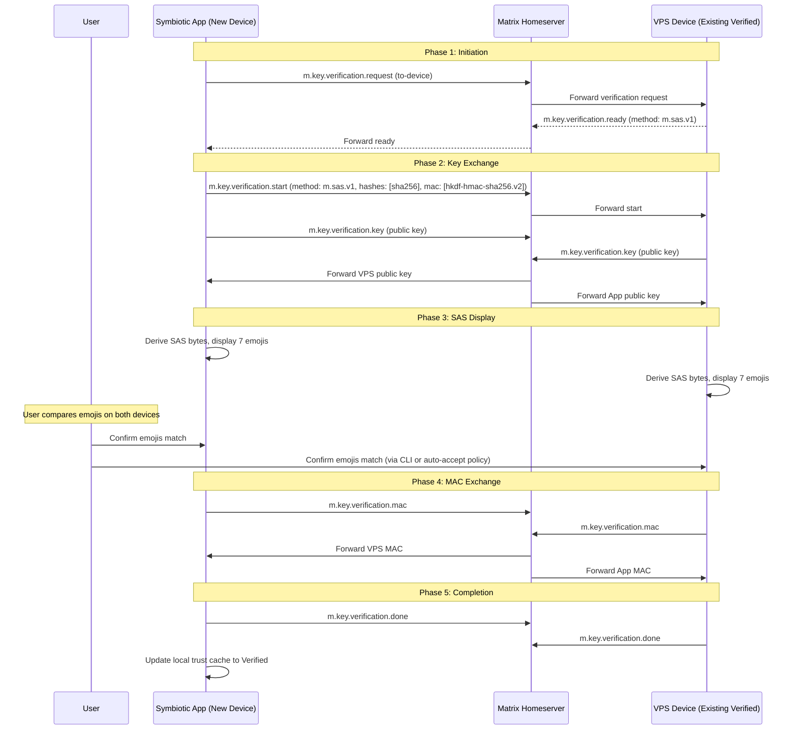
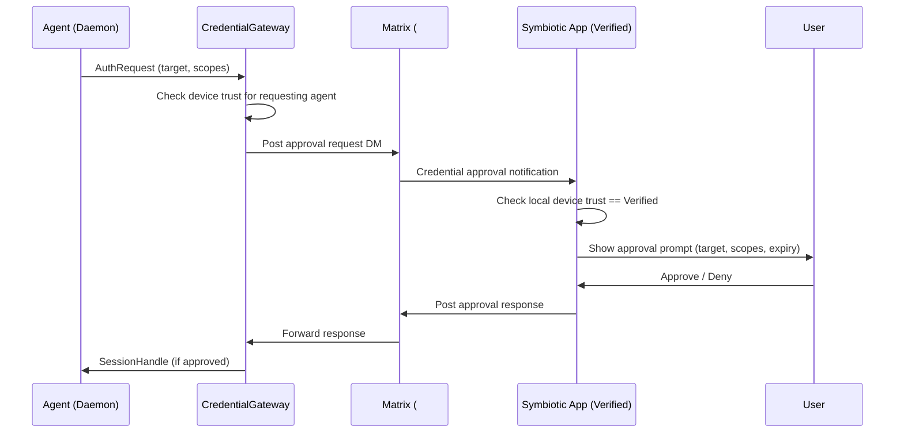
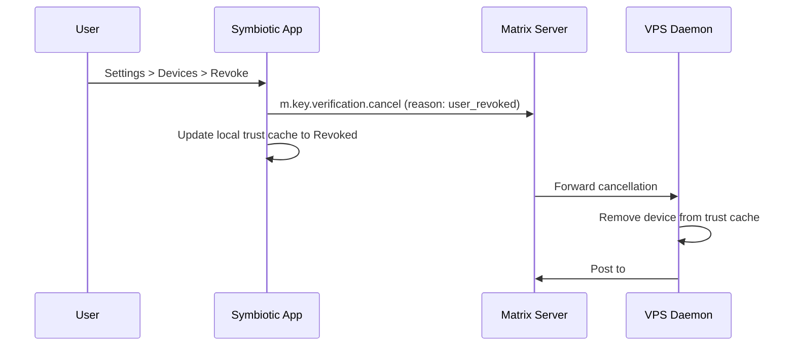

# Device Trust Bootstrap

**Status**: Planned (Approved)
**Task**: T47 (Zero-Touch User Onboarding)
**Depends on**: T46 (Symbiotic Matrix Client)

## Overview

Device trust bootstrap defines how the Symbiotic app establishes a **verified device** for sensitive actions (credential approvals, session handle export, payment flows). A device must complete SAS emoji verification via Matrix before it gains access to trust-critical operations.

## Trust Levels

| Level | Description | Allowed Actions |
|-------|-------------|-----------------|
| **Unverified** | Device registered but not verified | Read non-sensitive channels, view system status |
| **Verified** | SAS emoji verification completed | Approve credentials, view private alerts, export session handles |

## Rust Types

These types will live in `submodules/runtime/crates/symbiotic-trust/src/device.rs`:

```rust
use serde::{Deserialize, Serialize};
use thiserror::Error;

/// Unique identifier for a Matrix device, as returned by the homeserver.
pub type MatrixDeviceId = String;

#[derive(Debug, Clone, Copy, PartialEq, Eq, Serialize, Deserialize)]
pub enum DeviceTrustLevel {
    /// Device registered but not yet verified via SAS.
    Unverified,
    /// SAS emoji verification completed successfully.
    Verified,
    /// Device trust was revoked (must re-verify).
    Revoked,
}

#[derive(Debug, Clone, Serialize, Deserialize)]
pub struct DeviceTrustRecord {
    /// Matrix device ID (e.g., "ABCDEF1234").
    pub device_id: MatrixDeviceId,
    /// Current trust level.
    pub trust_level: DeviceTrustLevel,
    /// Unix timestamp when verification completed (0 if unverified).
    pub verified_at: u64,
    /// Unix timestamp when the record was last checked against the homeserver.
    pub last_checked: u64,
    /// Matrix user ID that owns this device.
    pub user_id: String,
}

#[derive(Debug, Error)]
pub enum DeviceTrustError {
    #[error("device not found: {0}")]
    DeviceNotFound(MatrixDeviceId),
    #[error("device not verified: {0}")]
    DeviceNotVerified(MatrixDeviceId),
    #[error("device trust revoked: {0}")]
    DeviceRevoked(MatrixDeviceId),
    #[error("SAS verification failed: {0}")]
    SasVerificationFailed(String),
    #[error("trust cache corrupted: {0}")]
    CacheCorrupted(String),
    #[error("homeserver unreachable")]
    HomeserverUnreachable,
    #[error("verification timeout after {0} seconds")]
    VerificationTimeout(u64),
}
```

## Trust Cache

Device trust state is cached locally to avoid requiring network access for every trust check.

**Location:** `~/.symbiotic/trust-cache.json` (on VPS: `/var/lib/symbiotic/trust-cache.json`)

**Format:**

```json
{
  "version": 1,
  "devices": [
    {
      "device_id": "ABCDEF1234",
      "trust_level": "Verified",
      "verified_at": 1738800000,
      "last_checked": 1738800300,
      "user_id": "@user:symbiotic.example"
    }
  ],
  "cache_written_at": 1738800300
}
```

**File permissions:** `0600` (same hardening as vault files).

**Cache invalidation rules:**
- Re-validate against homeserver on app startup.
- Re-validate if `last_checked` is older than 24 hours.
- Immediately invalidate on any Matrix key change event for the device.
- If cache file is missing or corrupted, treat all devices as `Unverified`.

```rust
use std::path::PathBuf;

pub struct TrustCacheConfig {
    /// Path to the trust cache file.
    pub cache_path: PathBuf,
    /// Maximum age in seconds before re-validation is required.
    pub max_age_secs: u64, // Default: 86400 (24 hours)
}

impl Default for TrustCacheConfig {
    fn default() -> Self {
        Self {
            cache_path: dirs::home_dir()
                .unwrap_or_default()
                .join(".symbiotic")
                .join("trust-cache.json"),
            max_age_secs: 86400,
        }
    }
}
```

## SAS Emoji Verification Algorithm

Symbiotic uses the Matrix SAS (Short Authentication String) emoji verification protocol, as defined in [Matrix Spec: Key Verification](https://spec.matrix.org/v1.9/client-server-api/#key-verification-framework).

### Protocol Steps



### Implementation Notes

- The `matrix-sdk` crate provides `Sas` and `SasVerification` types that handle the cryptographic protocol.
- The app displays 7 emojis from the Matrix SAS emoji table (64 defined emojis, 6 bits each, 42 bits total from the SAS output).
- The VPS side auto-accepts if the verification was initiated from a device already in the trust cache. For first-device bootstrap (no existing verified device), the VPS CLI prompts for confirmation or uses a one-time bootstrap token provided during install.

### First-Device Bootstrap

When no verified device exists yet (fresh install), the VPS generates a one-time bootstrap token during the install wizard's **Matrix Link** step:

1. Install wizard generates a 6-digit numeric code displayed in the setup UI.
2. User enters the code in the Symbiotic app.
3. The app sends the code to the VPS via an encrypted Matrix DM.
4. VPS validates the code and initiates SAS verification.
5. On success, the app becomes the first verified device.

The bootstrap code expires after 5 minutes and is single-use.

## Approval Flow

Sensitive actions require approval from a verified device. The flow integrates with the existing `CredentialGateway` in `services/credential-gateway/`:



### Approval Request Schema

Sent as an `org.symbiotic.event` in the `#credentials` room:

```json
{
  "msgtype": "org.symbiotic.event",
  "body": "Credential approval requested for x.com",
  "sym": {
    "v": 1,
    "t": "auth.approval_request",
    "s": "blocked",
    "rid": "auth_run_abc123",
    "ts": 1738800000,
    "d": {
      "target": "x.com",
      "scopes": "web.login",
      "expires_in": "300",
      "request_id": "req_abc123"
    }
  }
}
```

### Approval Timeout

- Default: 300 seconds (5 minutes).
- If no response within timeout, the request is denied and `auth.failed` is emitted.
- The daemon retries once after a 60-second cooldown, then escalates to `#alerts`.

## Revocation Flow

Device trust can be revoked in three ways:

### 1. User-Initiated Revocation (from app)



### 2. Automatic Revocation (key change detected)

When the homeserver reports a device key change (`m.device_list_update`), the daemon:
1. Marks the device as `Revoked` in the trust cache.
2. Emits `auth.device_revoked` event to `#alerts`.
3. Blocks all pending approval requests from that device.
4. Requires re-verification before the device can approve again.

### 3. Admin CLI Revocation

```bash
symbiotic-daemon device revoke --device-id ABCDEF1234
```

This immediately updates the trust cache and notifies via `#alerts`.

## Enforcement

Integration points in the existing codebase:

| Check Point | Crate/Module | Enforcement |
|-------------|--------------|-------------|
| Credential approval | `services/credential-gateway/src/lib.rs` | `issue_session_handle()` checks device trust before processing |
| Session handle export | `services/credential-gateway/src/lib.rs` | `export_session_handle()` requires verified device |
| Vault Seal step | `submodules/runtime/services/symbiotic-installer/src/lib.rs` | `WizardStep::VaultSeal` blocks until device verified |
| Private alert delivery | `submodules/runtime/crates/symbiotic-matrix/src/transport.rs` | Filter sensitive messages to verified devices only |

## Error Handling

| Error | User-Facing Message | Recovery |
|-------|---------------------|----------|
| `SasVerificationFailed` | "Verification failed. The emojis did not match. Please try again." | Retry SAS from the beginning |
| `DeviceNotVerified` | "This device is not verified. Complete device verification in Settings to approve credentials." | Navigate to verification flow |
| `DeviceRevoked` | "This device's trust has been revoked. Re-verify to continue." | Re-initiate SAS verification |
| `VerificationTimeout` | "Verification timed out. Please try again." | Retry with fresh SAS session |
| `CacheCorrupted` | "Trust data is corrupted. Re-verifying device..." | Delete cache, re-verify |
| `HomeserverUnreachable` | "Cannot reach server. Sensitive actions are temporarily unavailable." | Retry on next connectivity |

## Test Strategy

### Unit Tests (`submodules/runtime/crates/symbiotic-trust/src/device.rs`)

| Test | Description |
|------|-------------|
| `trust_cache_roundtrip` | Serialize/deserialize `DeviceTrustRecord` to/from JSON |
| `trust_cache_rejects_corrupted` | Malformed JSON returns `CacheCorrupted` error |
| `trust_cache_invalidates_stale` | Records older than `max_age_secs` are treated as unverified |
| `device_trust_level_ordering` | `Revoked < Unverified < Verified` for enforcement checks |
| `enforcement_blocks_unverified` | Unverified device cannot pass trust gate |
| `enforcement_allows_verified` | Verified device passes trust gate |
| `revocation_updates_cache` | Revoking a device updates cache and blocks subsequent checks |

### Integration Tests (`tests/device_trust_integration.rs`)

| Test | Description |
|------|-------------|
| `first_device_bootstrap_e2e` | Bootstrap token flow from install wizard to verified device |
| `sas_verification_happy_path` | Full SAS flow using `InMemoryMatrixTransport` |
| `sas_verification_mismatch` | Mismatched SAS returns `SasVerificationFailed` |
| `approval_requires_verified_device` | Credential approval rejected when device is unverified |
| `revocation_blocks_approval` | Revoked device cannot approve credentials |
| `cache_survives_restart` | Write cache, re-read, device still verified |

## Related Docs

- `docs/architecture/trust-capabilities.md` (implemented trust levels)
- `docs/architecture/credential-sandbox.md` (credential gateway)
- `docs/architecture/matrix-channels.md` (channel definitions)
- `docs/design/setup-experience.md` (Matrix Link step)
- `docs/design/symbiotic-app.md` (mobile app integration)
