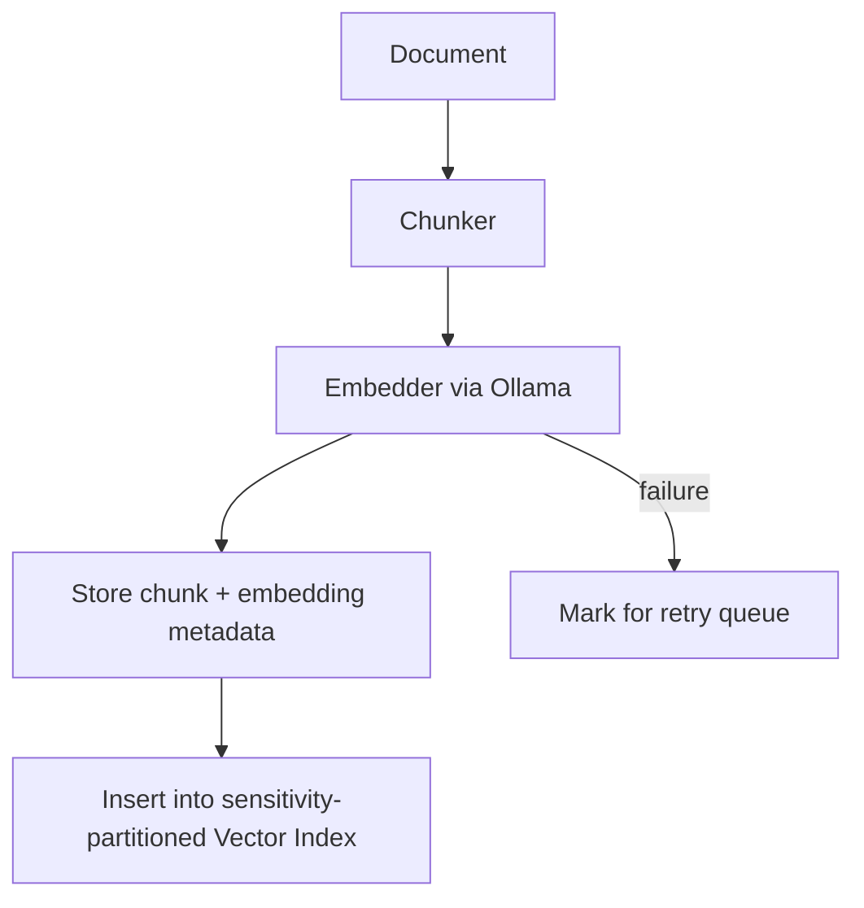

# Embedding & Chunking


**Status**: Planned (Approved)
**Task**: T32 (Vector Embeddings + Semantic Search)
**Depends on**: ---

## Overview

This spec defines how content is chunked and embedded for semantic retrieval. It ensures consistent recall, dedupe, and privacy enforcement.

## Tokenizer

| Criterion | Decision |
|-----------|----------|
| Library | `tiktoken-rs` |
| Encoding | `cl100k_base` |
| Purpose | Accurate token counting for chunk sizing and budget enforcement |

**Rationale**: `cl100k_base` is the standard encoding used by modern LLMs. Using `tiktoken-rs` gives accurate token counts rather than word-count estimates. This matters for chunk sizing (staying within the 512-token target) and for token budget enforcement in context packs.

```rust
use thiserror::Error;

#[derive(Debug, Error)]
pub enum TokenizerError {
    #[error("tokenizer initialization failed: {0}")]
    InitFailed(String),
    #[error("encoding failed for input of length {0}")]
    EncodingFailed(usize),
}

pub struct Tokenizer {
    bpe: tiktoken_rs::CoreBPE,
}

impl Tokenizer {
    pub fn new() -> Result<Self, TokenizerError> {
        let bpe = tiktoken_rs::cl100k_base()
            .map_err(|e| TokenizerError::InitFailed(e.to_string()))?;
        Ok(Self { bpe })
    }

    /// Count tokens in the given text.
    pub fn count_tokens(&self, text: &str) -> usize {
        self.bpe.encode_with_special_tokens(text).len()
    }

    /// Encode text to token IDs.
    pub fn encode(&self, text: &str) -> Vec<usize> {
        self.bpe.encode_with_special_tokens(text)
    }

    /// Decode token IDs back to text.
    pub fn decode(&self, tokens: &[usize]) -> Result<String, TokenizerError> {
        self.bpe
            .decode(tokens.to_vec())
            .map_err(|_| TokenizerError::EncodingFailed(tokens.len()))
    }
}
```

## Chunking Rules

| Parameter | Value | Rationale |
|-----------|-------|-----------|
| Target size | 512 tokens | Fits well within nomic-embed-text's 8192 context; good retrieval granularity |
| Overlap | 64 tokens | ~12.5% overlap preserves cross-boundary context |
| Minimum chunk | 64 tokens | Discard fragments too small to be useful |
| Maximum chunk | 768 tokens | Hard cap; split if boundary detection produces oversized chunks |

### Boundary Detection Algorithm

The chunker prefers splitting at natural text boundaries rather than arbitrary token offsets. Priority order:

1. **Paragraph boundary** (`\n\n`) -- strongest signal
2. **Heading boundary** (`# `, `## `, etc.) -- section break
3. **Sentence boundary** (`. `, `! `, `? ` followed by uppercase or end) -- sentence end
4. **Token boundary** -- fallback when no natural boundary found within window

```rust
use serde::{Deserialize, Serialize};

#[derive(Debug, Clone, Serialize, Deserialize)]
pub struct ChunkConfig {
    /// Target chunk size in tokens.
    pub target_tokens: usize,
    /// Overlap between adjacent chunks in tokens.
    pub overlap_tokens: usize,
    /// Minimum chunk size; smaller chunks are merged with neighbors or discarded.
    pub min_tokens: usize,
    /// Maximum chunk size; chunks exceeding this are force-split at token boundary.
    pub max_tokens: usize,
}

impl Default for ChunkConfig {
    fn default() -> Self {
        Self {
            target_tokens: 512,
            overlap_tokens: 64,
            min_tokens: 64,
            max_tokens: 768,
        }
    }
}

#[derive(Debug, Clone, Serialize, Deserialize)]
pub struct Chunk {
    /// Unique ID for this chunk (UUID v4).
    pub chunk_id: String,
    /// Source document ID (archive entry short-id).
    pub source_id: String,
    /// Byte offset in the original document where this chunk starts.
    pub byte_offset: usize,
    /// Character length of the chunk in the original document.
    pub char_length: usize,
    /// Token count (computed by tokenizer).
    pub token_count: usize,
    /// The chunk text content.
    pub text: String,
    /// Sensitivity level inherited from source document.
    pub sensitivity: Sensitivity,
    /// Which boundary type was used to end this chunk.
    pub boundary_type: BoundaryType,
    /// Chunk index within the document (0-based).
    pub sequence_index: usize,
}

#[derive(Debug, Clone, Copy, Serialize, Deserialize)]
#[serde(rename_all = "snake_case")]
pub enum BoundaryType {
    Paragraph,
    Heading,
    Sentence,
    Token,
}

#[derive(Debug, Error)]
pub enum ChunkError {
    #[error("empty input")]
    EmptyInput,
    #[error("tokenizer error: {0}")]
    Tokenizer(#[from] TokenizerError),
    #[error("source document too large: {size} bytes exceeds max {max}")]
    DocumentTooLarge { size: usize, max: usize },
}
```

### Chunking Algorithm

```rust
pub struct Chunker {
    config: ChunkConfig,
    tokenizer: Tokenizer,
}

impl Chunker {
    pub fn new(config: ChunkConfig) -> Result<Self, TokenizerError> {
        let tokenizer = Tokenizer::new()?;
        Ok(Self { config, tokenizer })
    }

    /// Split a document into chunks respecting boundary preferences.
    pub fn chunk_document(
        &self,
        source_id: &str,
        text: &str,
        sensitivity: Sensitivity,
    ) -> Result<Vec<Chunk>, ChunkError> {
        if text.trim().is_empty() {
            return Err(ChunkError::EmptyInput);
        }
        // Algorithm:
        // 1. Tokenize full document.
        // 2. Walk forward in target_tokens steps.
        // 3. At each step, scan backward from target position for best boundary:
        //    a. Look for paragraph break (\n\n) within last 20% of window.
        //    b. Look for heading (line starting with #) within last 20%.
        //    c. Look for sentence end (.\s, !\s, ?\s) within last 20%.
        //    d. Fall back to exact token boundary.
        // 4. Emit chunk, advance position by (chunk_size - overlap_tokens).
        // 5. Discard final chunk if < min_tokens (merge into previous).
        todo!()
    }
}
```

## Embedding Rules

| Rule | Detail |
|------|--------|
| Private/restricted chunks | Embed locally only (via Ollama) |
| Shareable chunks | Local or remote embeddings allowed |
| Model stored per chunk | Enables re-embedding when model changes |
| Batch size | 32 chunks per Ollama API call |

### Embedding Pipeline



### Retry Strategy for Failed Embeddings

| Scenario | Action |
|----------|--------|
| Ollama timeout | Retry with exponential backoff: 1s, 2s, 4s, max 3 attempts |
| Ollama unavailable | Store chunk without embedding, mark `embedding_status: pending` |
| Model not loaded | Attempt `ollama pull` once, then retry embed; fail after that |
| Dimension mismatch | Log error, do not store embedding, mark `embedding_status: error` |
| Batch partial failure | Retry failed chunks individually |

```rust
#[derive(Debug, Clone, Copy, Serialize, Deserialize)]
#[serde(rename_all = "snake_case")]
pub enum EmbeddingStatus {
    /// Successfully embedded.
    Complete,
    /// Awaiting embedding (Ollama was unavailable).
    Pending,
    /// Embedding failed after retries.
    Error,
    /// Needs re-embedding (model changed).
    Stale,
}

#[derive(Debug, Clone, Serialize, Deserialize)]
pub struct ChunkEmbedding {
    /// References the chunk this embedding belongs to.
    pub chunk_id: String,
    /// The embedding vector.
    pub embedding: Vec<f32>,
    /// Model used to generate this embedding.
    pub model_name: String,
    /// Embedding dimensions (for validation).
    pub dimensions: usize,
    /// Current status.
    pub status: EmbeddingStatus,
    /// Number of retry attempts.
    pub retry_count: u32,
    /// Timestamp of last attempt.
    pub last_attempt_at: Option<String>,
}

#[derive(Debug, Clone, Copy)]
pub struct RetryConfig {
    /// Maximum number of retry attempts.
    pub max_retries: u32,
    /// Initial backoff duration in milliseconds.
    pub initial_backoff_ms: u64,
    /// Backoff multiplier (exponential).
    pub backoff_multiplier: f64,
}

impl Default for RetryConfig {
    fn default() -> Self {
        Self {
            max_retries: 3,
            initial_backoff_ms: 1000,
            backoff_multiplier: 2.0,
        }
    }
}
```

## Metadata Stored per Chunk

```json
{
  "chunk_id": "uuid-v4",
  "source_id": "short-id",
  "byte_offset": 1200,
  "char_length": 650,
  "token_count": 487,
  "model": "nomic-embed-text",
  "dimensions": 768,
  "sensitivity": "private",
  "boundary_type": "paragraph",
  "sequence_index": 3,
  "embedding_status": "complete",
  "created_at": "ISO8601"
}
```

## Test Strategy

| Test | Type | Description |
|------|------|-------------|
| Tokenizer accuracy | Unit | Verify token counts match tiktoken reference for known strings |
| Boundary detection | Unit | Paragraph/heading/sentence boundaries detected correctly |
| Overlap correctness | Unit | Adjacent chunks share exactly `overlap_tokens` tokens |
| Min/max enforcement | Unit | Chunks below min are merged; chunks above max are force-split |
| Empty input | Unit | Returns `ChunkError::EmptyInput` |
| Retry backoff | Unit | Verify exponential backoff timing |
| Embedding round-trip | Integration | Chunk doc, embed, retrieve by similarity |
| Status transitions | Unit | pending -> complete, pending -> error after max retries |

## Error Handling

| Error | Handling |
| --- | --- |
| Embedding failure | Mark chunk for retry with exponential backoff |
| Model mismatch | Re-embed all chunks for that model; quarantine stale embeddings |
| Privacy violation | Drop chunk and alert user |
| Tokenizer init failure | Fatal; cannot proceed without tokenizer |
| Document too large | Reject with `DocumentTooLarge` error |
| Ollama unavailable | Store chunks without embeddings; background retry |

## Related Docs

- `docs/design/vector-search.md`
- `docs/architecture/vector-search.md`
