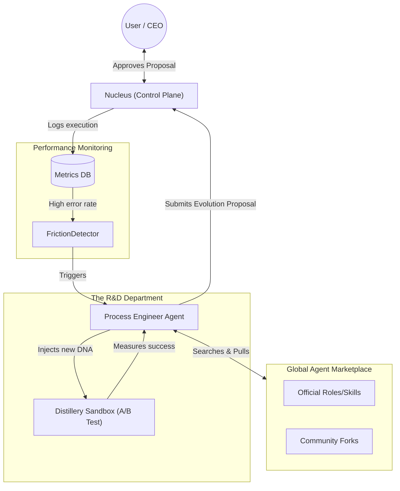

# Evolution Engine & Agent Marketplace

**Status**: Conceptual (Draft)
**Epic**: Agentic Self-Improvement (T112)
**Depends on**: The "Company" Model (`agent-company-model.md`)

## 1. The Vision: From Automation to Evolution

Currently, Symbiotic is a highly capable "Company of Agents." However, the "Employees" (Agent Prompts) and the "Handbooks" (Skills and Workflows) are static. If an agent struggles with a new coding framework or repeatedly fails a specific type of research, it requires human intervention to rewrite its instructions.

The **Evolution Engine** transforms Symbiotic into a self-optimizing intelligence hive. By treating an agent's entire persona (prompts, tools, and skills) as versioned, declarative "DNA," the system can automatically monitor its own performance, identify friction, and pull improved agent profiles from a global **Agent Marketplace**.

This is the ultimate realization of **Task 112 (Agentic Self-Improvement)**: The system learns to manage its own "Human Resources."

---

## 2. What Constitutes Agent "DNA"?

In the Declarative Control Plane, an agent's capability is defined entirely by text files on disk. This makes it safe and easy for the system to modify itself.

| DNA Component | Location | What it does |
| :--- | :--- | :--- |
| **Role Manifest** | `data/runtime/roles/{name}.json` | Defines the System Prompt, Trust Level, Model Tier, and Available Tools (e.g., Coder vs. Reviewer). |
| **Skill Guide** | `knowledge-base/operations/skills/{name}.md` | A Markdown handbook detailing *how* to perform a specific task (e.g., "How to write a Flutter Widget"). |
| **Workflow Template** | `data/runtime/workflows/{name}.json` | The step-by-step pipeline an agent swarm follows to complete a complex goal. |

---

## 3. The Evolution Loop (How it learns)

The evolution process is driven by the **Friction Detector** and executed by a specialized meta-agent called the **Process Engineer**.

### Step 1: Detect Friction (The Catalyst)
The Daemon's `MetricsStore` constantly tracks the "Company's" performance.
*   *Trigger*: The Coder agent took 14 iterations to build a Flutter UI, resulting in 3 compiler errors and high token usage.
*   *Detection*: The `FrictionDetector` flags the `build-frontend` workflow as highly inefficient.

### Step 2: The Process Engineer (The HR Optimizer)
The Nucleus spawns the **Process Engineer Agent**. Its sole job is to fix company friction.
*   It analyzes the Coder's raw logs from the failed task.
*   It realizes the Coder's system prompt lacks context on modern Flutter state management.

### Step 3: The Marketplace Search
The Process Engineer connects to the **Symbiotic Agent Marketplace** (a centralized or decentralized Git registry).
*   It searches for `role:coder tags:flutter,riverpod`.
*   It finds two options:
    *   **Official (Vouched)**: `symbiotic-core/flutter-coder (v2.1)` — 95% success rate.
    *   **Community (Unofficial)**: `user123/flutter-wizard (v1.0)` — Specialized, but unvouched.
*   It decides to pull the Official Vouched profile.

### Step 4: The Distillery Simulation (The Safe Sandbox)
The Nucleus **forks** the new "Flutter Coder" profile locally.
*   It spins up a **Distillery Sandbox**.
*   It feeds the new Coder the exact same failed goal from Step 1.
*   *Result*: The new Coder succeeds in 3 iterations with zero compiler errors.

### Step 5: The Proposal (The Pull Request)
The Process Engineer submits an **Evolution Proposal** to the User (CEO) in the `#stream` or `#thread-meta`:
> **Evolution Proposal:** "The default Coder agent is struggling with Flutter tasks (80% error rate). I tested the official `flutter-coder v2.1` profile from the Marketplace. It completed the same task 60% faster. Shall I upgrade our local Coder profile?"
> `[Approve] [View Diff] [Reject]`

If approved, the Nucleus overwrites the local `roles/coder.json` with the new DNA. The Company has evolved.

---

## 4. The Agent Marketplace Architecture

The Marketplace is essentially a package manager for AI workflows (like `npm` or `cargo`, but for prompts and skills).

*   **Format**: A standard Symbiotic Package (`.sympkg` or a Git repo) containing:
    *   `manifest.yaml` (Name, version, description)
    *   `roles/*.json` (System prompts)
    *   `skills/*.md` (Knowledge guides)
*   **Vouched vs. Unofficial**:
    *   *Vouched*: Profiles maintained by the core Symbiotic team. High trust, safe to auto-propose.
    *   *Unofficial*: Community creations. The system can discover them, but they require a higher threshold of User Approval before testing in the sandbox, as a malicious prompt could attempt social engineering or jailbreaking.

## 5. Visualizing the Evolution Engine

## 6. Impact on T112 (Agentic Self-Improvement)

Previously, T112 was vaguely defined as agents writing Rust code to modify the Daemon. That is dangerous and brittle.

By pivoting T112 to focus entirely on **Agent DNA Optimization (Prompts, Skills, Workflows)**:
1.  **It is 100% Safe**: The agents are only modifying text files that are fed to the LLM, not the compiled binaries of the host machine.
2.  **It is Immediate**: Updating a prompt yields instant behavioral improvements without requiring a system reboot or compiler pass.
3.  **It is Scalable**: A global marketplace allows the entire Symbiotic user base to crowd-source the "perfect" agent prompts for thousands of obscure niches (e.g., a dedicated "Smart Contract Auditor" agent).

The system ceases to be a static tool and becomes an evolving ecosystem that adapts precisely to the user's workload.
