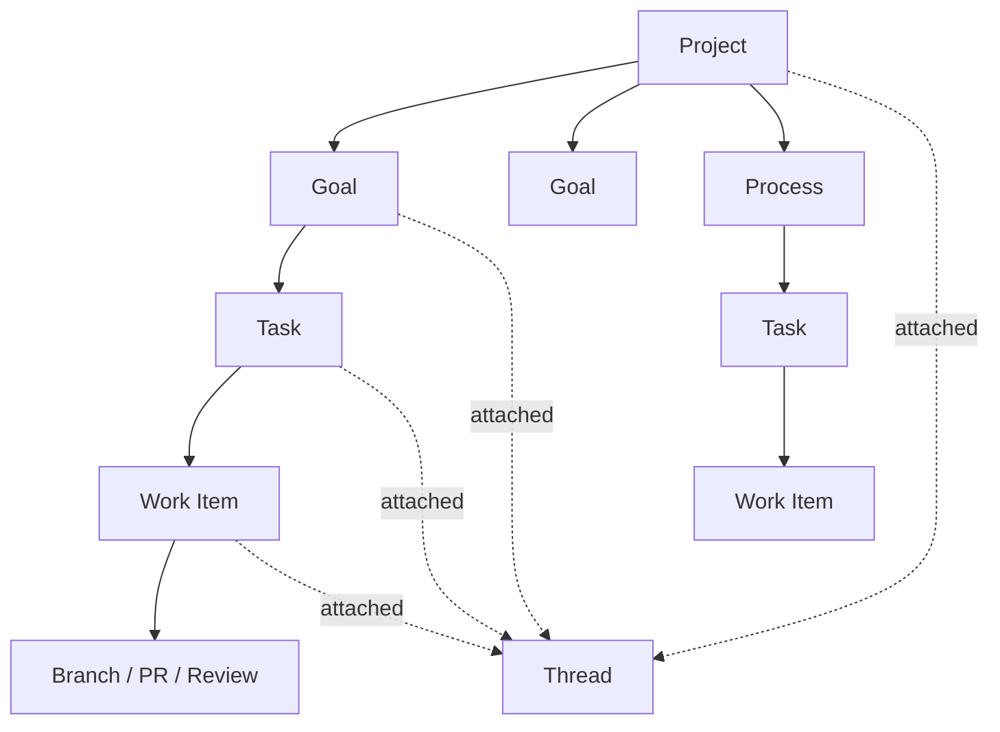

# Project, Goal, Process, Task, and Work-Item Hierarchy

**Status**: Approved design target  
**Related Tasks**: T113, T115, T116, T108  
**Related Docs**: `docs/design/project-goal-process-model.md`, `docs/design/non-swarm-management-ownership.md`, `docs/design/management-work-item-claims.md`, `docs/design/thread-architecture.md`, `docs/design/agent-collaboration-conflict-resolution.md`, `docs/design/goals-layer.md`

## Goal

Define the end-state ownership hierarchy for Symbiotic so:

- messaging does not become ownership
- goals do not have to carry both project and outcome meaning
- reusable processes do not get collapsed into one-off goal records
- execution and development artifacts stay subordinate to planned work

The earlier hierarchy fixed `thread != project`, but it overloaded `goal` into
the top-level container. That was a useful correction at the time, but it is
too blunt for the real product.

Symbiotic needs a clean distinction between:

- the long-lived thing being operated
- the outcome being pursued
- the reusable or recurring structure of work
- the concrete plan and execution underneath

## Core Decision

Symbiotic should converge on this hierarchy:

1. **Project**
   - top-level owned container
   - portfolio / company / product / initiative namespace
2. **Goal**
   - desired outcome inside a project
   - may be one-off or long-lived
3. **Process**
   - reusable or recurring operating structure inside a project
   - may generate goals, tasks, or recurring reviews/checks
4. **Task**
   - durable planned slice under a goal or process
5. **Work Item**
   - atomic checked-out execution unit
6. **Development Artifact**
   - branch / PR / review / merge / CI
7. **Thread**
   - messaging and observability attachment surface
   - never the owner

In short:

- `project` is the container
- `goal` is the outcome
- `process` is the reusable or recurring structure
- `task` is the planned slice
- `work item` is the checkout unit
- `thread` is not a project
- `branch` is not a task

## Why This Is Better

This removes three persistent ambiguities:

1. `thread = project`
   - wrong because threads are conversation surfaces
2. `goal = project`
   - wrong because a project can contain many outcomes and many recurring loops
3. `process = goal`
   - wrong because a recurring review loop or release loop is not the same thing
     as the outcome it serves

Without this split, the system keeps collapsing:

- business context into runtime work units
- recurring structure into one-off plans
- execution into top-level ownership

## Canonical Mapping

### 1. Project

Represents:

- `Symbiotic`
- `Company A Growth`
- `Infra Ops`
- `Product B`

Responsibilities:

- top-level ownership
- namespace / grouping
- aggregate priorities
- attached repos, artifacts, and operating context
- parent container for goals and processes

Non-responsibilities:

- not the atomic execution unit
- not the messaging surface

### 2. Goal

Represents an outcome inside a project.

Examples:

- `Ship truthful observability`
- `Increase lead flow`
- `Reduce incident rate`
- `Land project-memory benchmark`

Responsibilities:

- outcome definition
- success condition
- priority and approval policy
- parent for planned tasks

### 3. Process

Represents reusable or recurring work structure inside a project.

Examples:

- `Weekly product review`
- `Release loop`
- `Upgrade Symbiotic loop`
- `Sales follow-up loop`
- `Infra hygiene review`

Responsibilities:

- cadence / recurrence
- methodology / structure
- optional goal generation
- optional recurring task generation

Important:

- a process is not necessarily active execution
- a process may generate goals or tasks repeatedly over time
- a process is primarily Archive truth, not a heavy runtime primitive

### 4. Task

Represents a durable planned slice beneath a goal or process.

Examples:

- `Define runtime status lane`
- `Review weekly KPIs`
- `Prepare release checklist`
- `Investigate recurring deploy failure`

Responsibilities:

- bounded problem statement
- durable planning record
- parent for concrete work items

### 5. Work Item

Represents the atomic checked-out execution.

Examples:

- `Implement daemon runtime-status store`
- `Review PR #24`
- `Distill merged branch changes`
- `Run KPI review for this week`

Responsibilities:

- atomic checkout
- assignee
- lease / heartbeat
- blocked/running/review state
- scope claims

### 6. Development Artifact

Represents:

- branch
- PR
- review
- merge
- CI run

Responsibilities:

- development-layer lifecycle only
- attached beneath implementation/review work items

### 7. Thread

Represents:

- conversational surface
- human-visible narrative
- observability carrier

Responsibilities:

- route messages
- show attached execution state
- collect memory-relevant conversation

Non-responsibilities:

- owning the project
- being the primary planning unit
- being the execution unit

## Relationship Between Goal And Process

This is the critical distinction.

### Goal

Use `goal` when the question is:

- what outcome are we trying to achieve?

### Process

Use `process` when the question is:

- what repeatable or structured way of operating should keep happening?

Examples:

- project: `Symbiotic`
- goal: `Ship project-board truthfulness`
- process: `Weekly architecture review`

- project: `Company A`
- goal: `Increase inbound qualified leads`
- process: `Monday growth review`

A process may:

- generate new goals
- generate recurring tasks under an existing goal
- run reviews/checks that feed future planning

But it should not replace the goal as the outcome container.

## Runtime Consequences

The runtime should stay minimal.

The ownership spine should remain:

- `project -> goal -> task -> work item -> artifact`

The process layer should usually behave as:

- Archive-native structure and generation logic
- not a second heavy execution primitive alongside work items

That means:

- runtime work should still center on `task -> work item`
- process records should shape planning and recurrence
- graph/link relationships should connect projects, goals, processes, threads,
  repos, and entities without turning the whole control plane into a graph

## Storage Direction

Long term, canonical planning truth should remain inside the Archive.

End-state conceptual layout:

```text
knowledge-base/
  operations/
    projects/
      {project}/
        project.md
        goals/
          {goal}/
            plan.md
            tasks/
            events/
        processes/
          {process}.md
```

This is a design direction, not an implemented path today.

Current code and docs still use:

- `knowledge-base/operations/goals/{goal}/...`

So this document is defining the target conceptual hierarchy, not claiming the
runtime has already migrated to the final filesystem shape.

## Diagram



## What This Does Not Mean

It does not mean:

- adding a deep ontology
- turning the control plane into a pure graph
- introducing many new runtime state machines at once

The right shape is:

- small ownership hierarchy
- rich links across entities
- graph as derived view for recall/navigation

Not:

- endless abstraction layers

## Short-Term Rule

Until the runtime is adjusted, treat current `goal` records as overloaded:

- they currently act partly like projects
- they also carry goal-like outcome and process configuration

Do not cement that overload further in new design work.

From this point on, new design should prefer:

- `project`
- `goal`
- `process`

as distinct concepts, even if implementation catches up in phases.

## Next Design Slice

The next clean step is:

1. define canonical `project` records in the Archive
2. define canonical `process` records and how they generate goals/tasks
3. decide whether current `operations/goals/*` should become:
   - nested under projects
   - or remain a flat runtime-compatible path with explicit `project_id`

That is the next place where implementation should begin, not by adding more
runtime abstractions first.
