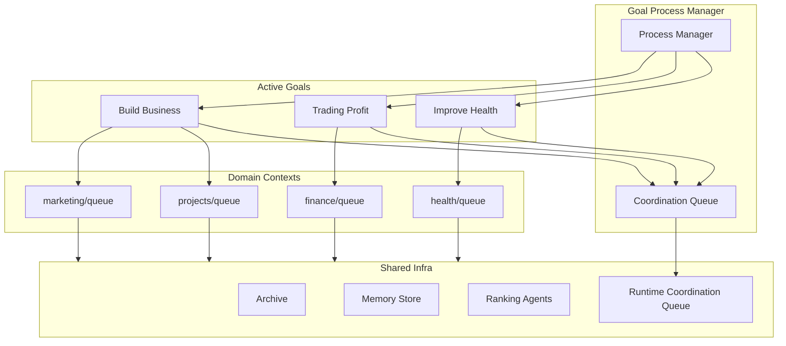
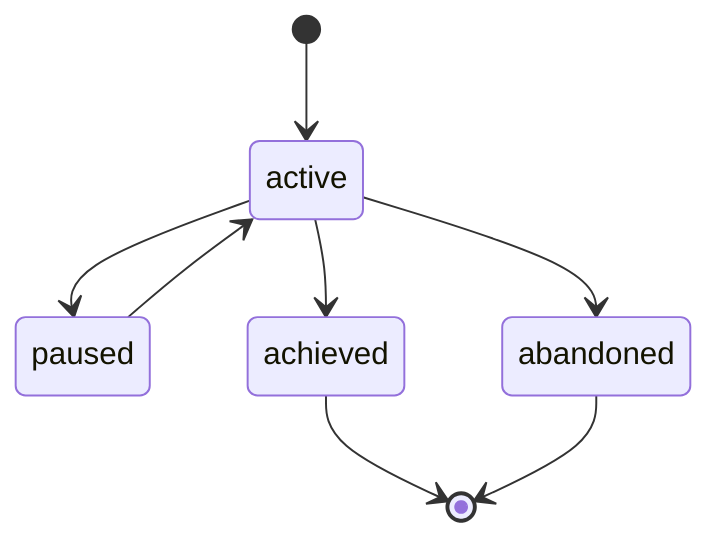

# Goals Layer (Design)

## Overview

This document describes the planned evolution of the Goals Layer from simple goal-tagged tasks into a full goal-driven orchestration system. Goals become running processes that spawn agents, coordinate streams, and manage workflows toward outcomes.

**Naming note (2026-04-16):** this doc predates the newer hierarchy correction in `docs/design/goal-task-work-item-hierarchy.md`. Parts of this design still use `goal` as the top-level active container. Current direction is:

- `project` = top-level container
- `goal` = outcome inside a project
- `process` = reusable or recurring operating structure inside a project

So this doc should now be read mainly as a design for the orchestration behavior that will eventually sit under that cleaner hierarchy, not as the final naming model by itself.

**Current implementation**: see `docs/architecture/goals-layer.md` for the implemented `DomainTask` goal field and domain queue system.

**Verification**: The verification pipeline is defined in `docs/design/agent-orchestration.md` (section "Verification Pipeline"). This doc references it for goal output validation.

**Status**: Planned (Approved)
**Task**: T66 (Goal-Driven Multi-Domain System)
**Depends on**: T67 (Privacy & Security Layer)

## Planned: Goal Process Manager

The GoalProcessManager turns goals from passive tags into active processes. It manages goal lifecycles, schedules check-ins, and coordinates cross-goal resource allocation.

### GoalProcessManager API

```rust
/// Lifecycle state of a goal process.
#[derive(Debug, Clone, PartialEq, Eq, Serialize, Deserialize)]
#[serde(rename_all = "snake_case")]
pub enum GoalState {
    Active,
    Paused,
    Achieved,
    Abandoned,
}

/// A running goal process.
#[derive(Debug, Clone, Serialize, Deserialize)]
pub struct GoalProcess {
    pub id: String,                    // uuid-v4
    pub slug: String,
    pub title: String,
    pub state: GoalState,
    pub priority: u8,                  // 1-5 (lower = higher)
    pub autonomy_level: AutonomyLevel,
    pub process_type: ProcessType,
    pub check_frequency: CheckFrequency,
    pub max_parallel_agents: usize,
    pub streams: Vec<GoalStream>,
    pub domains: Vec<String>,
    pub created_at: u64,
    pub last_check_at: Option<u64>,
    pub next_check_at: Option<u64>,
    pub metrics: GoalMetrics,
}

#[derive(Debug, Clone, Copy, PartialEq, Eq, Serialize, Deserialize)]
#[serde(rename_all = "snake_case")]
pub enum AutonomyLevel {
    Manual,  // Every action requires human approval
    Semi,    // Routine actions auto-approved, significant ones need approval
    Auto,    // All actions auto-approved within capability bounds
}

#[derive(Debug, Clone, Copy, PartialEq, Eq, Serialize, Deserialize)]
#[serde(rename_all = "snake_case")]
pub enum ProcessType {
    Persistent,  // Always running, checks on schedule
    Periodic,    // Runs at intervals, sleeps between
    OnDemand,    // Only runs when triggered
}

#[derive(Debug, Clone, Copy, PartialEq, Eq, Serialize, Deserialize)]
#[serde(rename_all = "snake_case")]
pub enum CheckFrequency {
    Hourly,
    Daily,
    Weekly,
    Custom { interval_secs: u64 },
}

#[derive(Debug, Clone, Serialize, Deserialize)]
pub struct GoalStream {
    pub name: String,
    pub domain: String,
    pub focus: String,
    pub autonomy: AutonomyLevel,
    pub active_agents: usize,
    pub max_agents: usize,
}

#[derive(Debug, Clone, Default, Serialize, Deserialize)]
pub struct GoalMetrics {
    pub tasks_completed: u64,
    pub tasks_failed: u64,
    pub agents_spawned: u64,
    pub total_cost_usd: f64,
    pub last_progress_note: Option<String>,
}

/// The goal process manager: runs goal processes, handles scheduling,
/// and coordinates resource allocation across goals.
pub struct GoalProcessManager {
    goals: Vec<GoalProcess>,
    coordination_queue: CoordinationQueue,
    store_path: PathBuf,  // data/goals/
}

impl GoalProcessManager {
    /// Load all goal processes from disk.
    pub fn load(store_path: &Path) -> Result<Self>;

    /// Create a new goal process from a YAML definition.
    pub fn create_goal(&mut self, definition: &Path) -> Result<&GoalProcess>;

    /// Get goals due for their next check-in.
    pub fn get_due_goals(&self, now: u64) -> Vec<&GoalProcess> {
        self.goals.iter()
            .filter(|g| g.state == GoalState::Active)
            .filter(|g| match g.next_check_at {
                Some(next) => now >= next,
                None => true, // Never checked, due immediately
            })
            .collect()
    }

    /// Run a check-in for a goal: evaluate progress, spawn agents if needed,
    /// update metrics.
    pub async fn check_in(&mut self, goal_slug: &str, now: u64) -> Result<CheckInReport>;

    /// Transition a goal to a new state.
    pub fn transition(&mut self, goal_slug: &str, new_state: GoalState) -> Result<()>;

    /// Get all active goals sorted by priority.
    pub fn active_goals_by_priority(&self) -> Vec<&GoalProcess> {
        let mut goals: Vec<_> = self.goals.iter()
            .filter(|g| g.state == GoalState::Active)
            .collect();
        goals.sort_by_key(|g| g.priority);
        goals
    }

    /// Allocate agent slots across active goals based on priority.
    /// Returns a map of goal_slug -> allocated_slots.
    pub fn allocate_agent_slots(&self, total_slots: usize) -> HashMap<String, usize> {
        let active = self.active_goals_by_priority();
        if active.is_empty() {
            return HashMap::new();
        }
        // Weighted allocation: priority 1 gets 3x weight, priority 5 gets 1x
        let weights: Vec<(String, usize)> = active.iter()
            .map(|g| (g.slug.clone(), 6 - g.priority as usize)) // p1=5, p2=4, ...
            .collect();
        let total_weight: usize = weights.iter().map(|(_, w)| w).sum();
        weights.iter()
            .map(|(slug, w)| {
                let slots = ((*w as f64 / total_weight as f64) * total_slots as f64)
                    .ceil() as usize;
                (slug.clone(), slots.min(
                    active.iter()
                        .find(|g| &g.slug == slug)
                        .map(|g| g.max_parallel_agents)
                        .unwrap_or(0)
                ))
            })
            .collect()
    }

    /// Persist all goal state to disk (atomic writes).
    pub fn save(&self) -> Result<()>;
}
```

### Components

| Component | Purpose |
|-----------|---------|
| GoalProcessManager | Runs goal processes and manages scheduling |
| CoordinationQueue | Cross-goal queries and conflict resolution |
| Event Bus (Matrix) | Routes updates and approvals |

### Orchestrator Data Flow



## Planned: Goal File Schema (YAML)

Goal definitions live under `data/goals/` with YAML frontmatter:

```yaml
---
id: uuid-v4
slug: build-symbiotic-business
title: Build Symbiotic Business
status: active              # active | paused | achieved | abandoned
priority: 1                 # 1-5 (lower = higher)
autonomy_level: semi        # manual | semi | auto

process:
  type: persistent          # persistent | periodic | on-demand
  check_frequency: daily
  max_parallel_agents: 3

streams:
  - name: marketing
    domain: marketing
    focus: "Content creation"
    autonomy: semi

domains: [marketing, projects]
---
```

## Planned: Goal State Machine



## Planned: Priority Ranking Algorithm

Ranking agents score new content against active goals at intake time. This avoids re-scoring on every query.

### Ranking API

```rust
/// Ranking criteria defined per goal.
#[derive(Debug, Clone, Serialize, Deserialize)]
pub struct RankingCriteria {
    /// Keywords and phrases that indicate relevance.
    pub keywords: Vec<String>,
    /// Domain tags that are relevant to this goal.
    pub domains: Vec<String>,
    /// Minimum relevance score to trigger action extraction.
    pub action_threshold: f64,  // 0.0 - 1.0, default: 0.6
}

/// Result of ranking a piece of content against a goal.
#[derive(Debug, Clone, Serialize, Deserialize)]
pub struct RankingResult {
    pub goal_slug: String,
    pub relevance_score: f64,   // 0.0 - 1.0
    pub matched_keywords: Vec<String>,
    pub extracted_actions: Vec<String>,
    pub ranked_at: u64,
}

/// Scores an entry against all active goals at intake time.
pub struct GoalRanker {
    goals: Vec<(String, RankingCriteria)>,  // (slug, criteria)
}

impl GoalRanker {
    /// Rank content against all active goals.
    /// Returns results sorted by relevance_score descending.
    pub async fn rank(&self, content: &str, metadata: &EntryMetadata) -> Vec<RankingResult>;
}
```

### Ranking Algorithm

1. For each active goal, compute relevance score:
   - **Keyword match** (40% weight): TF-IDF style matching of goal keywords against content
   - **Domain match** (30% weight): Does the content's domain overlap with goal domains?
   - **Semantic similarity** (30% weight): Vector similarity between content embedding and goal description embedding (requires T32: Vector Embeddings)
2. If `relevance_score >= action_threshold`, extract potential actions using LLM (Haiku for cost efficiency)
3. Store ranking results alongside the entry metadata
4. Content that fails all goal rankings is marked as `unscored` for retry when new goals are added

- Each goal defines ranking criteria in its YAML file.
- Ranking produces a relevance score and optional extracted actions.
- Unscored content is marked for retry.

## Planned: Coordination Queue

Cross-goal queries and conflict resolution live in `data/runtime/coordination/`. The coordination queue reuses the `QueueBackend` trait from `symbiotic-queue`.

### Coordination Queue API

```rust
/// A coordination request between goals.
#[derive(Debug, Clone, Serialize, Deserialize)]
pub struct CoordinationRequest {
    pub id: String,
    pub request_type: CoordinationType,
    pub requesting_goal: String,
    pub competing_goal: Option<String>,
    pub resource: String,
    pub priority_requesting: u8,
    pub priority_competing: Option<u8>,
    pub created_at: u64,
    pub resolved_at: Option<u64>,
    pub resolution: Option<CoordinationResolution>,
}

#[derive(Debug, Clone, PartialEq, Eq, Serialize, Deserialize)]
#[serde(rename_all = "snake_case")]
pub enum CoordinationType {
    /// Two goals competing for the same agent slot.
    AgentSlotConflict,
    /// Two goals trying to modify the same resource.
    ResourceConflict,
    /// Goal needs more agent slots than allocated.
    SlotEscalation,
}

#[derive(Debug, Clone, PartialEq, Eq, Serialize, Deserialize)]
#[serde(rename_all = "snake_case")]
pub enum CoordinationResolution {
    /// Higher priority goal wins.
    PriorityWins { winner: String },
    /// User decided.
    UserDecided { winner: String, notes: String },
    /// Merged: both goals share the resource.
    Shared,
}

/// Coordination queue backed by symbiotic-queue's QueueBackend.
pub struct CoordinationQueue {
    backend: Box<dyn QueueBackend>,
}

impl CoordinationQueue {
    /// Submit a coordination request.
    pub fn submit(&self, request: CoordinationRequest) -> Result<String>;

    /// Auto-resolve simple conflicts (clear priority winner).
    pub fn auto_resolve(&self, request_id: &str) -> Result<Option<CoordinationResolution>> {
        // If priority difference >= 2, auto-resolve to higher priority
        // If same priority or difference == 1, escalate to user
    }

    /// Get pending requests that need user input.
    pub fn pending_for_user(&self) -> Result<Vec<CoordinationRequest>>;

    /// Record a user's resolution.
    pub fn resolve(&self, request_id: &str, resolution: CoordinationResolution) -> Result<()>;

    /// Audit trail of all resolved requests.
    pub fn history(&self) -> Result<Vec<CoordinationRequest>>;
}
```

### Conflict Resolution Rules

1. **Priority difference >= 2**: Auto-resolve in favor of higher priority goal
2. **Priority difference 0-1**: Escalate to user via Matrix
3. **Resource conflict**: If both goals can share (read-only), auto-resolve as `Shared`
4. **Agent slot escalation**: Temporarily reallocate from lowest-priority active goal

## Planned: Workflow Engine

Goals can define workflows as JSON templates. The workflow engine executes steps, handles branching, and reports progress.

- Workflow templates stored in `workflows/`.
- UI serializes workflows; JSON is the canonical format.
- Steps map to agent actions, user prompts, or external integrations.

## Planned: Event-Driven Updates

Goal status updates travel via Matrix event envelopes (`org.symbiotic.event`), using the same envelope format as setup and runtime status updates.

## Key Decisions

1. **Goals are processes, not tags**: goals can run, spawn agents, and report progress.
2. **Streams within goals**: parallel sub-processes per goal with independent autonomy.
3. **Ranking on ingest**: goal scoring happens once at intake, not on every query.
4. **Domain-agnostic infra**: domains supply context, core systems remain shared.
5. **Hybrid autonomy**: per-goal/stream autonomy levels (manual/semi/auto).
6. **Workflow templates in JSON**: UI serializes workflows; JSON is the canonical format.
7. **Event-driven updates**: goal status updates travel via Matrix event envelopes.
8. **Runtime/dev separation**: production coordination lives under `data/runtime/*`, not `tasks/*`.
9. **Reuse symbiotic-queue**: coordination queue uses the existing `QueueBackend` trait rather than a new persistence mechanism.
10. **Weighted slot allocation**: agent slots distributed proportional to goal priority weights.

## Error Handling

| Error | Handling |
|-------|----------|
| Agent failure | Retry with backoff, then escalate to human |
| Cross-goal conflict | Resolve by priority or ask user (see Coordination Queue) |
| Resource limits | Enforce `max_parallel_agents` and queue excess |
| Ranking failures | Mark content as unscored, retry later |
| Workflow errors | Fail closed, notify `#alerts` |
| Goal process crash | Restart from last persisted state |

## Related Docs

- `docs/architecture/goals-layer.md` (current implementation: DomainTask, DomainQueue)
- `docs/design/agent-orchestration.md` (verification pipeline, task graph API)
- `docs/architecture/matrix-channels.md` (event delivery)
