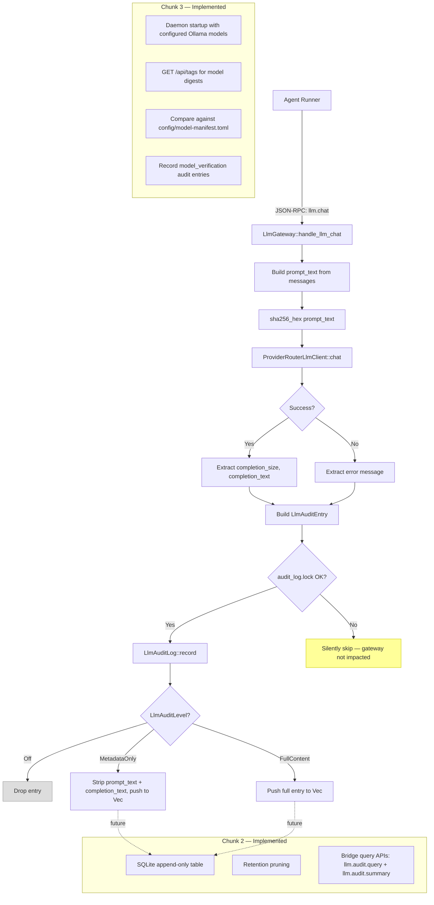

# LLM I/O Audit Trail + Model Integrity

**Task**: T120 | **Priority**: P1 | **Status**: Implemented

## Overview

Every LLM request routed through the daemon's JSON-RPC gateway is logged to a structured audit trail with configurable verbosity (off, metadata-only, full-content). This provides the forensic foundation for error diagnosis (T107) and agent performance evaluation (T112). A second layer now records startup integrity attestations for the local Ollama models Symbiotic actually uses, comparing Ollama-reported digests against a known-good manifest without inventing a separate weight-loader path.

## Components

| File | Role | Status |
|------|------|--------|
| `services/symbiotic-daemon/src/llm_audit.rs` | `LlmAuditLog`, `LlmAuditEntry`, `LlmAuditLevel`, `sha256_hex()` | Implemented |
| `services/symbiotic-daemon/src/llm_gateway.rs` | Wiring: audit recording in `handle_llm_chat()`, tool memory in `handle_tool_execute()` / `handle_swarm_rpc()` | Implemented |
| `crates/symbiotic-memory/src/tool_memory.rs` | `ToolMemoryStore`, `ToolInvocation` (companion: T122) | Implemented |
| `services/symbiotic-daemon/src/llm_audit.rs` | SQLite persistence, query, and summary helpers for audit entries | Implemented |
| `services/symbiotic-daemon/src/model_integrity.rs` | Startup attestation against Ollama-reported digests | Implemented |
| `config/model-manifest.toml` | Known-good local model digests | Implemented |

## Data Flow



## Implementation Status

### Chunk 1: LLM I/O Audit Log — Implemented

**Types:**

- `LlmAuditLevel` — enum: `Off`, `MetadataOnly`, `FullContent` (serde: `snake_case`)
- `LlmAuditEntry` — struct with fields: `timestamp: u64`, `agent_id: String`, `model: String`, `prompt_hash: String`, `completion_size: usize`, `token_count: Option<u64>`, `latency_ms: u64`, `success: bool`, `error: Option<String>`, `prompt_text: Option<String>`, `completion_text: Option<String>`
- `LlmAuditLog` — struct holding `level: LlmAuditLevel`, `retention_days: u64`, `entries: Vec<LlmAuditEntry>`
- `sha256_hex(text: &str) -> String` — helper using `sha2::Sha256`

**API:**

- `LlmAuditLog::new(level, retention_days) -> Self`
- `LlmAuditLog::record(&mut self, entry)` — respects level; `Off` drops, `MetadataOnly` strips content fields
- `LlmAuditLog::entries() -> &[LlmAuditEntry]`
- `LlmAuditLog::entries_since(epoch_secs) -> Vec<&LlmAuditEntry>`

**Wiring in `llm_gateway.rs`:**

The gateway holds `audit_log: Arc<Mutex<LlmAuditLog>>`. In `handle_llm_chat()`:
1. Prompt text is assembled from `messages` (`"{role}: {content}"` per message, joined by `\n`)
2. `sha256_hex()` hashes the prompt before the LLM call
3. `Instant::now()` measures wall-clock latency
4. After the LLM call completes (success or failure), an `LlmAuditEntry` is built and recorded
5. Lock acquisition uses `if let Ok(mut log)` — failure is silently ignored

**Tests:** Unit tests cover audit levels, time-range filtering, SHA-256 determinism, error entry recording, SQLite persistence round-trip, retention pruning, filtered queries, and aggregate summaries.

### Chunk 2: SQLite Persistence + Queryability — Implemented

The gateway now persists retained entries in SQLite and exposes them over the authenticated runner bridge.

**Schema:**

```sql
CREATE TABLE llm_audit (
    id            INTEGER PRIMARY KEY AUTOINCREMENT,
    timestamp     INTEGER NOT NULL,
    agent_id      TEXT NOT NULL,
    model         TEXT NOT NULL,
    prompt_hash   TEXT NOT NULL,
    completion_size INTEGER NOT NULL,
    token_count   INTEGER,
    latency_ms    INTEGER NOT NULL,
    success       INTEGER NOT NULL,
    error         TEXT,
    prompt_text   TEXT,
    completion_text TEXT
);

CREATE INDEX idx_llm_audit_timestamp ON llm_audit(timestamp);
CREATE INDEX idx_llm_audit_agent ON llm_audit(agent_id);
CREATE INDEX idx_llm_audit_model ON llm_audit(model);
```

**Retention:** Configurable, default 7 days. Expired rows are pruned during startup hydration and on new record writes, keeping the store bounded without making gateway availability depend on a background task.

**Query API:**

- `llm.audit.query` filters by agent, model, success, and time window with a bounded limit
- `llm.audit.summary` returns aggregate counts, success rate, average latency, and top models since an optional cutoff
- Store-level helpers live in `LlmAuditLog::query(...)` and `LlmAuditLog::summary_since(...)`

### Chunk 3: Model Integrity Verification — Implemented

Integrity verification now runs at daemon startup against the local Ollama models Symbiotic actually uses.

**Manifest format** (`config/model-manifest.toml`):

```toml
[[models]]
name = "qwen3.5"
digest = "sha256:a1b2c3..."
version = "qwen3.5"
verified_at = "2026-04-05"

[[models]]
name = "nomic-embed-text"
digest = "sha256:d4e5f6..."
version = "nomic-embed-text"
verified_at = "2026-04-05"
```

**Behavior:**

1. At startup, derive the actual local models Symbiotic uses: the configured Ollama chat model plus the default embedding model.
2. Query Ollama's `/api/tags` endpoint, which already reports the digests of installed models.
3. Compare the reported digest against the matching manifest entry from `config/model-manifest.toml`.
4. Record a typed `model_verification` audit entry for each model with status `verified`, `mismatch`, `manifest_missing`, `model_missing`, `digest_missing`, or `provider_unavailable`.
5. **Never block model usage** — the user may have intentionally updated a model, or Ollama may be temporarily unavailable. Verification is advisory and forensic, not an availability gate.

**Audit entry extension:** `LlmAuditEntry` now carries a `kind` plus optional `verification` metadata:

```rust
pub struct ModelVerification {
    pub provider: String,
    pub model_name: String,
    pub expected_digest: Option<String>,
    pub actual_digest: Option<String>,
    pub matched: bool,
    pub status: ModelVerificationStatus,
    pub detail: Option<String>,
}
```

## Key Decisions

- **Decision 1: In-memory first, SQLite next.** Chunk 1 used `Vec<LlmAuditEntry>` to ship the audit trail quickly and unblock T107/T112. Chunk 2 then moved persistence and queryability into the same `LlmAuditLog` type rather than introducing a parallel audit subsystem.

- **Decision 2: Non-blocking logging.** Audit recording uses `if let Ok(mut log) = state.audit_log.lock()` — a poisoned or contended mutex is silently skipped. Gateway reliability must never be compromised by audit failures. An LLM call that succeeds but fails to audit is always preferable to an LLM call that fails because audit recording panicked.

- **Decision 3: SHA-256 prompt hashing.** Every prompt is hashed before storage. In `MetadataOnly` mode, this enables deduplication and prompt-frequency analysis without storing full prompt content — important for privacy when running in production. The hash is always stored regardless of audit level.

- **Decision 4: Startup attestation, not a fake load hook.** The current provider architecture has startup registration and request-time inference, but no stable separate "model load" callback. Verification therefore runs at startup against the configured Ollama models and records the result in the audit log.
- **Decision 5: Advisory-only model verification.** Chunk 3 warns on mismatch or missing manifest coverage but never blocks model usage. Users who self-host manage their own models and may intentionally update them. Blocking would break the workflow; audit visibility provides awareness without friction.

## Error Handling

Audit failures follow a strict "swallow, never propagate" policy:

1. **Lock acquisition failure** (`Mutex` poisoned or contended): entry is silently dropped. The gateway returns the LLM result normally.
2. **SQLite write failure** (Chunk 2): logged via `tracing::warn!`, entry is dropped. The gateway continues.
3. **Model verification failure** (Chunk 3): logged via `tracing::warn!`, recorded as a failed-verification audit entry. Model usage proceeds normally.
4. **Ollama API unavailable** (Chunk 3): recorded as `provider_unavailable` verification entries so the failure is visible in the audit trail. Models still proceed according to normal provider availability rules.

No audit failure is ever propagated to the calling agent. The gateway's contract is: "LLM calls succeed or fail based on the LLM provider, never based on audit infrastructure."

## Integration Points

- **T107 (Resilient Error Handling):** Uses the audit trail as the primary data source for error forensics. When an agent fails, T107 queries recent audit entries for that agent to reconstruct the conversation that led to failure — what the LLM saw, what it returned, and how long it took.

- **T112 (Evolution Engine):** Uses audit trail entries as evidence for agent fitness evaluation. The evolution engine queries success rates, latency distributions, and token usage per agent to decide which agents should be promoted, demoted, or retired.

- **T122 (Tool Memory):** Companion system wired in the same gateway. While the audit trail tracks LLM interactions, tool memory tracks tool invocations (recall, archive, queue, swarm RPCs). Together they provide a complete picture of what an agent did during a session.

- **T119 (Quantum-Safe Crypto):** Model integrity verification (Chunk 3) uses SHA-256. If T119 identifies SHA-256 as insufficient for the threat model, the hash function can be upgraded to SHA-3 or a post-quantum alternative without changing the audit trail schema.
