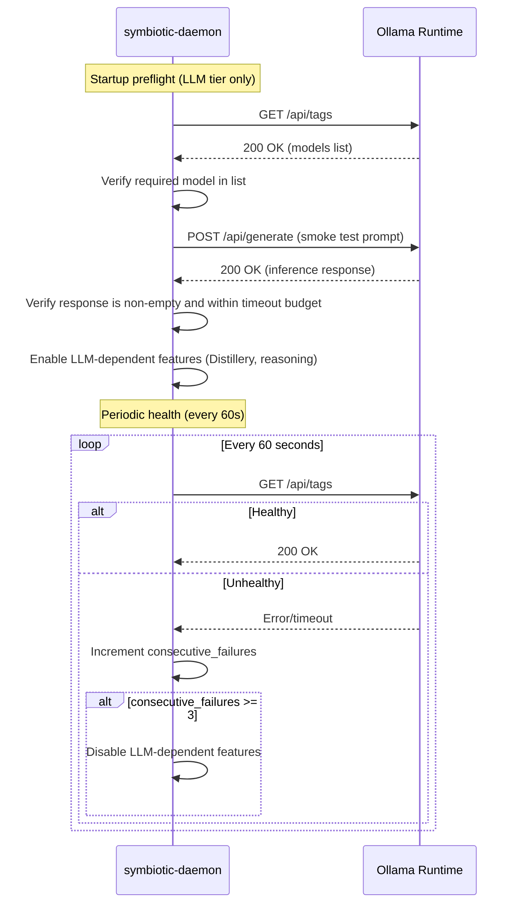
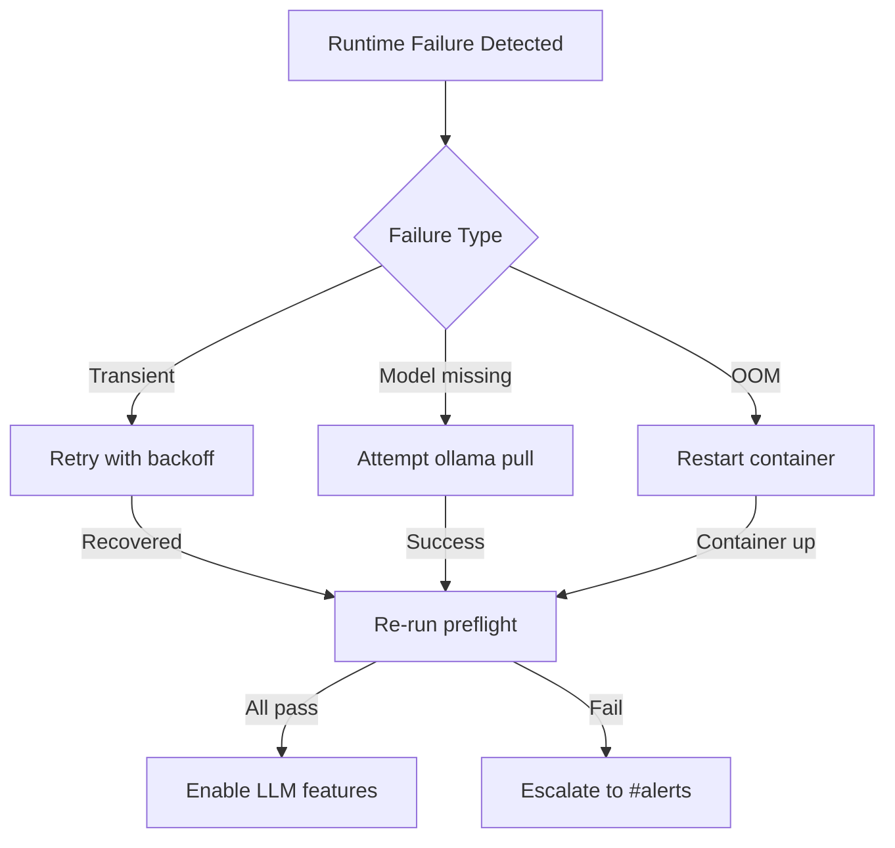

# Local LLM Runtime (Opt-in LLM Tier)

**Status**: Planned (Approved)
**Task**: T8 (Ollama Agent Rules)
**Depends on**: --

## Overview

The local LLM runtime provides opt-in model inference for Distillery processing, on-device reasoning, and privacy-maximized workflows. It is **not** required for the base deployment tier — credential operations are handled by the Auth Script Engine (deterministic Playwright scripts), not by an LLM.

When a user opts into the LLM tier, the Ollama runtime is provisioned alongside the base stack. See `docs/design/compute-tiers.md` for tier definitions.

## LLM Tier Requirement

- **Runtime:** Ollama
- **Model:** User-chosen (e.g. Llama 3.2, Qwen 2.5, Mistral — depends on available RAM/VRAM)
- **Network:** Standard Docker network (no special isolation needed — the LLM tier never touches credentials)
- **Startup gate:** Daemon marks LLM-dependent features `blocked` until runtime health is green
- **Host:** VPS or dedicated GPU instance (spun up on demand)

## Health Check Contract

The daemon checks Ollama health before enabling LLM-dependent features (Distillery, reasoning agents).

### Health Check Endpoint

**URL:** `http://ollama:11434/api/tags` (lists available models)

**Expected Response (HTTP 200):**

```json
{
  "models": [
    {
      "name": "qwen3.5:latest",
      "model": "qwen3.5:latest",
      "size": 2048000000,
      "digest": "sha256:abc123...",
      "modified_at": "2026-02-01T00:00:00Z"
    }
  ]
}
```

### Health Check Rust Types

```rust
use serde::{Deserialize, Serialize};
use thiserror::Error;

/// Health check configuration for the local LLM runtime.
/// Lives in `crates/symbiotic-agents/src/llm_runtime.rs`.
pub struct OllamaHealthConfig {
    /// Base URL of the Ollama API.
    pub ollama_url: String, // Default: "http://ollama:11434"
    /// Required model name that must be available.
    pub required_model: String, // Default: configured by user
    /// Maximum time to wait for a health check response.
    pub health_timeout_secs: u64, // Default: 10
    /// Interval between periodic health checks during runtime.
    pub health_interval_secs: u64, // Default: 60
    /// Number of consecutive health check failures before marking runtime as down.
    pub max_consecutive_failures: u32, // Default: 3
}

impl Default for OllamaHealthConfig {
    fn default() -> Self {
        Self {
            ollama_url: "http://ollama:11434".to_string(),
            required_model: "qwen3.5".to_string(),
            health_timeout_secs: 10,
            health_interval_secs: 60,
            max_consecutive_failures: 3,
        }
    }
}

#[derive(Debug, Clone, Serialize, Deserialize)]
pub struct OllamaHealthStatus {
    /// Whether the runtime is healthy and ready for inference.
    pub healthy: bool,
    /// List of available model names.
    pub available_models: Vec<String>,
    /// Unix timestamp of the last successful health check.
    pub last_healthy_at: u64,
    /// Number of consecutive failures (0 when healthy).
    pub consecutive_failures: u32,
    /// Human-readable status message.
    pub message: String,
}

#[derive(Debug, Error)]
pub enum OllamaRuntimeError {
    #[error("ollama runtime unreachable at {0}")]
    Unreachable(String),
    #[error("required model not available: {0}")]
    ModelNotAvailable(String),
    #[error("health check timed out after {0} seconds")]
    HealthTimeout(u64),
    #[error("inference failed: {0}")]
    InferenceFailed(String),
    #[error("inference timed out after {0} seconds")]
    InferenceTimeout(u64),
    #[error("model load failed: {0}")]
    ModelLoadFailed(String),
    #[error("runtime resource exhausted: {0}")]
    ResourceExhausted(String),
}
```

### Health Check Sequence



## Preflight Test Checklist

Before enabling LLM-dependent features, the daemon runs a preflight sequence. All checks must pass.

| # | Check | Method | Pass Criteria | Timeout |
|---|-------|--------|---------------|---------|
| 1 | **Ollama reachable** | `GET /api/tags` | HTTP 200 | 10s |
| 2 | **Required model available** | Parse `/api/tags` response | Configured model in list | -- |
| 3 | **Smoke inference** | `POST /api/generate` with test prompt | Non-empty response, no error | 30s |
| 4 | **Inference budget** | Measure smoke inference duration | Response within 15s | -- |

### Smoke Test Prompt

```json
{
  "model": "qwen3.5",
  "prompt": "Respond with exactly the word 'ready' and nothing else.",
  "stream": false,
  "options": {
    "temperature": 0,
    "num_predict": 10
  }
}
```

The response must contain at least one non-whitespace character. The exact content is not validated (it is a liveness check, not a correctness check).

### Preflight Rust Type

```rust
/// Result of a single preflight check.
#[derive(Debug, Clone, Serialize, Deserialize)]
pub struct PreflightCheckResult {
    /// Check identifier (e.g., "ollama_reachable", "model_available").
    pub check_id: String,
    /// Whether the check passed.
    pub passed: bool,
    /// Human-readable detail (error message on failure, "ok" on success).
    pub detail: String,
    /// Duration of the check in milliseconds.
    pub duration_ms: u64,
}

/// Full preflight report.
#[derive(Debug, Clone, Serialize, Deserialize)]
pub struct PreflightReport {
    /// Unix timestamp when preflight started.
    pub started_at: u64,
    /// All check results in execution order.
    pub checks: Vec<PreflightCheckResult>,
    /// Overall pass/fail.
    pub all_passed: bool,
}
```

## Bootstrap Checklist

1. User opts into LLM tier (via install wizard or config).
2. Provision Ollama runtime (Docker container or GPU instance).
3. Pull required model artifact (e.g. `ollama pull qwen3.5`).
4. Run health check endpoint.
5. Run preflight tests (model available, smoke inference, timeout budget).
6. Enable LLM-dependent features in the daemon.

## Failure Behavior

| Failure | Handling | Event Emitted |
|---------|----------|---------------|
| Runtime unreachable | Block LLM features, retry with 5s/10s/30s backoff | `llm.runtime_down` to `#alerts` |
| Model not available | Block LLM features, attempt `ollama pull` once | `llm.model_missing` to `#alerts` |
| Model load timeout | Retry with backoff (5s, 10s, 30s), keep in degraded mode | `llm.runtime_degraded` to `#alerts` |
| Inference error | Fail request; never fallback to cloud for local-only tasks | `llm.inference_failed` to `#alerts` |
| Inference timeout (>15s) | Fail request; log slow inference for monitoring | `llm.inference_timeout` to `#alerts` |
| Resource exhaustion (OOM) | Restart Ollama container, re-run preflight | `llm.runtime_oom` to `#alerts` |

### Recovery Flow



## LLM Tier Use Cases

| Feature | Why Local LLM | Cloud Alternative |
|---------|---------------|-------------------|
| **Distillery** | Process private knowledge without cloud exposure | BYOK cloud API (user accepts privacy tradeoff) |
| **On-device reasoning** | Reduced latency, no API cost | Cloud inference |
| **Privacy-maximized workflows** | Data never leaves the VPS | N/A (privacy is the feature) |
| **Offline operation** | Works without internet | Not possible |

> **Note:** Credential operations are NOT in this list. They are handled by the Auth Script Engine (deterministic scripts) regardless of tier. See `docs/design/credential-sandbox.md`.

## Test Strategy

### Unit Tests

| Test | Description |
|------|-------------|
| `health_config_defaults` | Verify all `OllamaHealthConfig` defaults are sane |
| `health_status_serialization` | Roundtrip `OllamaHealthStatus` to/from JSON |
| `preflight_report_all_passed` | Report with all checks passed returns `all_passed: true` |
| `preflight_report_one_failed` | Report with one failed check returns `all_passed: false` |
| `runtime_error_display` | All `OllamaRuntimeError` variants have meaningful messages |

### Integration Tests

| Test | Description |
|------|-------------|
| `preflight_happy_path` | Mock Ollama responds to all checks; preflight passes |
| `preflight_fails_on_missing_model` | Mock Ollama returns empty model list; preflight fails on check #2 |
| `preflight_fails_on_slow_inference` | Mock Ollama responds slowly; preflight fails on check #4 |
| `health_check_tracks_consecutive_failures` | 3 consecutive failures trigger runtime-down status |
| `health_check_resets_on_recovery` | After failure, successful check resets `consecutive_failures` to 0 |
| `llm_features_blocked_when_unhealthy` | Distillery requests rejected when runtime health is red |

## Related Docs

- `docs/design/compute-tiers.md` (tier definitions and resource requirements)
- `docs/architecture/credential-sandbox.md` (credential handling — independent of LLM tier)
- `docs/architecture/vps-deployment.md` (VPS infrastructure)
- `docs/design/device-trust-bootstrap.md` (trust requirements)
