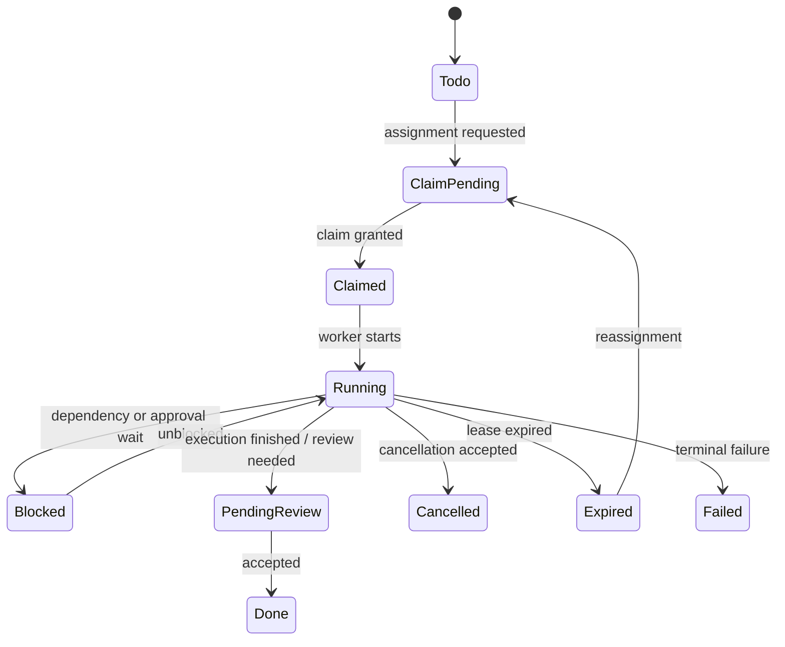
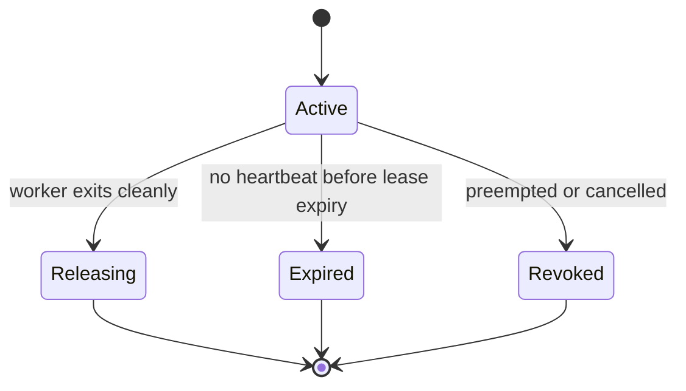

# Management Work Items, Scope Claims, and Leases

**Status**: Approved design target
**Related Tasks**: T113, T116
**Related Docs**: `docs/design/agent-collaboration-conflict-resolution.md`, `docs/design/internal-git-swarm.md`, `control-plane/docs/design/declarative-control-plane.md`, `docs/design/external-system-eval-2026-04-07.md`

## Goal

Define the implementation-ready management-layer object model for multi-agent coordination in Symbiotic.

This document covers only the **management layer**:

- work definition
- scope claiming
- lease and heartbeat rules
- stale-work detection
- cancellation and preemption
- handoff into development and KB layers

It does **not** define git merge policy or KB semantic review mechanics. Those remain in their own layers.

## Why This Exists

The higher-level collaboration split is already approved:

- management layer decides who works on what
- development layer lands code safely through sandbox + git swarm
- KB layer curates shared project memory and semantic review

What is still missing is the concrete management contract that the orchestrator can persist and enforce.

Without that contract, Symbiotic still behaves too much like:

- spawn agent
- hope ownership stays clear
- detect collisions later

The management layer should instead make conflict prevention explicit before work begins.

## Core Decision

The management layer revolves around **three first-class objects**:

1. `WorkItem`
   - the unit of planned work
2. `ScopeClaim`
   - the bounded ownership/permission contract for a worker
3. `Lease`
   - the liveness contract that keeps a claim active

These objects are persisted in structured control-plane state, not in Markdown.

## Object Model

### Work Item

```rust
use serde::{Deserialize, Serialize};

#[derive(Debug, Clone, Serialize, Deserialize)]
pub struct WorkItem {
    pub id: String,
    pub project_id: String,
    pub initiative_id: Option<String>,
    pub parent_work_item_id: Option<String>,
    pub thread_id: Option<String>,
    pub title: String,
    pub summary: String,
    pub status: WorkItemStatus,
    pub priority: WorkPriority,
    pub urgency: WorkUrgency,
    pub assignment_mode: AssignmentMode,
    pub requested_scopes: Vec<ScopeRequirement>,
    pub accepted_claim_ids: Vec<String>,
    pub assignee: Option<AgentAssignment>,
    pub blocked_by: Vec<String>,
    pub depends_on: Vec<String>,
    pub review_mode: ReviewMode,
    pub cancellation: Option<CancellationState>,
    pub created_at: i64,
    pub updated_at: i64,
}

#[derive(Debug, Clone, Copy, Serialize, Deserialize, PartialEq, Eq)]
#[serde(rename_all = "snake_case")]
pub enum WorkItemStatus {
    Todo,
    ClaimPending,
    Claimed,
    Running,
    Blocked,
    PendingReview,
    Done,
    Cancelled,
    Expired,
    Failed,
}

#[derive(Debug, Clone, Copy, Serialize, Deserialize, PartialEq, Eq, PartialOrd, Ord)]
#[serde(rename_all = "snake_case")]
pub enum WorkPriority {
    P0,
    P1,
    P2,
    P3,
}

#[derive(Debug, Clone, Copy, Serialize, Deserialize, PartialEq, Eq)]
#[serde(rename_all = "snake_case")]
pub enum WorkUrgency {
    Immediate,
    Normal,
    Deferred,
}

#[derive(Debug, Clone, Copy, Serialize, Deserialize, PartialEq, Eq)]
#[serde(rename_all = "snake_case")]
pub enum AssignmentMode {
    SingleOwner,
    ParallelChildren,
    ReviewOnly,
}

#[derive(Debug, Clone, Serialize, Deserialize)]
pub struct AgentAssignment {
    pub agent_id: String,
    pub runner_id: Option<String>,
    pub assigned_at: i64,
}

#[derive(Debug, Clone, Copy, Serialize, Deserialize, PartialEq, Eq)]
#[serde(rename_all = "snake_case")]
pub enum ReviewMode {
    NoReview,
    HumanRequired,
    AutoReviewThenHumanIfNeeded,
}

#[derive(Debug, Clone, Serialize, Deserialize)]
pub struct CancellationState {
    pub requested_at: i64,
    pub requested_by: String,
    pub reason: String,
    pub hard_stop: bool,
}
```

`thread_id` is an attachment field for messaging/observability only. It does
not make the thread the owner of the work item.

### Hierarchy Rule

The intended ownership hierarchy is:

- project
- goal / process
- task
- concrete work item
- attached development artifacts

Current runtime implementation has the top and bottom of that stack:

- top-level goal work items
- branch work items with claims and leases

The missing middle layer is durable task ownership. The management model
should continue converging toward that hierarchy instead of collapsing back to
`thread = project` or `branch = work owner`.

### Scope Requirement and Scope Claim

`WorkItem` declares desired access. `ScopeClaim` records the granted access.

```rust
#[derive(Debug, Clone, Serialize, Deserialize)]
pub struct ScopeRequirement {
    pub scope: CollaborationScope,
    pub mode: ScopeMode,
    pub reason: String,
}

#[derive(Debug, Clone, Serialize, Deserialize)]
pub struct ScopeClaim {
    pub id: String,
    pub work_item_id: String,
    pub holder_agent_id: String,
    pub scope: CollaborationScope,
    pub mode: ScopeMode,
    pub status: ScopeClaimStatus,
    pub lease: Lease,
    pub granted_at: i64,
    pub updated_at: i64,
}

#[derive(Debug, Clone, Copy, Serialize, Deserialize, PartialEq, Eq)]
#[serde(rename_all = "snake_case")]
pub enum ScopeClaimStatus {
    Active,
    Releasing,
    Expired,
    Revoked,
}

#[derive(Debug, Clone, Serialize, Deserialize)]
#[serde(tag = "kind", rename_all = "snake_case")]
pub enum CollaborationScope {
    RepoPath { repo_id: String, path: String },
    RepoDoc { repo_id: String, path: String },
    RepoBranchNamespace { repo_id: String, pattern: String },
    KbSubtree { path: String },
    KbAppendChannel { path: String },
    ReviewQueue { queue: String },
}

#[derive(Debug, Clone, Copy, Serialize, Deserialize, PartialEq, Eq)]
#[serde(rename_all = "snake_case")]
pub enum ScopeMode {
    SharedRead,
    ExclusiveWrite,
    AppendOnly,
}
```

### Lease and Heartbeat

```rust
#[derive(Debug, Clone, Serialize, Deserialize)]
pub struct Lease {
    pub holder_agent_id: String,
    pub lease_started_at: i64,
    pub last_heartbeat_at: i64,
    pub expires_at: i64,
    pub heartbeat_interval_secs: u64,
    pub max_missed_heartbeats: u32,
}

#[derive(Debug, Clone, Serialize, Deserialize)]
pub struct HeartbeatUpdate {
    pub work_item_id: String,
    pub agent_id: String,
    pub status: HeartbeatStatus,
    pub progress_summary: Option<String>,
    pub progress_percent: Option<u8>,
    pub needs_attention: bool,
    pub observed_at: i64,
}

#[derive(Debug, Clone, Copy, Serialize, Deserialize, PartialEq, Eq)]
#[serde(rename_all = "snake_case")]
pub enum HeartbeatStatus {
    Alive,
    Blocked,
    AwaitingReview,
    Releasing,
}
```

## State Machine

### Work Item Lifecycle



### Scope Claim Lifecycle



## Grant Rules

### Rule 1: Claims Are Granted Before Meaningful Work

An agent may inspect high-level task metadata before a claim exists, but it may not begin meaningful execution until:

- the `WorkItem` is assigned
- required `ScopeClaim`s are granted
- a lease exists

This prevents the current failure mode of parallel agents informally drifting into the same problem.

### Rule 2: `exclusive_write` Never Overlaps

Two active `exclusive_write` claims conflict if their scopes overlap semantically.

Overlap rules:

- `RepoPath`
  - same repo and identical path
  - same repo and one path is a parent of the other
- `RepoDoc`
  - exact same doc path
- `RepoBranchNamespace`
  - identical branch namespace or one broad namespace contains the other
- `KbSubtree`
  - same subtree or parent/child overlap
- `ReviewQueue`
  - same queue key

### Rule 3: `append_only` Is Parallel-Friendly

`append_only` claims may coexist with:

- other `append_only`
- `shared_read`

They must not coexist with:

- `exclusive_write` on the same logical surface

### Rule 4: `shared_read` Never Blocks Other Reads

`shared_read` is conflict-free by default and exists to document dependency surfaces, not to reserve them.

## Lease Policy

### Default Timing

Recommended initial defaults:

```rust
pub struct ManagementLeaseConfig {
    pub default_heartbeat_interval_secs: u64, // 30
    pub default_lease_duration_secs: u64,     // 120
    pub default_max_missed_heartbeats: u32,   // 2
    pub blocked_grace_secs: u64,              // 300
}
```

This means:

- normal work heartbeats every 30 seconds
- lease expires after about 2 minutes without valid renewal
- explicitly blocked work gets a longer grace window before reassignment

### Renewal Rules

Every accepted heartbeat:

- updates `last_heartbeat_at`
- extends `expires_at`
- may update progress metadata

If a heartbeat marks the item as `Blocked`, the system may extend the lease using `blocked_grace_secs` instead of the normal interval.

## Stale-Work Recovery

### When Work Becomes Stale

Work is stale if any of these are true:

1. lease expired
2. worker declared `Releasing` but did not finish release
3. manager cancelled the work and the worker did not comply
4. dependency graph changed and the work item is now invalid

### Recovery Actions

Recovery is management-layer only:

1. revoke active `ScopeClaim`s
2. mark the work item `Expired` or `Cancelled`
3. append a checkpoint/handoff request into the KB evidence channel if available
4. create a fresh `ClaimPending` successor or reopen the same work item

Management does not directly merge code, revert branches, or mutate KB summaries.

## Preemption and Cancellation

### Soft Preemption

Soft preemption means:

- no new work should start
- current worker is asked to checkpoint and release
- claims remain active briefly during handoff

Use soft preemption when:

- higher-priority work supersedes the task
- duplicate work should be consolidated
- user redirected the initiative

### Hard Stop

Hard stop means:

- revoke claims
- mark item cancelled
- ignore further heartbeats for claim renewal

Use hard stop when:

- the task is unsafe
- the scope was assigned incorrectly
- the worker is non-responsive beyond grace windows

## Handoff Into Other Layers

### Into Development Layer

Once claims exist, the management layer may authorize:

- sandbox spawn
- branch namespace allocation
- reviewer/CI creation
- merge eligibility checks tied to `WorkItem`

But the development layer still owns:

- PR lifecycle
- merge conflict handling
- stale review dismissal
- post-merge distillery

### Into KB Layer

The management layer may grant:

- `KbAppendChannel` for checkpoints and run notes
- temporary `KbSubtree` exclusive-write for one synthesizer

But the KB layer still owns:

- contradiction investigation
- summary synthesis
- canonical typed record mutation
- Memory Review escalation

## Recommended Persistence Shape

The control plane should persist these objects in structured storage, not Markdown:

```text
control_plane/
  work_items/
  scope_claims/
  leases/
  heartbeats/
  cancellations/
```

Minimal persistence requirements:

- durable `WorkItem` and `ScopeClaim`
- monotonic `updated_at`
- restart-safe lease expiry evaluation
- append-only heartbeat/event trail for audit

## Runtime Module Mapping

This design should map onto the current runtime tree like this:

```text
submodules/runtime/
  crates/
    symbiotic-control-plane/
      src/
        lib.rs
        goals.rs
        work_items.rs
        claims.rs
        leases.rs
        management_store.rs
```

### Why `symbiotic-control-plane`

`symbiotic-control-plane` is already the closest current home for:

- desired-state reconciliation
- goal lifecycle
- worker-slot allocation
- persisted runtime control state

The management-layer contract belongs there because it is:

- orchestration state
- durable control-plane state
- not sandbox execution code
- not git swarm review state

### What Should Stay Out

`symbiotic-agents::swarm` should not become the authority for these objects.

It may still remain useful for:

- parallel task execution helpers
- local conflict checks
- review queue mechanics

But authoritative `WorkItem` / `ScopeClaim` / `Lease` state should live in `symbiotic-control-plane`, not in an execution helper crate.

`symbiotic-git-swarm` should also stay focused on:

- repo lifecycle
- PR/review/check state
- merge policy

It should consume management decisions, not replace them.

## Proposed Internal Module Split

### `work_items.rs`

Owns:

- `WorkItem`
- `WorkItemStatus`
- `WorkPriority`
- `AssignmentMode`
- `CancellationState`
- lifecycle transitions

### `claims.rs`

Owns:

- `ScopeRequirement`
- `ScopeClaim`
- `CollaborationScope`
- `ScopeMode`
- overlap detection
- grant/revoke logic

### `leases.rs`

Owns:

- `Lease`
- `HeartbeatUpdate`
- renewal
- expiry evaluation
- stale-work transition helpers

### `management_store.rs`

Owns:

- persistence layout
- atomic write/read helpers
- restart restore
- lookup indexes for active claims and work items

## Proposed Persistence Layout

Reuse the existing file-backed, atomic-write style already present in runtime stores.

Recommended initial shape:

```text
data/runtime/control-plane/
  work-items/
    {work_item_id}.json
  scope-claims/
    {claim_id}.json
  heartbeats.log
```

This keeps the first slice simple:

- one file per work item
- one file per active/recent claim
- append-only heartbeat/event log for audit

If scale later requires it, this can move behind SQLite without changing the object model.

## Integration With Existing Runtime Seams

### `GoalProcessManager`

Current `GoalProcessManager` in `symbiotic-control-plane/src/goals.rs` already owns:

- goal lifecycle
- persisted goal state
- worker slot accounting

The management layer should sit adjacent to it, not replace it.

Recommended boundary:

- `GoalProcessManager` stays goal-centric
- new management modules become task/work-centric
- goal processes may spawn or track many `WorkItem`s

### `symbiotic-daemon` reconciler / dispatch

Daemon-side code should consume the management-layer API through the control-plane crate.

Likely touchpoints:

- `services/symbiotic-daemon/src/reconciler.rs`
- `services/symbiotic-daemon/src/dispatch_ops.rs`
- `services/symbiotic-daemon/src/control_plane.rs`

The daemon should:

- create and update work items
- ask the control plane to grant claims
- renew heartbeats from worker events
- react to expiry or cancellation

It should not open-code claim state in daemon-only structs.

### `swarm_server.rs`

The internal git swarm should integrate at the branch/review boundary:

- before reviewer/CI/distillery dispatch, confirm the PR/work branch still belongs to an active `WorkItem`
- use `RepoBranchNamespace` or `RepoPath` claims to validate ownership
- invalidate stale review/merge paths when the management layer has cancelled or expired the associated work

### KB Integration

The first implementation slice should not try to fully automate KB synthesis.

For slice one, only support:

- `KbAppendChannel` claims for checkpoints/handoffs
- optional handoff artifact creation on stale-work recovery

Keep:

- summary synthesis
- contradiction handling
- Memory Review

in the KB layer proper.

## Event Surface

Recommended event families:

- `work_item.created`
- `work_item.claim_pending`
- `work_item.claimed`
- `work_item.running`
- `work_item.blocked`
- `work_item.pending_review`
- `work_item.expired`
- `work_item.cancelled`
- `scope_claim.granted`
- `scope_claim.revoked`
- `lease.heartbeat`
- `lease.expired`

These are operational control-plane events, not Archive truth.

## Integration Plan

### Immediate

1. adopt this object model as the management-layer source of truth
2. keep development collaboration in T116
3. keep KB semantic routing in the memory-system / collaboration docs
4. treat `symbiotic-control-plane` as the authoritative implementation home

### Near-Term

1. add runtime types for `WorkItem`, `ScopeClaim`, `Lease`
2. add file-backed persistence under `data/runtime/control-plane/`
3. add a claim-overlap evaluator
4. add heartbeat persistence and expiry scanning
5. connect sandbox/git swarm job dispatch to granted claims

### Later

1. add priority-aware preemption
2. add UI/operator surfaces for claims and stale-work recovery
3. add policy-driven auto-reassignment
