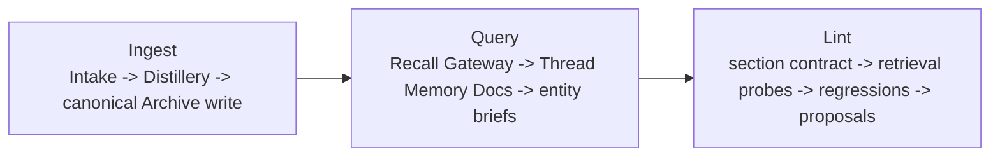
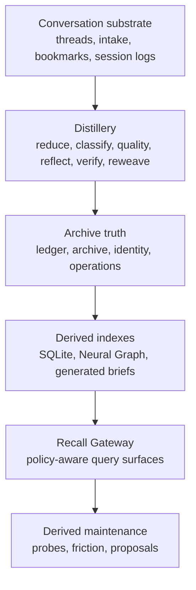
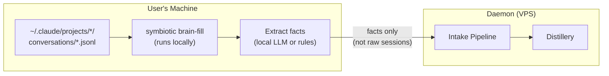
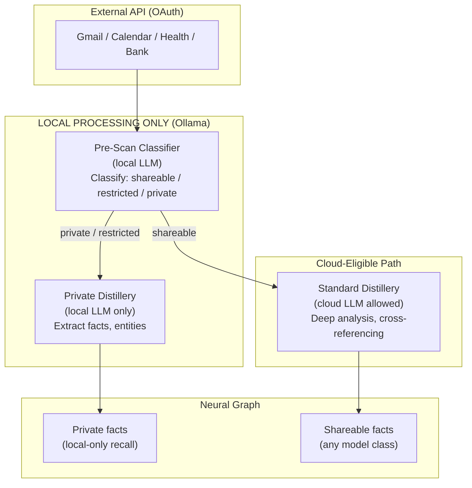
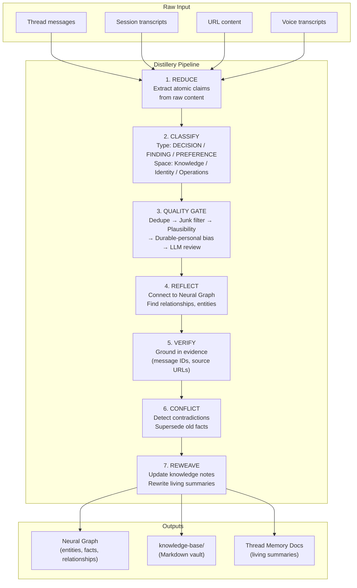

# The Symbiotic Brain — Living Memory System

> **Depends on:** Thread Architecture (`docs/design/thread-architecture.md`), UX Specification (`docs/design/ux-specification.md`), Distillery (`docs/architecture/distillery.md`)
> **Supersedes:** `memory-store.md`, `memory-extraction.md`, `memory-pipeline-integration.md` (retained as implementation references)
> **Task:** Defines the complete brain for Symbiotic — from raw conversation to living intelligence

---

## Vision

Every AI conversation you've ever had is a wasted asset. Hundreds of decisions, thousands of preferences, tens of thousands of facts — all evaporating when the session closes. The next session starts from zero. You re-explain your life, your projects, your taste, your history. Every single time.

Symbiotic's brain doesn't just remember. It **learns, connects, corrects, fills gaps, and compounds** — automatically, continuously, from every conversation you have and every piece of information you capture.

**What makes this different from everything else:**

| System | What It Does | What It Doesn't Do |
|--------|-------------|-------------------|
| **ChatGPT/Claude Memory** | Stores key-value pairs from conversations | No structure, no typing, no graph, no provenance, no quality control, vendor-locked |
| **RAG systems** | Retrieves similar text chunks | Can't track temporal state, can't invalidate stale facts, can't distinguish a decision from an observation |
| **Mem0 / Supermemory** | Memory API with entity extraction | External dependency, no conversation distillation, no self-improvement loop |
| **Obsidian + Claude Code** | Markdown vault readable by agents | Manual maintenance, no automatic extraction, no quality pipeline, no graph |
| **Symbiotic Brain** | Full distillery pipeline: conversations → typed facts → knowledge graph → living summaries → compounding intelligence | — |

The user's experience: **you just talk.** Everything else happens automatically. Six months in, the system understands your projects, decisions, relationships, preferences, and methodology better than any human colleague could — all structured, searchable, and agent-accessible.

The storage contract for that intelligence is now explicit:

- canonical entity truth lives in `knowledge-base/ledger/{type}/{slug}/{slug}.md`
- generated read artifacts live beside it as `knowledge-base/ledger/{type}/{slug}/{slug}.brief.md`
- `type:` stays on the fixed core `EntityType` ontology
- future richer specialization belongs in `schema:`, not in a new top-level folder tree

The operator-facing model should now be understood as:

`Ingest -> Query -> Lint`

- `Ingest` brings raw material into the system and runs the Distillery plus canonical follow-through into `knowledge-base/`
- `Query` exposes derived read surfaces through the Recall Gateway, Thread Memory Docs, and generated entity briefs
- `Lint` validates both canonical record shape and retrieval reachability without creating a second source of truth

That is the main operating loop. The deeper layers below are implementation structure, not separate user-facing subsystems.

---

## Operating Loop



The loop above is the operator model. The implementation still contains multiple layers under it, but those layers should be read as internal structure in service of this loop, not as separate product surfaces.

Generated artifacts such as Thread Memory Docs and `{slug}.brief.md` are query surfaces, not truth. They are regenerated from canonical records, excluded from canonical indexing, and never edited directly.

## Implementation Layers



---

## Layer 0: Conversation Substrate

Everything starts as raw input. In operator terms this is the start of `Ingest`; in implementation terms all of these sources feed the same Distillery.

### Input Sources

| Source | Format | Status | Description |
|--------|--------|--------|-------------|
| **Thread conversations** | Matrix E2EE rooms | Designed (thread-architecture.md) | Primary — ongoing conversations with the system |
| **`#stream` quick replies** | Matrix messages | Designed | Lightweight Q&A, short tasks |
| **Agent session transcripts** | JSONL on disk | **New** | Claude Code, Cursor, etc. store full session history — currently wasted |
| **URL intake** | HTTP → Markdown | Implemented | URLs captured via share extension, paste, or bookmarks |
| **Share extension** | iOS/Android share sheet | Implemented | Photos, documents, links from any app |
| **Bookmarks sync** | Browser export | Implemented | Bulk import of browser bookmarks |
| **Voice notes** | Audio → transcript | Future | Whisper transcription → Distillery |
| **Google Calendar** | OAuth → API | Planned | Events, attendees, scheduling context |
| **Gmail / Outlook** | OAuth → API | Planned | Threads, contacts, action items (privacy pre-scan required) |
| **Health APIs** | HealthKit / API | Future | Metrics, labs, medications |
| **Financial APIs** | Plaid / API | Future | Transactions, balances, positions |
| **Manual notes** | Markdown in vault | Supported | User writes directly in `knowledge-base/` or Obsidian |

### Brain Bootstrap

The brain needs to learn about you. But the daemon runs on a VPS and the user interacts through a mobile app — there's no local filesystem to scan. So the brain bootstraps through the medium it already has: **conversation**.

The onboarding is not a questionnaire. It's a real thread that **naturally escalates into a goal** — and in doing so, demonstrates the entire product mechanic (conversation → classification → goal promotion → plan → execution) in the user's first 5 minutes, without a tutorial.

#### The First Thread

Right after the install wizard completes, the system drops you into your first thread. It starts as casual conversation:

```
🧠 Symbiotic
  Hey. I'm going to be working with you for a long time.
  Let me learn the basics so I'm not starting from zero.

  What do you do? (role, industry, main focus)
```

The user answers naturally. The Distillery processes each response in real-time — extracting DECISION, ENTITY, PREFERENCE, and METHODOLOGY facts into the Neural Graph immediately.

```
User: "Solo founder, building a SaaS analytics platform"

🧠 Nice. What's the stack?

User: "Vue + Nuxt, Stripe, PostgreSQL"

🧠 Got it. What's the most important thing right now?

User: "Getting the first paying customer"
```

After a few exchanges, the system recognizes this conversation IS a goal — and promotes it:

```
🧠 I've learned enough to start building your brain properly.
   Here's what I'd like to do:

   ┌─────────────────────────────────────────────┐
   │  🧠 Brain Bootstrap                         │
   │                                             │
   │  1. ✓ Learn your basics (done — 12 facts)   │
   │  2. Connect your calendar (optional)         │
   │  3. Import email contacts (optional)         │
   │  4. Set up daily brain-fill questions        │
   │  5. Generate your first entity briefs        │
   │                                             │
   │  [Approve]  [Edit]  [Skip to chatting]      │
   └─────────────────────────────────────────────┘
```

The conversation **naturally evolved into a goal with a plan card**. The user just experienced auto-classification, thread promotion, and the plan card UX — without being told about any of it. This is the product working exactly as designed.

#### User Controls the Pace

**The brain does not gate learning behind a calendar.** The tiers below describe available *depths* — not time-locked stages. The user decides how fast to go:

- **Power through** (20 minutes): Do the interview, connect Google Calendar, import email contacts, run the CLI import — all in one sitting. The plan card's steps are all right there. If the user approves step 2 (connect calendar), agents go to Google Calendar, pull events, classify them, and show progress in real-time. Same for Gmail, contacts, whatever they want. By the time they're done, the brain has hundreds of facts.
- **Take it slow**: Answer a few questions, come back tomorrow. Ambient questions fill in gaps over the first week at 2-3 per day. No pressure.
- **Skip everything**: Hit "Skip to chatting" on the plan card. The brain learns from natural conversation — every thread, every goal, every quick reply goes through the Distillery. It just takes longer to reach the same depth.

**The principle: never push, never gate.** The system offers but doesn't nag. If the user declines a connector, it never asks again. If they want to connect everything right now, every step is immediately available. The plan card is the interface — approve what you want, skip what you don't.

#### What the Bootstrap Extracts (by depth)

**Depth 1 — Onboarding interview (3-5 min):**
Role, active projects, tech stack, current priorities. ~10-15 core facts.

**Depth 2 — Ambient questions (first week, or all at once if user wants):**
Key people (partners, clients, collaborators), tools and workflows, health/routines/personal goals (skippable, never resurfaces if declined), communication preferences. Each answer feeds the Distillery. Questions **adapt** — if you mentioned Stripe in the tech stack, the brain doesn't ask about payment providers later. ~50-100 total facts.

**Depth 3 — Connector import (whenever user approves):**
Google Calendar events, email contacts, GitHub repos — whatever OAuth connectors the user enables. Agents execute the import as goal steps with live progress. Private data is pre-scanned locally before any cloud LLM touches it (see OAuth Data Connectors below). ~200-5000 facts depending on connectors.

**Depth 4 — Passive extraction (ongoing, automatic):**
After initial setup, the brain stops asking explicit questions. Everything it learns comes from natural conversation — the Thread Distillery extracts facts from every thread, every goal, every quick reply. The only exception: **gap-filling questions** when the brain detects it's missing critical context for a task:

```
🧠 I'm working on your marketing goal but don't know
   your target audience. Who are you building for?
```

**Depth 5 — Power user import (optional, any time):**

For users with AI session history they want to accelerate the brain with:

| Method | Complexity | How It Works |
|--------|-----------|-------------|
| **Paste in chat** | Lowest | User pastes key decisions or a summary of past project context directly into a thread. Distillery processes it. |
| **File drop** | Low | User shares exported JSONL or text files via the app's share extension. Daemon processes them through intake pipeline. |
| **CLI tool** | Medium | `symbiotic brain-fill --source ~/.claude/projects/ --daemon <url>` — runs locally, extracts facts on-device, sends only extracted facts to daemon (raw transcripts never leave the machine). |
| **Desktop companion** | Future | Lightweight app that watches session stores and syncs facts automatically. Requires building a desktop app. |



**Privacy:** Raw transcripts never leave the machine. Only extracted, typed facts are sent to the daemon.

#### Why a Goal, Not a Hidden Process

1. **Transparency** — the user sees exactly what the brain is learning and from where
2. **Control** — the user can pause, skip steps, or stop the bootstrap at any point
3. **Product demo** — the onboarding itself teaches the UX paradigm (conversation → goal → plan → execution)
4. **Progress** — the user watches their brain filling up: "147 facts extracted, 23 entities created"
5. **Approval gates** — before processing email or private data, the goal pauses for consent
6. **Auditability** — the Brain Bootstrap thread is a permanent record of how the brain was built

#### Brain Bootstrap Timeline

| Pace | Method | Facts | Brain State |
|------|--------|-------|-------------|
| **5 min** | Onboarding interview | ~10-15 core facts | Knows your role, projects, stack, priorities |
| **20 min** | + connectors + ambient Qs (power-through) | ~100-500 facts | Knows your people, tools, calendar, preferences |
| **Week 1** | Ambient questions (gradual pace) | ~50-100 facts | Same as above but spread over a week |
| **Month 1** | Passive extraction | ~200-500 facts | Knows your decisions, findings, active work |
| **Month 3** | Passive + compounding | ~500-1500 facts | Cross-project connections, methodology patterns |
| **Month 6** | Full flywheel | ~1500-5000 facts | Comprehensive life/work knowledge graph |
| **Any time** | + CLI import | +200-1000 from history | Retroactive mining of past AI sessions |
| **Any time** | + OAuth connectors | +500-5000 from APIs | Calendar, contacts, email, documents |

### OAuth Data Connectors

The brain can pull data from external services the user already uses. Each connector authenticates via OAuth, fetches data through the service's API, and feeds it through the Distillery.

#### Available Connectors (Planned)

| Connector | OAuth Scope | What It Pulls | Sensitivity |
|-----------|------------|---------------|-------------|
| **Google Calendar** | `calendar.readonly` | Events, attendees, locations | Restricted |
| **Google Contacts** | `contacts.readonly` | People, relationships, orgs | Restricted |
| **Gmail** | `gmail.readonly` | Threads, contacts, action items | **Private** (pre-scan required) |
| **Outlook Calendar** | `Calendars.Read` | Events, attendees | Restricted |
| **Outlook Mail** | `Mail.Read` | Threads, contacts | **Private** (pre-scan required) |
| **Google Drive** | `drive.readonly` | Doc metadata, content | Mixed |
| **Apple Health** | HealthKit | Metrics, labs, medications | **Private** |
| **Bank/Brokerage** | Plaid/API | Transactions, balances | **Private** |
| **GitHub** | `repo`, `user` | Repos, PRs, issues | Shareable |

#### Trust-Tiered Processing

**The critical rule: you cannot send private data to a cloud LLM to determine if it's private.** The sensitivity classification itself must happen locally.



**Pre-Scan Classifier** — a local LLM (Ollama, running on daemon VPS or user's machine) that:
1. Reads raw content from the API
2. Classifies sensitivity: `shareable` / `restricted` / `private`
3. Flags categories: financial, health, legal, personal relationships, credentials
4. Routes to the appropriate Distillery path

**Classification signals:**

| Signal | Classification | Example |
|--------|---------------|---------|
| Contains financial amounts, account numbers | Private | Bank statements, invoices |
| Contains health data, medications, diagnoses | Private | Lab results, doctor notes |
| Contains personal relationship details | Private/Restricted | "Sarah is having an affair" |
| Contains passwords, tokens, secrets | Private (Vault-routed) | API keys, login credentials |
| Contains legal matters, contracts | Restricted | NDA terms, legal disputes |
| Public project discussion, tech content | Shareable | GitHub PR review, tech blog |
| Calendar event with no sensitive details | Shareable | "Team standup at 10am" |
| Calendar event with medical appointment | Restricted | "Dr. Smith oncology 2pm" |

**What each path gets:**

| Path | LLM | Facts Stored As | Accessible To |
|------|-----|----------------|---------------|
| **Private** | Local only (Ollama) | `sensitivity: private` | Local agents only. Cloud models get redacted summary or nothing. |
| **Restricted** | Local only (Ollama) | `sensitivity: restricted` | Local/hybrid agents. Cloud models get anonymized version. |
| **Shareable** | Any (cloud allowed) | `sensitivity: shareable` | All agents, all model classes. |

This maps directly to the existing Recall Gateway's `model_class` × `sensitivity_max` enforcement — no new security model needed, just a new input path with local-only pre-scanning.

#### Credential Handling for Connectors

OAuth tokens and API credentials for connectors are **Vault-managed** (same as all credentials in Symbiotic):

- Tokens stored encrypted in the Vault (not in the Neural Graph)
- Connector authentication goes through the Credential Gateway
- The Gatekeeper enforces capability tokens — a connector can only access the APIs it's authorized for
- Token refresh handled by the daemon, never exposed to agents or cloud LLMs
- Revocation: user can disconnect any connector from the app (VAULT tab)

#### Email-Specific Concerns

Email is the most sensitive connector. Additional safeguards:

1. **Vault boundary**: raw email content terminates at the local pre-scan. It never reaches the cloud Distillery path.
2. **Selective sync**: user chooses which folders/labels to connect (e.g., "Work" inbox but not "Personal")
3. **Sender filtering**: only process emails from known contacts (entities in the Neural Graph), skip spam/marketing
4. **Attachment handling**: documents attached to emails go through the standard intake pipeline with sensitivity classification
5. **PII stripping**: the RedactionEngine runs on all email-sourced facts before they enter the Neural Graph, even for private facts (defense in depth)
6. **No raw email storage**: the brain stores extracted facts and entity references, NOT raw email text. The original email stays in Gmail/Outlook.

### Brain Bootstrap Goal Structure

The entire bootstrap — interview, connectors, ongoing sync — is organized as goals within the Brain Bootstrap thread:

```
Thread: 🧠 Brain Bootstrap
  ├── Goal: Initial Setup (auto-started after install wizard)
  │   ├── Step 1: Onboarding interview (conversation → facts)
  │   ├── Step 2: Offer connector setup (OAuth — all optional)
  │   ├── Step 3: Pre-scan imported data (local LLM)
  │   ├── Step 4: Process shareable data (full Distillery)
  │   ├── Step 5: Process private data (local Distillery)
  │   ├── Step 6: Generate initial entity briefs
  │   ├── Step 7: Identify knowledge gaps
  │   └── Step 8: Report: "Your brain has X facts, Y entities, Z threads"
  │
  ├── Goal: Brain-Fill Questions (ambient, user-paced)
  │   └── 2-3 adaptive questions — daily if gradual, all at once if power-through
  │
  └── Goal: Connector Sync (recurring, ongoing)
      └── Pull new data from connected APIs on schedule
```

Steps 2-5 execute immediately if the user approves them — agents authenticate via OAuth, pull data from Google Calendar / Gmail / etc., classify sensitivity locally, and process through the Distillery. Progress shows in real-time on the plan card. The user doesn't wait — they watch it happen.

### Connector Sync as Recurring Goal

After initial setup, connectors run as a **recurring goal** within the Brain Bootstrap thread:

```
🧠 Brain Bootstrap    ⟳ daily    last: 2h ago
  ├── Calendar sync: 3 new events imported
  ├── Gmail sync: 7 threads processed, 2 private (local only)
  └── Next sync: tomorrow 7:00 AM
```

The user sees what's being synced, how much was classified private vs. shareable, and when the next pull happens. No hidden background processes — everything is a visible, controllable goal.

### Conversation Storage Model

Raw conversation stays in its canonical location — Matrix rooms for Symbiotic threads, JSONL files for external agent sessions. The brain does NOT duplicate raw conversation. It processes it through the Distillery and stores only the extracted knowledge.

```
Raw conversation:     Matrix rooms + JSONL files (canonical, untouched)
                        ↓ Distillery processes
Processed knowledge:  knowledge-base/ (Markdown vault)
                        ├── archive/     ← receipts / raw captured intake
                        ├── library/     ← managed references
                        ├── ledger/      ← canonical records + generated briefs
                        ├── threads/     ← Thread Memory Documents
                        ├── identity/    ← personal / identity state
                        └── operations/  ← goals / skills / workflows / reports
                        ↓
Structured graph:     Neural Graph (SQLite — entities, facts, relationships)
```

---

## Layer 1: The Distillery

The Distillery is the brain's processing engine. It transforms raw input — conversation messages, URLs, documents, session transcripts — into structured, verified, interconnected knowledge.

**Existing implementation:** `symbiotic-intake/src/distillery.rs`, `pipeline.rs`, `conflict.rs`, `dedup.rs`

### Pipeline Stages



### Stage 1: Reduce

Extract atomic claims from raw content. One claim per fact. No compound statements.

**Input:** Raw text (conversation messages, article content, transcript)
**Output:** `Vec<AtomicClaim>` with source references

```
Conversation: "Let's go with Vue instead of React — the SSR story is better and
               we already have a Nuxt template from the competitor research"

Claims extracted:
  1. "Frontend framework decision: Vue over React"
  2. "Reason: better SSR story"
  3. "Reason: existing Nuxt template available"
  4. "Source: competitor research provided the template"
```

### Stage 2: Classify

Every claim gets a **type** and a **memory space**:

| Type | Description | Persistence | Examples |
|------|-------------|-------------|---------|
| **DECISION** | Explicit choice by the user | Highest — decisions drive everything | "Use Vue", "Price at $49/mo", "PostgreSQL not MySQL" |
| **FINDING** | Discovery from research or agent work | High — informs future decisions | "Competitor A charges $49/mo", "Stripe API has rate limit of 100/sec" |
| **PREFERENCE** | User style, taste, or behavioral choice | Medium — shapes behavior | "Prefers dark mode", "Terse commit messages", "Morning person" |
| **ENTITY** | Person, company, project, technology | Medium — structural | "Stripe (payment provider)", "Sarah (former boss at Acme)" |
| **EPISODE** | What happened, when, outcome | Lower — temporal, decays | "Deployed v2.1 on March 14", "Backtest Sharpe ratio: 1.4" |
| **METHODOLOGY** | How to do something, patterns, lessons | Medium — procedural | "Always run migrations before deploy", "Use feature branches" |

Memory spaces (from existing Distillery):
- **Knowledge** — facts about the world (FINDING, ENTITY, most DECISIONS)
- **Self** — facts about the user (PREFERENCE, personal EPISODES)
- **Methodology** — how to do things (METHODOLOGY, process DECISIONS)

### Stage 3: Quality Gate

Not all extracted facts are worth keeping. The quality pipeline prevents garbage accumulation:

```
1. EXACT DEDUPE     — hash match against existing facts → skip
2. SEMANTIC DEDUPE  — embedding similarity > 0.92 → merge or skip
3. JUNK FILTER      — discard transient chat ("ok", "thanks", "let me check")
4. PLAUSIBILITY     — contradicts high-confidence existing fact? → flag
5. DURABLE-PERSONAL — score: (durability × personal_relevance)
                      User decisions > Findings > Observations > Status updates
6. CONFLICT CHECK   — contradicts existing fact? → queue for superseding
7. LLM REVIEW       — borderline facts get one cheap call for validation
```

**Durable-personal bias** is the critical filter. It answers: "Will this fact matter in 6 months?"

| Input | Durability | Personal | Score | Action |
|-------|-----------|----------|-------|--------|
| "We're using Vue for the frontend" | High | High | 0.95 | Store as DECISION |
| "Competitor A charges $49/mo" | High | Medium | 0.75 | Store as FINDING |
| "The API responded in 200ms" | Low | Low | 0.10 | Discard |
| "I prefer dark mode" | High | High | 0.90 | Store as PREFERENCE |
| "Step 2 of 4 completed" | Low | Low | 0.05 | Discard |
| "Always run tests before merge" | High | Medium | 0.80 | Store as METHODOLOGY |

### Stage 4: Reflect

Connect new facts to the existing Neural Graph. Find entities, discover relationships, identify clusters.

- **Entity resolution**: "Sarah" in conversation → match to existing entity `sarah-acme-corp` or create new
- **Relationship discovery**: "Vue" decision links to "SaaS Product" project, "competitor research" finding
- **Cross-thread connections**: A fact in thread A relates to an entity from thread B
- **Somatic annotation**: Assign valence (positive/negative) and arousal (importance) scores

### Stage 5: Verify

Ground every fact in evidence. No fact exists without a source.

| Evidence Type | Source | Example |
|--------------|--------|---------|
| Matrix message ID | Thread conversation | `$msg-abc123` in `#thread-saas-product` |
| Session transcript line | JSONL session | `session-2026-03-14.jsonl:line:247` |
| Source URL | Intake content | `https://stripe.com/pricing` |
| Archive entry ID | Knowledge base | `archive:competitor-analysis-001` |
| User confirmation | Direct statement | `"Yes, that's correct"` in conversation |

### Stage 6: Conflict Detection

When a new fact contradicts an existing one, the old fact is **superseded, not deleted**:

```
saas-frontend-001: "React + Next.js" (2026-03-11) → SUPERSEDED
  └── superseded_by: saas-frontend-002
saas-frontend-002: "Vue + Nuxt" (2026-03-14) → ACTIVE
  └── supersedes: saas-frontend-001
  └── reason: "better SSR story, existing template"
```

The full decision history is preserved. An agent can trace: "Why did we switch from React?" → follow the superseding chain → find the original decision, the new decision, and the reasoning.

**Cascading staleness:** When a source fact becomes stale, all facts that depend on it are flagged:

```
FINDING: "5 competitors, none offer AI onboarding" (2025-12-15) → STALE
  └── DECISION: "Our differentiator is AI onboarding" → SUSPECT
       └── Goal: "Build marketing strategy" → WARNING: based on stale data
```

### Stage 7: Reweave

Update the knowledge vault. The Distillery doesn't just store facts — it updates the relevant Markdown notes to reflect active knowledge plus visible superseded history.

- **Thread Memory Documents** → regenerated from active facts for the thread
- **Knowledge notes** → updated with new claims, entity links, wikilinks, and visible archived/superseded facts where needed
- **Methodology notes** → new procedural knowledge incorporated
- **Self notes** → personal preferences and patterns updated

Output: clean, current, human-readable Markdown files in `knowledge-base/`.

---

## Layer 2: Neural Graph

The structured derived knowledge index. Every canonical entity, fact, and relationship from the Archive is represented here in a queryable, typed, temporal, and evidence-linked form.

**Implementation:** SQLite-backed graph/index crates over Archive-authored Markdown truth.

### Schema

```
Entity
  ├── id: UUID
  ├── name: String
  ├── entity_type: Person | Project | Technology | Company | Concept | Place
  ├── aliases: Vec<String>           (e.g., "Vue.js", "Vue", "VueJS")
  ├── first_seen: DateTime
  ├── last_referenced: DateTime
  └── sensitivity: Shareable | Restricted | Private

Fact
  ├── id: UUID
  ├── claim: String                  ("Frontend framework: Vue + Nuxt")
  ├── fact_type: Decision | Finding | Preference | Entity | Episode | Methodology
  ├── confidence: f32                (0.0 - 1.0)
  ├── authored_by: String            ("user" | "agent:researcher" | "agent:planner")
  ├── space: Knowledge | Self | Methodology
  ├── thread_id: Option<String>      (which thread this came from)
  ├── evidence: Vec<EvidenceLink>    (message IDs, URLs, archive entries)
  ├── status: Active | Superseded | Stale | Disputed
  ├── supersedes: Option<UUID>       (chain to previous version)
  ├── superseded_by: Option<UUID>
  ├── depends_on: Vec<UUID>          (for cascading staleness)
  ├── valid_from: DateTime
  ├── valid_until: Option<DateTime>  (explicit expiry if known)
  ├── somatic: SomaticMarker         (valence, arousal)
  ├── access_count: u32              (how often recalled)
  ├── last_accessed: DateTime
  └── created_at: DateTime

Relationship
  ├── source_entity: UUID
  ├── target_entity: UUID
  ├── relation_type: RelatedTo | DependsOn | Contradicts | Supersedes | PartOf | Uses
  ├── weight: f32
  └── evidence: Vec<EvidenceLink>

EvidenceLink
  ├── link_type: MatrixMessage | SessionTranscript | SourceUrl | ArchiveEntry | UserConfirmation
  ├── reference: String              ("$msg-abc123" | "session-xyz:247" | "https://...")
  └── timestamp: DateTime
```

### Temporal Dynamics

Facts are not static. The graph evolves:

- **Superseding chains**: Decision changes → old fact linked to new, full history preserved
- **Staleness detection**: Facts older than their expected refresh cadence are flagged
- **Cascading dependencies**: Stale source facts propagate warnings to dependent facts
- **Somatic decay**: Facts lose arousal over time unless accessed. High-arousal facts (financial decisions, key milestones) decay slower
- **Access boost**: Every time a fact is recalled by an agent, its access count increases and decay resets — frequently used knowledge stays sharp

### Entity Resolution

When the Distillery extracts "Stripe" from a conversation, it must resolve to an existing entity or create one:

1. **Exact match**: name matches existing entity → link
2. **Alias match**: "VueJS" matches alias of "Vue" entity → link
3. **Fuzzy match**: Levenshtein distance ≤ 2, same entity type → candidate match, verify
4. **Context match**: "Sarah" + "Acme Corp" in same sentence → likely `sarah-acme-corp` not `sarah-roommate`
5. **No match**: create new entity, populate from context

---

## Layer 3: The Archive (Markdown Vault)

The human-readable, browsable, Obsidian-compatible knowledge base. Every piece of processed knowledge lives here as a Markdown file with YAML frontmatter and wikilinks.

### Vault Structure

```
knowledge-base/
├── archive/                         ← Receipts / raw captured intake
│   ├── links/
│   └── imports/
├── library/                         ← Managed external reference docs
│   ├── stripe-integration.md
│   └── competitor-analysis-2026.md
├── threads/                         ← Thread Memory Documents (living summaries)
│   ├── saas-product.md
│   ├── algo-trading.md
│   └── tokyo-trip.md
├── identity/                        ← Personal and identity state
│   ├── work-style.md
│   ├── health-goals.md
│   └── financial-preferences.md
├── operations/                      ← Goals, workflows, skills, reports
│   ├── deployment-checklist.md
│   ├── code-review-process.md
│   └── debugging-approach.md
├── ledger/                          ← Canonical entity records + briefs
│   ├── people/
│   │   └── sarah-acme-corp/
│   │       ├── sarah-acme-corp.md
│   │       └── sarah-acme-corp.brief.md
│   ├── projects/
│   │   └── saas-product/
│   │       ├── saas-product.md
│   │       └── saas-product.brief.md
│   └── tools/
│       └── stripe/
│           ├── stripe.md
│           └── stripe.brief.md
└── threads/                         ← Thread Memory Docs
    ├── saas-product.md
    └── pricing-strategy.md
```

### Thread Memory Documents

See `docs/design/thread-architecture.md` §5 for full specification. Key properties:

- One per thread, stored as `knowledge-base/threads/{slug}.md`
- Regenerated by the Distillery from active facts
- Contains: summary, key decisions (with dates), findings, active/completed goals, open questions, entity links, and visible archived/superseded sections where needed
- Syncs to app via existing Archive HTTP API
- Wikilinks to entities: `we decided to use [[vue]] over [[react]]`
- Updated on: goal completion, periodic schedule (2-4h), manual trigger, thread split

### Entity Briefs

Auto-generated Markdown brief files for each entity in the Neural Graph, colocated with the canonical record:

```markdown
---
type: entity
entity_type: technology
id: vue-001
aliases: [Vue.js, VueJS, Vue 3]
first_seen: 2026-03-11
last_referenced: 2026-03-16
---

# Vue

JavaScript framework for building user interfaces. Selected as frontend framework for [[saas-product]].

## Facts
- Chosen over React for better SSR story (DECISION, 2026-03-14, confidence: 0.95)
- Nuxt 3 template available from competitor research (FINDING, 2026-03-12)
- App Router recommended over Pages Router (FINDING, 2026-03-13)

## Relationships
- used_with: [[nuxt]]
- supports: [[saas-product]]

## History
### Archived Facts
- ~~React + Next.js selected~~ [archived: 2026-03-14, reason: superseded by Vue + Nuxt for better SSR, commit: abc1234]

### Relationship Changes
- removed: used_with -> [[react]] [changed: 2026-03-14, reason: framework decision replaced, commit: def5678]

## Referenced In
- [[saas-product]] — primary frontend framework
- [[competitor-analysis-2026]] — template source

```

These `.brief.md` artifacts are auto-maintained by the Reweave stage beside the canonical `{slug}.md` record. The user-facing surface may render them, but direct edits still target the canonical record underneath. Current truth stays in `## Facts` and `## Relationships`; semantic change history belongs at the end under `## History`, while Git remains the exact diff source.

### Prose-as-Title Convention

Knowledge notes use claims as titles, not categories:

```
✗  frontend-framework.md
✓  vue-outperforms-react-for-ssr.md

✗  pricing-notes.md
✓  competitor-pricing-ranges-49-to-99.md
```

When agents search, **titles alone tell you relevance** before reading content. This dramatically improves search hit rate.

### Wikilink Graph

Every note links to related notes via `[[wikilinks]]`. Links read as prose:

```markdown
We chose [[vue]] over [[react]] because [[nuxt-3-ssr-performance]]
is significantly better. This aligns with our [[saas-product]] goal
of fast initial page loads, based on [[competitor-analysis-2026]].
```

The graph becomes self-documenting. Retrieval becomes navigation. An agent following links from `saas-product.md` discovers every decision, finding, and entity related to the project — without a single search query.

---

## Layer 4: Recall Gateway

The policy-controlled access layer. Agents and models never query the graph or vault directly — they request a **Context Pack** through the Recall Gateway, which applies sensitivity rules, class budgets, progressive disclosure, and redaction.

**Implementation:** `symbiotic-context/src/lib.rs` (RecallGateway)

### Context Request

```json
{
  "request_id": "uuid",
  "model_class": "local|hybrid|cloud",
  "purpose": "answer|plan|review|act",
  "sensitivity_max": "shareable|restricted|private",
  "token_budget": 2000,
  "filters": {
    "threads": ["thread-saas-product"],
    "goals": ["build-frontend"],
    "entity_types": ["technology", "decision"],
    "fact_types": ["DECISION", "FINDING"],
    "tags": ["frontend"],
    "recency_days": 30
  },
  "retrieval_tier": "auto"
}
```

### Class Budgets

The Gateway balances memory types in the context pack so no single type dominates:

| Memory Type | Default Budget | Rationale |
|-------------|---------------|-----------|
| DECISION | 30% | Decisions drive execution — always prioritized |
| FINDING | 25% | Findings inform the next decision |
| ENTITY | 15% | Structural knowledge — who/what/where |
| PREFERENCE | 10% | Shapes behavior without dominating |
| METHODOLOGY | 10% | Procedural — how to do things |
| EPISODE | 10% | Temporal — decays fastest |

Within each class, facts are ranked by: `confidence × recency × somatic_score × access_frequency`

This ensures an agent working on "Build the frontend" gets key decisions (Vue over React), relevant findings (competitor pricing), involved entities (Stripe, Vercel), and user preferences (dark mode) — not 50 episode entries about completed steps.

### Progressive Disclosure

Agents don't load the full vault. Retrieval follows tiers — start cheap, go deeper only when needed:

| Tier | Content | Tokens | When |
|------|---------|--------|------|
| 0 | Thread titles + status | ~1 each | Thread list, routing decisions |
| 1 | Thread Memory Doc summary section | 50-100 | Cross-thread context, search results |
| 2 | Thread Memory Doc full | 500-1000 | Standard agent context for thread work |
| 3 | Thread Memory Doc + recent raw messages | 2000-5000 | Deep context for nuanced work |
| 4 | Full thread room history (paginated) | Unbounded | Explicit search, audit |

The Gateway selects the tier based on `purpose`:
- `answer` → Tier 1-2 (quick reply needs broad but shallow context)
- `plan` → Tier 2-3 (planning needs decisions and recent conversation)
- `act` → Tier 2 (execution needs decisions and methodology)
- `review` → Tier 3-4 (review needs full context)

### Write-Back Enrichment

When an agent searches for something and finds it externally (web search, API call, tool result), the answer is written back to the thread as a FINDING:

```
Agent searches "Stripe pricing tiers" → not in thread context
  → Recall Gateway returns empty
  → Agent calls web search tool → finds answer
  → Agent uses the answer AND writes back:
    Fact: "Stripe charges 2.9% + 30¢ per transaction (standard)"
    Type: FINDING, Confidence: 0.85, Evidence: "https://stripe.com/pricing"
  → Next recall for Stripe pricing → found locally
```

Threads become **self-enriching**. Every external lookup permanently improves the brain.

### Query Gap Tracking

When queries return no results, the gap is logged:

```json
{"thread": "thread-saas-product", "query": "pricing strategy", "agent": "agent:planner", "count": 3}
```

After 3+ misses on the same topic, the system surfaces a suggestion:
- *"Agents have asked about pricing strategy 3 times but found nothing. Want to discuss this?"*

The brain identifies its own blind spots and asks the user to fill them.

---

## Layer 5: The Living Layer

The brain is not a passive store. It actively improves itself through background processes that detect friction, identify gaps, maintain quality, and propose structural changes.

### The Compounding Flywheel

```
You have a conversation
  ↓
Distillery extracts facts (cheap sub-agent, pennies)
  ↓
Neural Graph grows (entities, decisions, relationships)
  ↓
Thread Memory Doc updated (living summary)
  ↓
knowledge-base/ vault enriched (Markdown, wikilinked)
  ↓
Better context for agents in next conversation (via Recall Gateway)
  ↓
Better responses, deeper understanding
  ↓
More conversation, more signal
  ↓
The brain compounds
```

**Timeline:**
- **Week 1**: Basic preferences, a few project threads, initial entities
- **Month 1**: Routines, key people, active projects, decision history
- **Month 3**: Cross-project connections, methodology patterns, relationship map
- **Month 6**: A richer model of your work and life than most humans maintain
- **Year 1**: Every decision traced, every project documented, every preference learned

All human-readable. All searchable. Always current.

### Background Processes

| Process | Frequency | What It Does |
|---------|-----------|-------------|
| **Thread Distillery** | Every 2-4h for active threads + on goal completion | Extract facts from new conversation messages |
| **Session Historian** | Daily scan of JSONL session stores | Retroactively mine past AI conversations |
| **Staleness Detector** | Daily | Flag facts past their expected refresh cadence |
| **Cascading Staleness** | On staleness detection | Propagate warnings to dependent facts and goals |
| **Query Gap Analyzer** | On every empty recall result | Track blind spots, suggest topics to discuss |
| **Entity Dedup** | Weekly | Merge duplicate entities that accumulated separately |
| **Summary Regeneration** | On fact changes | Rewrite Thread Memory Docs from current active facts |
| **Graph Integrity** | Weekly | Verify wikilinks resolve, find broken references |

### Self-Improving Graph

The daemon monitors friction signals and proposes improvements:

| Signal | Proposal |
|--------|----------|
| Same topic across 3+ threads | "These threads overlap. Merge?" |
| Thread spans 5+ distinct topics | "This thread has diverged. Split?" |
| Agent searches X, finds nothing, 3+ times | "No info about X. Want to add it?" |
| Fact contradicts another | "Conflict: [A] vs [B]. Which is current?" |
| Thread idle 30 days with open questions | "Unresolved questions here. Revisit or archive?" |
| Entity referenced in 5+ threads but has no profile | "Create an entity note for [[Stripe]]?" |
| Decision based on stale finding | "This decision is based on data from 3 months ago. Re-validate?" |

The system never acts unilaterally. It proposes — the user decides.

### Periodic Synthesis

Weekly (configurable), the brain runs a deep synthesis pass:

1. **Cross-thread knowledge merge** — findings that appear in multiple threads get consolidated into standalone knowledge notes
2. **Entity profile refresh** — entity notes rewritten from all active facts across all threads
3. **Methodology extraction** — patterns that appear in the user's corrections and preferences get formalized as methodology notes
4. **Stale fact pruning** — episodes older than threshold with no dependencies get their somatic scores zeroed (they remain in the graph but won't surface in recall)
5. **Decision trace compilation** — all active decisions compiled into a "decision register" for the user to review

---

## Search Architecture

### Four-Tier Search

```
User types "saas pricing" in search
  │
  ├── Tier 1: FTS5 over Thread Memory Docs (<50ms, local app)
  │   → "SaaS Product" → "$49/mo pricing tier"
  │
  ├── Tier 2: FTS5 over raw message cache (<100ms, local app)
  │   → Exact keyword matches the summary missed
  │
  ├── Tier 3: Neural Graph entity/fact search (<200ms, daemon)
  │   → Entity "saas-product" → linked facts about pricing
  │
  └── Tier 4: Vector semantic search (⌕ button, <500ms, daemon)
      → Embedding similarity over Thread Memory Docs + Archive
      → Graph traversal from matched entities
      → Cross-thread discovery
```

Tier 1-2 run locally on the app. Tier 3-4 run on the daemon. The user gets instant local results while deeper search runs in parallel.

### Why This Beats Pure Vector Search

Vector search (RAG) finds "similar text." The Neural Graph finds "connected knowledge." The difference:

```
Query: "What should we price the SaaS at?"

Vector search returns:
  1. "Target $49/mo pricing tier" (high similarity)
  2. "Competitor A charges $49/mo" (high similarity)
  3. "Stripe charges 2.9% + 30¢" (medium similarity)

Neural Graph returns:
  1. DECISION: "$49/mo pricing tier" + evidence chain
  2. FINDING: "Competitor range: $49-$99/mo" + 3 competitors
  3. FINDING: "No competitor offers AI onboarding" (our differentiator)
  4. ENTITY: Stripe → cost impact on margins
  5. OPEN QUESTION: "Free tier or trial-only?" (flagged, unresolved)
  6. WARNING: Competitor data is 3 months old (cascading staleness)
```

The graph gives you structured, typed, temporally-aware context with provenance. Vector search gives you similar text chunks.

---

## Security & Privacy

### Sensitivity Tiers

Every fact and entity has a sensitivity level:

| Level | Who Can Access | Examples |
|-------|---------------|---------|
| **Shareable** | Cloud models, any agent | Public knowledge, technology facts |
| **Restricted** | Local/hybrid models only | Business decisions, project details |
| **Private** | Local models only, redacted for cloud | Financial data, health, relationships |

### Access Control

- **Recall Gateway enforces sensitivity** — cloud models never see Private facts
- **Redaction Layer** — Private content is summarized/anonymized before reaching cloud models
- **Per-agent capability tokens** — agents can only access facts within their trust level
- **Audit log** — every recall request logged with agent identity, scope, facts accessed

### Encryption

- **Matrix E2EE** — conversation in transit and at rest (Megolm sessions, SSSS key backup)
- **SQLite encryption** — Neural Graph database encrypted at rest (SQLCipher)
- **Vault encryption** — `knowledge-base/` optionally encrypted (age/LUKS)
- **Session transcripts** — local files, OS-level encryption (FileVault/dm-crypt)

---

## What Exists vs. What's New

### Already Implemented
- Distillery pipeline (Reduce, Classify, Reflect, Verify, Reweave)
- Neural Graph (SQLite + GraphStore + SomaticIndex)
- Recall Gateway (policy, sensitivity, token budgets, hybrid retrieval)
- Archive sync (HTTP API + local SQLite + FTS5)
- Conflict detection + superseding
- Temporal modeling (valid_from/valid_to)
- PII redaction engine
- Vector search (hybrid BM25 + cosine)
- knowledge-base/ vault structure

### New in This Design
- **Thread Distillery** — conversations as input source for existing pipeline
- **Session Historian** — retroactive mining of past AI sessions
- **Typed fact classification** — DECISION/FINDING/PREFERENCE/ENTITY/EPISODE/METHODOLOGY
- **Memory quality pipeline** — dedupe + junk filter + durable-personal bias
- **Class budgets in recall** — balanced context assembly by memory type
- **Progressive disclosure** — tiered retrieval (titles → summary → full → raw)
- **Write-back enrichment** — external lookups persist to thread
- **Cascading staleness** — dependent fact flagging
- **Query gap analysis** — blind spot detection
- **Self-improving graph** — friction detection → structural proposals
- **Entity briefs** — auto-generated Markdown briefs per entity
- **Thread Memory Documents** in `knowledge-base/threads/`
- **Prose-as-title convention** — claims as note names
- **Periodic synthesis** — weekly deep consolidation pass

### Migration Path

| Phase | What | Depends On |
|-------|------|-----------|
| 1 | Thread rooms + event protocol | Thread Architecture design |
| 2 | Thread Distillery (conversations → existing pipeline) | Phase 1 + existing Distillery |
| 3 | Typed fact classification + quality pipeline | Phase 2 |
| 4 | Thread Memory Docs in `knowledge-base/threads/` | Phase 2 |
| 5 | Class budgets + progressive disclosure in Recall Gateway | Phase 3 |
| 6 | Session Historian (retroactive mining) | Phase 2 |
| 7 | Entity briefs (auto-generated) | Phase 3 |
| 8 | Write-back enrichment | Phase 5 |
| 9 | Self-improving graph (friction detection) | Phase 4 + 5 |
| 10 | Periodic synthesis (weekly consolidation) | Phase 7 |

---

## The Experience

**Day 1:**
You install Symbiotic. The brain asks a few questions — what you do, what you're working on, your stack. Five minutes of conversation and it already knows your role, projects, and priorities. If you're a power user, you run the CLI import tool and it retroactively mines your past Claude Code sessions — months of decisions and preferences, instantly available.

**Week 1:**
You talk to Symbiotic through the app. "Research competitors for my SaaS idea." A thread is created. The goal runs. Findings are extracted as typed facts. Entity profiles are created for each competitor. A Thread Memory Doc captures everything.

**Week 2:**
You say "What did we find about competitor pricing?" The system instantly recalls: 5 competitors, $49-$99 range, none offer AI onboarding. No re-explaining. No searching. It just knows.

**Month 1:**
You're in a different thread about marketing. You mention "pricing." The system surfaces the SaaS pricing decision ($49/mo) and the competitor analysis — cross-thread intelligence. It also flags: "Competitor data is 3 weeks old. Re-run research?"

**Month 3:**
A new goal references "the frontend." The agent loads context and immediately knows: Vue + Nuxt (not React — that was superseded), Stripe for payments, PostgreSQL database, deployed on Vercel. It traces why React was dropped. It knows your deployment checklist from your methodology space. It works as if it's been on the project from day one.

**Month 6:**
You open the `knowledge-base/` folder in Obsidian. There it is — your entire professional and personal knowledge graph, beautifully structured as Markdown files with wikilinks. Entity profiles for every person, project, and technology you've discussed. Decision registers showing every choice and why. Thread summaries capturing every project's full history. All searchable, all linked, all human-readable.

You didn't maintain any of it. You just talked.

**On tablet/desktop (future):**
Flutter targets all platforms from one codebase. On larger screens, the thread-based UX expands naturally — thread list on the left, chat view on the right, knowledge graph and live inspect with real screen estate. Power users get the full workflow editor, entity browser, and vault management without squinting. The brain is the same everywhere — your phone captures and converses, your desktop manages and explores.

---

## Related Documents

| Document | Relationship |
|----------|-------------|
| `docs/design/thread-architecture.md` | Thread rooms, lifecycle, classification pipeline |
| `docs/design/ux-specification.md` | App UX, STREAM/GOALS/MEMORY/VAULT tabs |
| `docs/architecture/distillery.md` | Implemented Distillery pipeline stages |
| `docs/architecture/context-delivery.md` | Recall Gateway implementation |
| `docs/architecture/vector-search.md` | Hybrid BM25 + cosine search |
| `docs/architecture/context-graphs.md` | BFS graph retrieval |
| `docs/design/vault-as-truth.md` | Canonical memory storage model: Archive as truth, Neural Graph as derived index |
| `docs/design/memory-extraction.md` | LLM-based entity/fact extraction |
| `docs/design/temporal-modeling.md` | Temporal validity, staleness |
| `docs/VISION.md` | Distillery loop: Capture → Distillery → Archive → Recall → Action → Evolution |
| `docs/NAMING-CANON.md` | Canonical names: Archive, Neural Graph, Recall Gateway, Distillery |
