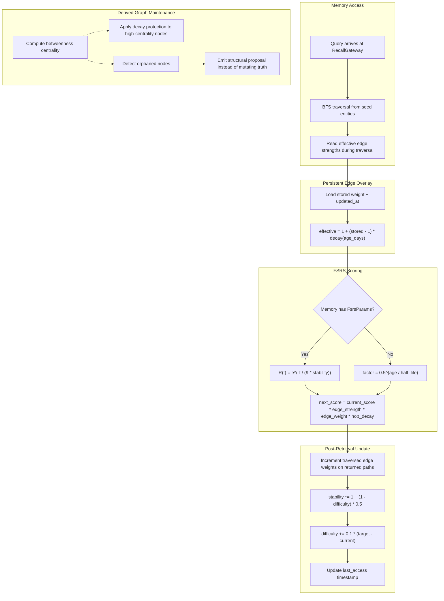

# Mycelium Memory — Adaptive Knowledge Graph

**Task**: [T121](../../tasks/TASKS.md) | **Priority**: P1 | **Status**: Implementation complete, awaiting review approval

---

## Overview

Upgrades the Neural Graph with FSRS (Free Spaced Repetition Scheduler) dual-strength temporal decay, edge-weighted path reinforcement, and betweenness centrality ranking. The current memory system uses single-parameter exponential decay and largely static path scoring, which treats all knowledge paths too similarly and provides a crude "found/not-found" signal. Mycelium Memory makes the graph adaptive: frequently-traversed paths strengthen like mycelial hyphae, dormant paths drift back toward neutral, and structural hub nodes resist decay because they connect disparate knowledge clusters. This directly improves T112 (Evolution Engine) by giving it recall quality as a fitness signal.

---

## Components

| Module | File | Status |
|--------|------|--------|
| FSRS retention functions | `crates/symbiotic-context/src/graph.rs` | Implemented |
| `FsrsParams` struct | `crates/symbiotic-context/src/graph.rs` | Implemented |
| `Memory.fsrs` field | `crates/symbiotic-context/src/graph.rs` | Implemented |
| Persisted `Memory.fsrs` state | `crates/symbiotic-memory/src/types.rs` + SQLite schema | Implemented |
| `temporal_decay()` FSRS path | `crates/symbiotic-context/src/graph.rs` | Implemented |
| `entity_temporal_decay()` FSRS path | `crates/symbiotic-context/src/graph.rs` | Implemented |
| SQLite Neural Graph adapter | `crates/symbiotic-memory/src/graph_store.rs` | Implemented |
| Daemon Recall Gateway wiring | `services/symbiotic-daemon/src/lib.rs` | Implemented |
| `GraphEdge.weight` field | `crates/symbiotic-context/src/graph.rs` | Implemented (Chunk 3) |
| Edge weight reinforcement on returned paths | `crates/symbiotic-context/src/graph.rs` | Implemented (Chunk 3) |
| Lazy decay overlay in SQLite graph store | `crates/symbiotic-memory/src/graph_store.rs` | Implemented (Chunk 3) |
| Betweenness centrality computation | `crates/symbiotic-context/src/graph.rs` + `crates/symbiotic-memory/src/graph_store.rs` | Implemented (Chunk 4A) |
| Derived centrality persistence | `crates/symbiotic-memory/src/sqlite_schema.rs` + `crates/symbiotic-memory/src/graph_store.rs` | Implemented (Chunk 4A) |
| Graph-maintenance snapshot | `crates/symbiotic-memory/src/sqlite.rs` | Implemented (Chunk 4B) |
| Orphan detection + reconnection proposals | `crates/symbiotic-memory/src/self_improvement.rs` + daemon proposal flow | Implemented (Chunk 4B) |
| Retrieval-only derived edge overlay | `crates/symbiotic-memory/src/graph_store.rs` + future overlay schema | Deferred follow-through (Chunk 5) |

All paths are relative to `submodules/runtime/`.

---

## Data Flow



---

## Implementation Status

### Chunk 1: FSRS Dual-Strength Temporal Decay -- Implemented

**File**: `crates/symbiotic-context/src/graph.rs`

**Types added**:

```rust
pub struct FsrsParams {
    pub stability: f64,   // days until ~90% retention; default 30.0
    pub difficulty: f64,   // recall difficulty [0.0, 1.0]; default 0.3
    pub last_access: u64,  // epoch seconds
}

pub struct Memory {
    // ... existing fields ...
    pub fsrs: Option<FsrsParams>,  // None = legacy half-life decay
}
```

**Functions added**:

| Function | Signature | Purpose |
|----------|-----------|---------|
| `fsrs_retention` | `fn(age_days: f64, stability: f64) -> f64` | Core formula: `e^(-t / (9 * S))`. Returns 0.0 for zero/negative stability. |
| `fsrs_update_stability` | `fn(current: f64, difficulty: f64) -> f64` | Stability grows on recall: `current * (1 + (1 - difficulty) * 0.5)`. Capped at 3,650 days. |
| `fsrs_update_difficulty` | `fn(current: f64, quality: f64) -> f64` | Adjusts toward quality target: `current + 0.1 * ((1 - quality) - current)`. Clamped to [0.0, 1.0]. |

**Modified functions**:

| Function | Change |
|----------|--------|
| `temporal_decay(updated_at, now_secs, half_life_days, fsrs)` | Added `fsrs: Option<&FsrsParams>` parameter. When `Some`, uses FSRS retention formula; when `None`, falls back to legacy half-life. Uses `last_access` preferentially, falls back to `updated_at` when `last_access` is 0. |
| `entity_temporal_decay(entity, now_secs, half_life_days)` | Searches entity memories for the most recently accessed FSRS-enabled memory. If found, uses FSRS path; otherwise falls back to legacy most-recent `updated_at`. |

**Backward compatibility**: All existing memories work unchanged. The `fsrs` field on `Memory` is `Option<FsrsParams>` with `#[serde(default)]`, so deserialization of old data produces `None` and the legacy half-life path is used.

**Tests added** (13 new, 243 total in `symbiotic-context`):

| Test | What it verifies |
|------|------------------|
| `fsrs_retention_at_zero_age` | R(0) = 1.0 (perfect retention at access time) |
| `fsrs_retention_decays_over_time` | R(t) decreases as age increases |
| `fsrs_retention_high_stability_decays_slower` | Higher stability = slower decay |
| `fsrs_retention_zero_stability_returns_zero` | Edge case: zero stability returns 0.0 |
| `fsrs_update_stability_increases_on_recall` | Stability grows after successful recall |
| `fsrs_update_stability_capped_at_ten_years` | Stability never exceeds 3,650 days |
| `fsrs_update_stability_harder_difficulty_grows_less` | Higher difficulty = less stability growth |
| `fsrs_update_difficulty_adjusts_toward_quality` | Difficulty moves toward quality-based target |
| `fsrs_update_difficulty_clamps_to_valid_range` | Difficulty stays in [0.0, 1.0] with extreme inputs |
| `legacy_half_life_still_works_with_fsrs_none` | Legacy path unchanged when `fsrs` is `None` |
| `temporal_decay_uses_fsrs_when_provided` | FSRS formula used when `FsrsParams` provided |
| `temporal_decay_fsrs_falls_back_to_updated_at` | Uses `updated_at` when `last_access` is 0 |
| `bfs_with_fsrs_memories_score_differently` | Full BFS traversal with FSRS vs legacy memories |

**Live follow-through now implemented**: `memory.db` persists per-memory FSRS state, new memories get default FSRS parameters at write time, and successful graph recall updates that state (`stability`, `difficulty`, `last_access`) on the returned memories.

### Chunk 2: Runtime Adaptation Callsites -- Implemented

**Files**:
- `crates/symbiotic-memory/src/graph_store.rs`
- `services/symbiotic-daemon/src/lib.rs`

**What landed**:

- Added `SqliteGraphStore`, a live adapter from the memory SQLite schema to the `GraphStore` trait expected by `BfsGraphRetriever`.
- Wired the daemon's `RecallGateway` to use that adapter in production, so graph merge retrieval now operates over the live Neural Graph in `memory.db`.
- Added daemon coverage proving `get_context()` returns graph-backed `memory` items from the live memory store.
- Successful graph recall now writes updated FSRS state back into `memory.db`, making retrieval genuinely adaptive instead of read-only.

### Chunk 3: Edge-Weighted Neural Graph -- Implemented

**Goal**: Make graph edges adaptive. Frequently-traversed paths strengthen; dormant paths weaken without adding a background maintenance loop.

**Approved model**:

- `GraphEdge` keeps two separate signals:
  - `strength`: static relationship quality authored by extraction / curation
  - `weight`: dynamic traversal multiplier learned from successful recall
- Retrieval uses accumulated path scoring, not last-hop-only scoring:
  - `next_score = current_score * edge.strength * edge.weight * decay_factor`
- Dynamic edge weights are persisted as an overlay table in `memory.db`, not folded back into relationship truth.
- Stored weights decay lazily toward neutral `1.0` when read or updated:
  - `effective_weight = 1.0 + (stored_weight - 1.0) * EDGE_WEIGHT_DECAY_PER_DAY.powf(age_days)`
- Reinforcement applies only to edges in paths for nodes that actually survive retrieval filtering/truncation.
- No background decay worker is introduced in Chunk 3. That complexity is not justified for the current scale and would create unnecessary scheduler/operational debt.
- Edge overlay keys preserve the stored relationship direction. We do not canonicalize `(source, target)` because relationship direction carries meaning (`uses`, `supports`, etc.) and collapsing it would destroy graph semantics.

**Key files**:

- `crates/symbiotic-context/src/graph.rs`
- `crates/symbiotic-memory/src/graph_store.rs`
- `crates/symbiotic-memory/src/sqlite_schema.rs`

**SQLite overlay schema**:

```sql
CREATE TABLE graph_edge_weights (
    source_entity_id TEXT NOT NULL,
    target_entity_id TEXT NOT NULL,
    relationship TEXT NOT NULL,
    weight REAL NOT NULL DEFAULT 1.0,
    updated_at INTEGER NOT NULL,
    PRIMARY KEY (source_entity_id, target_entity_id, relationship)
);
```

**Runtime seam**:

```rust
pub struct GraphEdge {
    pub source_id: String,
    pub target_id: String,
    pub relationship: String,
    pub strength: f64,
    pub weight: f64,
}

pub trait GraphStore: Send + Sync {
    fn reinforce_edges(&self, edges: &[GraphEdge]) -> Result<(), GraphRetrievalError>;
}
```

**What landed**:

- `GraphEdge.weight` is now a first-class runtime field in graph traversal.
- BFS retrieval now uses accumulated path scoring, so reinforced upstream routes affect downstream recall.
- `SqliteGraphStore` overlays persisted dynamic weights from `graph_edge_weights` onto the live Neural Graph.
- Stored weights decay lazily toward `1.0` when loaded, so dormant paths lose influence without a background maintenance job.
- Returned-path reinforcement now persists back into `memory.db`, and repeated retrieval measurably increases the score of previously successful routes.

### Chunk 4A: Betweenness Centrality as Derived Memory State -- Implemented

**Goal**: Identify structural hub nodes and protect them from decay without changing graph truth.

**Approved model**:

- Betweenness centrality is **derived state**, not canonical truth.
- Metrics are computed over the current live Neural Graph topology and persisted in a rebuildable SQLite table.
- Centrality should help retrieval score hub nodes slightly higher, but it must not dominate reinforced path scoring.
- Structural centrality ignores edge direction for traversal-hub analysis. Relationship direction remains canonical for normal graph traversal, but the centrality computation treats connectivity as undirected because the goal is “bridge across clusters,” not execution semantics.
- No dedicated daemon scheduler is required for correctness. The metrics are refreshed lazily when stale or when the graph topology fingerprint changes.

**SQLite derived table**:

```sql
CREATE TABLE graph_node_metrics (
    entity_id TEXT PRIMARY KEY,
    betweenness REAL NOT NULL DEFAULT 0.0,
    updated_at INTEGER NOT NULL
);
```

**Runtime seam**:

```rust
pub trait GraphStore: Send + Sync {
    fn structural_boost(&self, entity_id: &str) -> Result<f64, GraphRetrievalError> {
        Ok(1.0)
    }
}
```

`structural_boost` is derived from normalized betweenness centrality and applies only a bounded multiplier.

**What landed**:

- Added pure betweenness-centrality computation to `symbiotic-context`.
- Added rebuildable `graph_node_metrics` persistence to `memory.db`.
- `SqliteGraphStore` now refreshes structural metrics lazily when the graph topology changes or the cached metrics age out.
- Recall retrieval now applies a bounded structural boost to non-seed hub nodes.

### Chunk 4B: Orphan Detection + Reconnection Proposals -- Implemented

**Goal**: Detect weakly-connected knowledge nodes and surface repair opportunities without silently mutating graph truth.

**Approved model**:

- “Self-healing” does **not** mean auto-writing synthetic relationships into the canonical Neural Graph.
- Orphan detection is a derived structural analysis, similar to friction detection.
- Reconnection candidates should flow through the existing structural proposal / approval path, not directly into `relationships` or `links`.
- If we ever add machine-generated reconnection edges later, they must live in a separate derived layer with provenance and revocation, not inside evidence-backed relationship truth.

**What landed**:

- `SqliteMemoryStore::graph_maintenance_snapshot()` builds a typed maintenance view over live active entities, active memories, relationships, and links.
- `FrictionDetector::detect_orphaned_nodes(...)` now detects aged, memory-backed weakly connected nodes using that snapshot.
- Candidate reconnections are derived from shared maintenance keywords and a small entity-type affinity bonus.
- Zero-memory stub entities and fresh nodes are intentionally excluded so the proposal channel stays high-signal.
- Graph-global orphan proposals route through the daemon structural proposal flow even when they are not thread-scoped.

**Future derived-edge overlay**:

- Retrieval-only synthetic edges may be introduced as a separate derived overlay.
- Those edges must include provenance (`co_recall`, `shared_evidence`, `embedding_similarity`, `manual_promotion`), confidence, and revocability.
- Promotion from derived edge to canonical relationship must remain explicit and auditable.
- This is now reserved as T121 Chunk 05, so the agreed “soft self-heal over the index layer” stays tracked as explicit follow-through instead of drifting back into canonical graph mutation.

**Why**:

- The Neural Graph is canonical memory structure, not a scratchpad for heuristic guesses.
- The current runtime already has a proposal system for structural improvements; that is the right end-state seam.
- This matches the stronger “truth vs derived” pattern used elsewhere in the repo and avoids pre-launch technical debt around synthetic graph mutation.

---

## Key Decisions

| # | Decision | Rationale |
|---|----------|-----------|
| 1 | FSRS constant 9.0 in `e^(-t / (9 * S))` | Empirically derived from millions of Anki reviews by the FSRS research team. Not arbitrary. |
| 2 | `Option<FsrsParams>` on `Memory` | Gradual migration. No forced schema update. Old memories use legacy decay, new ones get FSRS. |
| 3 | Stability cap at 3,650 days (10 years) | Prevents infinite stability from compounding on repeatedly-accessed memories. |
| 4 | Simplified FSRS update formula | Using a reduced version of FSRS-4 for stability growth (`growth = 1 + (1 - difficulty) * 0.5`), not the full 19-parameter model. Sufficient for knowledge-graph decay; the full model is designed for flashcard scheduling. |
| 5 | `last_access` fallback to `updated_at` | When FSRS is present but `last_access` is 0 (freshly migrated), the decay function uses `updated_at` as a fallback timestamp. |
| 6 | Separate `weight` from `strength` (Chunk 3) | `strength` is a static relationship quality score. `weight` is a dynamic reinforcement signal. Keeping them separate preserves the original edge semantics. |
| 7 | Lazy decay back to `1.0` instead of a background decay pass | Avoids introducing a scheduler/maintenance loop for a simple overlay while still letting dormant paths lose influence over time. |
| 8 | Accumulate score along the whole path | Reinforced upstream edges should matter for downstream recall; last-hop-only scoring would make adaptive paths mostly ineffective. |
| 9 | Preserve directed edge identity in the weight overlay | Directed relationships encode meaning. Canonicalizing endpoints would incorrectly merge distinct semantics. |
| 10 | Centrality is derived and rebuildable, not canonical | Structural metrics accelerate and improve recall but must never become a second truth system. |
| 11 | Orphan “self-healing” flows through proposals, not direct mutation | Heuristic reconnection is not strong enough evidence to write canonical graph edges automatically. |

---

## Error Handling

FSRS functions (`fsrs_retention`, `fsrs_update_stability`, `fsrs_update_difficulty`) are **pure math** with no I/O. Invalid inputs produce safe defaults:

| Input | Behavior |
|-------|----------|
| `stability <= 0.0` | `fsrs_retention` returns 0.0 |
| `difficulty` outside [0.0, 1.0] | `fsrs_update_difficulty` clamps output to [0.0, 1.0] |
| `last_access == 0` | Falls back to `updated_at`; if also absent, returns 1.0 (no decay) |
| No FSRS params | Legacy half-life path, fully backward compatible |

---

## Integration Points

| System | How it connects |
|--------|----------------|
| **T112 (Evolution Engine)** | FSRS recall quality provides a fitness signal for evolution proposals. Proposals that improve average recall quality across the graph are scored higher. |
| **T123 (Active Recall Probes)** | Uses `fsrs_retention()` to identify memories with retention below a threshold -- these are candidates for proactive recall probes to test and reinforce. |
| **T122 (Tool Memory)** | Tool invocation records can influence edge weights: successful tool use on a topic reinforces the path from that topic to the tool's domain node. |
| **RecallGateway** | The gateway now uses a live SQLite-backed `GraphRetriever` in the daemon, and successful graph recall persists updated FSRS state plus returned-path edge reinforcement back into `memory.db`. |
| **Structural Proposals** | Orphan detection should reuse the existing proposal/approval flow instead of mutating `relationships` or `links` directly. |

---

## References

- FSRS algorithm: https://github.com/open-spaced-repetition/fsrs4anki
- LACP Mycelium Network: https://github.com/0xNyk/lacp
- Brandes' betweenness centrality: U. Brandes, "A Faster Algorithm for Betweenness Centrality" (2001)
