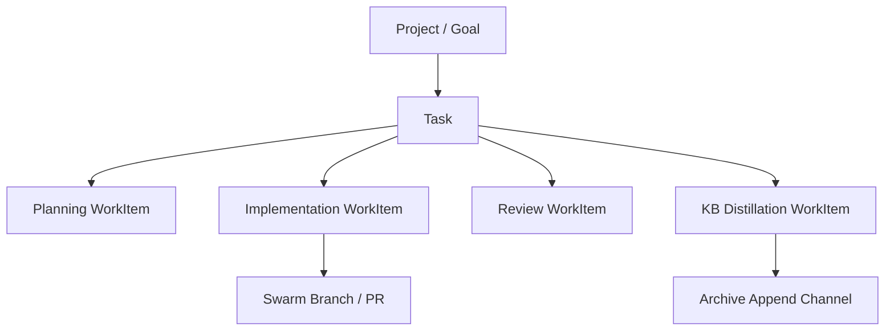

# Non-Swarm Management Ownership

**Status**: Approved design target  
**Related Tasks**: T113, T115, T116  
**Related Docs**: `docs/design/management-work-item-claims.md`, `docs/design/agent-collaboration-conflict-resolution.md`, `control-plane/docs/design/declarative-control-plane.md`, `docs/design/ux-specification.md`

## Goal

Choose the first **non-swarm** runtime seam that should use the management-layer `WorkItem` / `ScopeClaim` / `Lease` model.

This document exists because the swarm path is now real, but the management layer is still missing its first canonical caller outside internal git branch ownership.

## End-State Principle

Symbiotic should converge on a **super-agent orchestrator** model:

- the control plane owns initiative and work ownership
- execution services run externally and report back
- development-layer branch ownership stays separate from management ownership
- the Archive remains sufficient to reconstruct declared goal/task state after
  restore

This matches the control-plane split Paperclip makes explicit:

- Paperclip manages assignment, status, goals, budgets, and heartbeats
- execution adapters run elsewhere and phone home

For Symbiotic, that means the next management caller must represent **who owns the work**, not merely **who happened to spawn a worker**.

## Candidate Seams

### Option A: `dispatch_ops.rs`

Use reconciler dispatch requests as the first non-swarm caller.

#### Upside

- easy to thread into the current daemon path
- visible immediately when the reconciler starts or stops work
- low implementation cost

#### Failure Mode

This would make management ownership hang off an incidental transport event:

- spawn requested
- goal started
- worker invoked

That is too shallow for the end state. It models **requests**, not durable ownership.

The result would likely be:

- duplicated work items as dispatch behavior evolves
- weak reassignment semantics
- unclear parent/child work structure

### Option B: Goal / Initiative Lifecycle

Use goal lifecycle as the first non-swarm management seam.

#### Upside

- matches the end-state orchestrator design
- gives the control plane one durable unit of ownership
- fits checkout, heartbeat, stale-work recovery, and reassignment naturally
- keeps development-layer branch claims subordinate to management-layer work

#### Cost

- broader first implementation
- requires a clearer mapping between goal state and child work items
- needs explicit rules for when a goal owns work directly vs through delegated child items

## Decision

The first non-swarm management caller should be the **goal / initiative lifecycle seam**, not `dispatch_ops.rs`.

`dispatch_ops.rs` may still emit operational events, but it should not become the canonical source of management ownership.

## Canonical Model

### Storage Boundary

Planned ownership records should live canonically in the Archive subtree:

- `knowledge-base/operations/goals/{goal}/plan.md`
- `knowledge-base/operations/goals/{goal}/tasks/*.md`

The management layer should not become a second canonical planner store. Its
role is narrower:

- `WorkItem` = live execution checkout projection
- `ScopeClaim` / `Lease` = volatile ownership and heartbeat state
- branch / PR / review rows = development artifact projection

This keeps the planner truth backup-friendly and human-inspectable while still
letting the runtime own transactional execution behavior.

### Ownership Hierarchy

The approved end-state hierarchy is:

1. **Project**
   - top-level owned container
   - persistent across many executions and conversations
2. **Goal**
   - desired outcome inside that project
3. **Task**
   - a bounded owned slice under a goal or process
   - may be planning, implementation, review, research, rollout, etc.
4. **Work Item**
   - the concrete execution unit with a lease, heartbeat, and assignee
5. **Development Artifact**
   - branch / PR / review / merge records attached to implementation/review work
6. **Thread**
   - a messaging surface that may attach to any of the above, but is not itself the owner

That means:

- `thread` is never the project container
- `branch` is never the owner of the work
- `work item` is the atomic checked-out unit
- `task` is the durable grouping layer missing from the current runtime
- `project` is the top-level owned container
- `goal` is the outcome beneath it

### Top-Level Work Ownership

Each active project/goal ownership slice should map to a top-level `WorkItem`.

That top-level item owns:

- project identity
- current lifecycle state
- high-level assignee or owning manager agent
- stale-work and preemption semantics
- aggregate progress / blocked state

It does **not** own repo branch claims directly.

### Delegated Task Layer

Between the top-level project/goal ownership slice and the concrete execution unit, Symbiotic should
grow a durable task layer.

Representative examples:

- `Project: Symbiotic`
  - `Goal: Build truthful observability`
  - `Task: Thread observability projection`
  - `Task: Project Board live data contract`
  - `Task: Swarm artifact ownership`

Each task may own many concrete execution work items over time.

### Delegated Child Work Items

When a task delegates concrete execution, it should create child
`WorkItem`s.

Representative child categories:

- planning / research pass
- implementation pass
- review pass
- KB distillation pass
- user-wait / approval-wait subtask

Each child work item may then acquire:

- management lease ownership
- development-layer branch claims
- KB append / summary scopes

This keeps the hierarchy clean:

Threads may attach to `G`, `T`, or a specific execution `WorkItem`, but that
attachment is purely for messaging/observability and does not invert ownership.

## Why This Beats `dispatch_ops`

`dispatch_ops.rs` is still useful, but as an adapter seam:

- it should request work
- update operational status
- emit reconciler-side execution events

It should **not** define the true ownership model.

Otherwise Symbiotic would encode management state around daemon dispatch mechanics instead of around the user's actual ongoing work.

## Current Runtime Gap

Today the runtime has:

- top-level goal work items
- branch work items
- explicit thread attachment on branch work items

What it still does **not** have is the durable middle layer:

- task ownership under the goal/project
- child execution work items under that task

That is why branch work is still cleaner than before, but not yet end-state
clean.

## Phase 1 Implementation Boundary

The first non-swarm slice should stay narrow:

1. map active goals to top-level management `WorkItem`s
2. keep ownership single-owner at the top level
3. attach heartbeat / blocked / expired state to that item
4. do **not** introduce child work creation automatically yet
5. do **not** move repo path claims into management

That yields a clean first step without corrupting the end-state model.

## Next Ownership Slice

The next implementation step should **not** make branches the primary child of
top-level goals.

Instead, it should introduce one durable intermediate layer for delegated work:

1. top-level project or goal-scoped work item
2. task child work item
3. implementation/review child work item
4. development artifacts attached under that work item

This keeps Paperclip-style issue ownership semantics while still preserving the
development-layer branch lifecycle already implemented in swarm.

## Runtime Mapping

Primary seam:

- `submodules/runtime/services/symbiotic-daemon/src/control_plane.rs`

Likely collaborators:

- `submodules/runtime/services/symbiotic-daemon/src/goals.rs`
- `submodules/runtime/services/symbiotic-daemon/src/goal_state.rs`

Secondary event producer:

- `submodules/runtime/services/symbiotic-daemon/src/dispatch_ops.rs`

## Explicit Non-Goals

This slice should not yet decide:

- budget accounting
- org-chart ownership
- automatic child work decomposition
- UI treatment of management state

Those follow after the top-level goal ownership path is real.

## Next Step

Implement top-level goal-to-`WorkItem` persistence and status transitions in the daemon/control-plane seam, then expand into child work decomposition once the ownership lifecycle is stable.
