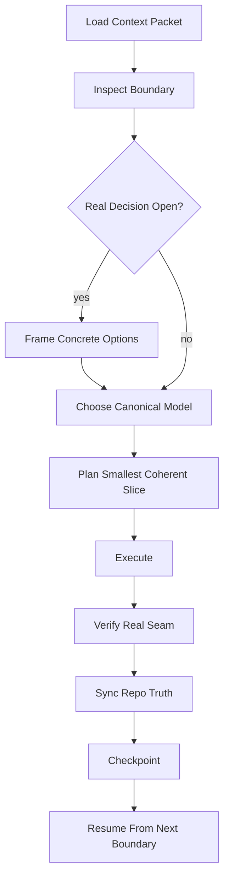

# Operator Reasoning Distillation


**Status**: Approved design target
**Related**: T105, T113, T120, `docs/design/deliberation-first-pipeline.md`, `docs/design/credential-auth-bridge.md`

## Goal

Encode the successful operator method into Symbiotic's agentic execution surface so agents do not only have tools, but also inherit the disciplined process that has worked in real Claude Code and Codex Symbiotic sessions.

This is not personality cloning and not provider-specific prompt tuning.

The target is the **operator protocol**:

- load the right context first
- identify the real boundary before editing
- choose one canonical model
- implement the smallest coherent slice
- verify the real seam
- sync repo truth
- checkpoint after each logical chunk

That protocol must survive across GPT, Claude, Codex, local models, and future runner backends.

## Evidence Base

This design is grounded primarily in actual session records, with commit history used as secondary corroborating evidence.

Primary evidence sources:

- Codex session logs under `~/.codex/sessions/.../*.jsonl`
- Claude session logs under `~/.claude/projects/-Users-k-p-symbiotic/*.jsonl`
- repo context stack: `CONTEXT.md`, `docs/NAMING-CANON.md`, `tasks/TASKS.md`, `tasks/NEXT.md`

Secondary corroborating sources:

- checkpoint commits and commit sequencing
- task and continuation history
- code/doc landing patterns after successful chunks

Observed recurring successful patterns:

- Claude sessions explicitly read the required context files before substantive action.
- Codex sessions give a short progress statement, then immediately trace the real code path with tools instead of freeform theorizing.
- The best sessions stop only at real architectural or trust-boundary choices, not at arbitrary implementation size.
- The best sessions converge one canonical model and then propagate it through code, docs, tasks, and checkpoint state.

Observed failure patterns to guard against:

- continuing implementation past the real semantic decision boundary
- treating derived views as truth-bearing state
- verifying helper seams but not the real user-visible path
- leaving docs, tasks, and continuation state behind the code
- making broad edits without a coherent checkpointable slice

Gemini transcript mining is not yet part of the evidence base because usable Symbiotic transcript files were not found locally.

The weighting should remain:

- transcripts are the main source for operator-process rules
- commit trail is the secondary source for chunk-shape and landing-discipline validation

## Problem

Current agent execution surfaces are mostly about:

- tool invocation
- runner isolation
- gateway auth
- pause/resume
- capability enforcement

Those are necessary, but they do not encode the operator method that keeps work coherent.

Without that method, agents tend to:

- optimize for local progress instead of canonical correctness
- keep coding after the real design choice appears
- blur source-of-truth boundaries
- verify the wrong seam
- let repo truth drift behind implementation

## Design Principles

### 1. Process, Not Persona

The protocol is a sequence of required checks and artifacts, not a style of prose and not a specific model's "voice".

### 2. Canonical Before Convenient

The protocol must prefer the end-state model over transitional hacks.

### 3. Evidence Before Theory

Protocol rules should come from mined successful sessions plus enforced repo conventions, not from intuition alone.

### 4. Smallest Coherent Slice

The unit of progress is not "a lot of code". It is a slice that is:

- semantically complete
- verified at the real seam
- checkpointable

### 5. Truth Sync Is Part of Execution

Code, design docs, task state, and continuation state are one execution surface. Updating only one of them is incomplete execution.

## Target Operator Protocol



### Phase 1: `context.packet.load`

Before meaningful work, the agent must load:

- root rules and naming canon
- current task and continuation state
- relevant subsystem context
- relevant design and architecture docs
- recent checkpoint summary
- any mined operator protocol notes relevant to the current domain

This is mandatory preflight, not optional habit.

### Phase 2: `boundary.inspect`

Before editing, the agent must produce an internal or user-visible boundary statement:

- what is canonical truth here?
- what is derived?
- what is the active semantic edge?
- what would be a hack?
- what would be the end-state move?

If this cannot be answered cleanly, implementation should pause for design clarification.

### Phase 3: `decision.frame`

When a real choice exists, the agent must reduce it to:

- one exact decision
- 2-3 real options
- one recommended option
- concrete reasons the others are weaker

This is the shape that repeatedly worked in successful sessions.

### Phase 4: `slice.plan`

The agent should choose the smallest slice that is:

- coherent end-to-end
- aligned with the chosen canonical model
- independently verifiable
- small enough to checkpoint immediately after landing

### Phase 5: `execute`

Execution should favor:

- typed contracts over loose text surfaces
- source-of-truth mutation before derived-view polish
- real follow-through over stub completion

### Phase 6: `verify.real`

Verification must happen at the correct seam.

Preferred order:

1. source-of-truth mutation
2. daemon/orchestrator follow-through
3. consuming UI/runner surface
4. format/lint/analyze on the touched boundary

### Phase 7: `truth.sync`

After a coherent slice lands, the agent must update:

- relevant design or architecture docs
- task state
- `tasks/NEXT.md`
- any local continuation artifact for the next session

### Phase 8: `checkpoint.create`

A chunk is complete only when there is a checkpoint summary stating:

- what landed
- what was verified
- what remains open
- what the next real boundary is

## Strict Workflow Contract

The execution surface should eventually enforce this contract explicitly.

Required fields per coherent chunk:

- `context_sources_read`
- `canonical_truth_statement`
- `derived_surfaces_statement`
- `decision_boundary`
- `planned_slice`
- `verification_evidence`
- `truth_sync_targets`
- `checkpoint_summary`

This should not require heavy user ceremony. The runner and daemon should maintain these as structured artifacts around execution.

## Protocol Linter

The system should gain a strict protocol linter for agent executions.

Purpose:

- reject fake completion
- detect skipped context preflight
- detect missing verification
- detect code/doc/task drift
- detect slices that ended without a checkpoint

### `reasoning.protocol.lint`

Inputs:

- execution trace
- tool history
- changed files
- verification records
- checkpoint artifact

Checks:

- context packet was loaded before editing
- a boundary statement exists before major edits
- if a decision was present, options were framed
- verification touched the real seam, not only helper tests
- touched behavior has matching doc/task truth updates
- a checkpoint artifact exists for completed chunks

Outputs:

- `pass`
- `warn`
- `fail`
- concrete missing fields

The linter is not a style checker. It is an execution-discipline checker.

## Symbiotic Runtime Integration

This should live as a first-class orchestration layer, not as prompt folklore.

### Runner Side

Add protocol-aware execution support in `symbiotic-agent-runner`:

- preflight context packet request
- boundary artifact emission
- decision framing artifact emission
- chunk checkpoint emission

Proposed locations:

- `submodules/runtime/crates/symbiotic-agent-runner/src/operator_protocol.rs`
- `submodules/runtime/crates/symbiotic-agent-runner/src/context_packet.rs`

### Daemon Side

The daemon should own:

- context packet assembly
- session-log distillation products
- protocol linting
- persistence of chunk artifacts

Proposed locations:

- `submodules/runtime/services/symbiotic-daemon/src/operator_protocol.rs`
- `submodules/runtime/services/symbiotic-daemon/src/operator_protocol_lint.rs`
- `submodules/runtime/services/symbiotic-daemon/src/operator_context.rs`

### Bridge / Workflow Contract

Add typed bridge or orchestration primitives for:

- `context.packet.load`
- `boundary.inspect`
- `decision.frame`
- `truth.sync`
- `checkpoint.create`

These may be represented internally first before being exposed as explicit public RPC calls.

## Archive Contract

The operator protocol should distill into Archive as explicit operational knowledge.

Recommended canonical storage:

```text
knowledge-base/
  operations/
    skills/
      operator-protocol/
        operator-protocol.md
        operator-protocol.brief.md
    workflows/
      session-distillation/
        session-distillation.md
```

Meaning:

- `operator-protocol.md` = canonical maintained protocol for agent execution
- `operator-protocol.brief.md` = generated condensed read surface
- `session-distillation.md` = workflow for mining session transcripts into protocol updates

This keeps the protocol as explicit operational knowledge, not just code.

## Session-Log Distillation Pipeline

The protocol should be updated from actual session evidence.

### Inputs

- Codex JSONL session logs
- Claude JSONL session logs
- future Gemini or other session logs when available
- checkpoint and commit history for chunk-boundary validation

### Distillation Stages

1. parse session transcript format
2. extract execution episodes
3. classify good patterns and failure patterns
4. normalize to protocol candidates
5. cross-check chunk boundaries and truth-sync behavior against commit history
6. review and promote accepted candidates into `operator-protocol.md`

### Output Types

- `ProtocolRule`
- `AntiPattern`
- `ExampleExecution`
- `VerificationHeuristic`

### Constraints

- transcript mining should run locally
- raw private transcripts should not need to leave the machine
- promoted rules must be human-reviewable before becoming canonical

## Relation To Existing Memory and Agent Work

This design does not replace:

- T113 runner hardening
- T105 deliberation-first execution
- T109/T111 Archive truth work

It composes them.

The intended split is:

- T113 provides secure execution and bridge boundaries
- T105 provides deliberation and workflow structure
- Archive provides canonical operational knowledge
- this design adds the operator method that decides how work advances coherently

## What To Copy From External Inspirations

### From `MemPalace`

Copy:

- pre-action protocol before edits
- area intent / principles / decisions discipline
- explicit handling for major refactors

Do not copy:

- visual memory as primary substrate
- remote shared-palace assumptions
- benchmark and compression claims without provenance

### From `llm-wiki`

Copy:

- simple three-layer explanation
- persistent markdown maintenance model
- explicit `ingest / query / lint` loop
- filing useful answers back into memory

Do not copy:

- loose source-of-truth boundaries
- purely text-maintenance framing without action/security integration

## Phased Adoption

### Phase A: Canonical Design and Archive Notes

- maintain this design doc
- create canonical `operator-protocol.md`
- create `session-distillation.md`

### Phase B: Local Distillation Tooling

- parse Claude/Codex session logs
- generate protocol candidates
- produce reviewable distilled notes

### Phase C: Runtime Context Packet

- daemon compiles execution context packets
- runner consumes them before tool work

### Phase D: Protocol Lint

- enforce the strict workflow contract
- block or warn on incomplete chunks

### Phase E: Provider-Agnostic Default Behavior

- make the operator protocol the default execution loop for all supported backends

## Acceptance Criteria

- the protocol is documented as operational knowledge, not only as code comments
- the design is grounded in real session evidence rather than commit archaeology
- the execution surface has explicit slots for context, boundary, verification, truth sync, and checkpoint artifacts
- a future linter can mechanically detect skipped protocol steps
- the design remains provider-agnostic and security-compatible

## Current Recommendation

The next correct implementation order is:

1. canonicalize the Archive notes for operator protocol and session distillation
2. build local transcript distillation over Claude and Codex session logs
3. compile protocol-aware context packets in the daemon
4. add protocol linting before trying to make providers "smarter"

The protocol should become part of Symbiotic's operating system, not an undocumented habit of one assistant session.
