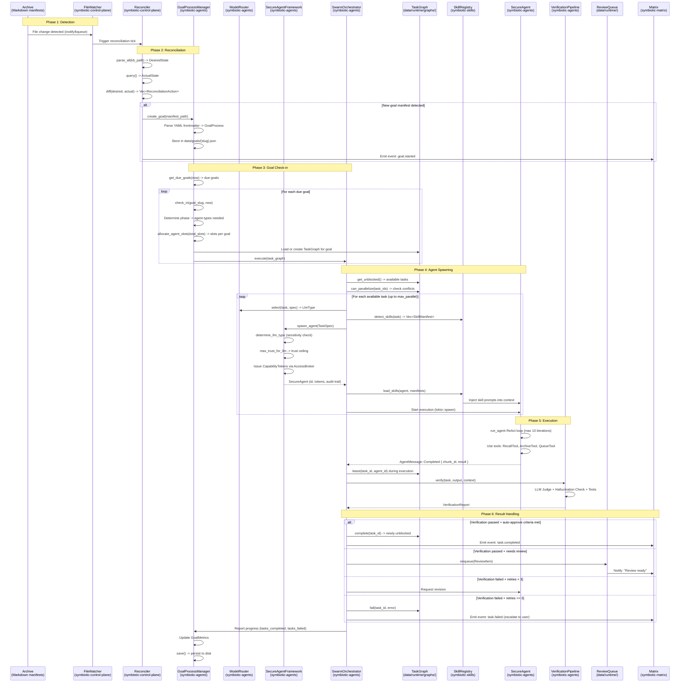
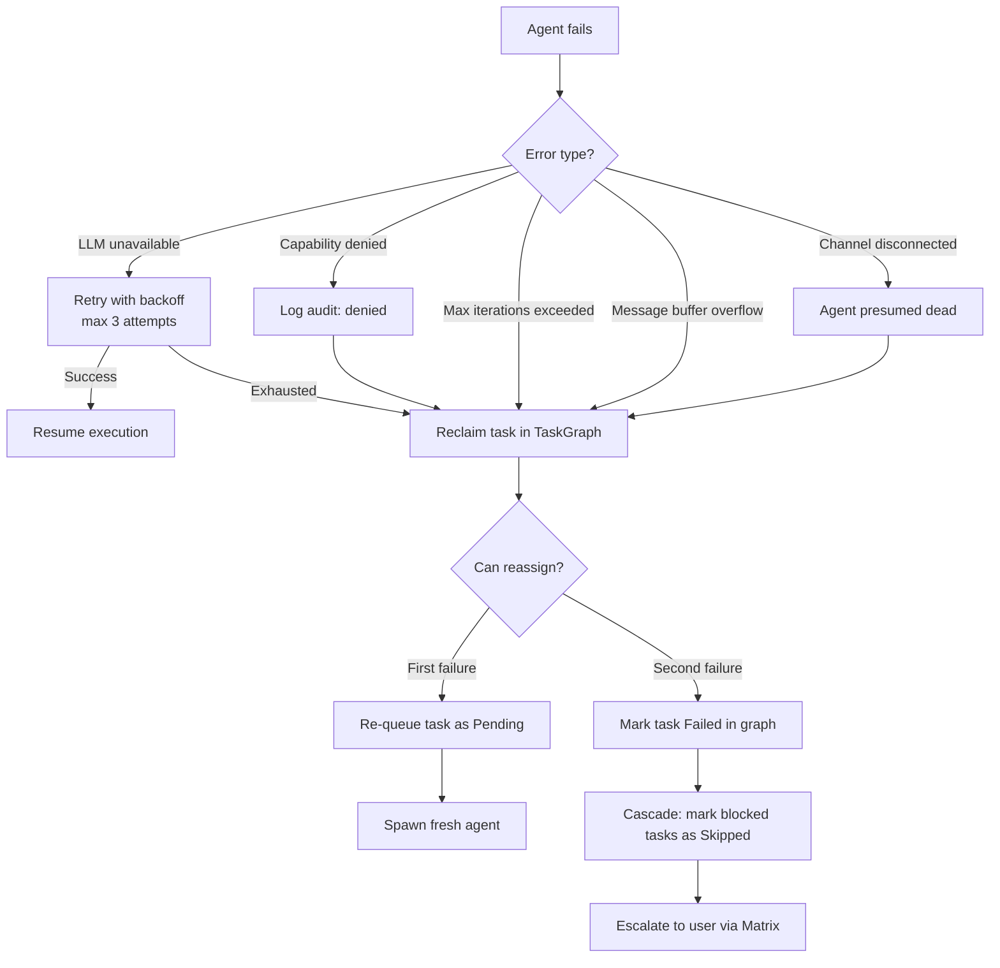

# Orchestration Integration Spec

## Overview

This document specifies how the Declarative Cognitive Control Plane, GoalProcessManager, SwarmOrchestrator, SecureAgentFramework, and Skills System wire together to form the autonomous execution engine. It defines the exact call sequence from a goal manifest appearing on disk through to agent execution and result reporting, including the daemon's main loop integration.

**Naming note (2026-04-16):** this integration spec is still written in goal-centric runtime language. Newer design canon in `docs/design/project-goal-process-model.md` separates `project`, `goal`, and `process`. Read this doc as the current orchestration wiring shape, not as the final naming model.

**Related docs:**
- `docs/design/goals-layer.md` (GoalProcessManager API)
- `docs/design/agent-orchestration.md` (agent framework, task graph, verification)
- `docs/design/agent-swarms.md` (swarm orchestration, channels)
- `docs/design/skills-system.md` (skill loading, manifests)
- `control-plane/docs/design/declarative-control-plane.md` (reconciliation loop)
- `docs/architecture/agent-orchestration.md` (current implementation)
- `docs/architecture/agent-swarms.md` (current swarm implementation)

**Tasks**: T66 (Goal-Driven), T70 (Agent Framework), T103 (Architecture 2.0)

## Data Flow



## Stage Details

### Phase-to-Agent-Type Mapping

A Goal's `phase` field determines which types of agents are spawned. This mapping is implemented in `GoalProcessManager::check_in()`:

```rust
/// Determines which agent types to spawn for a goal's current phase.
pub fn agents_for_phase(phase: &GoalPhase, goal: &GoalProcess) -> Vec<AgentSpec> {
    match phase {
        GoalPhase::Inquisition => vec![
            AgentSpec {
                role: "interviewer",
                llm_preference: LlmPreference::Premium, // Opus for nuanced questioning
                capabilities: vec!["archive.read".into()],
                trust_min: TrustLevel::ReadOnly,
                complexity: Complexity::High,
            },
        ],
        GoalPhase::Research => vec![
            AgentSpec {
                role: "discovery",
                llm_preference: LlmPreference::Fast, // Haiku for breadth
                capabilities: vec!["archive.read".into(), "web.search".into()],
                trust_min: TrustLevel::ReadOnly,
                complexity: Complexity::Low,
            },
            AgentSpec {
                role: "analyst",
                llm_preference: LlmPreference::Standard, // Sonnet for synthesis
                capabilities: vec!["archive.read".into(), "archive.write".into()],
                trust_min: TrustLevel::ArchiveWrite,
                complexity: Complexity::Medium,
            },
        ],
        GoalPhase::Provisioning => vec![
            AgentSpec {
                role: "infrastructure",
                llm_preference: LlmPreference::Local, // Local for credential work
                capabilities: vec![
                    "archive.read".into(),
                    "credential".into(),
                    "vm.create".into(),
                ],
                trust_min: TrustLevel::CredentialAccess,
                complexity: Complexity::High,
            },
        ],
        GoalPhase::Implementation => vec![
            AgentSpec {
                role: "executor",
                llm_preference: LlmPreference::Standard,
                capabilities: vec![
                    "archive.read".into(),
                    "archive.write".into(),
                    "queue.submit".into(),
                ],
                trust_min: TrustLevel::ArchiveWrite,
                complexity: Complexity::Medium,
            },
            AgentSpec {
                role: "coder",
                llm_preference: LlmPreference::Premium,
                capabilities: vec![
                    "archive.read".into(),
                    "file.read".into(),
                    "file.write".into(),
                    "vm.exec".into(),
                ],
                trust_min: TrustLevel::ArchiveWrite,
                complexity: Complexity::High,
            },
        ],
        GoalPhase::Maintenance => vec![
            AgentSpec {
                role: "monitor",
                llm_preference: LlmPreference::Fast,
                capabilities: vec!["archive.read".into()],
                trust_min: TrustLevel::ReadOnly,
                complexity: Complexity::Low,
            },
        ],
    }
}

#[derive(Debug, Clone)]
pub struct AgentSpec {
    pub role: &'static str,
    pub llm_preference: LlmPreference,
    pub capabilities: Vec<String>,
    pub trust_min: TrustLevel,
    pub complexity: Complexity,
}

#[derive(Debug, Clone, Copy)]
pub enum LlmPreference {
    Local,    // Force local (credential work)
    Fast,     // Haiku/cheap model
    Standard, // Sonnet
    Premium,  // Opus
}
```

### SwarmOrchestrator Task Distribution

The `SwarmOrchestrator` bridges between `GoalProcessManager` and `SecureAgentFramework`. On each tick:

```rust
impl SwarmOrchestrator {
    /// Core integration method: takes a goal's task graph,
    /// spawns agents via SecureAgentFramework, and manages execution.
    pub async fn execute_for_goal(
        &mut self,
        goal: &GoalProcess,
        task_graph: &mut TaskGraph,
        framework: &SecureAgentFramework,
        skill_registry: &SkillRegistry,
    ) -> Result<SwarmReport> {
        let agent_specs = agents_for_phase(&goal.phase(), goal);

        loop {
            let unblocked = task_graph.get_unblocked();
            if unblocked.is_empty() && self.active_agents.is_empty() {
                break;
            }

            let parallelizable = self.filter_parallelizable(&unblocked, task_graph);
            let slots = self.config.max_parallel.saturating_sub(self.active_agents.len());

            for task_node in parallelizable.into_iter().take(slots) {
                // Step 1: Select model via ModelRouter
                let spec = self.build_task_spec(&task_node, &agent_specs);
                let llm_type = self.model_router.select(&task_node, &spec);

                // Step 2: Spawn agent via SecureAgentFramework
                let agent = framework.spawn_agent(AgentSpawnRequest {
                    parent: AgentParent::Goal { slug: goal.slug.clone() },
                    task_spec: spec.clone(),
                    llm_type,
                })?;

                // Step 3: Load skills into agent context
                let skills = skill_registry.detect_skills(&task_node, agent.trust_level());
                for skill in &skills {
                    if skills.len() <= 3 { // Max 3 skills per agent
                        skill_registry.load_into_agent(&agent, skill)?;
                    }
                }

                // Step 4: Lease task in graph
                task_graph.lease(&task_node.id, &agent.id())?;

                // Step 5: Spawn execution
                let (agent_tx, orch_rx) = self.create_channels();
                let handle = tokio::spawn(async move {
                    run_agent_with_reporting(agent, agent_tx).await
                });
                self.active_agents.insert(task_node.id.clone(), ActiveAgent {
                    handle,
                    orch_rx,
                    agent_id: agent.id().to_string(),
                });
            }

            // Collect completed agents
            self.collect_and_verify(task_graph).await?;

            tokio::time::sleep(Duration::from_secs(self.config.poll_interval_secs)).await;
        }

        Ok(self.build_report())
    }
}
```

### Skill Loading into Agent Contexts

Skills are detected and loaded in a three-step process:

```rust
impl SkillRegistry {
    /// Detect which skills should be loaded for a task.
    pub fn detect_skills(
        &self,
        task: &TaskNode,
        agent_trust: TrustLevel,
    ) -> Vec<&SkillManifest> {
        let mut matches = Vec::new();

        for manifest in &self.manifests {
            // Trust gating: agent must meet skill's minimum trust
            if agent_trust < manifest.min_trust_level {
                continue;
            }

            // Explicit invocation: "skill:code-review" in task context
            let task_text = task.context.to_string();
            if task_text.contains(&format!("skill:{}", manifest.invocation)) {
                matches.push(manifest);
                continue;
            }

            // Keyword match
            if manifest.triggers.keywords.iter()
                .any(|kw| task_text.to_lowercase().contains(&kw.to_lowercase()))
            {
                matches.push(manifest);
                continue;
            }

            // Domain match
            if let Some(domain) = &task.stream {
                if manifest.triggers.domains.contains(domain) {
                    matches.push(manifest);
                }
            }
        }

        // Limit to 3 skills, prefer keyword over domain matches
        matches.truncate(3);
        matches
    }

    /// Load a skill's prompt and examples into the agent's system context.
    pub fn load_into_agent(
        &self,
        agent: &SecureAgent,
        manifest: &SkillManifest,
    ) -> Result<()> {
        let prompt_content = std::fs::read_to_string(&manifest.prompt_path)?;
        agent.append_system_context(&format!(
            "\n--- Skill: {} v{} ---\n{}\n--- End Skill ---\n",
            manifest.name, manifest.version, prompt_content
        ));

        // Load examples if present
        for example_path in &manifest.example_paths {
            let example = std::fs::read_to_string(example_path)?;
            agent.append_system_context(&format!(
                "\n--- Example ({}) ---\n{}\n--- End Example ---\n",
                example_path.display(), example
            ));
        }

        Ok(())
    }
}
```

### API Contracts Between Components

#### GoalProcessManager -> SecureAgentFramework

```rust
/// The GoalProcessManager calls SecureAgentFramework.spawn_agent()
/// with this request structure.
pub struct AgentSpawnRequest {
    pub parent: AgentParent,
    pub task_spec: TaskSpec,
    pub llm_type: LlmType,
}

/// SecureAgentFramework.spawn_agent() returns SecureAgent or Err.
impl SecureAgentFramework {
    pub fn spawn_agent(&self, request: AgentSpawnRequest) -> Result<SecureAgent> {
        // 1. Validate capabilities against trust ceiling for LLM type
        let trust = self.max_trust_for_llm(&request.llm_type);
        for cap in &request.task_spec.capabilities {
            let required = self.required_trust_for_scope(&cap.scope);
            if required > trust {
                return Err(anyhow!(
                    "Capability '{}' requires {:?} but LLM type max is {:?}",
                    cap.scope, required, trust
                ));
            }
        }

        // 2. Issue scoped tokens via AccessBroker (1-hour TTL)
        let tokens = self.access_broker.issue_tokens(
            &request.task_spec.capabilities,
            trust,
            Duration::from_secs(3600),
        )?;

        // 3. Create agent with audit trail
        let agent = SecureAgent::new(
            uuid::Uuid::new_v4().to_string(),
            request.parent,
            request.llm_type,
            trust,
            tokens,
        );

        self.register_agent(agent.clone());
        Ok(agent)
    }
}
```

#### SwarmOrchestrator -> VerificationPipeline

```rust
impl SwarmOrchestrator {
    async fn collect_and_verify(&mut self, task_graph: &mut TaskGraph) -> Result<()> {
        let completed = self.drain_completed_agents().await;

        for (task_id, result) in completed {
            let task = task_graph.get_node(&task_id)
                .ok_or_else(|| anyhow!("Task {} not found", task_id))?;

            let report = self.verification.verify(
                task,
                &AgentOutput { content: result.output.clone(), files_changed: result.files_changed.clone() },
                &VerificationContext { goal_slug: task.goal.clone() },
            ).await?;

            if report.overall_passed {
                if self.should_auto_approve(&report, task) {
                    task_graph.complete(&task_id)?;
                    self.emit_event(TaskEvent::Completed { task_id: task_id.clone() });
                } else {
                    self.review_queue.enqueue(ReviewItem {
                        id: uuid::Uuid::new_v4().to_string(),
                        chunk_id: task_id.clone(),
                        task_id: task_id.clone(),
                        title: task.title.clone(),
                        summary: result.output.clone(),
                        files_changed: result.files_changed,
                        verification_report: report,
                        status: ReviewStatus::Pending,
                        created_at: now_unix(),
                        reviewed_at: None,
                        reviewer_notes: None,
                    })?;
                }
            } else if result.revision_count < 3 {
                // Request revision
                self.request_revision(&task_id, &report).await?;
            } else {
                task_graph.fail(&task_id, &report.layers.iter()
                    .flat_map(|l| l.issues.iter())
                    .map(|i| i.description.as_str())
                    .collect::<Vec<_>>()
                    .join("; "))?;
                self.emit_event(TaskEvent::Failed { task_id: task_id.clone() });
            }
        }

        Ok(())
    }

    fn should_auto_approve(&self, report: &VerificationReport, task: &TaskNode) -> bool {
        report.overall_score >= 0.85
            && !report.layers.iter().any(|l|
                l.issues.iter().any(|i| i.severity == IssueSeverity::Error))
            && !self.is_security_critical(task)
    }
}
```

### Daemon Main Loop Integration

The daemon's main loop wires all components together:

```rust
// In symbiotic-daemon/src/lib.rs
pub async fn run_daemon(config: DaemonConfig) -> Result<()> {
    // Initialize shared infrastructure
    let access_broker = Arc::new(AccessBroker::new(config.trust_config));
    let memory_store = Arc::new(SqliteMemoryStore::open(&config.memory_db_path)?);
    let archive_store = Arc::new(FileArchiveStore::new(&config.archive_path));
    let matrix_client = Arc::new(MatrixClient::new(&config.matrix_config).await?);

    // Initialize agent framework
    let framework = Arc::new(SecureAgentFramework::new(
        access_broker.clone(),
        config.agent_config.clone(),
    ));

    // Initialize skill registry
    let skill_registry = Arc::new(SkillRegistry::load(&config.skills_path)?);

    // Initialize goal manager
    let goal_manager = Arc::new(Mutex::new(
        GoalProcessManager::load(&config.goals_path)?,
    ));

    // Initialize reconciler
    let reconciler = Arc::new(Mutex::new(Reconciler::new(
        ReconcilerConfig {
            reconcile_interval_secs: 30,
            watch_filesystem: true,
            max_actions_per_tick: 10,
            knowledge_base_path: config.kb_path.clone(),
        },
        Box::new(DaemonStateQuery::new(
            goal_manager.clone(),
            framework.clone(),
            skill_registry.clone(),
        )),
    )));

    // Background task 1: Reconciliation loop
    let reconciler_handle = {
        let reconciler = reconciler.clone();
        let matrix = matrix_client.clone();
        let gpm = goal_manager.clone();
        let framework = framework.clone();
        let skill_registry = skill_registry.clone();
        tokio::spawn(async move {
            let mut interval = tokio::time::interval(Duration::from_secs(30));
            loop {
                interval.tick().await;
                let mut r = reconciler.lock().await;
                match r.reconcile().await {
                    Ok(actions) => {
                        for action in &actions {
                            tracing::info!(?action, "Reconciliation action");
                            execute_reconciliation_action(
                                action,
                                &gpm,
                                &framework,
                                &skill_registry,
                                &matrix,
                            ).await;
                        }
                    }
                    Err(e) => tracing::warn!("Reconciliation failed: {}", e),
                }
            }
        })
    };

    // Background task 2: Goal check-in loop
    let goal_handle = {
        let gpm = goal_manager.clone();
        let framework = framework.clone();
        let skill_registry = skill_registry.clone();
        let matrix = matrix_client.clone();
        tokio::spawn(async move {
            let mut interval = tokio::time::interval(Duration::from_secs(60));
            loop {
                interval.tick().await;
                let now = now_unix();
                let mut manager = gpm.lock().await;
                let due_goals: Vec<String> = manager.get_due_goals(now)
                    .iter().map(|g| g.slug.clone()).collect();

                for slug in due_goals {
                    let total_slots = 5; // From preferences.md max_concurrent_agents
                    let allocation = manager.allocate_agent_slots(total_slots);
                    let slots = allocation.get(&slug).copied().unwrap_or(0);

                    if slots == 0 { continue; }

                    let swarm_config = SwarmConfig {
                        max_parallel: slots.min(3),
                        max_total_agents: 10,
                        poll_interval_secs: 5,
                        auto_commit: true,
                        verification: VerificationConfig::default(),
                    };

                    let mut orchestrator = SwarmOrchestrator::new(
                        swarm_config,
                        ModelRouter::new(config.model_router_config.clone()),
                        VerificationPipeline::new(VerificationConfig::default()),
                    );

                    if let Some(goal) = manager.goals.iter().find(|g| g.slug == slug) {
                        let graph_path = format!("data/runtime/graphs/{}.json", slug);
                        let mut task_graph = TaskGraph::load_or_create(&graph_path, &slug)?;

                        match orchestrator.execute_for_goal(
                            goal,
                            &mut task_graph,
                            &framework,
                            &skill_registry,
                        ).await {
                            Ok(report) => {
                                manager.update_metrics(&slug, &report);
                                task_graph.save(&graph_path)?;
                            }
                            Err(e) => {
                                tracing::error!(goal = %slug, "Swarm execution failed: {}", e);
                                matrix.send_alert(&format!(
                                    "Goal '{}' swarm failed: {}", slug, e
                                )).await;
                            }
                        }
                    }

                    manager.save()?;
                }
            }
        })
    };

    // Background task 3: Matrix command listener (existing)
    let matrix_handle = tokio::spawn(matrix_command_loop(matrix_client.clone()));

    // Wait for all tasks
    tokio::select! {
        _ = reconciler_handle => tracing::error!("Reconciler exited"),
        _ = goal_handle => tracing::error!("Goal loop exited"),
        _ = matrix_handle => tracing::error!("Matrix loop exited"),
    }

    Ok(())
}
```

### Reconciliation Action Execution

```rust
async fn execute_reconciliation_action(
    action: &ReconciliationAction,
    gpm: &Arc<Mutex<GoalProcessManager>>,
    framework: &Arc<SecureAgentFramework>,
    skill_registry: &Arc<SkillRegistry>,
    matrix: &Arc<MatrixClient>,
) {
    match &action.action_type {
        ActionType::StartGoal => {
            if action.requires_approval {
                matrix.send_approval_request(&format!(
                    "New goal '{}' requires manual approval to start", action.target
                )).await;
            } else {
                let mut manager = gpm.lock().await;
                if let Err(e) = manager.create_goal_from_slug(&action.target) {
                    tracing::error!("Failed to start goal {}: {}", action.target, e);
                }
            }
        }
        ActionType::StopGoal => {
            let mut manager = gpm.lock().await;
            let _ = manager.transition(&action.target, GoalState::Abandoned);
        }
        ActionType::PauseGoal => {
            let mut manager = gpm.lock().await;
            let _ = manager.transition(&action.target, GoalState::Paused);
        }
        ActionType::ResumeGoal => {
            let mut manager = gpm.lock().await;
            let _ = manager.transition(&action.target, GoalState::Active);
        }
        ActionType::SpawnAgents { goal, count } => {
            tracing::info!(goal, count, "Reconciler requests agent spawn (handled by goal loop)");
            // Agent spawning is handled by the goal check-in loop, not directly by reconciler
        }
        ActionType::LoadSkill { name } => {
            if let Err(e) = skill_registry.load_skill(name) {
                tracing::error!("Failed to load skill {}: {}", name, e);
            }
        }
        ActionType::UnloadSkill { name } => {
            skill_registry.unload_skill(name);
        }
        ActionType::ReloadIdentity => {
            tracing::info!("Reloading SOUL identity into agent prompts");
            // Identity is re-read on next agent spawn; no immediate action needed
        }
        ActionType::ReloadPreferences => {
            tracing::info!("Reloading operator preferences");
            // Preferences are re-read on next reconciliation tick
        }
        ActionType::AdvancePhase { from, to } => {
            tracing::info!(goal = %action.target, from, to, "Phase advance");
            // Phase advancement triggers different agent types on next goal check-in
        }
    }
}
```

## Error Handling

### Agent Failure Mid-Goal

When an agent fails during goal execution, the error flows through multiple layers:



| Failure | Component | Handling |
|---------|-----------|----------|
| Agent LLM call fails | `run_agent()` in executor.rs | Returns `Err`. SwarmOrchestrator catches, retries once. |
| Agent exceeds max iterations (10) | `run_agent()` | Returns `Err("max iterations exceeded")`. Task reclaimed. |
| Agent message buffer > 2 MiB | `run_agent()` | Returns `Err` before next LLM call. Task reclaimed. |
| Capability token expired during execution | `execute_scope()` | Returns `Err`. Tool call recorded as failed. Agent may recover by trying alternative tool. |
| Tool execution failure | `Tool::execute()` | Result fed back to LLM for recovery. Agent may use different approach. |
| Verification failure (score < 0.7) | `VerificationPipeline::verify()` | Revision requested (up to 3x). Then escalated to human. |
| TaskGraph write conflict | `can_parallelize()` | Tasks not spawned in parallel. Serialized execution. |
| Goal process crash (panic) | `GoalProcessManager::check_in()` | Caught by tokio::spawn. Goal restarted from persisted state on next tick. |
| Reconciler tick failure | `Reconciler::reconcile()` | Logged, skipped. Next tick retries. |
| Manifest parse failure | `ManifestParser::parse_goal()` | Logged, file skipped. Other manifests processed normally. |
| Skill load failure | `SkillRegistry::load_into_agent()` | Logged. Agent proceeds without skill. |
| ReviewQueue write failure | `ReviewQueue::enqueue()` | Task stays in "pending_review" state. Retried on next collection cycle. |

## Integration Points

| Call Site | Crate | Method |
|-----------|-------|--------|
| Reconciliation loop | `symbiotic-control-plane` | `Reconciler::reconcile()` |
| Manifest parsing | `symbiotic-control-plane` | `ManifestParser::parse_all()` |
| State diff | `symbiotic-control-plane` | `Reconciler::diff()` |
| Goal creation | `symbiotic-agents` | `GoalProcessManager::create_goal()` |
| Goal check-in | `symbiotic-agents` | `GoalProcessManager::check_in()` |
| Slot allocation | `symbiotic-agents` | `GoalProcessManager::allocate_agent_slots()` |
| Agent spawning | `symbiotic-agents` | `SecureAgentFramework::spawn_agent()` |
| Model selection | `symbiotic-agents` | `ModelRouter::select()` |
| Agent execution | `symbiotic-agents` | `run_agent()` in executor.rs |
| Skill detection | `symbiotic-skills` | `SkillRegistry::detect_skills()` |
| Skill loading | `symbiotic-skills` | `SkillRegistry::load_into_agent()` |
| Task graph operations | `symbiotic-agents` | `TaskGraph::get_unblocked()`, `lease()`, `complete()`, `fail()` |
| Swarm execution | `symbiotic-agents` | `SwarmOrchestrator::execute_for_goal()` |
| Verification | `symbiotic-agents` | `VerificationPipeline::verify()` |
| Review queue | `symbiotic-agents` | `ReviewQueue::enqueue()`, `approve()`, `reject()` |
| Matrix events | `symbiotic-matrix` | `MatrixClient::send_status_event()` |
| File watching | `symbiotic-control-plane` | `FileWatcher` (via `notify` crate) |

## Config

| Parameter | Location | Default | Description |
|-----------|----------|---------|-------------|
| `reconcile_interval_secs` | `ReconcilerConfig` | `30` | Seconds between reconciliation ticks |
| `max_actions_per_tick` | `ReconcilerConfig` | `10` | Cap on actions per reconciliation |
| `watch_filesystem` | `ReconcilerConfig` | `true` | Enable inotify/kqueue |
| `max_parallel` | `SwarmConfig` | `3` | Max concurrent agents per swarm |
| `max_total_agents` | `SwarmConfig` | `10` | Max total agents per swarm |
| `poll_interval_secs` | `SwarmConfig` | `5` | Swarm collection poll interval |
| `auto_commit` | `SwarmConfig` | `true` | Auto-commit after chunk completion |
| `max_revisions` | `VerificationConfig` | `3` | Revision attempts before escalation |
| `pass_threshold` | `VerificationConfig` | `0.7` | Minimum verification score |
| `auto_approve_threshold` | Preferences manifest | `0.85` | Score above which results auto-approve |
| `max_concurrent_agents` | Preferences manifest | `5` | Global agent concurrency limit |
| `max_daily_llm_cost_usd` | Preferences manifest | `10.0` | Daily LLM spend cap |

## Test Strategy

| Test | Type | Description |
|------|------|-------------|
| **Reconciler detects new goal** | Unit | Write goal manifest, run `reconcile()`. Verify `StartGoal` action emitted. |
| **Reconciler pauses goal** | Unit | Change manifest `state: paused`. Verify `PauseGoal` action. |
| **Reconciler is idempotent** | Unit | Run `reconcile()` twice with no changes. Verify zero actions on second run. |
| **Phase-to-agent mapping** | Unit | Call `agents_for_phase()` for each phase. Verify correct roles and capabilities. |
| **Slot allocation by priority** | Unit | 3 goals with priorities 1, 3, 5. Verify priority 1 gets most slots. |
| **Swarm distributes tasks** | Integration | Create TaskGraph with 5 unblocked tasks. Run `execute_for_goal()`. Verify 3 spawned in parallel (default). |
| **Swarm respects write conflicts** | Integration | Two tasks with overlapping write paths. Verify serialized execution. |
| **Skill detection by keyword** | Unit | Task with "review" in context. Verify code-review skill detected. |
| **Skill trust gating** | Unit | Agent with ReadOnly trust. Verify skill requiring Standard is not loaded. |
| **Agent failure retry** | Integration | Mock agent that fails once then succeeds. Verify retry and task completion. |
| **Agent failure escalation** | Integration | Mock agent that fails twice. Verify task marked Failed in graph. |
| **Verification auto-approve** | Unit | Score 0.9, no errors, non-security file. Verify auto-approved. |
| **Verification manual review** | Unit | Score 0.8, touches security file. Verify routed to ReviewQueue. |
| **Full goal lifecycle** | Integration | Create goal manifest, let reconciler detect, run check-in, verify agents spawned, tasks completed, metrics updated. |
