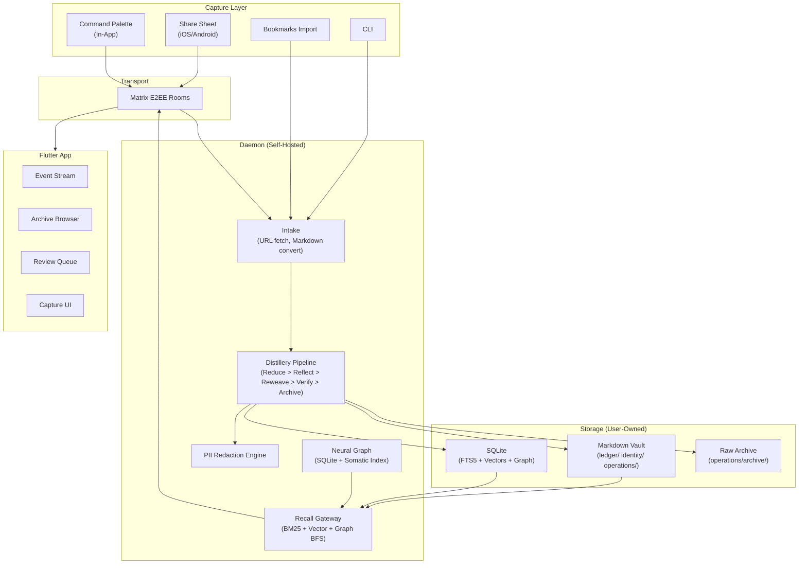

# PRD: Symbiotic Brain

**Status**: Draft
**Author**: K + Symbiotic AI
**Date**: 2026-03-05

---

## 1. What Is This

Symbiotic Brain is the open-source core of Symbiotic — a self-hosted AI memory system that actively processes, connects, and evolves your knowledge. You capture raw inputs from your phone or desktop. The system breaks them into atomic claims, discovers connections to what you already know, rewrites existing notes to incorporate new understanding, and makes everything retrievable through semantic, graph, and temporal search.

It is not a note-taking app. It is a living knowledge base that thinks about what you feed it.

**What this is NOT**: This is not the automation layer. Agent swarms, goal execution, browser automation, skill synthesis, and the action engine are a separate product ("Symbiotic Arm") that plugs into the Brain as an addon.

---

## 2. Why This Exists

Every second brain tool today is a **filing cabinet**. You capture, you tag, you forget. The knowledge never evolves. You never discover that the article you saved 3 months ago contradicts what you read today. You never see your notes rewritten to reflect new understanding. Search is keyword-based or basic embeddings — it has no concept of time, impact, or emotional salience.

Symbiotic Brain treats memory as **identity construction**, not storage. The Distillery pipeline is the product.

### Competitive Landscape

| Product | Captures | Processes | Connects | Evolves | Self-Hosted | E2EE |
|---------|----------|-----------|----------|---------|-------------|------|
| Obsidian | Manual | No | Manual links | No | Local files | No |
| Notion | Manual | No | No | No | No | No |
| Roam | Manual | No | Backlinks | No | No | No |
| Mem.ai | Auto | Basic summary | AI links | No | No | No |
| Readwise Reader | Auto | Highlights | No | No | No | No |
| **Symbiotic Brain** | Auto | Distillery | Neural Graph | Reweave | Yes | Yes |

The gap: no product does autonomous knowledge processing + graph evolution + self-hosted + E2EE. That's the product.

---

## 3. Principles (Non-Negotiable)

These are inherited from the Symbiotic project and apply without exception.

1. **You own your data.** Plain Markdown files in an Obsidian-compatible vault. No proprietary format. No cloud lock-in. Export is `cp -r`.
2. **Self-hosted first.** The runtime runs on your machine or your VPS. Cloud is optional convenience, never required.
3. **E2EE everywhere.** Phone-to-daemon sync over Matrix E2EE. No plaintext transport of personal knowledge.
4. **AI-powered, local-capable.** Works with Ollama (local LLM) out of the box. Cloud LLM providers are optional for higher quality.
5. **Open source runtime.** The processing engine, storage, and sync are open source. The app may be paid.
6. **Memory is identity.** Three memory spaces (Knowledge, Self, Methodology) — not flat storage. The system understands *what it knows*, *who it serves*, and *how it works*.
7. **PII protection by default.** Redaction engine strips personal data before sending to cloud LLMs. Local LLM path skips redaction.
8. **Temporal awareness.** Knowledge decays. Recent high-impact information surfaces first. Stale knowledge is flagged.

---

## 4. Users

### Primary: Knowledge Workers Who Distrust Cloud

- Developers, researchers, analysts, founders
- Heavy information consumers (100+ articles/week)
- Already use Obsidian or similar Markdown tools
- Care about data sovereignty
- Technically capable enough to self-host (or willing to follow a guide)

### Secondary: Privacy-Conscious Professionals

- Lawyers, doctors, journalists with sensitive source material
- Need E2EE and PII redaction as baseline, not feature
- Can't use Notion/Mem because compliance won't allow it

### Anti-Persona

- Casual note-taker who wants a pretty app that "just works" with zero setup
- Team collaboration (this is personal, not shared — for now)

---

## 5. Product Scope

### 5.1 The Distillery (Core Engine)

The pipeline that makes this product different from every other second brain.

**Flow**: `Capture -> Intake -> Distillery -> Archive -> Recall`

| Stage | What Happens |
|-------|-------------|
| **Capture** | Content enters the system (share sheet, CLI, paste, bookmarks import) |
| **Intake** | Raw content is converted to Markdown. URLs are fetched, cleaned, stripped of scripts/ads |
| **Dedup** | SHA-256 hash check prevents reprocessing identical content |
| **Reduce** | LLM extracts atomic claims with impact scores (1-10). Strips hedging, filler, opinion framing |
| **Classify** | Each claim is routed to Knowledge, Self, or Methodology space |
| **Reflect** | LLM discovers connections between new claims and the existing Neural Graph across all 3 spaces |
| **Verify** | Deterministic validation: bounds checking, link verification, schema conformance |
| **Semantic Verify** | (Optional) LLM fact-checks claims against the original source text |
| **Conflict Detection** | Identifies contradictions between new claims and existing knowledge. Queues for human review |
| **Reweave** | LLM rewrites existing notes to incorporate new knowledge. This is the magic — your old notes evolve |
| **PII Post-Check** | Scans rewritten notes for accidentally introduced PII |
| **Archive** | Raw source preserved with YAML frontmatter for provenance. Content hash recorded |

**Key properties:**
- Strict prompt chaining (no ReAct loop) — deterministic, fast, predictable
- Rollback safety — any stage failure restores files to pre-pipeline state
- Graceful degradation — optional stages (classify, semantic verify) fall back to defaults on failure
- Hallucination guard — claim count cap per source prevents runaway extraction

### 5.2 The Three Memory Spaces

Not a flat folder. Three distinct cognitive spaces, each with its own purpose and retrieval characteristics.

| Space | Directory | Contains | Example |
|-------|-----------|----------|---------|
| **Knowledge** (Semantic) | `knowledge/` | Facts, entities, external knowledge | "Rust 1.88 adds async closures" |
| **Identity** (Episodic) | `identity/` | Identity, preferences, personal experiences | "I prefer functional over OOP" |
| **Operations** (Procedural) | `operations/` | Workflows, processes, how-to | "My deploy process: build → test → tag → push" |

Cross-space linking: a Knowledge claim can link to a Methodology note. Conflict detection respects space boundaries — factual claims never auto-override identity claims.

### 5.3 The Neural Graph

Entity-relationship graph overlaid on the Markdown vault.

- **Entities**: People, projects, concepts, tools — extracted from content
- **Edges**: Typed, directed, strength-weighted (`supports`, `contradicts`, `extends`, `exemplifies`)
- **Somatic Markers**: Each entity carries emotional/impact weighting (valence + arousal) for fast retrieval routing
- **Temporal Decay**: Exponential decay with configurable half-life (default: 1 week). Recent high-impact knowledge surfaces first
- **Access Frequency**: Entities accessed more often resist decay

Storage: SQLite-backed property graph with in-memory cache. The Markdown files are the source of truth; the graph is a derived index that can be rebuilt.

### 5.4 Recall Gateway (Search & Retrieval)

Hybrid retrieval combining three strategies:

1. **Keyword search** (BM25 via FTS5) — fast exact-match baseline
2. **Vector search** (cosine similarity via embeddings) — semantic similarity
3. **Graph BFS** — traverse entity relationships from seed matches with decay scoring

Results are merged, deduplicated, and ranked by composite score. The gateway respects sensitivity levels and memory space boundaries.

### 5.5 The App (Flutter — iOS, Android, Desktop)

The primary interface. Not a note editor. A living stream of your processed knowledge.

**Screens:**

| Screen | Purpose |
|--------|---------|
| **Event Stream** (Home) | Chronological feed of processed entries with impact-level indicators (HIGH/MED/LOW). Glassmorphism cards. Cybernetic Stream aesthetic |
| **Archive** | Browse the full vault by space (Knowledge / Self / Methodology). Search. Tap to read |
| **Capture** | Command palette. Paste a URL, text, or note. Triggers Distillery pipeline |
| **Review Queue** | Conflicts, flagged claims, items needing human judgment |
| **Settings** | AI provider config, sync status, vault path, redaction preferences |

**Capture methods:**
- iOS/Android share sheet (Share Extension → Matrix E2EE → Daemon)
- In-app command palette (`> command symbiotic...`)
- Bookmarks import (bulk one-time sync from browser)
- CLI (`symbiotic capture <url>`) for power users

**UX Identity:**
- Cybernetic Stream aesthetic (see `docs/design/cybernetic-stream-style-guide.md`)
- Dark, muted phosphor-green palette. Glassmorphism. Monospace-dominant typography
- Information-dense, compact. Not consumer-friendly bubbly — mission control
- Angular borders (4-8px radius). No pills, no rounded-2xl
- Mechanical animation (no spring physics). Smooth ease-out

### 5.6 Sync & Transport

- **Matrix E2EE**: Phone ↔ Daemon communication via encrypted Matrix rooms
- **Dedicated rooms**: Separate rooms for events, credentials, capture, status
- **Device trust bootstrap**: Cross-signing verification during onboarding
- **Offline-capable**: App queues captures locally, syncs when daemon is reachable

### 5.7 AI Provider Layer

The Brain needs an LLM for the Distillery pipeline. It does not need agents.

| Provider | Use Case | Required |
|----------|----------|----------|
| **Ollama** (local) | Default. Runs on user's machine. No data leaves the device | Yes (bundled) |
| **Anthropic** | Higher quality extraction for cloud-capable users | Optional |
| **OpenAI** | Alternative cloud provider | Optional |
| **Custom endpoint** | Self-hosted vLLM, llama.cpp server, etc. | Optional |

When using cloud providers, PII redaction is applied before every LLM call. Original content is preserved in the archive.

---

## 6. What Is Explicitly Out of Scope

These are **not** part of Symbiotic Brain. They belong to the Automation addon ("Symbiotic Arm").

| Feature | Why It's Separate |
|---------|-------------------|
| Agent swarms & handoff protocol | Execution complexity, not memory |
| Goal execution pipeline | Action, not knowledge |
| Browser automation (Playwright) | External interaction |
| VM sandboxing | Execution isolation |
| Dynamic Skill Synthesis | Tool creation |
| Gatekeeper / CapabilityToken (for external actions) | Security for automation, not recall |
| Multi-LLM Planning Council | Orchestration |
| Credential Vault (for external services) | Secrets for actions |
| Voice interface | Phase 2 enhancement |

The Arm addon connects to the Brain's Recall Gateway to pull context and to the Archive to store results. The Brain does not depend on the Arm. The Arm depends on the Brain.

---

## 7. Architecture (Simplified)



### Addon Interface (Future)

The Arm connects here:

```
Recall Gateway ──→ Agent Swarms (context retrieval)
Archive        ←── Agent Swarms (store results)
Matrix Rooms   ←→  Goal Execution (commands + status)
```

The Brain exposes the Recall Gateway as a trait. The Arm consumes it. Clean boundary.

---

## 8. Open Source Strategy

| Component | License | Rationale |
|-----------|---------|-----------|
| Runtime (daemon, crates, pipeline) | FSL-1.1-ALv2 | Source-available with automatic conversion to Apache 2.0 two years after each release. Blocks competing commercial hosting during the window; converts to fully permissive after. |
| Contracts (schemas, protocols) | MIT | Maximize ecosystem compatibility |
| Flutter app | Proprietary | Revenue vehicle. Paid tier for multi-device sync, cloud LLM routing, managed hosting. |
| Knowledge base conventions | CC-BY-SA | Community knowledge sharing |

### Revenue Model

1. **App** — Free tier (local-only, single device). Paid tier ($X/mo) for multi-device sync, cloud LLM routing, managed Matrix server
2. **Managed hosting** — Zero-touch setup: we run the daemon + Matrix + backup for you. Subscription
3. **Automation addon** (Symbiotic Arm) — Separate paid product. Requires Brain as foundation

### Community Value Proposition

- Self-host the entire stack for free
- Build your own UI on top of the open runtime
- Contribute Distillery improvements back (pipeline stages, LLM prompts, graph algorithms)
- Export your vault anytime — it's just Markdown

---

## 9. MVP Definition (v0.1)

The smallest thing that delivers the core value: **capture something from your phone, have it processed into structured knowledge, find it later**.

### Must Have

- [ ] Share sheet capture (iOS) → Matrix E2EE → Daemon → Distillery → Archive
- [ ] Distillery pipeline: Dedup → Reduce → Classify → Reflect → Verify → Archive (Reweave optional in v0.1)
- [ ] Markdown vault with 3 memory spaces
- [ ] Basic Recall: FTS5 keyword search (vector + graph can follow)
- [ ] Event Stream home screen showing processed entries
- [ ] Archive browser (read-only vault navigation)
- [ ] Single LLM provider (Ollama)
- [ ] Self-hosted daemon with Docker Compose
- [ ] Matrix E2EE sync (phone ↔ daemon)
- [ ] PII redaction before cloud LLM calls (when cloud provider added)

### Should Have (v0.2)

- [ ] Reweave stage (notes evolve with new knowledge)
- [ ] Vector search (hybrid BM25 + cosine)
- [ ] Neural Graph with BFS retrieval
- [ ] Conflict detection + Review Queue
- [ ] Somatic markers + temporal decay
- [ ] Cloud LLM provider support (Anthropic, OpenAI)
- [ ] Bookmarks bulk import
- [ ] Command palette capture (in-app)
- [ ] Android share sheet

### Could Have (v0.3+)

- [ ] Semantic verify stage
- [ ] Multi-device sync
- [ ] Desktop app (macOS, Linux)
- [ ] Managed hosting option
- [ ] Wikilink rendering (`[[links]]` navigation in app)
- [ ] Obsidian plugin (bidirectional vault sync)

---

## 10. Success Metrics

### Product-Market Fit Signals

| Signal | Target | Timeframe |
|--------|--------|-----------|
| GitHub stars (runtime) | 1,000 | 3 months post-launch |
| Self-hosted installs (Docker pulls) | 500 | 3 months |
| Daily active captures per user | 3+ | Steady state |
| Vault size (avg entries per user) | 200+ after 30 days | Retention signal |
| "Reweave moment" — user discovers their old notes were updated | Qualitative | First 30 days |

### Quality Metrics

| Metric | Target |
|--------|--------|
| Capture → processed (e2e latency) | < 30s for URL, < 10s for text |
| Distillery pipeline success rate | > 95% (non-duplicate inputs) |
| False positive PII redaction rate | < 5% |
| Recall relevance (top-5 precision) | > 70% |

---

## 11. Risks

| Risk | Severity | Mitigation |
|------|----------|------------|
| Self-hosting friction kills adoption | High | Docker Compose one-liner. Managed hosting as alternative. Clear docs |
| Local LLM quality too low for Distillery | High | Support cloud LLM with PII redaction. Benchmark Ollama models, recommend minimum (qwen3.5 7B+) |
| Matrix E2EE complexity (key management, UTD events) | Medium | Simplified device trust bootstrap. Daemon as single trusted device. Retry on UTD |
| Reweave produces garbage notes | Medium | Human review queue. Conservative reweave (append, don't destroy). Rollback safety |
| "Just use Obsidian + ChatGPT" objection | Medium | Demo the Reweave moment. Show conflict detection. Show temporal recall. These don't exist in manual workflows |
| Open source but no community forms | Medium | Ship with strong docs, clear contribution guide. Dogfood publicly |

---

## 12. Naming

All terms follow `docs/NAMING-CANON.md`:

| Concept | Name |
|---------|------|
| The product | **Symbiotic Brain** |
| Processing pipeline | **Distillery** |
| Storage | **Archive** |
| Entity graph | **Neural Graph** |
| Search/retrieval | **Recall Gateway** |
| Content intake | **Intake** |
| A single captured item | **Entry** |
| Compressed summary | **Brief** |
| Main runtime | **Nucleus** |
| Automation addon | **Symbiotic Arm** |
| Capture → processed flow | `Capture -> Intake -> Distillery -> Archive -> Recall` |
