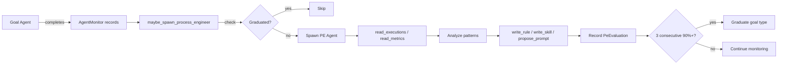

# Process Engineer Meta-Agent

> Task link: Process Engineer implementation (untracked — initiated directly by user)

## Overview

The Process Engineer (PE) is a post-hoc observer agent that spawns after goal agents complete, evaluates their execution efficiency, and creates rules, skills, and prompt improvements. It bootstraps during early system use and graduates out once processes stabilize.

## Architecture

### Post-hoc Observer Pattern

PE does NOT run concurrently with goal agents. Instead:

1. Goal agent completes → monitoring data persisted (already exists)
2. PE spawns with read access to execution records + tool call details
3. PE analyzes tool calls for redundancies, errors, and inefficiencies
4. PE outputs improvements via its tools (rules, skills, prompt proposals)
5. PE evaluation is recorded → graduation check runs

### Graduation

PE tracks per-goal-type efficiency scores:

- After **3 consecutive runs at 90%+ efficiency** (minimum 5 total evaluations), that goal type **graduates**
- Graduation is reversible — if efficiency drops below threshold on a new evaluation, graduation is revoked

### Safety Model

| Output Type | Auto-applied? | Risk |
|---|---|---|
| Rules (Markdown) | Yes — auto-loaded on next agent run | Low |
| Skills (TOML + prompt.md) | Yes — auto-loaded on next agent run | Low |
| Prompt improvements | **No** — proposed only, human must activate | Medium |

## Components

### 1. GraduationStore (`crates/symbiotic-agents/src/graduation.rs`)

```rust
pub struct PeEvaluation {
    pub eval_id: String,
    pub goal_type: String,
    pub observed_role: String,
    pub efficiency_score: f64,
    pub redundant_tool_calls: u32,
    pub avoidable_errors: u32,
    pub rules_created: u32,
    pub skills_created: u32,
    pub prompts_proposed: u32,
    pub evaluated_at: DateTime<Utc>,
}

pub struct GraduationConfig {
    pub min_efficiency_score: f64,  // 0.90
    pub required_consecutive: u32,  // 3
    pub min_evaluations: u32,       // 5
}

pub enum GraduationStatus {
    InsufficientData { total_evaluations: u32, required: u32 },
    NotConverged { consecutive_passing: u32, required: u32 },
    Graduated { since: DateTime<Utc> },
}

pub trait GraduationStore: Send + Sync {
    fn record_evaluation(&self, eval: &PeEvaluation) -> Result<(), MonitorError>;
    fn check_graduation(&self, goal_type: &str, config: &GraduationConfig) -> Result<GraduationStatus, MonitorError>;
    fn is_graduated(&self, goal_type: &str, config: &GraduationConfig) -> Result<bool, MonitorError>;
    fn evaluations_for_goal_type(&self, goal_type: &str) -> Result<Vec<PeEvaluation>, MonitorError>;
}
```

SQLite tables: `pe_evaluations` + `pe_graduations`.

### 2. Tool Call Persistence (`crates/symbiotic-agents/src/monitoring.rs`)

Add `tool_calls_json: Option<String>` to `agent_executions` table and `AgentExecution` struct. On `record_finish`, optionally accept serialized tool call records.

### 3. PE Tools (`crates/symbiotic-agents/src/pe_tools.rs`)

Five tools implementing `Tool` trait:

| Tool | Capability | Purpose |
|---|---|---|
| `read_executions` | archive.read | Query AgentMonitor for execution records + tool calls |
| `read_metrics` | archive.read | Query execution summary stats |
| `write_rule` | archive.write | Write Markdown rule to operations/ |
| `write_skill` | archive.write | Write TOML manifest + prompt to skills/ |
| `propose_prompt` | archive.write | Add PromptVersion to role (not activated) |

### 4. PE Role (`crates/symbiotic-agent-config/src/defaults.rs`)

- Trust level: `ArchiveWrite`
- Capabilities: `archive.read`, `archive.write`
- Max iterations: 8
- System prompt: analyze tool calls, score efficiency, output improvements

### 5. Daemon Integration (`services/symbiotic-daemon/`)

- `maybe_spawn_process_engineer()` in agents.rs
- Called from goals.rs after successful workflow/agent completion
- `GraduationStore` + `enable_process_engineer` config in lib.rs

## Data Flow



## Key Decisions

- **Post-hoc** over concurrent: simpler, no hot-path impact, all data already persisted
- **Graduation** prevents unbounded PE overhead as system matures
- **Prompt proposals never auto-activate**: humans review prompt changes before they take effect
- **Rules and skills auto-load**: low risk (Markdown/TOML), high impact, consistent with existing methodology loading

## Error Handling

- PE failures are non-fatal — logged but do not affect goal completion
- Graduation store errors degrade to "not graduated" (PE continues spawning)
- Tool call serialization failures degrade to `None` (PE works without detailed tool data)
