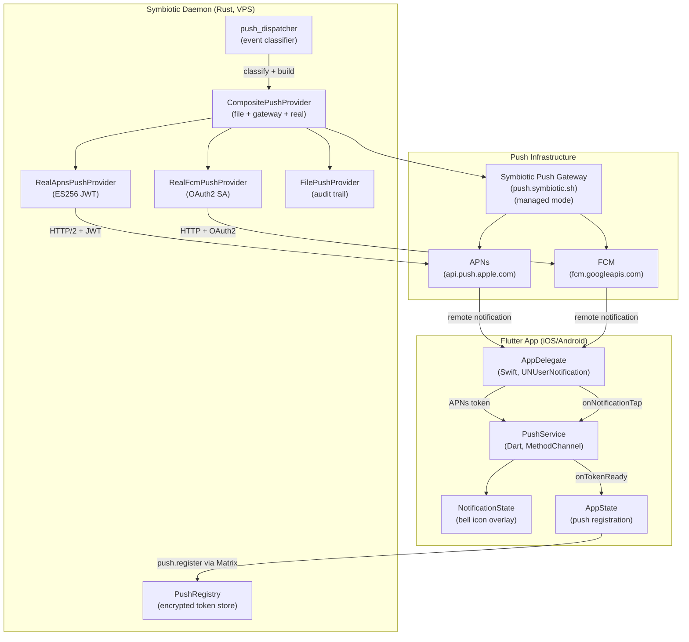
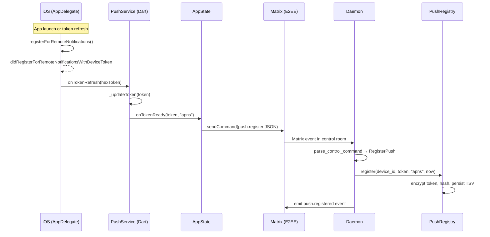
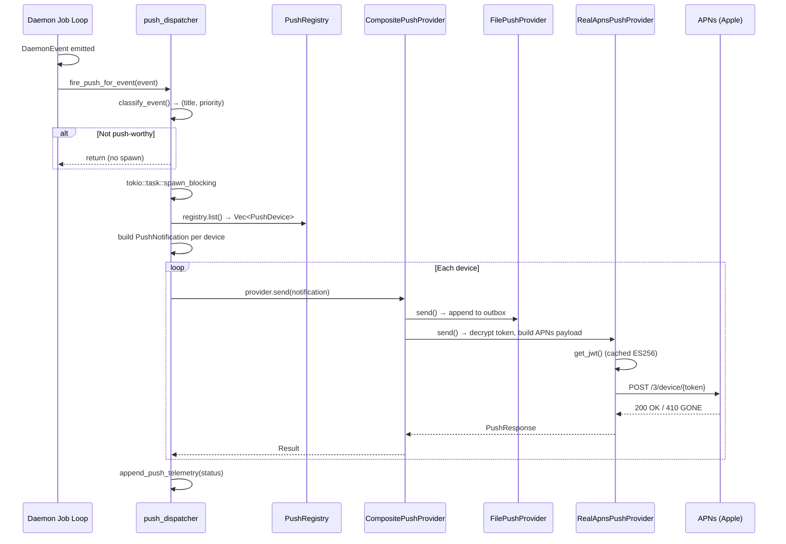

# Push Notifications

**Status**: Planned (Approved)
**Task**: [T87](../../tasks/TASKS.md) (Push Delivery to Devices)
**Related Tasks**: T94 (Wire Flutter Screens to Matrix), T91 (iOS Runner + Share Extension), T90 (Flutter Matrix SDK Integration)
**NEXT.md ref**: Priority 2 -- "Push Notifications (Mission Control UX Phase 5)"

**Related docs:**
- `docs/design/ux-specification.md` (Mission Control UX, notification overlay)
- `docs/architecture/matrix-channels.md` (event delivery via Matrix E2EE rooms)
- `submodules/runtime/services/symbiotic-daemon/CONTEXT.md` (daemon structure, push files)

## Overview

Push notifications complete the "always-on" loop for Symbiotic's Mission Control UX. When the Flutter app is backgrounded or closed, the daemon must deliver time-sensitive events (auth requests, goal failures, action completions) directly to the user's device via APNs (iOS) or FCM (Android). The system already has substantial infrastructure in place: the daemon has a `PushRegistry`, `PushProvider` trait, and provider implementations (file-based, HTTP gateway, real APNs/FCM); the `symbiotic-push` crate provides async `PushGateway` implementations with JWT auth, token storage, and dispatch fan-out; and the Flutter app has a `PushService` with platform channel integration and an `AppDelegate` wired for APNs. This design doc describes the remaining wiring and the end-to-end data flow that connects these existing pieces into a working system.

## Architecture



## 1. Device Token Registration

### Current State (Already Implemented)

The token registration path is fully wired end-to-end:

**iOS native (Swift)**:
- `AppDelegate.swift` registers as `UNUserNotificationCenterDelegate`
- `requestPushPermission()` calls `UNUserNotificationCenter.requestAuthorization()`
- On success, calls `UIApplication.shared.registerForRemoteNotifications()`
- `didRegisterForRemoteNotificationsWithDeviceToken` converts `Data` to hex string, sends to Flutter via `onTokenRefresh` method channel call

**Flutter (Dart)**:
- `PushService` on `sh.symbiotic.app/push` MethodChannel
- `_handleNativeCall('onTokenRefresh')` updates token, triggers `onTokenReady` callback
- `AppState._onPushTokenReady()` calls `registerPushToken()` which sends a `push.register` JSON command via Matrix control room
- `PushService.buildRegisterCommand()` builds the JSON payload: `{v: 1, command: "push.register", device_id, token, platform}`

**Daemon (Rust)**:
- `routing.rs` parses `push.register` from both text and JSON v1 formats
- `commands.rs` handles `ControlCommand::RegisterPush` by calling `PushRegistry::register()`
- `PushRegistry` encrypts the token via `TokenEncryptor` and persists to a TSV file with hardened permissions (0o600)

### Remaining Work

**Token refresh resilience**: The current flow re-registers on app connect (`_initPushIfGranted`). No additional work needed -- APNs token refresh is handled by `onTokenRefresh` callbacks from AppDelegate, which triggers `onTokenReady` and re-registration.

**Android**: The Flutter `PushService` already handles platform detection (`Platform.isIOS ? 'apns' : 'fcm'`). The Android native side needs a `FirebaseMessagingService` implementation (deferred to post-MVP Android support).

### Token Registration Sequence



## 2. Token Storage

### Current State (Already Implemented)

Two complementary token storage systems exist:

**Daemon-side (`push.rs` -- PushRegistry)**:
- File-based TSV storage at `data/push/tokens.tsv`
- 5-column format: `device_id \t token_hash \t encrypted_token \t platform \t last_seen`
- Token encryption via `credential-gateway::TokenEncryptor` (symmetric key at `data/push/token.key`)
- Hardened file permissions (0o600 file, 0o700 directory)
- In-memory `HashMap<String, PushDevice>` with atomic file writes (write-to-tmp, rename)
- Multi-device support: keyed by `device_id`

**Crate-level (`symbiotic-push::store` -- PushTokenStore)**:
- SQLite-backed storage with schema: `push_tokens(device_id, platform, token, user_id, registered_at, expires_at)`
- Upsert by `(device_id, platform)` composite primary key
- `prune_expired()` for automatic cleanup
- `remove_by_token_string()` for auto-pruning invalid tokens (410/GONE from APNs)
- Indexes on `user_id` and `expires_at`

### Architecture Decision: Daemon Uses PushRegistry (File-Based)

The daemon uses `PushRegistry` (file-based, encrypted) rather than `PushTokenStore` (SQLite) because:
1. The daemon is single-user -- no need for `user_id`-scoped queries
2. Encrypted tokens are a stronger security posture for a VPS-deployed daemon
3. The file format is simpler to inspect and debug
4. `PushTokenStore` is designed for the managed push gateway service (`push.symbiotic.sh`), which handles multi-tenant token storage

### Token Lifecycle

| Event | Action |
|-------|--------|
| App registers token | `PushRegistry::register()` -- upsert by device_id |
| APNs returns 410 (GONE) | Log warning, remove stale device from registry |
| Token refresh | Re-registration via `push.register` overwrites old token |
| Device unlinked | Future: `push.unregister` command (not yet implemented) |
| Daemon restart | Registry loaded from file on `PushRegistry::open()` |

### Remaining Work

- ~~**Token invalidation on 410**: `RealApnsPushProvider::send()` already detects `token_invalid: true` from `PushResponse`. Need to wire this to remove the device from `PushRegistry`. Currently the invalid token stays in the registry and fails on every subsequent push.~~ **Done** -- Both `RealApnsPushProvider` and `RealFcmPushProvider` now auto-remove devices via `PushRegistry::remove_by_token_hash()` when the provider reports `token_invalid: true`.
- ~~**`push.unregister` command**: Add a command to remove a device token when the user signs out or unlinks the device.~~ **Done** -- Already implemented (both text and JSON v1 command formats).
- ~~**Stale token pruning**: Add a periodic sweep (e.g., daily) to remove devices with `last_seen` older than 90 days.~~ **Done** -- `PushRegistry::prune_stale(now, max_age_secs)` added. Config field `push_stale_device_days` (default: 90). Periodic invocation should be wired into the daemon's main loop timer (see Phase 2).

## 3. Push-Worthy Event Classification

### Current State (Already Implemented)

Two parallel classification systems exist:

**Daemon-side (`push_dispatcher.rs` -- `classify_event`)**:
Operates on `DaemonEvent` values from the job execution loop:

| Event Type + Status | Title | Priority |
|---------------------|-------|----------|
| `ingest.fetch` + `dlq` | "Ingest failed (DLQ)" | high |
| `ingest.fetch` + `completed` | "Entry captured" | high |
| `archive.review` + `dlq` | "Review failed (DLQ)" | high |
| `auth.issue` + `failed`/`dlq` | "Auth issue failed" | critical |
| `workflow.run` + `completed` | "Workflow completed" | high |
| `workflow.run` + `dlq` | "Workflow failed (DLQ)" | high |
| `install.*` + `completed`/`dlq` | Install progress | high/critical |
| `job.unknown` | "Unknown job type" | high |
| `ingest.fetch` + `retry` | (suppressed) | -- |
| Everything else | (suppressed) | -- |

**Daemon-side (`push.rs` -- `push_priority_for_event`)**:
Operates on `MatrixEventEnvelope` values from Matrix event routing:

| Event Type | Priority |
|------------|----------|
| `auth.required` | Critical |
| `auth.failed` | High |
| `alert.received` / `alert.escalation` | High |
| `goal.failed` / `task.failed` / `intake.failed` / `review.failed` | High |
| `command.rejected` | High |
| `push.*` | (suppressed -- prevents loops) |
| Everything else | (suppressed) |

**Flutter-side (`event_router.dart` -- `_shouldNotify`)**:
Determines which events generate in-app notifications (bell icon overlay):

| Condition | Notifies |
|-----------|----------|
| `auth.required` / `alert.escalation` | Yes (critical) |
| `status == 'failed'` / `status == 'blocked'` | Yes (high) |
| `intake.completed` / `goal.completed` / `archive.review.completed` | Yes (normal) |
| `alert.*` | Yes |
| Everything else | No |

### Design: Unified Classification

The two daemon-side classifiers (`push_dispatcher::classify_event` and `push::push_priority_for_event`) serve different code paths but should agree on classification policy. The `push_dispatcher` is the primary path used by `fire_push_for_event()` which is called from the daemon's job execution loop.

**Events that MUST push (user needs to act or know)**:

| Category | Event Types | Priority | Rationale |
|----------|------------|----------|-----------|
| Auth required | `auth.required`, `auth.issue failed` | Critical | User must provide 2FA code |
| Failures (DLQ) | `*.dlq`, `*.failed` | High | Something broke, user may need to intervene |
| Goal completion | `workflow.run completed` | High | User wants to see progress |
| Entry captured | `ingest.fetch completed` | High | Feedback on captures (configurable) |
| Install progress | `install.* completed/dlq` | High/Critical | User is waiting on provisioning |
| Alert escalation | `alert.escalation` | Critical | Escalated from other rooms |

**Events that MUST NOT push**:

| Category | Event Types | Rationale |
|----------|------------|-----------|
| Transient retries | `*.retry` | Wait for final outcome |
| Routine status | `status.snapshot` | Background polling |
| Push events | `push.*` | Prevent feedback loops |
| Agent progress | `agent.progress`, `task.progress` | Too noisy |
| Intake started | `intake.started` | Not actionable yet |

### Remaining Work: User Notification Preferences

Add a `push.preferences` command and corresponding daemon config:

```rust
/// User-configurable push notification preferences.
///
/// Stored in `data/push/preferences.toml` alongside the token registry.
/// Defaults to all categories enabled.
#[derive(Debug, Clone, Serialize, Deserialize)]
pub(crate) struct PushPreferences {
    /// Push for auth-required events (always on, cannot be disabled).
    pub auth_required: bool,          // default: true, NOT user-overridable
    /// Push for failure/DLQ events.
    pub failures: bool,               // default: true
    /// Push for goal/workflow completions.
    pub goal_completions: bool,       // default: true
    /// Push for entry capture confirmations.
    pub capture_confirmations: bool,  // default: true
    /// Push for install lifecycle events.
    pub install_progress: bool,       // default: true
    /// Push for alert escalations (always on, cannot be disabled).
    pub alert_escalations: bool,      // default: true, NOT user-overridable
}

impl Default for PushPreferences {
    fn default() -> Self {
        Self {
            auth_required: true,
            failures: true,
            goal_completions: true,
            capture_confirmations: true,
            install_progress: true,
            alert_escalations: true,
        }
    }
}
```

```dart
/// Flutter-side mirror of push notification preferences.
/// Persisted to SharedPreferences and synced to daemon via Matrix command.
class PushPreferences {
  bool failures;
  bool goalCompletions;
  bool captureConfirmations;
  bool installProgress;

  PushPreferences({
    this.failures = true,
    this.goalCompletions = true,
    this.captureConfirmations = true,
    this.installProgress = true,
  });

  Map<String, dynamic> toJson() => {
    'failures': failures,
    'goal_completions': goalCompletions,
    'capture_confirmations': captureConfirmations,
    'install_progress': installProgress,
  };

  /// Build the Matrix command to sync preferences to the daemon.
  String buildSyncCommand() => jsonEncode({
    'v': 1,
    'command': 'push.preferences',
    ...toJson(),
  });
}
```

## 4. Push Delivery Path

### Current State (Already Implemented)

The delivery infrastructure is fully built across two layers:

**Daemon `push.rs` -- Composite Provider Architecture**:
`build_push_provider()` constructs a `CompositePushProvider` that fans out to all configured providers:

1. **`FilePushProvider`** (always enabled) -- Appends JSON to `data/push/outbox.ndjson` as an audit trail
2. **`HttpPushProvider`** (if `push_gateway_url` set) -- Generic HTTP POST to any gateway
3. **`ApnsGatewayPushProvider`** (if `push_apns_gateway_url` set) -- Curl-based APNs proxy
4. **`FcmGatewayPushProvider`** (if `push_fcm_gateway_url` set) -- Curl-based FCM proxy
5. **`RealApnsPushProvider`** (if APNs credentials set) -- Direct APNs via ES256 JWT (HTTP/2)
6. **`RealFcmPushProvider`** (if FCM credentials set) -- Direct FCM via OAuth2 service account

**`symbiotic-push` crate -- Real Gateway Implementations**:
- `ApnsGateway`: HTTP/2 to `api.push.apple.com`, ES256 JWT auth, token caching (50-min refresh)
- `FcmGateway`: HTTP to `fcm.googleapis.com/v1`, RS256 JWT -> OAuth2 token exchange, caching
- `NotificationDispatcher`: Fan-out to user devices, retry with backoff, auto-prune invalid tokens

**`push_client.rs` -- Managed Mode Gateway Client**:
- `PushGatewayClient`: HTTP client for `push.symbiotic.sh/v1/notify`
- Sends metadata-only payloads (category, priority, badge) -- never message content
- Authenticated via Bearer daemon token (same as relay tunnel)

### Delivery Flow



### APNs Payload Format

The `ApnsGateway` constructs the standard APNs payload:

```json
{
  "aps": {
    "alert": {
      "title": "Auth required",
      "body": "Awaiting 2FA for Binance login"
    },
    "badge": 3,
    "sound": "default"
  },
  "category": "approval_request",
  "event_type": "auth.required",
  "event_status": "pending",
  "rid": "run-uuid-1234"
}
```

Custom data keys (`event_type`, `event_status`, `rid`, `category`) are placed at the top level of the JSON (outside `aps`) per Apple's custom payload guidelines. The Flutter side receives these in `userInfo` when the notification is tapped.

### Remaining Work

- ~~**Badge count management**: The daemon does not currently track badge counts. Add a `badge_count` field to `PushRegistry` (per-device), incremented on each push and reset on `push.ack`. Pass the count to the notification payload.~~ **Done** -- `PushRegistry` has `increment_badge()`, `reset_badge()`, `badge_count()`. Badge is passed in every `PushNotification`. Reset via `push.ack` command with `device_id`.
- ~~**Wire `fire_push_for_event` into the main loop**: The function exists but verify it is called at every event emission point (job completion, Matrix event routing, install lifecycle).~~ **Done** -- `dispatch_event_push_full()` is called from `SymbioticDaemon::run_once()` (job loop) and `maybe_emit_push_event()` (Matrix event routing).

## 5. Local Notification Handling (App Side)

### Current State (Already Implemented)

**iOS AppDelegate (Swift)**:
- `UNUserNotificationCenterDelegate` set on launch
- `willPresent` handler shows banner/badge/sound even when app is in foreground
- `didReceive` handler extracts `userInfo` payload, converts to `[String: String]`, sends to Flutter via `onNotificationTap` method channel

**PushService (Dart)**:
- `_handleNativeCall('onNotificationTap')` receives the payload map
- Invokes `AppState._onPushNotificationTap(payload)`
- `_onPushNotificationTap` creates an `AppNotification.fromPushPayload(payload)`, adds it to `NotificationState`, calls `handleTap()` which marks it read and determines the target tab

**NotificationState (Dart)**:
- `addFromPushPayload()` creates `AppNotification` from the push data
- `handleTap()` returns the tab index for navigation
- `tabIndexForScreen()` maps event type prefixes to tabs (vault, memory, goals, stream)

**AppNotification (Dart)**:
- `fromPushPayload()` factory extracts `event_type`, `title`, `body`, `rid`, `timestamp`
- `targetScreenFromEventType()` maps prefixes: `auth.* → vault`, `intake.*/ingest.*/archive.* → memory`, `workflow.*/goal.*/task.*/agent.* → goals`

### Deep Linking Matrix

| Event Type Prefix | Target Screen | Tab Index | Deep Link Target |
|-------------------|---------------|-----------|-----------------|
| `auth.*` | Vault | 3 | Credential request (by `rid`) |
| `intake.*` / `ingest.*` / `archive.*` | Memory | 1 | Entry detail (by `rid`) |
| `workflow.*` / `goal.*` / `task.*` / `agent.*` | Goals | 2 | Goal detail (by `rid`) |
| Everything else | Stream (Home) | 0 | Activity feed |

### Notification Grouping

The `PushNotification` type in `symbiotic-push` already supports `thread_id` for APNs notification grouping. Thread IDs should be set based on the event's `rid` (run ID) so that related notifications (e.g., all events for a single intake pipeline run) are grouped together in the iOS notification center.

```rust
// In push_dispatcher.rs build logic:
let thread_id = event.intake_run_id
    .as_deref()
    .or(event.goal_run_id.as_deref())
    .unwrap_or("symbiotic");
```

### Remaining Work

- **Set `thread_id`** on notifications in `push_dispatcher::dispatch_event_push()` so iOS groups related notifications.
- **Notification sound**: Configure `sound: "default"` for high/critical, no sound for normal priority.
- **Rich notifications (future)**: iOS Notification Service Extension for media attachments (post-MVP).

## 6. Security Considerations

### E2EE and Push Payloads

**Hard rule: Push notification payloads MUST NOT contain sensitive content.**

The system enforces this at multiple levels:

1. **Daemon `push_dispatcher.rs`**: The `build_body()` function constructs the notification body from event metadata (URL, title, status detail). It does NOT include the actual content of captured entries, credentials, or agent outputs.

2. **Push Gateway Client (`push_client.rs`)**: The managed-mode gateway payload contains only `category`, `priority`, and `badge` -- no message content fields exist in the `NotificationPayload` struct.

3. **`RealApnsPushProvider` / `RealFcmPushProvider`**: The bridge converts daemon notifications to crate notifications. The title and body are generic labels ("Auth required", "Entry captured"), not the actual content.

4. **APNs payload visibility**: Push notification content is visible to Apple's APNs infrastructure (not E2EE). Only the Matrix sync channel provides E2EE. The push notification is a **wake-up signal**, not a content delivery mechanism.

**What IS included in push payloads:**
- Generic title (e.g., "Auth required", "Entry captured")
- Status description (e.g., "Ingest completed for https://example.com")
- Event type and status (for client-side routing)
- Run ID (for deep linking, not sensitive)

**What is NEVER included:**
- Actual entry content (article text, summaries)
- Credentials, API keys, tokens
- Agent outputs or LLM responses
- Memory graph data
- User-identifiable information beyond what's in the URL

### Token Security

- **APNs device tokens** are not secrets (Apple's security model does not depend on token secrecy), but the daemon encrypts them at rest via `TokenEncryptor` as defense-in-depth.
- **Token hashing**: SHA-256 hash stored alongside the encrypted token for deduplication without decryption.
- **File permissions**: Registry file is 0o600, directory is 0o700.
- **Encryption key**: Stored at `data/push/token.key`, generated on first `PushRegistry::open()`.

### Rate Limiting

- **Daemon-side**: `push_dispatcher` only fires for classified events (roughly ~15 event types out of hundreds). Transient retries are suppressed.
- **Provider-side**: APNs and FCM both enforce rate limits. The `PushGateway` implementations handle 429 responses with `retry_after_secs`.
- **Future**: Add a per-device rate limiter (max N pushes per hour) in `dispatch_event_push()` to prevent notification spam during cascading failures.

```rust
/// Per-device rate limiter for push notifications.
/// Prevents notification spam during cascading failures.
pub(crate) struct PushRateLimiter {
    /// Maximum notifications per device per window.
    max_per_window: u32,
    /// Window duration in seconds.
    window_secs: u64,
    /// device_id -> (count, window_start)
    counters: HashMap<String, (u32, u64)>,
}

impl PushRateLimiter {
    pub(crate) fn new(max_per_window: u32, window_secs: u64) -> Self {
        Self {
            max_per_window,
            window_secs,
            counters: HashMap::new(),
        }
    }

    /// Returns true if the device is under its rate limit.
    pub(crate) fn check_and_increment(&mut self, device_id: &str, now: u64) -> bool {
        let entry = self.counters.entry(device_id.to_string()).or_insert((0, now));
        if now - entry.1 >= self.window_secs {
            // Window expired, reset.
            *entry = (1, now);
            true
        } else if entry.0 < self.max_per_window {
            entry.0 += 1;
            true
        } else {
            false // Rate limited
        }
    }
}
```

## 7. Configuration Schema

### Daemon Config (Already Implemented)

The following fields exist on `DaemonConfig`:

```rust
// File paths
pub push_registry_file: PathBuf,        // default: data/push/tokens.tsv
pub push_token_key_file: PathBuf,       // default: data/push/token.key
pub push_outbox_file: PathBuf,          // default: data/push/outbox.ndjson
pub push_ack_file: PathBuf,             // default: data/push/acks.ndjson
pub push_telemetry_file: PathBuf,       // default: data/push/delivery.log

// Curl-based HTTP gateway (legacy)
pub push_gateway_url: Option<String>,
pub push_gateway_api_key: Option<String>,
pub push_apns_gateway_url: Option<String>,
pub push_apns_gateway_api_key: Option<String>,
pub push_fcm_gateway_url: Option<String>,
pub push_fcm_gateway_api_key: Option<String>,

// Real APNs (direct, ES256 JWT)
pub push_apns_team_id: Option<String>,
pub push_apns_key_id: Option<String>,
pub push_apns_private_key_pem: Option<String>,
pub push_apns_sandbox: bool,            // default: false

// Real FCM (direct, OAuth2 service account)
pub push_fcm_project_id: Option<String>,
pub push_fcm_service_account_email: Option<String>,
pub push_fcm_private_key_pem: Option<String>,
```

### Environment Variables

| Variable | Required | Default | Purpose |
|----------|----------|---------|---------|
| `SYMBIOTIC_PUSH_GATEWAY_URL` | No | (disabled) | Managed-mode push gateway URL |
| `SYMBIOTIC_RELAY_DAEMON_TOKEN` | With gateway | -- | Bearer token for gateway auth |
| `PUSH_APNS_TEAM_ID` | For real APNs | -- | Apple Developer Team ID |
| `PUSH_APNS_KEY_ID` | For real APNs | -- | APNs Auth Key ID |
| `PUSH_APNS_PRIVATE_KEY_PEM` | For real APNs | -- | ES256 private key (.p8 content) |
| `PUSH_APNS_SANDBOX` | No | `false` | Use APNs sandbox environment |
| `PUSH_FCM_PROJECT_ID` | For real FCM | -- | Firebase project ID |
| `PUSH_FCM_SERVICE_ACCOUNT_EMAIL` | For real FCM | -- | Service account email |
| `PUSH_FCM_PRIVATE_KEY_PEM` | For real FCM | -- | RSA private key (from SA JSON) |

### New Config Fields (To Be Added)

```rust
// Push preferences file path
pub push_preferences_file: PathBuf,     // default: data/push/preferences.toml

// Rate limiting
pub push_rate_limit_per_hour: u32,      // default: 30
pub push_stale_device_days: u64,        // default: 90
```

## 8. Deployment Modes

### BYOS (Bring Your Own Server) -- Direct APNs/FCM

The user provides their own APNs credentials (Apple Developer account) and/or FCM credentials (Google Cloud service account). The daemon connects directly to APNs/FCM.

**Pros**: No dependency on Symbiotic infrastructure. Full control.
**Cons**: User must configure Apple Developer and/or Firebase accounts.

### Managed Mode -- Symbiotic Push Gateway

The daemon sends metadata-only push requests to `push.symbiotic.sh/v1/notify`. The gateway holds the APNs/FCM credentials and dispatches on behalf of all managed daemons.

**Pros**: Zero push configuration for the user. Works out of the box.
**Cons**: Depends on Symbiotic infrastructure. Gateway sees device tokens (encrypted).

**Security**: The gateway never receives message content. The payload contains only `category`, `priority`, and `badge`. Device tokens are encrypted by the daemon and decrypted by the gateway using a shared key established during relay provisioning.

### Hybrid

Both modes can be active simultaneously via the `CompositePushProvider`. The `FilePushProvider` always runs as an audit trail regardless of which delivery providers are configured.

## 9. Implementation Plan

### Phase 1: Wire Existing Infrastructure (MVP)

**Goal**: Deliver push notifications for auth-required and failure events on iOS.

1. **Verify `fire_push_for_event` is called at all event emission points** in `main.rs` and `commands.rs`. Currently it is wired in `dispatch_push_for_event()` on `SymbioticDaemon` -- confirm it is invoked from the job loop and Matrix event handlers.

2. **Add `thread_id` to push notifications** in `push_dispatcher.rs` for iOS notification grouping by `rid`.

3. **Add badge count tracking**: Increment a per-device counter in `PushRegistry` on each push. Reset to 0 when `push.ack` is received. Pass count in notification payload.

4. **Test end-to-end on iOS Simulator**:
   - Note: APNs does not work on the iOS Simulator. Use a physical device for push testing.
   - Alternatively, test the full path up to `FilePushProvider` output verification (daemon writes to `outbox.ndjson`).
   - Use `RealApnsPushProvider` with sandbox credentials on a physical device.

5. **Add `push.unregister` command** to remove device tokens on signout.

### Phase 2: Preferences and Rate Limiting

1. **Implement `PushPreferences`** with TOML persistence.
2. **Add `push.preferences` command** for Flutter to sync preferences.
3. **Implement `PushRateLimiter`** (max 30 pushes/device/hour default).
4. **Add stale device pruning** (remove devices with `last_seen > 90 days`).
5. **Add preferences UI** in Flutter Settings screen.

### Phase 3: Managed Mode Gateway

1. **Deploy push gateway service** at `push.symbiotic.sh`.
2. **Wire `PushGatewayClient`** into the daemon's composite provider.
3. **Token encryption key exchange** during relay provisioning.

### Phase 4: Android Support (Post-MVP)

1. **Android native `FirebaseMessagingService`** in Kotlin.
2. **FCM token delivery** to Flutter via method channel.
3. **Test FCM delivery** with `RealFcmPushProvider`.

## 10. Test Plan

### Unit Tests (Rust)

| Test | File | Description |
|------|------|-------------|
| `classify_event_*` | `push_dispatcher.rs` | All event type + status combinations |
| `build_body_*` | `push_dispatcher.rs` | Body construction with/without URL/title |
| `dispatch_*` | `push_dispatcher.rs` | Send to 0, 1, N devices; failures; telemetry |
| `push_priority_for_event_*` | `push.rs` | Matrix envelope classification |
| `push_title_for_event_*` | `push.rs` | Title generation per event type |
| `registry_*` | `push.rs` | Register, list, persist, load, decrypt |
| `rate_limiter_*` | `push_dispatcher.rs` | Window expiry, increment, limit enforcement |
| `preferences_*` | `push.rs` | Load, save, default, merge with classify |

### Unit Tests (Dart)

| Test | File | Description |
|------|------|-------------|
| `notification_from_push_payload` | `app_notification_test.dart` | Factory construction from payload map |
| `target_screen_routing` | `app_notification_test.dart` | Event type -> screen mapping |
| `push_service_build_command` | `push_service_test.dart` | JSON command construction |
| `notification_state_from_push` | `notification_state_test.dart` | `addFromPushPayload` + `handleTap` |
| `push_preferences_serialization` | `push_preferences_test.dart` | JSON round-trip |

### Integration Tests

| Test | Description |
|------|-------------|
| Token registration round-trip | App sends `push.register`, verify `PushRegistry` contains the device |
| Push delivery for DLQ event | Emit `ingest.fetch dlq`, verify `FilePushProvider` outbox contains notification |
| Push suppression for retry | Emit `ingest.fetch retry`, verify outbox is empty |
| Badge count increment | Register device, send 3 pushes, verify badge count = 3 |
| Badge count reset on ack | Send `push.ack`, verify badge count = 0 |
| Preferences filter | Disable `capture_confirmations`, emit `ingest.fetch completed`, verify no push |
| Rate limiter | Send 31 pushes in 1 hour window, verify 31st is suppressed |

### Manual Tests (Physical Device)

| Test | Description |
|------|-------------|
| APNs sandbox delivery | Configure sandbox credentials, send push, verify banner on device |
| Notification tap deep link | Tap notification, verify app opens to correct screen |
| Background delivery | Kill app, send push, verify notification appears |
| Permission request flow | Fresh install, verify permission dialog, verify token registration |
| Token refresh | Force token refresh, verify re-registration with daemon |

## Key Decisions

1. **No content in push payloads**: Push notifications are wake-up signals with generic titles. Actual content is delivered via Matrix E2EE sync when the app opens.
2. **Daemon-side classification**: The daemon decides what is push-worthy, not the app. The app cannot filter pushes after they are delivered.
3. **File provider as audit trail**: `FilePushProvider` always runs, providing a local audit trail of all push attempts regardless of delivery provider configuration.
4. **Encrypted token storage**: Device tokens are encrypted at rest even though they are not secrets per APNs security model. Defense-in-depth.
5. **Two classification paths**: `push_dispatcher` for job loop events, `push_priority_for_event` for Matrix envelope events. Both should agree on policy.
6. **MVP = iOS APNs only**: Android FCM support is deferred to Phase 4.
7. **Preferences are daemon-side**: The daemon enforces notification preferences, not the app. The app syncs preferences via Matrix command.
8. **Thread grouping by run ID**: Related notifications (same `rid`) are grouped in the iOS notification center.

## Error Handling

| Error | Handling |
|-------|----------|
| APNs 410 (token invalid) | Remove device from registry, log warning |
| APNs 429 (rate limited) | Retry with `retry_after_secs` (max 3 attempts, exponential backoff) |
| APNs 403 (JWT invalid) | Invalidate JWT cache, retry with fresh token |
| FCM 401 (token expired) | Invalidate OAuth2 cache, retry |
| FCM 404 (token not found) | Remove device from registry |
| Network failure | Retry with exponential backoff (200ms, 400ms, 800ms) |
| Push registry lock poisoned | Return error, log critical warning |
| No devices registered | Return 0 (no-op), no error |
| Push permission denied | Persist status, show settings prompt in UI |
| Method channel not available | Graceful degradation (simulator, tests) |
