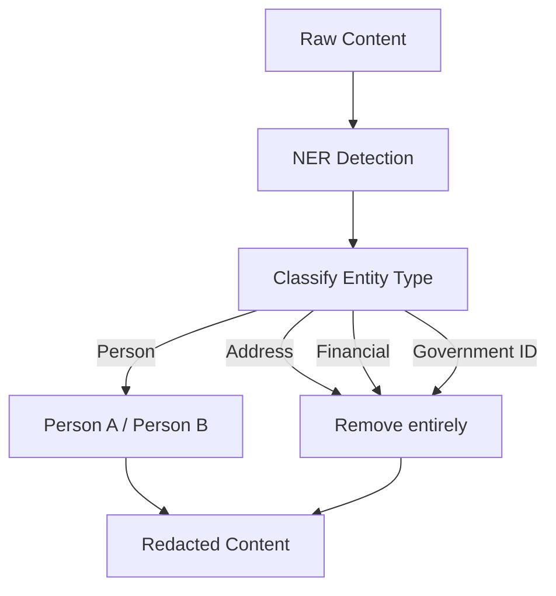

# Redaction Policy (Design)

## Overview

This document describes planned enhancements to the redaction system beyond the current keyword heuristics. These features will add NER-based PII detection, entity masking with typed placeholders, and summarization of private notes.

**Current implementation**: see `docs/architecture/redaction-policy.md` for the keyword-heuristic system that is in production.

**Status**: Planned (Approved)
**Task**: T67 (Privacy & Security Layer)
**Depends on**: —

## Planned: Full PII Detection (NER-Based)

The current keyword heuristics catch emails, phone numbers, and a handful of sensitive keywords. A full PII detection layer will use Named Entity Recognition to detect:

- **Addresses**: street addresses, zip codes, city/state/country
- **Government IDs**: SSN patterns, passport numbers, driver's license numbers
- **Financial data**: credit card numbers (with Luhn validation), bank account numbers
- **Names**: person names detected via NER model

### NER Model Choice

| Option | Trade-off |
|--------|-----------|
| Local NER model (e.g., spaCy or candle-based) | No data leaves device; higher resource usage |
| Rule-based regex suite | Low resource usage; lower recall for names/addresses |
| Hybrid (regex + local NER) | Best coverage; moderate resource usage |

**MVP decision: Rule-based (regex patterns) only.** NER model upgrade is deferred to post-MVP.

**Rationale:**
- Regex patterns cover the highest-risk structured PII (SSN, credit cards, phone numbers, emails) with high precision
- NER models add complexity, binary size, and startup latency
- False positives from NER on short text fragments degrade user experience
- Upgrade path: add a local `candle`-based NER model later for name/address detection

### PII Detection Rules (MVP)

| Category | Pattern | Action | Priority |
|----------|---------|--------|----------|
| **Email** | `[a-zA-Z0-9._%+-]+@[a-zA-Z0-9.-]+\.[a-zA-Z]{2,}` | Replace with `[redacted-email]` | High |
| **Phone (US)** | `(\+?1[-.\s]?)?\(?\d{3}\)?[-.\s]?\d{3}[-.\s]?\d{4}` | Replace with `[redacted-phone]` | High |
| **Phone (intl)** | `\+\d{1,3}[-.\s]?\d{4,14}` | Replace with `[redacted-phone]` | High |
| **SSN** | `\b\d{3}-\d{2}-\d{4}\b` | Remove entirely | Critical |
| **Credit Card** | `\b\d{4}[-\s]?\d{4}[-\s]?\d{4}[-\s]?\d{4}\b` (+ Luhn check) | Remove entirely | Critical |
| **IPv4 Address** | `\b\d{1,3}\.\d{1,3}\.\d{1,3}\.\d{1,3}\b` (non-public only) | Replace with `[redacted-ip]` | Medium |
| **US Address** | `\b\d{1,5}\s[\w\s]+(?:St|Ave|Blvd|Dr|Ln|Rd|Way|Ct)\b` | Remove entirely | High |
| **US Zip Code** | `\b\d{5}(-\d{4})?\b` (with address context) | Remove entirely | Medium |
| **API Key pattern** | `(?:api[_-]?key|token|secret)[=:]\s*["']?[\w-]{20,}` | Replace with `[redacted-key]` | Critical |
| **Sensitive keyword** | Configurable list in `policies/redaction-policy.json` | Replace with `[redacted-sensitive]` | Medium |

### Post-MVP: NER Upgrade Path

When NER is added, it will handle:
- **Person names**: Detected via local NER model, masked as `Person A`, `Person B`
- **Organization names**: Context-dependent (only redact when co-occurring with PII)
- **Addresses**: Full street addresses that regex patterns miss

## Planned: Entity Masking

Replace detected entities with typed, consistent placeholders:

**Input:**
"John Doe (john@example.com) prefers Stripe for billing. Address: 123 Main St."

**Masked output:**
"Person A prefers Stripe for billing."

### Masking Rules

- Entities of the same type get sequential labels: `Person A`, `Person B`.
- Addresses, government IDs, and financial data are removed entirely (not masked).

### Multi-Turn Masking Consistency

Within a session (multi-turn conversation), the same entity must map to the same pseudonym. This prevents information leakage through inconsistent masking and avoids confusing the LLM.

**Approach:** Hash-based pseudonymization with session-scoped mapping.

```rust
use std::collections::HashMap;
use sha2::{Sha256, Digest};

pub struct SessionMaskMap {
    /// Session-unique salt (generated at session start, never stored)
    salt: [u8; 32],

    /// entity_hash -> pseudonym (e.g., "Person A")
    map: HashMap<String, String>,

    /// Counter per entity type for sequential labels
    counters: HashMap<EntityType, u32>,
}

impl SessionMaskMap {
    pub fn new() -> Self {
        Self {
            salt: generate_random_salt(),
            map: HashMap::new(),
            counters: HashMap::new(),
        }
    }

    /// Get or create a pseudonym for an entity
    pub fn pseudonym(&mut self, entity: &str, entity_type: EntityType) -> String {
        let hash = self.hash_entity(entity);
        if let Some(existing) = self.map.get(&hash) {
            return existing.clone();
        }

        let counter = self.counters.entry(entity_type).or_insert(0);
        *counter += 1;
        let label = format!("{} {}", entity_type.label(), index_to_letter(*counter));
        self.map.insert(hash, label.clone());
        label
    }

    fn hash_entity(&self, entity: &str) -> String {
        let mut hasher = Sha256::new();
        hasher.update(&self.salt);
        hasher.update(entity.as_bytes());
        hex::encode(hasher.finalize())
    }
}
```

**Key properties:**
- Same entity -> same pseudonym within a session (deterministic via salted hash)
- Different sessions -> different pseudonyms (different salt)
- Salt is ephemeral: generated per session, never persisted
- Mapping is in-memory only, dropped when session ends
- If session is lost (crash), new session starts with fresh mapping (acceptable trade-off)

### Data Flow



## Planned: Private Note Summarization

For entries marked as `Private` sensitivity, instead of dropping them entirely for cloud models, generate a short non-PII summary that preserves topical relevance without leaking details.

### Requirements

- Summary is generated by a local model (never cloud).
- Summary must not contain any detected PII.
- Summary is cached alongside the entry for reuse.
- If local model is unavailable, fall back to omitting the entry entirely.

### Example

**Private note:**
"Meeting with John about Q3 revenue targets. He wants $2M ARR by September. His concern is the enterprise pipeline in APAC."

**Summary:**
"Discussion about quarterly revenue targets and regional enterprise pipeline."

## Key Decisions

1. **NER runs locally only**: PII detection must never send content to cloud models.
2. **Entity masking is per-request**: no persistent entity mapping across requests.
3. **Summarization requires local model**: if no local model is available, private content is omitted rather than summarized.
4. **Graduated rollout**: keyword heuristics remain as the baseline; NER and summarization layer on top.

## Error Handling

| Error | Handling |
|-------|----------|
| NER model unavailable | Fall back to keyword heuristics |
| PII detector error | Fail closed: omit private content and alert user |
| Summarization model unavailable | Omit private entry entirely |
| Entity masking produces inconsistent labels | Re-run masking pass; if repeated failure, omit entry |

## Related Docs

- `docs/architecture/redaction-policy.md` (current implementation)
- `docs/architecture/context-delivery.md`
