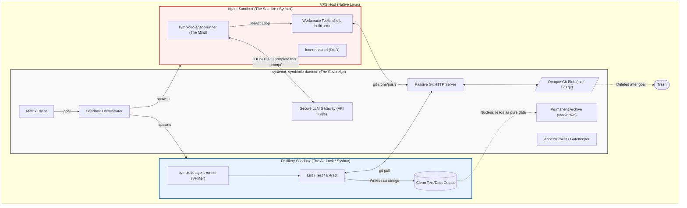

# Architecture Transition Plan: The Nuclear Orchestrator & Sysbox Execution Plane

**Status**: Phase 1 & 2 Completed (Verified, with caveats — see banner above)
**Epic**: Secure Agent Execution (T103 / T112 Prerequisite)

This document specs the transition from the current monolithic agent execution model to the **Nuclear Orchestrator Architecture**. It separates the "Sovereign Brain" (Nucleus) from the "Untrusted Hand" (Agent Sandbox) to ensure that LLM-generated code and actions can never compromise the host system or the user's master credentials.

---

## 1. The Core Problem (Why We Are Changing)

Currently, the ReAct loop and all agent tools execute *inside* the `symbiotic-daemon` process. This creates three critical vulnerabilities:
1.  **Host Compromise:** LLM-generated shell commands (`rm -rf /`) or malicious dependencies (`npm install`) have the same OS permissions as the Daemon.
2.  **Credential Theft:** An agent running in the same process as the Daemon can theoretically read the Vault's master keys or memory.
3.  **Poisoned Artifacts:** Parsing an agent's Git repository or executing its generated binaries on the host can trigger vulnerabilities in Git or the OS kernel.

We must build a physical Linux boundary (Sysbox) between the Nucleus and the Agent's reasoning loop.

---

## 2. The Target Architecture: The "Nuclear" Model

The Nucleus (Daemon) is stripped of its "Intelligence" and becomes a strictly imperative **Control Plane**.

### The Three Security Invariants (Hard Rules)
1.  **Separation of Mind and Secrets:** The **Mind** (LLM ReAct loop) runs inside the **Sandbox**. The **Secrets** (API Keys, Vault) stay in the **Nucleus**. The sandbox has NO access to the internet/cloud directly; it must request LLM completions from the Nucleus over a Unix socket.
2.  **Air-Gapped Git Collaboration:** Agents collaborate via an internal Git server hosted by the Nucleus. The Nucleus treats these repos as **opaque blobs**. It never runs `git log`, `git checkout`, or parses Git metadata on the host. 
    *   *Persistent Hosting*: While typically ephemeral, the Nucleus can configure a Swarm Repo with an external Git origin (e.g., a private GitHub repo). The agents push to the internal server, and the Nucleus safely mirrors those blobs to the external remote, allowing the "Company" to contribute directly to your real-world software projects.
3.  **No Binary Execution:** The Nucleus **NEVER** executes binaries generated by an agent. Only raw text/data (Markdown, source strings) is extracted via the **Distillery Sandbox** and moved to the permanent Archive.

---

## 3. Component Reshuffling & Logic Split

| Component | Location | Role |
| :--- | :--- | :--- |
| **Nucleus (Daemon)** | **Host (systemd)** | Sovereign Orchestrator. Manages Matrix, Vault, and Sandboxes. Acts as an LLM Gateway (holding API keys) and a Passive Git Server. |
| **Satellite (Agent Runner)** | **Sandbox (Sysbox)** | The Intelligence. Runs the ReAct loop and all local tools (`shell_exec`, `file_read`, etc.). |
| **Reconciler** | **Host (systemd)** | Periodically diffs Markdown manifests vs. reality to trigger goals/tasks. |
| **Distillery** | **Sandbox (Sysbox)** | A short-lived "Air-Lock" that clones agent repos, verifies code, and extracts clean artifacts for the Archive. |

---

## 4. The Nuclear Protocol (JSON-RPC)

Communication between the Nucleus and Satellites uses a **Network Agnostic JSON-RPC 2.0 Protocol**. 

### 4.1. The "Remote Tool" Security Pattern
To prevent agents from ever seeing API keys or master credentials, we use a **Proxy-Enrichment** pattern:

1.  **The Request**: The Satellite (Runner) wants to use a tool that requires a secret (e.g., `google_search`). It sends a `tool.execute` request to the Nucleus via the RPC bridge:
    `{ "method": "tool.execute", "params": { "name": "google_search", "params": { "query": "Symbiotic AI" } } }`
2.  **The Enrichment**: The Nucleus (which has the `GOOGLE_API_KEY` in its secure memory) intercepts the call. It attaches the secret parameters locally.
3.  **The Execution**: The Nucleus executes the real API call from its hardened environment.
4.  **The Result**: The Nucleus returns only the *result* (e.g., search snippets) back to the Satellite.
5.  **Security Invariant**: The secret **never enters the sandbox** and never exists in the Satellite's memory space.

### 4.2. Browser Handoff (Session Injection)
For interactive tasks (X, Matrix, etc.), we use **Session Redaction**:
*   The Nucleus performs the raw login (User/Pass) locally using its `AuthEngine`.
*   The resulting **Session Profile** (Cookies/LocalStorage) is injected into the Sandbox's browser.
*   The Agent can "act as the user" because it has the session, but it **never sees the user's password**.

### 4.3. Capability-Gated Satellite access
Every RPC call from a Satellite must be accompanied by an implicit or explicit **Capability Token**. The Nucleus (as the Sovereign) checks:
*   Does this Satellite have permission to use the `Recall` tool?
*   Does it have the `ArchiveWrite` trust level?
*   If denied, the Nucleus returns an RPC error. The Satellite cannot bypass this because it is physically isolated.

### 4.4. Hardware Agnosticism
Because the protocol is JSON-RPC over a generic stream:
*   **Current (Verified)**: Uses Unix Domain Sockets for same-machine isolation.
*   **Future**: Can use TCP (with mTLS) to run the **Nucleus on home hardware** (Pi/Server) and the **Satellite in the Cloud** (GPU Cluster).

---

## 5. Recovery & Resilience (The "Stateless" Nucleus)

The Nucleus is designed to be disposable. Because the **Declarative Model** stores the "Truth" in Markdown files (`knowledge-base/`) and the **Collaboration State** in Git repos (`/var/symbiotic/swarms/`), the system survives unrecoverable Nucleus crashes.

1.  **Cold Boot Recovery:** If the Nucleus binary/process is lost, a fresh install reads the Archive manifests and "re-discovers" every active goal and phase.
2.  **Sandbox Re-attachment:** On startup, the Nucleus queries Docker for managed sandboxes. It re-establishes RPC bridges or reaps "orphaned" sandboxes, resuming from the last Git commit in the swarm.
3.  **Zero-Loss Restoration:** As long as the Archive (Markdown) and Vault (SQLite) are backed up (via "Sovereign Sync"), the entire Symbiotic "Soul" can be restored to a brand-new VPS in minutes.

---

## 6. Bring Your Own Agent (BYOA) & Third-Party Integration

A massive, often-overlooked advantage of the Sysbox Execution Plane is that it provides a **true, native Linux environment**. 

Because the Sandbox is just a secure Ubuntu container with Docker-in-Docker, Git, and full shell access, you are not locked into using the `symbiotic-agent-runner`. The Nucleus can orchestrate **third-party CLI agents** (like Claude Code, Aider, or OpenDevin) natively, without any harnesses or complex API wrappers.

---

## 7. Visual Execution: Browser Automation & Desktop Environments

Because Sysbox mimics a full Virtual Machine (while sharing the host kernel), it natively supports display servers and graphics significantly better than standard Docker. This unlocks **T79 (Browser Automation)** and **Visual Testing** directly within the Company Model.

---

## 8. Implementation Path

### Phase 1: The Native Nucleus & LLM Gateway — ✅ COMPLETED
*   Migrate `symbiotic-daemon` to a hardened `systemd` service.
*   Implement the `LlmGateway` in the Nucleus: it holds the Vault API keys and exposes a Unix Socket for "Insecure Prompt Completion" requests.

### Phase 2: The `symbiotic-agent-runner` & Sysbox Integration — PARTIAL
*   Sysbox `bollard` integration in `symbiotic-vm` — ✅ landed.
*   Standalone runner binary — ❌ only `services/symbiotic-archeology-runner` ships today; a general `symbiotic-agent-runner` with the full ReAct loop pulled out of `symbiotic-agents` is not yet a separate service. Production paths still execute the ReAct loop inside the daemon process (`LlmGateway` in `llm_gateway.rs`, `swarm_server.rs`, `archeology_sandbox.rs`), with the archeology variant running in its own runner binary as the first separated profile.

### Phase 3: The Internal Git Swarm & Distillery
*   Embed the passive HTTP Git server in the Nucleus (Internal bridge network only).
*   Implement the **Distillery Sandbox** logic: a specialized runner profile that cleans, tests, and extracts artifacts from the swarm repos.

### Phase 4: Full T112 (Agentic Self-Improvement) Integration
*   Enable the agent to clone the Symbiotic source code into its sandbox.
*   The agent runs `cargo build` and `cargo test` in the sandbox.
*   The **Distillery** verifies the changes before the user is asked to "Pull" the improvement into the host.
