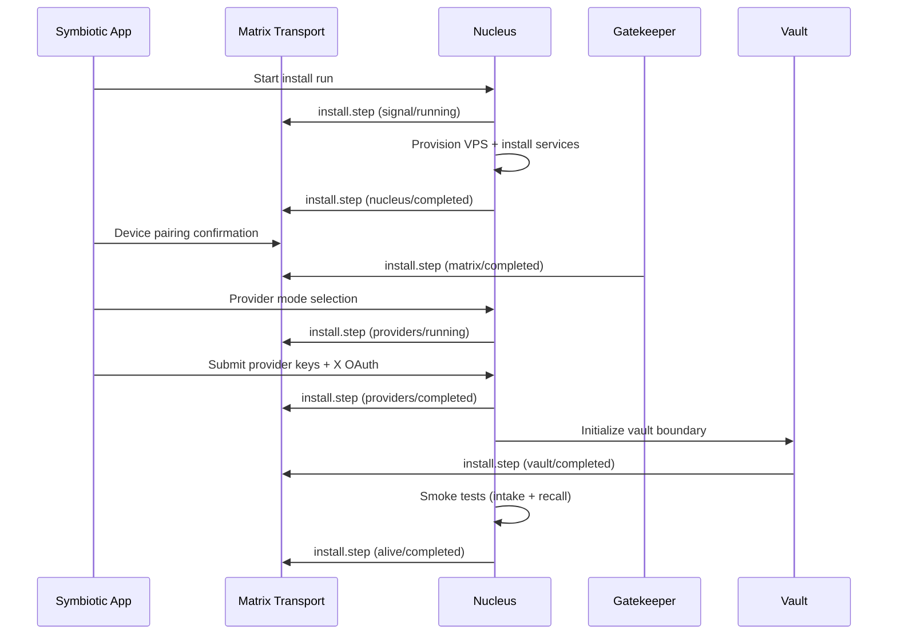
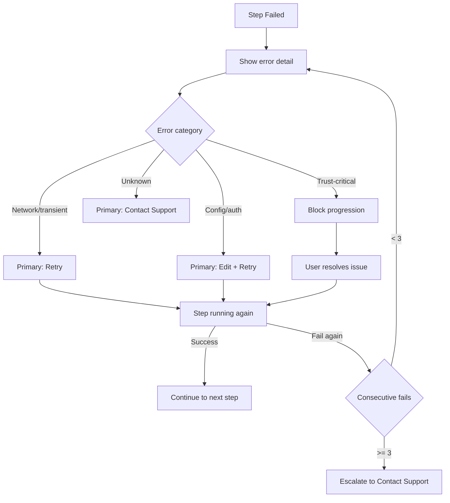
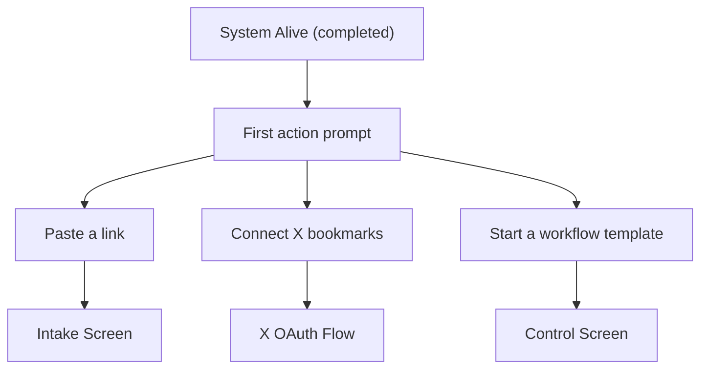

# Setup Experience (Design)


## Overview

This document describes the planned dynamic UX for the setup experience: binding events to real backend steps, animations tied to status changes, failure UX with retry/logs/support actions, and the first action handoff when setup completes.

**Current implementation**: see `docs/architecture/setup-experience.md` for the static scaffold, step definitions, and event envelope schema.

**Status**: Planned (Approved)
**Task**: T47 (Zero-Touch User Onboarding)
**Depends on**: T76 (Mobile App MVP)

## Planned: Event Binding to Backend Steps

The static scaffold will be wired to real-time events from the install wizard. Each `org.symbiotic.event` with `type: "install.step"` updates the corresponding `SetupStepTile` in the Flutter UI.

### Runtime Sequence



### Binding Rules

- Events are matched by `sid` (step ID) to the corresponding tile.
- Events are grouped by `rid` (run ID) so multiple install attempts are distinguishable.
- The `body` field provides human-readable fallback text if parsing fails.
- The `p` field (0-100) drives a progress bar within a step when present.

## Planned: Animations

Animations are deterministic and tied to real events. They never animate "success" before receiving backend completion.

| Status | Animation | Visual | Duration |
|--------|-----------|--------|----------|
| `queued` | None | Gray, inactive | -- |
| `running` | Pulse | Blue pulsing indicator | 1.5s cycle, ease-in-out |
| `blocked` | Amber hold | Amber glow with explicit CTA button | Static with 0.3s fade-in |
| `completed` | Short glow then lock | Green check, brief glow, then static | 0.6s glow, then lock |
| `failed` | Red edge | Red border with retry affordance | 0.3s transition |

### Animation Implementation

All animations use Flutter's `AnimationController` with the durations above. No Lottie or third-party animation libraries in MVP -- keep to built-in `AnimatedContainer` and `AnimatedOpacity`.

### Brain Diagram Concept

One animated brain diagram with highlighted regions per step. As each step completes, the corresponding brain region lights up and locks. This creates a visual metaphor for the system "coming alive."

- Implemented as a custom `CustomPainter` widget in `submodules/app/lib/src/widgets/brain_diagram.dart`.
- Each region maps to a `WizardStep` enum value from `submodules/control-plane/migration/symbiotic-installer-source/src/lib.rs`.
- Region highlight transitions use 0.4s ease-out.

## Planned: Failure UX

When a step fails, the UI must provide clear, actionable next steps.

### Error Taxonomy

| Error Category | Step(s) Affected | Primary Action | User-Facing Message |
|----------------|------------------|----------------|---------------------|
| **Network unreachable** | Signal Online, Nucleus Boot | Retry | "Cannot reach server. Check your connection and retry." |
| **VPS provisioning failed** | Nucleus Boot | Open Logs | "Server setup failed. Check logs for details." |
| **Matrix connection failed** | Matrix Link | Retry | "Could not connect to Matrix. Retrying..." |
| **Device verification failed** | Matrix Link | Retry | "Device verification failed. Please try again." |
| **Provider auth failed** | Provider Keys | Retry (with edit) | "Authentication failed for {provider}. Check your credentials." |
| **OAuth flow cancelled** | Provider Keys | Retry | "OAuth was cancelled. Tap to try again." |
| **Vault initialization failed** | Vault Seal | Contact Support | "Vault setup failed. This requires support assistance." |
| **Recall smoke test failed** | Recall Calibration | Retry | "System check failed. Retrying..." |
| **Unknown / unclassified** | Any | Contact Support | "An unexpected error occurred. Contact support." |

### Failure Rules

1. Show one primary next action: **Retry**, **Open Logs**, or **Contact Support**.
2. Preserve completed steps; retries start at the failed step.
3. If `Vault Seal` or `Matrix Link` fails, block progression until resolved (these are trust-critical).
4. Error detail from `WizardStepResult.detail` is shown in an expandable section.
5. After 3 consecutive failures on the same step, escalate primary action to **Contact Support**.

### Failure Flow



## Planned: Timeout Values

Each wizard step has a defined timeout. If no event is received within the timeout, the UI shows a "Still working..." indicator with elapsed time.

| Step | Timeout (seconds) | On Timeout Behavior |
|------|-------------------|---------------------|
| Signal Online | 30 | Retry automatically (network probe) |
| Nucleus Boot | 180 | Show "Still provisioning..." at 60s, timeout at 180s |
| Matrix Link | 120 | Show "Waiting for device..." at 30s |
| Memory Channels | 60 | Show "Creating channels..." at 30s |
| Provider Keys | 300 | User-driven (no auto-timeout, but show elapsed at 120s) |
| Vault Seal | 90 | Show "Initializing vault..." at 30s |
| Recall Calibration | 120 | Show "Running tests..." at 30s |
| System Alive | 30 | Auto-complete or fail fast |

### Timeout Rust Type

```rust
/// Per-step timeout configuration, used by the daemon to emit timeout events.
/// Lives in `submodules/control-plane/migration/symbiotic-installer-source/src/lib.rs`.
pub struct StepTimeoutConfig {
    pub step: WizardStep,
    /// Maximum seconds to wait for step completion before emitting a timeout event.
    pub timeout_secs: u64,
    /// Seconds before showing "still working" indicator in the UI.
    pub progress_hint_secs: u64,
}

pub fn default_step_timeouts() -> Vec<StepTimeoutConfig> {
    vec![
        StepTimeoutConfig { step: WizardStep::SignalOnline, timeout_secs: 30, progress_hint_secs: 10 },
        StepTimeoutConfig { step: WizardStep::NucleusBoot, timeout_secs: 180, progress_hint_secs: 60 },
        StepTimeoutConfig { step: WizardStep::MatrixLink, timeout_secs: 120, progress_hint_secs: 30 },
        StepTimeoutConfig { step: WizardStep::MemoryChannels, timeout_secs: 60, progress_hint_secs: 30 },
        StepTimeoutConfig { step: WizardStep::ProviderKeys, timeout_secs: 300, progress_hint_secs: 120 },
        StepTimeoutConfig { step: WizardStep::VaultSeal, timeout_secs: 90, progress_hint_secs: 30 },
        StepTimeoutConfig { step: WizardStep::RecallCalibration, timeout_secs: 120, progress_hint_secs: 30 },
        StepTimeoutConfig { step: WizardStep::SystemAlive, timeout_secs: 30, progress_hint_secs: 10 },
    ]
}
```

## Planned: First Action Handoff

When setup reaches **System Alive**, the app auto-opens the first intake prompt to create immediate proof that setup is complete and the system is usable.

### Handoff Options

- "Paste a link" -- opens the Intake screen with a text field
- "Connect X bookmarks" -- initiates OAuth flow
- "Start a workflow template" -- opens the Control screen with workflow picker

### Handoff UX



## Planned: Sensitive Step Confirmation

Steps involving credentials or device trust require explicit user confirmation before proceeding:

- **Matrix Link**: user must confirm device pairing.
- **Provider Keys**: user must manually enter or authorize keys.
- **Vault Seal**: user must acknowledge vault initialization.

These steps transition to `blocked` status with a CTA button until the user takes action.

## Key Decisions

1. **Events drive UI**: no fake progress bars; every visual change corresponds to a real backend event.
2. **Single event format**: setup reuses the same `org.symbiotic.event` envelope as runtime status.
3. **Failure is first-class**: the failure path gets dedicated UX design, not an afterthought.
4. **Handoff creates value immediately**: the first action after setup proves the system works.
5. **Trust-critical steps block**: Vault and Matrix steps must succeed before progression.
6. **Built-in animations only**: MVP uses Flutter's built-in animation primitives, no third-party dependencies.
7. **Escalation after 3 failures**: repeated failures on the same step escalate to "Contact Support" to avoid infinite retry loops.

## Error Handling

| Error | Handling |
|-------|----------|
| Event stream disconnected | Show "Reconnecting..." banner; retry connection with 2s/4s/8s backoff (max 30s) |
| Step timeout (no event for N seconds) | Show "Still working..." with elapsed time; fail after step-specific timeout |
| Multiple failures on same step (>= 3) | Escalate to "Contact support" as primary action |
| Unknown event type | Ignore gracefully; log for debugging |
| Malformed event payload | Fallback to `body` text; log parse error |
| App backgrounded during setup | Resume from last known state on foreground; re-sync via Matrix |

## Test Strategy

### Unit Tests (`submodules/control-plane/migration/symbiotic-installer-source/`)

| Test | Description |
|------|-------------|
| `step_timeout_config_covers_all_steps` | Every `WizardStep` variant has a timeout config |
| `timeout_values_are_positive` | All timeout and hint values are > 0 |
| `step_contract_rejects_invalid_status` | `InstallStepContract::validate()` rejects unknown statuses |

### Widget Tests (`submodules/app/test/`)

| Test | Description |
|------|-------------|
| `setup_step_tile_renders_all_statuses` | Tile renders correct color/icon for each `StepStatus` |
| `failed_step_shows_retry_button` | Failed tile shows retry affordance |
| `completed_step_shows_check` | Completed tile shows green check, no interaction |
| `blocked_step_shows_cta` | Blocked tile shows amber CTA button |
| `brain_diagram_lights_regions` | Each completed step lights the corresponding brain region |

### Integration Tests (`tests/setup_experience_integration.rs`)

| Test | Description |
|------|-------------|
| `full_wizard_happy_path` | All steps complete in sequence via `InMemoryMatrixTransport` |
| `step_failure_preserves_completed` | Failed step does not reset completed steps |
| `retry_resumes_at_failed_step` | After failure+retry, execution resumes at the failed step |
| `timeout_emits_failed_event` | Step exceeding timeout produces a `failed` event |
| `concurrent_runs_distinguished_by_rid` | Two runs with different `rid` values are tracked independently |

## Related Docs

- `docs/architecture/setup-experience.md` (current implementation)
- `docs/architecture/install-wizard.md`
- `docs/architecture/symbiotic-app.md`
- `docs/design/device-trust-bootstrap.md` (Matrix Link verification)
