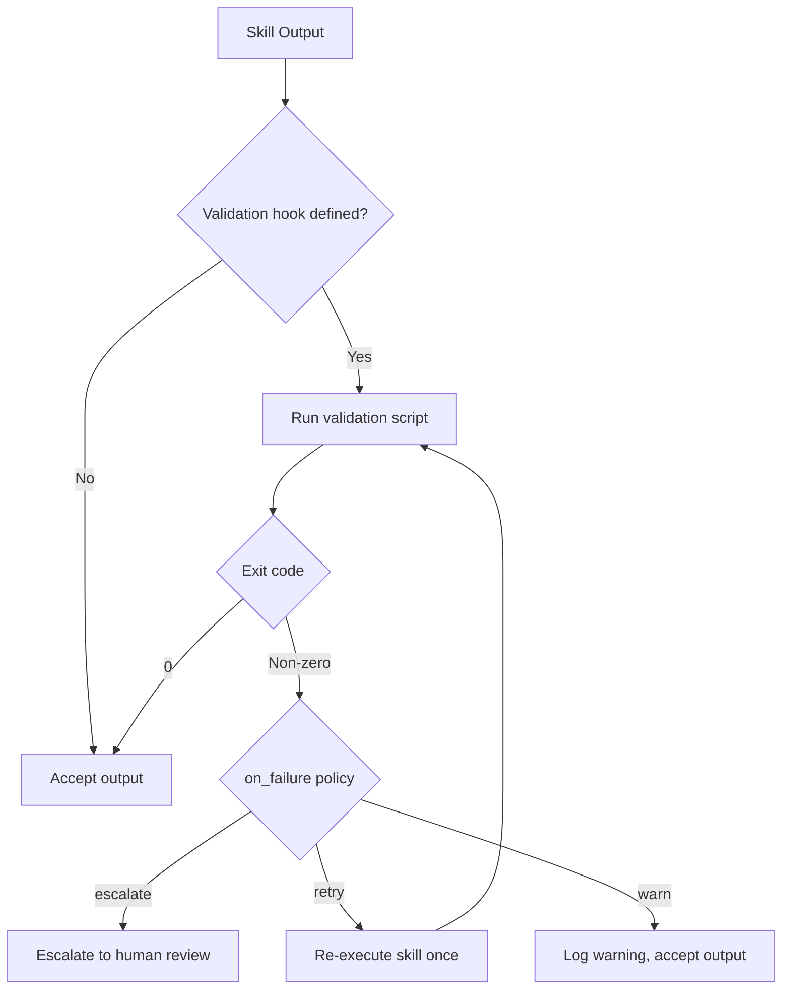
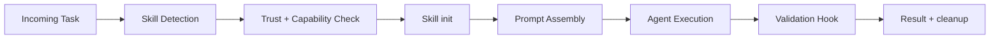
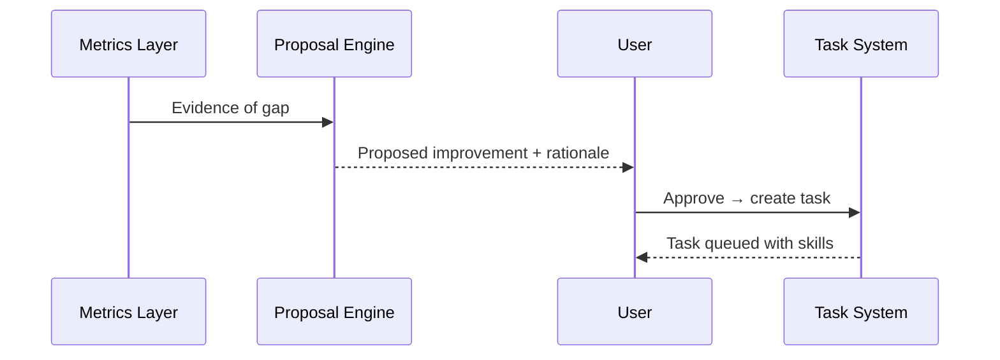

# Skills System


**Task**: T65 (Skills Auto-Loading System)
**Depends on**: T70 (Secure Agent Framework)

## Overview

Skills provide reusable, versioned prompt workflows with examples, rubrics, and validation steps. Skills are loaded on demand to keep context lean and reduce model confusion.

**Status (2026-02-04)**: Planned (Approved). This doc defines the auto‑loading rules for Task 65.

## Components

| Component | Purpose |
| --- | --- |
| Skill Registry | Maps skill names to paths/metadata |
| Skill Loader | Loads skill instructions at runtime |
| Auto-Loader | Picks skills based on task type or explicit mention |
| Skill Templates | Examples, rubrics, guardrails |
| Validation Hooks | Optional checks/tests per skill |

## Skill Manifest Format

Each skill is a directory under `skills/` containing a `manifest.toml` and associated files.

### Directory Structure

```
skills/
├── code-review/
│   ├── manifest.toml
│   ├── prompt.md          # Main skill instructions
│   ├── examples/          # Example inputs/outputs
│   │   ├── good-review.md
│   │   └── bad-review.md
│   └── rubric.md          # Evaluation criteria
├── ingestion/
│   ├── manifest.toml
│   ├── prompt.md
│   └── validation.sh      # Validation script
└── research/
    ├── manifest.toml
    └── prompt.md
```

### Manifest Schema (`manifest.toml`)

```toml
[skill]
name = "code-review"
version = "1.0.0"
description = "Structured code review with security and quality checks"

# Minimum trust level required to use this skill
min_trust_level = "Standard"   # Accepts both sets: ReadOnly | ArchiveWrite | CredentialAccess | ExternalAct (code) or Basic | Standard | Trusted | FullyTrusted (planned)

[capabilities]
# Capabilities this skill requires from the agent
required = ["archive.read", "file.read"]
optional = ["file.write"]

[triggers]
# Keywords in task/goal that trigger auto-loading
keywords = ["review", "code review", "PR review", "pull request"]

# Domain types that trigger auto-loading
domains = ["software-engineering"]

# Explicit invocation pattern (always works regardless of triggers)
# User says: "Use code-review" or task contains "skill:code-review"
invocation = "code-review"

[files]
# Files loaded into agent context
prompt = "prompt.md"
rubric = "rubric.md"            # optional
examples = ["examples/*.md"]     # optional glob

[validation]
# Optional validation hook run after skill execution
script = "validation.sh"         # optional, executed in sandbox
timeout_secs = 30               # max validation runtime
on_failure = "escalate"         # "escalate" (to human) | "retry" (once) | "warn"

[metadata]
author = "symbiotic"
created = "2026-02-06"
tags = ["quality", "security"]
```

### Manifest Validation Rules

- `name` must match directory name
- `version` must be valid semver
- `min_trust_level` must be a valid trust level
- All referenced files must exist
- `capabilities.required` must be a subset of valid capability scopes

## Skill API

Skills are loaded and executed through a defined lifecycle:

```rust
pub trait Skill: Send + Sync {
    /// Initialize skill: load prompt, examples, rubric into memory
    fn init(&mut self, config: &SkillConfig) -> Result<()>;

    /// Execute the skill within an agent context
    /// Returns structured output that can be validated
    fn execute(&self, context: SkillContext) -> Result<SkillOutput>;

    /// Clean up resources (drop loaded prompt data, temp files)
    fn cleanup(&mut self);
}

pub struct SkillConfig {
    pub manifest: SkillManifest,
    pub skill_dir: PathBuf,
}

pub struct SkillContext {
    /// The task or goal being worked on
    pub task: TaskDescription,

    /// Agent's current trust level
    pub trust_level: TrustLevel,

    /// Available capabilities (intersection of agent caps and skill requirements)
    pub capabilities: Vec<String>,

    /// Files/context already loaded by the agent
    pub existing_context: Vec<ContextItem>,
}

pub struct SkillOutput {
    /// The skill's contribution to the agent's prompt
    pub prompt_additions: Vec<String>,

    /// Structured result data (for validation)
    pub result: serde_json::Value,

    /// Whether validation passed (if validation hook was run)
    pub validation: Option<ValidationResult>,
}
```

## Auto-Load Triggers

Skills are loaded when matching conditions are detected in the goal or task description.

### Detection Algorithm

```mermaid
flowchart TD
    Goal[Goal / Task Description] --> Parse[Extract keywords + domain]
    Parse --> Explicit{Explicit invocation?<br/>"Use $skill" or "skill:$name"}
    Explicit -->|Yes| Load[Load Skill]
    Explicit -->|No| KW{Keyword match?}
    KW -->|Yes| Trust{Agent trust >= skill min?}
    KW -->|No| Domain{Domain match?}
    Domain -->|Yes| Trust
    Domain -->|No| Skip[No skill loaded]
    Trust -->|Yes| Caps{Capabilities intersect?}
    Trust -->|No| Skip
    Caps -->|Yes| Load
    Caps -->|No| Warn[Warn: skill requires unavailable capabilities]
```

### Priority Rules

1. **Explicit invocation always wins**: `Use $skill-name` or `skill:$skill-name` in task
2. **Keyword match**: skill `triggers.keywords` found in goal text (case-insensitive)
3. **Domain match**: task domain matches skill `triggers.domains`
4. **Most specific wins**: if multiple skills match, prefer keyword match over domain match
5. **Max loaded skills**: 3 per agent execution (prevents context bloat)

## Validation Hooks

Validation hooks run after skill execution to verify output quality.

### Validation Flow



### Validation Contract

Validation scripts receive skill output on stdin as JSON and must:
- Exit 0 for pass
- Exit non-zero for fail, with failure reason on stderr
- Complete within `timeout_secs`
- Run in a sandboxed environment (no network, limited filesystem)

```bash
#!/bin/bash
# Example: validation.sh for code-review skill
# Checks that the review output contains required sections

input=$(cat)

if ! echo "$input" | jq -e '.sections | has("security")' > /dev/null 2>&1; then
    echo "Missing security section in review" >&2
    exit 1
fi

if ! echo "$input" | jq -e '.sections | has("quality")' > /dev/null 2>&1; then
    echo "Missing quality section in review" >&2
    exit 1
fi

exit 0
```

## Data Flow



## Key Decisions

1. **Explicit invocation wins**: `Use $skill-name` always loads it.
2. **Auto-load by task type**: e.g., review tasks load review skill via keyword/domain match.
3. **Skills are additive**: load only what's needed for the task (max 3).
4. **Validation optional**: skills can specify checks; failure behavior is configurable.
5. **TOML manifests**: human-readable, versionable, consistent with Rust ecosystem.
6. **Capability intersection**: skill only loads if agent has at least the required capabilities.
7. **Trust gating**: skills specify a minimum trust level; agents below it cannot use the skill.

## Self‑Improvement Loop (Approved)

Skills power the **self‑improvement experience**: when metrics detect gaps, the system proposes improvements as **tasks**. The user approves; tasks are created in `tasks/` with the relevant skills attached.



## Error Handling

| Error | Handling |
| --- | --- |
| Missing skill | Warn and continue with fallback |
| Skill conflict | Load order is deterministic; later wins |
| Validation failure | Mark as failed and request review |
