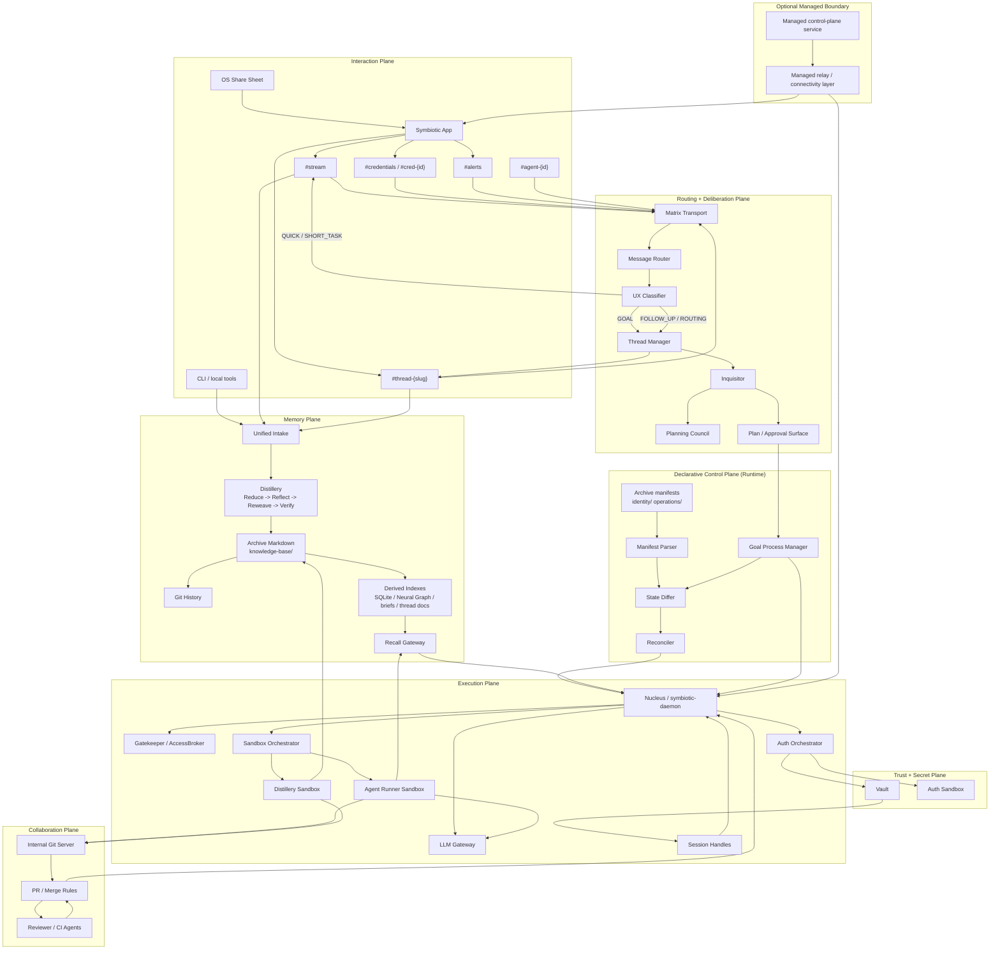
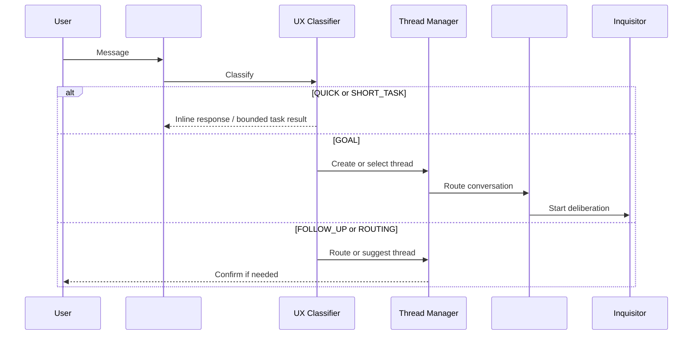
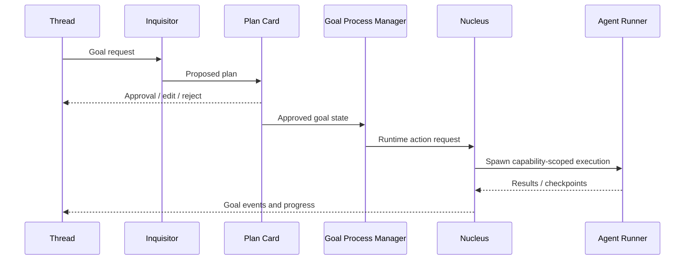
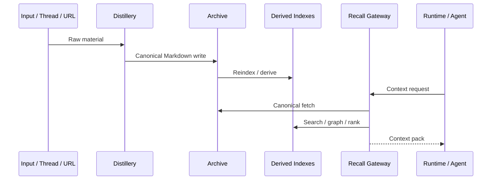
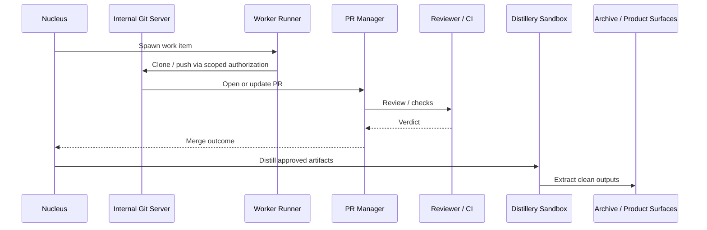

# Future System Map — Canonical Target Topology

> **Purpose:** Single high-level navigation hub for the post-pivot Symbiotic architecture
> **Scope:** This document describes the intended canonical topology after the approved design set is applied. It is not a claim that every component here is already fully implemented.
> **Current implementation map:** `docs/architecture/system-map.md`
> **Primary alignment sources:** `docs/design/architecture-arbitration-matrix-2026-04-04.md`, `docs/design/thread-architecture.md`, `docs/design/deliberation-first-pipeline.md`, `docs/design/vault-as-truth.md`, `docs/design/sandbox-transition-plan.md`, `docs/design/internal-git-swarm.md`

---

## 1. Canonical Rules

These rules define the map:

1. **Archive is knowledge; Vault is secrets.**
   `knowledge-base/` is the Archive's Markdown substrate and the source of truth for memory. `Vault` remains the credential and secret isolation boundary only.
2. **The interaction model is `#stream` + `#thread-{slug}`.**
   Old `#control`, `#status`, `#intake`, and `#goal-*` rooms are migration compatibility only.
3. **Deliberation-first is canonical for non-trivial work.**
   QUICK and SHORT_TASK paths may stay inline. GOAL paths route through the Inquisitor and plan/approval flow before substantial execution.
4. **The declarative control plane lives inside the user-owned runtime.**
   The optional managed service is a separate boundary, not the same thing.
5. **Nucleus is the sovereign orchestrator.**
   The LLM reasoning loop and tool execution run in isolated sandboxes via capability-gated RPC, not inside the trusted host process.
6. **Markdown truth, derived indexes.**
   SQLite, Neural Graph, entity briefs, thread memory docs, and retrieval packs are derived query surfaces, not canonical truth.
7. **The internal Git swarm is separate from Archive truth.**
   Agent code collaboration uses its own git/PR flow and distillery path; it does not replace the Archive or the Vault.

---

## 2. Top-Level Topology

### Reading the map

- **Interaction Plane** handles user-visible conversation surfaces and routing.
- **Routing + Deliberation Plane** decides whether a message stays inline, routes to an existing thread, or becomes a plan-driven goal.
- **Declarative Control Plane** turns Archive manifests into runtime reconciliation actions.
- **Memory Plane** keeps truth in Markdown and all fast retrieval structures as derived indexes.
- **Execution Plane** keeps the trusted host separate from the untrusted reasoning and tool-execution surfaces.
- **Collaboration Plane** supports agent code work through git/PR/CI flows.
- **Trust + Secret Plane** keeps credentials, sessions, and auth flows outside the general agent runtime.
- **Optional Managed Boundary** is explicit. It is a product mode, not a hidden assumption.

---

## 3. Canonical Planes

### 3.1 Interaction Plane

The future interaction model has one general landing pad and many promoted conversation surfaces:

- `#stream` is the default conversational surface for quick replies, short tasks, intake, and routing cards.
- `#thread-{slug}` is the long-lived conversation surface for a topic or initiative. Goals and work items can attach to it without making the thread the ownership container.
- `#credentials`, `#cred-{id}`, and `#alerts` stay isolated because they carry different trust and interruption semantics.
- `#agent-{id}` remains internal and is not the user-facing project surface.

### 3.2 Deliberation Plane

The message path is classification first, then goal planning:

- QUICK: direct answer, stays inline
- SHORT_TASK: single-agent or bounded task, stays inline
- GOAL: thread-scoped deliberation path
- FOLLOW_UP / ROUTING: thread selection or suggestion flow

For GOAL paths, the **Inquisitor always runs first**. Complex and critical work may also call the Planning Council, but the system does not bypass deliberation on the basis of a model confidence score.

### 3.3 Declarative Control Plane

The declarative control plane is the runtime reconciliation model inside the user-owned system:

- desired state comes from Archive manifests under `knowledge-base/identity/` and `knowledge-base/operations/`
- the reconciler observes, diffs, plans, and hands execution to the runtime
- capabilities are still issued imperatively through the Gatekeeper

This is distinct from the optional **managed control-plane service**.

### 3.4 Memory Plane

The memory system has one truth boundary and multiple derived surfaces:

- **Canonical truth:** Archive Markdown in `knowledge-base/`
- **History substrate:** git commits and diffs
- **Derived indexes:** SQLite, Neural Graph, embeddings, generated briefs, thread memory docs
- **Retrieval surface:** Recall Gateway

This means:

- facts are created, updated, or archived in Markdown
- derived stores may be rebuilt from the Archive
- generated artifacts are query surfaces, not canonical documents

### 3.5 Execution Plane

The runtime is split between a trusted sovereign host and isolated execution sandboxes:

- **Nucleus** owns orchestration, Matrix integration, capability gating, secret mediation, and sandbox lifecycle
- **Agent Runner Sandbox** hosts the LLM reasoning loop and local tools
- **Distillery Sandbox** verifies and extracts clean artifacts without trusting arbitrary agent outputs on the host
- **LLM Gateway** keeps provider credentials outside the sandbox

The core invariant is simple: **the mind and the secrets do not live in the same trust domain**.

### 3.6 Collaboration Plane

The internal Git swarm is the code-collaboration layer for agent companies:

- swarm repos are separate from Archive truth
- PR and review rules gate merges
- CI/reviewer agents validate output
- distillery follow-through extracts approved results back into durable product surfaces

### 3.7 Trust + Secret Plane

The trust plane owns all high-risk material:

- Gatekeeper / AccessBroker authorizes actions
- Vault stores credentials and secret material
- Session Handles carry scoped access without handing raw secrets to general agents
- Auth Sandbox handles login and challenge flows in dedicated isolated paths

### 3.8 Optional Managed Boundary

Managed mode may add relay/connectivity and hosted provisioning flows, but this must always be shown explicitly in diagrams and docs. The app-to-runtime path is not assumed to be direct in managed mode.

---

## 4. Core Flows

### 4.1 Conversational Routing

### 4.2 Goal Deliberation and Execution

### 4.3 Memory Distillation and Recall

### 4.4 Git Swarm Collaboration

---

## 5. Canonical Boundaries

### Knowledge vs secrets

- **Archive:** persistent knowledge layer, human-readable, versioned, user-owned
- **Vault:** credentials and secret isolation only

### Runtime vs managed

- **Declarative control plane:** reconciliation/orchestration inside the runtime
- **Managed control-plane service:** optional hosted product boundary

### Truth vs query surfaces

- **Truth:** canonical Markdown in the Archive
- **Query surfaces:** SQLite, Neural Graph, generated briefs, thread memory docs, retrieval packs

### Trusted host vs untrusted execution

- **Trusted:** Nucleus, Gatekeeper, Vault, auth/session mediation
- **Untrusted or lower-trust:** agent runner sandboxes, generated code, temporary work repos

---

## 6. Migration Position

This is the target map, not a claim of current parity. During migration:

- current room models may continue to exist for compatibility
- current architecture docs remain the source of truth for implemented behavior
- this document is the reference for future alignment and doc cleanup

When the design is fully realized, the relevant parts of this map should be promoted into `docs/architecture/system-map.md`.

---

## 7. Related Docs

- `docs/design/architecture-arbitration-matrix-2026-04-04.md`
- `docs/design/thread-architecture.md`
- `docs/design/deliberation-first-pipeline.md`
- `docs/design/vault-as-truth.md`
- `docs/design/memory-system.md`
- `control-plane/docs/design/declarative-control-plane.md`
- `control-plane/docs/architecture/control-plane.md`
- `docs/design/sandbox-transition-plan.md`
- `docs/design/internal-git-swarm.md`
- `docs/architecture/system-map.md`
