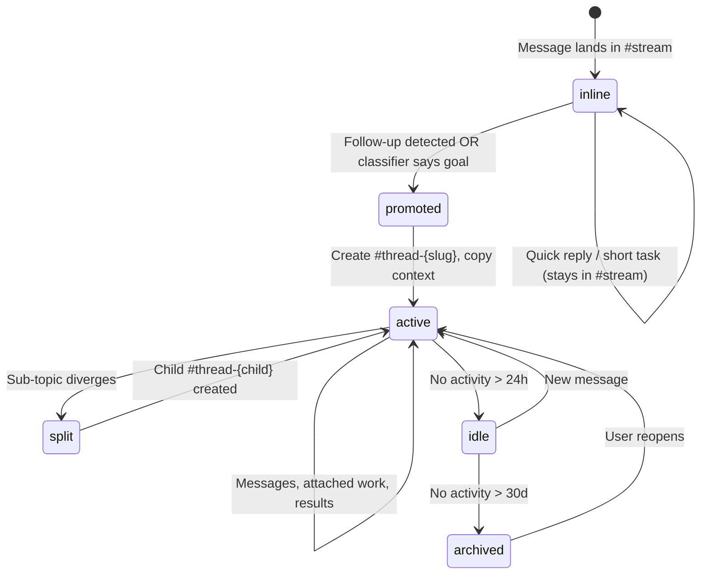
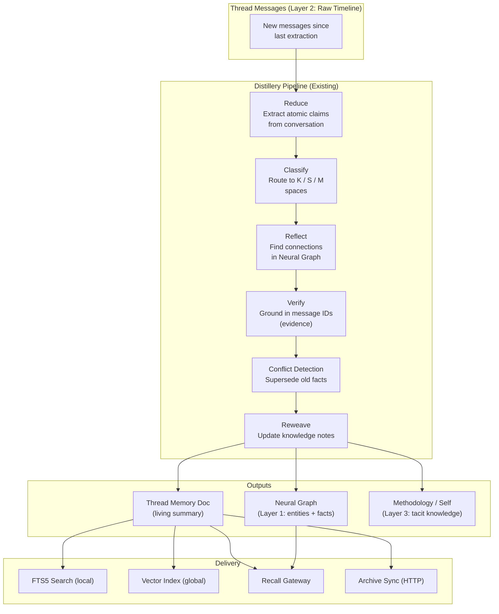
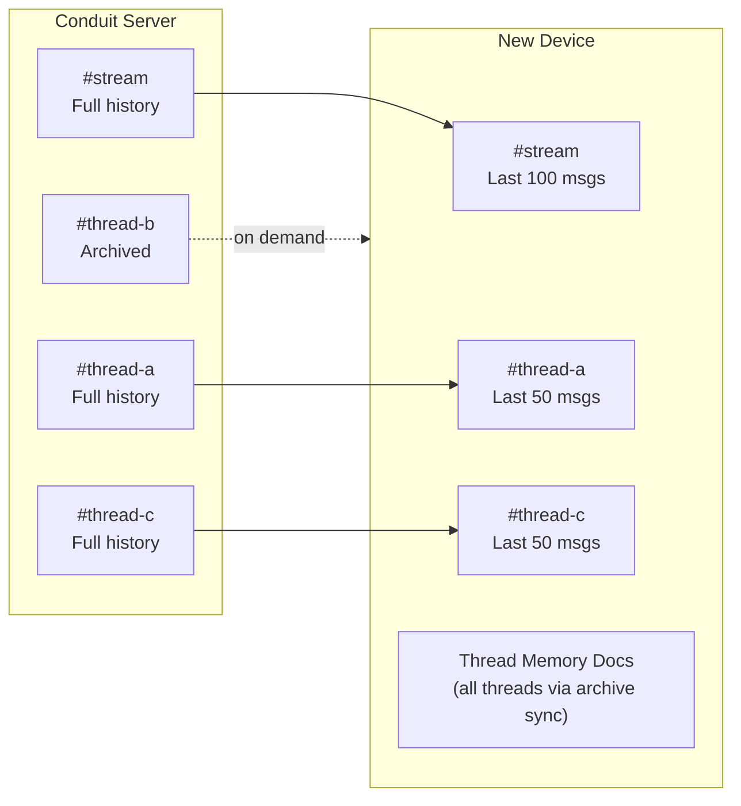
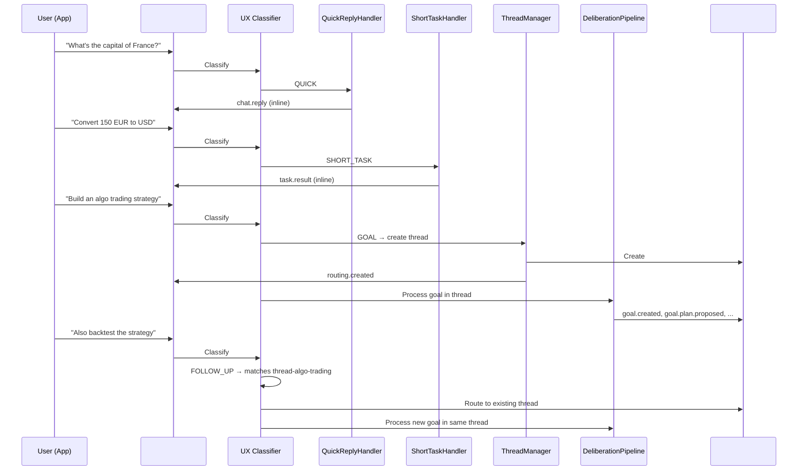

# Thread Architecture — Hybrid Room Model

> **Task:** Architectural upgrade from UX redesign (Session 66)
> **Depends on:** UX Specification (`docs/design/ux-specification.md`), Deliberation Pipeline (`docs/design/deliberation-first-pipeline.md`)
> **Supersedes:** Per-goal room model in `docs/architecture/matrix-channels.md` §Channel Structure

---

## 1. Motivation

Session 66 produced a comprehensive UX redesign (`ux-specification.md`) that shifts Symbiotic from a dashboard-oriented app to a **conversational AI operating system**. The core change: everything enters through conversational threads. Quick questions, short tasks, and complex goals all flow through the same input surface, but the messaging layer must stay distinct from the ownership and execution layers.

This redesign surfaces fundamental mismatches with the current architecture:

- **App navigation**: Home dashboard → STREAM thread list
- **Event routing**: flat domain lists → thread-based grouping
- **Matrix rooms**: per-goal rooms → hybrid stream + thread rooms
- **Notification system**: bell icon → input bar expansion
- **Input surfaces**: multiple bars → universal bar
- **Goal scope**: goal = room → thread = messaging surface attached to goals and work

This document defines the architectural changes needed to support the new UX.

---

## 2. Room Model

### Current

```
#control        — User commands
#status         — Daemon status updates
#intake         — URL drop for ingestion
#goal-{slug}    — Per-goal room (1 goal = 1 room)
#credentials    — Credential requests (isolated)
#cred-{id}      — Short-lived credential DMs
#alerts         — Escalations
#agent-{id}     — Agent-to-agent coordination
```

### New

```
#stream             — Landing pad: quick replies, short tasks, routing cards
#thread-{slug}      — Promoted conversation surface (long-lived topic/chat with attached work)
#credentials        — Credential requests (unchanged, security isolation)
#cred-{id}          — Short-lived credential DMs (unchanged)
#alerts             — Escalations (unchanged)
#agent-{id}         — Internal agent coordination (unchanged, not user-facing)
```

### Changes

| Old Room | New Room | Rationale |
|----------|----------|-----------|
| `#control` | `#stream` | User commands become natural language in one room |
| `#status` | `#stream` | Status updates are inline quick replies or thread events |
| `#intake` | `#stream` | URL paste is auto-classified by universal input bar |
| `#goal-{slug}` | `#thread-{slug}` | Threads are messaging surfaces; goals attach to them instead of owning the room |

### Design Rationale

**Why not one big room?**

1. **Device sync**: smaller rooms = faster initial sync, less key material per room
2. **Search partitioning**: per-thread vector/semantic indexes are structurally scoped
3. **Direct Matrix usage**: per-topic rooms are navigable in Element or other clients
4. **Agent context loading**: loading a thread room = loading exactly the relevant context
5. **Retention/archival**: can archive thread rooms independently without affecting `#stream`

**Why not room-per-goal?**

1. Conversation should stay stable even as owned work changes — a thread can outlive, switch, or attach to different goals and work items
2. Fewer rooms = less overhead for room creation, key exchange, room state
3. Goals should remain owned work units, not conversation containers

---

## 3. Thread Lifecycle



### 3.1 Create — Promotion from `#stream`

Threads are created when a conversation outgrows inline status:

1. **Immediate goal**: classifier identifies complex/multi-step intent → thread created from the start
2. **Follow-up detected**: user sends a second message that topic-matches a previous `#stream` exchange → daemon promotes to thread

**Promotion steps:**

1. Daemon assigns a `thread_id` (e.g., `thread-tokyo-trip`)
2. Creates `#thread-{slug}` Matrix room (E2EE, user + daemon)
3. **Processes conversation context**: extracts relevant messages from `#stream`, generates a context summary, posts as thread-opening message
4. Emits `routing.created` event in `#stream`:
   ```json
   {
     "sym": {
       "t": "routing.created",
       "d": {
         "thread_id": "thread-tokyo-trip",
         "title": "✈️ Tokyo Trip",
         "promoted_from": ["$msg-abc", "$msg-def"],
         "reason": "follow_up_detected"
       }
     },
     "body": "→ Thread created: ✈️ Tokyo Trip"
   }
   ```
5. Original `#stream` messages are annotated in the app ("→ continued in thread")
6. Future messages about this topic route to `#thread-{slug}`

### 3.2 Split — Thread → Child Thread

When a thread grows to encompass divergent sub-topics, it can be split:

**Triggers:**
- **User-initiated**: "Split marketing to its own thread" or long-press → "Split topic"
- **System-suggested**: daemon detects topic divergence after N messages or distinct sub-topics, suggests split

**Split steps:**

1. **Context extraction**: identify relevant messages (user selection or LLM topic detection)
2. **Summary generation**: run a mini-Distillery pass (Reduce → Reflect) on extracted content → produces structured context summary
3. **Create child room**: `#thread-{child-slug}` with context summary as opening message
4. **Routing card in parent**: `routing.split` event
   ```json
   {
     "sym": {
       "t": "routing.split",
       "d": {
         "parent_thread": "thread-saas-product",
         "child_thread": "thread-saas-marketing",
         "child_title": "🎯 SaaS Marketing",
         "extracted_messages": ["$msg-1", "$msg-2", "$msg-3"],
         "reason": "topic_divergence"
       }
     },
     "body": "→ Split: 🎯 Marketing moved to its own thread"
   }
   ```
5. **Routing card in `#stream`**: `routing.created` for discoverability
6. **Update classifier**: topic model knows "marketing" routes to child thread
7. **Seed child search index**: embed context summary for the new thread's vector index

### 3.3 Merge — Combine Threads

Inverse of split. Less common, but supported:

1. User selects two threads → "Merge into..."
2. Messages combined chronologically in target thread
3. Source thread archived with a redirect pointer
4. Vector indexes merged

### 3.4 Archive

- Threads with no activity > 30 days → archived (hidden from thread list)
- Goal threads archive when all goals complete + 7 days of no follow-up
- Accessible via search or "Show archived" toggle
- On the Matrix side: app leaves the room (can rejoin on demand, history preserved server-side)

### 3.5 Cross-Thread Routing

When you're inside `#thread-tokyo-trip` and type "find me headphones for the flight":

1. Classifier detects topic mismatch (headphones ≠ travel)
2. **Always suggest, never auto-move**: the system proposes a new or existing thread
   ```
   💬 This seems like a different topic.
   → Start new thread: 🛒 Shopping
   → Keep in ✈️ Tokyo Trip
   ```
3. User taps to confirm — message routes to chosen destination
4. If user confirms new/different thread: `routing.moved` event in source thread, message processed in target

**No auto-routing.** Moving messages without consent is disruptive. The classifier suggests, the user decides.

---

## 4. Classification Pipeline

The UX spec introduces a **pre-filter classifier** that sits before the existing Deliberation Pipeline. This resolves the mismatch between the UX's 3 tiers and the pipeline's 4 complexity levels.

```
User input (natural language in #stream or #thread-{slug})
  │
  ▼
┌─────────────────────────────────────────────────┐
│ UX Classifier (NEW — lightweight, fast)         │
│                                                 │
│ Determines: QUICK / SHORT_TASK / GOAL /         │
│             FOLLOW_UP / ROUTING                 │
└──────────────┬──────────────────────────────────┘
               │
     ┌─────────┼───────────┬──────────────┬──────────────┐
     ▼         ▼           ▼              ▼              ▼
   QUICK    SHORT_TASK    GOAL         FOLLOW_UP      ROUTING
   │         │            │              │              │
   │         │            ▼              ▼              ▼
   │         │    ┌──────────────┐  Route to        Route to
   │         │    │ Deliberation │  existing         different
   │         │    │ Pipeline     │  thread            thread
   │         │    │ (existing)   │
   │         │    │ Simple/      │
   │         │    │ Moderate/    │
   │         │    │ Complex/     │
   │         │    │ Critical     │
   │         │    └──────────────┘
   │         │            │
   ▼         ▼            ▼
 #stream   #stream    #thread-{slug}
 (inline)  (inline)   (new or existing)
```

### Classification Types

| Type | Latency | What Happens | Where |
|------|---------|--------------|-------|
| **QUICK** | <5s | Direct LLM call, no agent | Response inline in `#stream` |
| **SHORT_TASK** | 5-60s | Single agent pass, one tool | Result inline in `#stream` |
| **GOAL** | 60s+ | Deliberation pipeline → thread | Creates/uses `#thread-{slug}` |
| **FOLLOW_UP** | — | Topic matches existing exchange | Routes to existing `#thread-{slug}` |
| **ROUTING** | — | Topic mismatch in current thread | Suggests different thread (user confirms) |

### Classification Signals

| Signal | Indicates |
|--------|-----------|
| Question mark, short input, no action verbs | QUICK |
| Single action verb ("convert", "find", "translate") | SHORT_TASK |
| Multiple phases, planning words, complex requirements | GOAL |
| Topic similarity to recent `#stream` exchange or active thread | FOLLOW_UP |
| Topic mismatch with current thread context | ROUTING |

### Tier → Pipeline Mapping

Quick replies and short tasks **never enter** the Deliberation Pipeline. Only GOAL classification triggers it. All goals go through the Inquisitor first — there is no confidence-based auto-execution bypass.

| UX Tier | Pipeline Involvement | Response Path |
|---------|---------------------|---------------|
| Quick reply | None | Direct LLM → `chat.reply` in `#stream` |
| Short task | None | Single agent → `task.result` in `#stream` |
| Goal (any) | Inquisitor always runs | Inquisitor → plan card → approval → execution attached to `#thread-{slug}` |

Complexity assessment still informs depth: simple goals get brief plans with minimal questions, complex goals may involve council deliberation before the inquisitor proposes a plan, critical goals require mandatory approval. But the inquisitor is always the user-facing interface.

### Goals Attached To Threads

A thread is a **messaging surface**, not the project or ownership container. Goals and work items attach to the thread and project their state into it:

```
#thread-saas-product
  ├── 💬 Discussion about tech stack
  ├── 🎯 Goal: Research competitors
  │    └── work items: research -> synthesis -> review
  ├── 🎯 Goal: Build frontend
  │    └── work items: plan -> implement -> review
  ├── 💬 Chat about pricing strategy
  └── 🎯 Goal: Set up CI/CD
```

All goal events (`goal.question`, `goal.plan.proposed`, `goal.step.*`, `goal.result`, `goal.completed`) are emitted to the attached thread's Matrix room. The GOALS tab reads from the same events for its inspect/configuration views — it never hosts conversation.

Ownership stays outside the thread:

- `thread` = conversation and visibility surface
- `goal` = project / owned work container
- `task` = durable slice under a goal
- `work item` = concrete execution unit under a task
- `branch / PR / artifact` = development outputs attached to work items

---

## 5. Thread Distillery — Conversations as Knowledge Source

Thread conversations are a rich source of durable knowledge — decisions, findings, preferences, entities — that currently stays trapped in raw Matrix messages. The Thread Distillery runs the **existing Distillery pipeline** on conversation messages, producing both structured knowledge (Neural Graph entities/facts) and a readable summary (Thread Memory Document).

### Research Foundations

This design draws from convergent patterns in external research:

| Pattern | Source | Key Insight |
|---------|--------|-------------|
| **Three-Layer Memory** | spacepixel (Clawdbot guide) | Layer 1: entity graph with atomic facts + living summaries. Layer 2: raw timeline. Layer 3: tacit knowledge. Cheap sub-agent extraction (~30min). Weekly synthesis rewrites summaries. Supersede, never delete. |
| **Memory vs RAG** | Supermemory | RAG answers "What do I know?" — Memory answers "What do I remember about you?" Memory needs entity graphs with temporal invalidation, not just vector similarity. Temporal context + causal relationships beat semantic search. |
| **Smart Forgetting** | Supermemory (memory engine) | Intelligent decay, recency bias, context rewriting, hierarchical hot/cold layers. Human brain forgets the mundane, emphasizes what's used recently, and rewrites memories based on new context. |
| **Typed Memory Capture** | Gigabrain | Classify every memory as DECISION, PREFERENCE, ENTITY, EPISODE, or AGENT_IDENTITY with confidence scores. Enables class budgets in recall so preferences don't drown out decisions. |
| **Memory Quality Pipeline** | Gigabrain | Exact + semantic dedupe, junk filtering, plausibility checks, durable-personal bias. Bad memories don't pile up forever. Nightly maintenance, audit commands. |
| **Curated Auto-Injection** | Gigabrain | Every turn: recall → clean → dedupe → rank → inject only what's relevant. Class budgets ensure balanced context. |
| **4±1 Chunks** | Nyk (Cowan's research) | Active attention is 4 chunks, not 200k tokens. Scanning is not knowing. Distill to the most important chunks — don't dump raw conversation into context. |
| **Prose-as-Title** | Nyk | Notes named as claims, not categories: "Vue outperforms React for SSR.md" not "frontend-framework.md". Titles alone tell you relevance before reading content. |
| **Self-Improving Graph** | Nyk, tricalt | Friction signals accumulate → agent proposes structural changes. Contradictions flagged. Stale context pruned. The graph refactors itself. |
| **Brain Spec** | `brain-spec.md` | Provenance tracking (authored_by + confidence), cascading staleness (dependent facts flagged when source stales), write-back enrichment (external lookups persist to thread), query gap analysis. |

See also: `legacy/knowledge-base/articles/` for full source material.

### Architecture — Full Distillery, Not Just Summaries

Thread conversations feed into the **same Distillery pipeline** that processes intake content. The Thread Memory Document is an output, not the whole system.



### Three-Layer Mapping

| Layer | Symbiotic Component | Thread Role |
|-------|-------------------|-------------|
| **Layer 1**: Knowledge Graph | Neural Graph + Memory Store (SQLite + Graph) | Thread decisions, entities, relationships extracted as atomic facts |
| **Layer 2**: Raw Timeline | Thread room messages (Matrix) | The conversation itself — raw, unprocessed, searchable via FTS5 |
| **Layer 3**: Tacit Knowledge | Methodology + Self memory spaces | Patterns, preferences, lessons learned from thread interactions |

The **Thread Memory Document** is the "living summary" from Layer 1 — equivalent to Clawdbot's per-entity `summary.md`. It's regenerated from active facts, not maintained manually.

### Atomic Facts from Conversations

When the distillery processes thread messages, it extracts **atomic facts** — the same `AtomicClaim` type used for intake content, but with conversation evidence:

```json
{
  "id": "saas-frontend-002",
  "fact": "Frontend framework: Vue + Nuxt",
  "category": "decision",
  "thread_id": "thread-saas-product",
  "evidence": ["$matrix-msg-id-456"],
  "timestamp": "2026-03-14",
  "status": "active",
  "supersedes": "saas-frontend-001",
  "space": "knowledge"
}
```

### Superseding, Not Deleting

When decisions change within a thread, old facts are **superseded** — never deleted. This preserves the decision history:

```
saas-frontend-001: "React + Next.js" (2026-03-11) → superseded
saas-frontend-002: "Vue + Nuxt (switched)" (2026-03-14) → active
```

The Thread Memory Document only shows active facts. The Neural Graph preserves the full chain. An agent can ask "why did we switch from React?" and trace the superseding chain back to the original decision and the conversation where it changed.

### Somatic Markers & Decay

Thread-sourced facts receive somatic markers from the existing `SomaticIndex`:

| Signal | Valence | Arousal | Example |
|--------|---------|---------|---------|
| Financial decision | Neutral | High | "Stripe at 2.9% per transaction" |
| Positive milestone | Positive | Medium | "CI/CD working, deploys in 2 min" |
| Blocker/frustration | Negative | High | "Vercel build keeps timing out" |
| Casual preference | Neutral | Low | "Let's use dark mode by default" |

Facts from idle threads naturally decay. Frequently referenced facts get boosted. This mirrors human memory — important decisions stay sharp, trivia fades.

### Typed Memory Capture

Every fact extracted from a thread conversation is classified by type (from Gigabrain's pattern). This enables class budgets in recall and better prioritization:

| Type | Description | Example | Recall Priority |
|------|-------------|---------|-----------------|
| **DECISION** | Explicit choice made by the user | "We're using Vue + Nuxt" | Highest — decisions drive execution |
| **FINDING** | Discovery from research or agent work | "Competitor A charges $49/mo" | High — informs future decisions |
| **PREFERENCE** | User preference or style choice | "Dark mode by default" | Medium — shapes behavior |
| **ENTITY** | Person, company, project, technology | "Stripe (payment provider)" | Medium — structural knowledge |
| **EPISODE** | What happened, when, outcome | "Backtest ran 2026-03-14, Sharpe 1.4" | Low — temporal, decays |
| **METHODOLOGY** | How to do something, patterns, lessons | "Always run migration tests before deploy" | Medium — procedural knowledge |

Each fact also carries a **confidence score** and **authored_by** field:

```json
{
  "id": "saas-frontend-002",
  "fact": "Frontend framework: Vue + Nuxt",
  "type": "DECISION",
  "confidence": 0.95,
  "authored_by": "user",
  "thread_id": "thread-saas-product",
  "evidence": ["$matrix-msg-id-456"],
  "timestamp": "2026-03-14",
  "status": "active",
  "supersedes": "saas-frontend-001",
  "space": "knowledge"
}
```

Confidence levels:
- **0.9-1.0**: User explicitly stated (direct quote from conversation)
- **0.7-0.9**: Agent concluded from conversation context
- **0.4-0.7**: Agent inferred indirectly
- **< 0.4**: Speculative — flagged for review

### Memory Quality Pipeline

Before thread-extracted facts enter the Neural Graph, they pass through quality gates (adapted from Gigabrain's pattern):

```
Extracted claims from conversation
  │
  ├── 1. Exact Dedupe — hash match against existing facts
  ├── 2. Semantic Dedupe — embedding similarity > 0.92 against existing facts
  ├── 3. Junk Filter — discard transient chat ("ok", "thanks", "lol")
  ├── 4. Plausibility Check — does this contradict high-confidence existing facts?
  ├── 5. Durable-Personal Bias — prioritize facts that are durable AND personal
  │       (user decisions > generic observations > transient status)
  ├── 6. Conflict Detection — flag contradictions for superseding
  └── 7. Optional LLM Review — cheap sub-agent validates borderline facts
  │
  ▼
  Clean, deduplicated, classified facts → Neural Graph
```

**Durable-personal bias** is the key insight: not all facts are worth storing. A user decision ("use Vue") is durable and personal — store it. An agent observation ("the API responded in 200ms") is transient and generic — discard it. A finding ("competitor charges $49/mo") is durable but not personal — store it with lower priority.

### Class Budgets in Recall

When the Recall Gateway assembles context packs from thread memory, it applies **class budgets** to prevent any one memory type from dominating:

| Memory Type | Default Budget | Rationale |
|-------------|---------------|-----------|
| DECISION | 30% of token budget | Decisions are the most valuable — they drive execution |
| FINDING | 25% | Findings inform new decisions |
| ENTITY | 15% | Structural knowledge — who/what/where |
| PREFERENCE | 10% | Shapes behavior but shouldn't dominate |
| METHODOLOGY | 10% | Procedural knowledge — how to do things |
| EPISODE | 10% | Temporal — what happened, least durable |

Within each class, facts are ranked by: confidence × recency × somatic score. This ensures the context pack is balanced — an agent working on "Build the frontend" gets the key decisions, relevant findings, involved entities, and user preferences — not just 50 episodes of "step X completed."

### Progressive Disclosure / Tiered Retrieval

Agents shouldn't load the full Thread Memory Document when a title check would suffice. Retrieval follows progressive disclosure (inspired by Nyk's 4-level filtering):

```
Tier 0: Thread titles + status         (< 1 token each)
  → Thread list rendering, quick filtering

Tier 1: Thread Memory Doc summary      (~50-100 tokens)
  → "SaaS Product — Vue/Nuxt + Stripe, 3 goals done, 1 active"
  → Enough for cross-thread context, search results

Tier 2: Thread Memory Doc full         (~500-1000 tokens)
  → Key decisions, findings, entities, open questions
  → Standard agent context for working within a thread

Tier 3: Thread Memory Doc + raw recent messages  (~2000-5000 tokens)
  → Full summary + last N messages from Matrix room
  → Deep context when agent needs conversational nuance

Tier 4: Full thread room history        (unbounded)
  → Paginated Matrix room history
  → Only for explicit search or audit
```

The Recall Gateway starts at the cheapest tier and escalates only when needed. A quick reply about pricing doesn't need Tier 4; a goal planning phase might need Tier 3.

### Write-Back Enrichment

When an agent searches for something not in the thread context and finds it externally (via Recall Gateway, web search, or tool call), the result is **written back** to the thread as a finding:

```
Agent working on "SaaS Product" goal:
  → Searches thread for "Stripe pricing tiers"
  → Not found in thread memory
  → Recall Gateway searches Archive → not found
  → Agent calls web search tool → finds Stripe pricing page
  → Uses the answer AND writes it back:
    {
      "type": "FINDING",
      "fact": "Stripe charges 2.9% + 30¢ per transaction (standard plan)",
      "confidence": 0.85,
      "authored_by": "agent:researcher",
      "evidence": ["https://stripe.com/pricing"]
    }
  → Next time anyone asks about Stripe pricing, it's in the thread
```

This makes threads **self-enriching** — every external lookup permanently improves thread context. Over time, frequently used threads become comprehensive knowledge bases.

### Cascading Staleness

Facts can depend on other facts. When a source fact becomes stale, all dependent facts are flagged (from `brain-spec.md`):

```
FINDING: "5 competitors, none offer AI onboarding" (2025-12-15) → STALE (90 days old)
  └── DECISION: "Our differentiator is AI onboarding" → SUSPECT
       └── Goal: "Build marketing strategy" → plan may be outdated
```

The Thread Distillery tracks dependencies between facts via evidence linking. When a fact expires (exceeds its `valid_until` or staleness threshold), dependent facts and active goals are flagged:

- Thread Memory Doc shows: `⚠️ Key decision based on stale data (competitor analysis from Dec 2025)`
- Active goals in the thread get a warning event
- The daemon can suggest: "Competitor analysis is 3 months old. Re-run research?"

### Self-Improving Graph

The daemon monitors friction signals across threads and proposes structural improvements:

| Friction Signal | Proposal |
|----------------|----------|
| Same topic discussed across 3+ threads | "These threads seem related. Merge?" |
| Thread has 50+ messages spanning 5 distinct topics | "This thread covers many topics. Split?" |
| Agent searches for X in thread, finds nothing, 3+ times | "Consider adding information about X to this thread" |
| Fact contradicts another fact in same thread | "Conflict detected — which is current?" |
| Thread has no activity in 30 days but has open questions | "This thread has unresolved questions. Archive or revisit?" |
| Multiple threads reference same entity but it has no entry | "Create an entity note for [[Stripe]]?" |

Proposals appear as system messages in the thread or as suggestions in `#stream`. The user decides — the system never acts unilaterally on structural changes.

### Thread Memory Document — The Living Summary

The Thread Memory Document is the **output** of the distillery — a human-readable summary regenerated from active facts. It's stored as an Archive entry and syncs via existing infrastructure.

```markdown
---
type: thread_memory
thread_id: thread-saas-product
thread_title: 🚀 SaaS Product
updated_at: 2026-03-16T14:30:00Z
goal_count: 4
active_goals: 1
fact_count: 23
last_extraction: 2026-03-16T12:00:00Z
---

# 🚀 SaaS Product

## Summary
Building a subscription SaaS with Vue/Nuxt frontend and Stripe billing.
Started 2026-03-10. 3 goals completed, 1 active.

## Key Decisions
- Vue + Nuxt stack (2026-03-14, switched from React — better SSR story)
- Stripe for payments over Paddle (2026-03-12, simpler API)
- Target $49/mo pricing tier
- PostgreSQL, 12 tables (2026-03-12)

## Findings
- 5 competitors identified; key gap: none offer AI-assisted onboarding
- Competitor A: $49/mo, B: $99/mo, C: freemium
- Nuxt 3 App Router recommended

## Active Work
- Frontend auth flow (Goal: build-frontend, step 2/4)

## Completed Goals
- Research competitors (2026-03-11) — 5 competitors analyzed
- Design database schema (2026-03-12) — PostgreSQL, 12 tables
- Set up CI/CD (2026-03-13) — GitHub Actions + Vercel

## Open Questions
- Hosting: AWS vs Vercel (cost analysis pending)
- Free tier or trial-only?

## Entities
- [[saas-product]] (project)
- [[stripe]] (service, payment processing)
- [[vue]] (technology, frontend framework)
- [[vercel]] (platform, hosting candidate)
- [[competitor-a]] (company, $49/mo tier)

## Decision History
- saas-frontend-001: "React + Next.js" (2026-03-11) → **superseded**
- saas-frontend-002: "Vue + Nuxt" (2026-03-14) → **active** (reason: better SSR story)
```

### Update Triggers

| Trigger | When | Cost | Why |
|---------|------|------|-----|
| **Message batch** | Every N messages (default: 10) in active thread | 1 cheap LLM call | Continuous capture — doesn't wait for events |
| **Goal step completion** | After each `goal.step.completed` | 1 cheap LLM call | Step findings available to subsequent steps |
| **Goal completion** | On `goal.completed` or `goal.failed` | 1 cheap LLM call | Full synthesis of goal outcomes |
| **Key decision detected** | User makes an explicit decision in conversation | 1 cheap LLM call | High-value facts captured immediately |
| **Thread split** | When thread is split into child threads | 1 cheap LLM call | Context summary for new thread |
| **Periodic** | Every 2-4 hours for active threads (configurable) | 1 cheap LLM call | Catches anything missed by event triggers |
| **Manual** | User says "update summary" or taps refresh | 1 cheap LLM call | On-demand freshness |
| **Promotion** | When conversation promoted from `#stream` | 1 cheap LLM call | Initial summary generation |

Extraction uses a cheap sub-agent (Haiku-tier), same as the Clawdbot pattern — pennies per day.

### Continuous Knowledge Capture — Not Just On Completion

The Thread Distillery does **not** wait for goal completion to extract knowledge. It runs continuously on thread conversations and in-progress goal work:

**Conversation-level extraction (ongoing):**
- Every N messages (configurable, default: 10) or on significant events, a cheap sub-agent scans new messages and extracts facts
- User decisions, preferences, and key discussion points become structured memory immediately
- No need to wait for a goal to finish — the conversation itself is a knowledge source

**Goal phase-level extraction (in progress):**
- After each goal step completes (`goal.step.completed`), the distillery extracts findings from that step's agent work
- Research results from a researcher step → FINDING facts, available to the coder step that runs next
- This creates **intra-goal knowledge flow** — later steps benefit from earlier steps' distilled knowledge, not just raw output

**Goal completion extraction (on finish):**
- Full extraction pass on the goal's entire conversation and deliverables
- Synthesizes the goal's outcomes into the Thread Memory Document

**What gets extracted at each level:**

| Source | Fact Types | Example |
|--------|-----------|---------|
| User messages | DECISION, PREFERENCE | "Use Vue + Nuxt" → DECISION fact |
| Inquisitor Q&A | DECISION, ENTITY | "Budget: $5k, deadline: March" → constraints captured |
| Researcher output | FINDING, ENTITY | "Competitor A charges $49/mo" → FINDING fact |
| Coder output | METHODOLOGY, ENTITY | "Used Nuxt 3 App Router pattern" → METHODOLOGY fact |
| Reviewer feedback | FINDING | "Auth flow missing CSRF protection" → FINDING fact |
| Goal result | all types | Full synthesis of goal outcomes |

This means the system's memory grows **while goals are running**, not just after they finish. A research phase immediately enriches context for the coding phase. A user decision mid-conversation is captured before the goal even starts.

### Concurrency Model — Avoiding Race Conditions

Continuous extraction introduces several race conditions that must be handled:

**Race 1: Step N extraction vs Step N+1 start**

The workflow runner must not block on distillery extraction. Instead:
- Each step receives the **raw output** from the prior step (already works — no distillery dependency)
- Distillery extraction runs **async** after step completion
- If the distillery finishes before the next step's Recall Gateway query, the extracted facts are available as a bonus. If not, the next step still has the raw output.
- **No hard dependency**: step execution never waits on distillery. Knowledge enrichment is best-effort, not blocking.

```
Step N completes → raw output passed to Step N+1
                 → distillery extraction queued (async)
                      ↓ (may finish before or after Step N+1 starts)
                   facts written to Neural Graph
```

**Race 2: Concurrent extractions on the same thread**

Multiple triggers (goal step completion, message batch, periodic) could fire simultaneously for the same thread.
- **Extraction queue per thread**: each thread has a serial extraction queue (FIFO). Concurrent triggers enqueue; only one extraction runs at a time.
- **Cursor-based extraction**: the distillery tracks `last_extracted_event_id` per thread. Each extraction only processes events after the cursor. This makes extractions idempotent — running twice on the same range produces duplicates caught by the dedupe pipeline.

```rust
struct ThreadExtractionState {
    thread_id: String,
    last_extracted_event_id: String,  // Matrix event ID cursor
    extraction_in_progress: bool,      // Lock flag
    pending_triggers: VecDeque<ExtractionTrigger>,
}
```

**Race 3: Periodic vs event-driven overlap**

- Periodic trigger checks `extraction_in_progress` flag. If true, skip — the event-driven extraction will cover the same messages.
- Event-driven triggers always enqueue (they represent meaningful events worth capturing).

**Race 4: Agent writing while distillery reads**

- Not a real race at the Matrix level — the distillery reads from the Matrix room timeline, which is append-only and ordered by event IDs. The distillery reads up to a known event ID (the trigger event). Messages emitted after that ID are picked up by the next extraction run.
- The cursor (`last_extracted_event_id`) is only advanced after successful extraction, so no messages are lost.

**Design principle: best-effort enrichment, never blocking.** The workflow runner never waits for distillery. Raw output is always passed forward. Extracted knowledge is a bonus that compounds over time — missing one extraction is harmless because the next periodic run catches up.

### The Compounding Flywheel

```
Conversation in thread
   ↓
Facts extracted (cheap sub-agent)
   ↓
Neural Graph grows (entities, relationships, decisions)
   ↓
Thread Memory Doc updated (living summary)
   ↓
Better context for agents in next goal (via Recall Gateway)
   ↓
Better responses
   ↓
More conversation
```

Every thread interaction adds signal. The distillery compounds it. Six months in, the system understands the user's projects, decisions, and preferences — structured, searchable, and current.

### Search Flow

```
User types "saas pricing" in thread list search
  │
  ├── Tier 1: FTS5 over thread memory docs (<50ms, local)
  │   → Hits: "SaaS Product" → "$49/mo pricing tier"
  │
  ├── Tier 2: FTS5 over raw message cache (<100ms, local)
  │   → Hits: exact keyword matches the summary missed
  │
  └── ⌕ tap → AI semantic search (daemon)
      → Vector search on thread memory doc embeddings
      → Graph traversal on extracted entities
      → Returns ranked results across threads + knowledge
```

### Benefits Over Per-Thread Vector Index Sync

| Approach | Thread Distillery | Per-Thread Vector Indexes |
|----------|-------------------|--------------------------|
| Device sync | Archive sync (existing HTTP pull) | New sync mechanism needed |
| Storage on device | One Markdown doc per thread | Embedding vectors per message |
| Knowledge extraction | Entities, facts, relationships in Neural Graph | None — just embeddings |
| Temporal tracking | Superseding chains, somatic decay | None |
| Agent context | Read summary + graph via Recall Gateway | Parse raw messages, high token cost |
| Human readable | Yes (Markdown) | No (embedding vectors) |
| Infrastructure | Existing (distillery + archive sync + FTS5) | New (per-thread index sync) |

### Recall Gateway Integration

The `ContextRequest` filter gains a `threads` field:

```json
{
  "request_id": "uuid",
  "model_class": "cloud",
  "purpose": "plan",
  "token_budget": 2000,
  "filters": {
    "threads": ["thread-saas-product"],
    "goals": ["build-frontend"],
    "tags": ["frontend", "react"],
    "recency_days": 30
  }
}
```

When `threads` is specified, the Recall Gateway:
1. Selects retrieval tier based on purpose (Tier 1 for search, Tier 2 for planning, Tier 3 for execution)
2. Includes the thread memory document(s) in the context pack
3. Applies **class budgets** — balances DECISION/FINDING/ENTITY/PREFERENCE/EPISODE types
4. Includes relevant Neural Graph entities linked to the thread
5. Optionally fetches recent raw messages from the thread room (for recency)
6. Applies standard sensitivity/redaction policies
7. Tracks **query gaps** — if the query returns no results for a topic, logs it for the self-improving graph

### Query Gap Analysis

When agents search for information and come up empty, that's signal — not just a miss:

```
_system/query-gaps.jsonl:
{"thread": "thread-saas-product", "query": "pricing strategy", "agent": "agent:planner", "count": 3, "last": "2026-03-16"}
{"thread": "thread-saas-product", "query": "hosting cost comparison", "agent": "agent:researcher", "count": 2, "last": "2026-03-15"}
```

Gaps that accumulate (3+ queries with no results) trigger a suggestion in the thread:
- *"Agents have asked about pricing strategy 3 times but found nothing. Consider discussing this."*
- *"No hosting cost comparison exists. Should I research this?"*

This closes the loop: the system identifies its own blind spots and asks the user to fill them.

---

## 6. Event Protocol Changes

### New Event Types

| Type | Source | Room | Purpose |
|------|--------|------|---------|
| `chat.reply` | Daemon | `#stream` | Quick reply answer (tier 1) |
| `task.result` | Daemon | `#stream` | Short task result (tier 2) |
| `goal.created` | Daemon | `#thread-{slug}` | Goal spawned within thread |
| `goal.result` | Daemon | `#thread-{slug}` | Agent's structured output before completion |
| `goal.answer` | User | `#thread-{slug}` | User answers agent question |
| `routing.created` | Daemon | `#stream` | Thread created (promotion or goal) |
| `routing.moved` | Daemon | Source thread | Message moved to different thread |
| `routing.split` | Daemon | Parent thread | Sub-topic split to child thread |
| `routing.undo` | User | Source thread | Undo a cross-thread route |
| `thread.summary` | Daemon | `#thread-{slug}` | Thread memory document updated |

### Thread Envelope Extension

All events in a thread carry `thread_id` in `sym.d`:

```json
{
  "sym": {
    "v": 1,
    "t": "goal.step.completed",
    "s": "completed",
    "d": {
      "goal_id": "goal-build-frontend",
      "thread_id": "thread-saas-product",
      "detail": "step=scaffold type=agent.execute index=1 total=4"
    }
  }
}
```

Events in `#stream` (quick replies, short tasks) MAY omit `thread_id` when they are truly inline and unthreaded.

### Event Schema Examples

**Quick reply (inline in `#stream`):**
```json
{
  "sym": {
    "t": "chat.reply",
    "s": "completed",
    "d": {
      "in_reply_to": "$msg-xyz789"
    }
  },
  "body": "The capital of France is Paris."
}
```

**Thread creation (routing card in `#stream`):**
```json
{
  "sym": {
    "t": "routing.created",
    "s": "completed",
    "d": {
      "thread_id": "thread-algo-trading",
      "title": "📊 Algo Trading",
      "room_id": "!abc123:matrix.symbiotic.sh",
      "promoted_from": ["$msg-001"],
      "reason": "goal_classified"
    }
  },
  "body": "→ Thread created: 📊 Algo Trading"
}
```

**Thread split (routing card in parent thread):**
```json
{
  "sym": {
    "t": "routing.split",
    "s": "completed",
    "d": {
      "parent_thread": "thread-saas-product",
      "child_thread": "thread-saas-marketing",
      "child_title": "🎯 SaaS Marketing",
      "child_room_id": "!def456:matrix.symbiotic.sh",
      "extracted_messages": ["$msg-10", "$msg-15", "$msg-22"],
      "reason": "user_requested"
    }
  },
  "body": "→ Split: 🎯 Marketing moved to its own thread"
}
```

**Goal result (in thread room):**
```json
{
  "sym": {
    "t": "goal.result",
    "s": "completed",
    "d": {
      "goal_id": "goal-competitor-research",
      "thread_id": "thread-saas-product",
      "format": "structured"
    }
  },
  "body": "## Competitor Analysis\n\n### 1. Acme Corp ($49/mo)\n..."
}
```

### Events Requiring `EventType` Enum Addition

Add to `symbiotic-core/src/events.rs`:

```rust
// Stream tier events
ChatReply,      // "chat.reply"
TaskResult,     // "task.result"

// Goal lifecycle additions
GoalCreated,    // "goal.created"
GoalResult,     // "goal.result"
GoalAnswer,     // "goal.answer"

// Routing events
RoutingCreated, // "routing.created"
RoutingMoved,   // "routing.moved"
RoutingSplit,   // "routing.split"
RoutingUndo,    // "routing.undo"

// Thread management
ThreadSummary,  // "thread.summary"
```

---

## 7. Device Sync & Key Management

### Adding a New Device

1. **Join `#stream`**: sync last 50-100 messages (routing cards, recent quick replies). Lightweight.
2. **Join active `#thread-*` rooms**: sync last 50 messages each. Only active threads.
3. **Archived threads**: do NOT join on initial sync. Join on-demand when user navigates or searches.
4. **Key backup**: SSSS restores Megolm session keys for any room on demand. Old messages in paginated history can be decrypted when accessed.
5. **Thread memory documents**: sync via existing archive HTTP pull — immediate access to all thread summaries without joining archived rooms.

### Wiping a Device

- Per-room key cleanup: only keys for joined rooms are affected
- Thread rooms can be individually left without affecting others
- `#stream` wipe doesn't affect thread rooms and vice versa

### Sync Window Optimization

No data is ever deleted from the server. Optimization is via **sync window** control:

- `#stream`: keep last N messages locally (default: 100). Older messages paginated from server on scroll.
- `#thread-*`: keep last N messages locally (default: 50). Paginate on demand.
- Server-side: full history retained indefinitely (configurable via Conduit retention policy if needed)
- E2EE: key backup ensures all historical messages are decryptable regardless of sync window

### Room Lifecycle vs. Device Lifecycle



---

## 8. Search Architecture

### Current

```
Archive search:
  └── FTS5 (local app SQLite) + vector_index.json (daemon, global)

Conversation search:
  └── Not indexed (Matrix SDK stores messages, no structured search)
```

### New

```
Archive search (unchanged):
  └── FTS5 (local) + vector_index.json (daemon, global)
      Now includes thread memory documents as archive entries

Thread list search (auto-search on keystroke):
  └── Tier 1: Local FTS5 over thread memory docs + thread titles (<50ms)
  └── Tier 2: Local FTS5 over raw message cache (keyword matches the summary missed)

AI semantic search (⌕ button):
  └── Daemon: vector search over global index
      (includes archive entries + thread memory doc embeddings)
  └── Returns ranked results across threads + knowledge

In-thread search (⌕ inside a thread):
  └── Local keyword search over thread room messages (Matrix SDK local store)
  └── Scoped to one thread room
```

### Two-Tier Local Search

Thread memory documents capture key decisions, findings, and summaries — but they won't contain every keyword from the raw conversation. If you search for "API rate limit" and that phrase only appeared in a raw message (not distilled into the summary), you'd miss it.

**Solution: two-tier local search.**

| Tier | Source | Speed | Catches |
|------|--------|-------|---------|
| 1 | Thread memory docs (FTS5 in archive SQLite) | <50ms | Conceptual matches, decisions, findings |
| 2 | Raw message cache (FTS5 over Matrix SDK local messages) | <100ms | Exact keyword matches the summary missed |

The app maintains a lightweight FTS5 index over locally-cached Matrix messages (from the SDK's SQLite store). This runs as a secondary search tier — results from both tiers are merged and deduped.

For the AI semantic search (⌕ button), the daemon can additionally search raw thread room history server-side if the thread memory doc results are insufficient.

### Thread Memory Documents as Search Backbone

Thread memory documents make conversations searchable **without indexing every individual message at the vector level**:

1. The document captures key decisions, findings, and open questions
2. It's embedded in the global vector index (alongside archive entries)
3. It syncs to the app via existing archive HTTP pull
4. Local FTS5 makes it searchable offline (<50ms)
5. Agents access it via Recall Gateway (`filters.threads`)

This avoids:
- Per-thread vector index creation and sync
- Embedding every individual message
- New sync infrastructure

---

## 9. App State Changes

### Current State Shape

```dart
class AppState {
  List<StatusEvent> statusEvents;      // Home dashboard
  List<StatusEvent> goalEvents;        // Goals tab
  List<StatusEvent> intakeEvents;      // Memory tab
  List<StatusEvent> credentialRequests; // Vault tab
  List<StatusEvent> setupEvents;       // Setup screen
  Map<String, GoalRoom> _goalRooms;    // Goal conversations
  SystemSnapshot? snapshot;            // Dashboard data
}
```

### New State Shape

```dart
class AppState {
  // Thread-based state (replaces statusEvents, goalEvents, goalRooms)
  Map<String, Thread> threads;         // All threads by thread_id
  List<StreamMessage> streamMessages;  // Quick replies, routing cards in #stream

  // Unchanged domain state
  List<StatusEvent> credentialRequests; // Vault tab
  List<StatusEvent> setupEvents;       // Setup screen

  // Thread memory (from archive sync)
  Map<String, ThreadMemoryDoc> threadSummaries;  // Searchable summaries

  // Connection state (simplified)
  ConnectionStatus connectionStatus;   // replaces ConnectionBar + NucleusStatusCard
}

class Thread {
  String threadId;
  String title;
  String? emoji;                       // Auto-assigned topic emoji
  String roomId;                       // Matrix room ID
  ThreadStatus status;                 // active, idle, archived
  DateTime lastActivity;
  List<ThreadMessage> messages;        // Chat history
  List<ThreadGoal> goals;              // Goals within this thread
  String? preview;                     // Last message preview for thread card
  bool needsInput;                     // Amber dot: agent waiting for user
  int unreadCount;
}

class ThreadGoal {
  String goalId;
  String title;
  String status;                       // queued, running, completed, failed
  double? progress;
}

class StreamMessage {
  String messageId;
  String type;                         // chat.reply, task.result, routing.created
  String body;
  DateTime timestamp;
  Map<String, dynamic> details;
  String? promotedToThread;            // If this message was promoted
}
```

### Event Routing Changes

```dart
// Current: route by type prefix to flat lists
void routeEvent(StatusEvent event) {
  if (event.type.startsWith('goal.')) goalEvents.add(event);
  if (event.type.startsWith('intake.')) intakeEvents.add(event);
  // ...
}

// New: route by thread_id to thread objects, or to stream
void routeEvent(StatusEvent event) {
  final threadId = event.details['thread_id'];

  if (threadId != null && threads.containsKey(threadId)) {
    // Thread event → add to thread's message list
    threads[threadId]!.addMessage(event);
  } else if (event.type.startsWith('routing.')) {
    // Routing event → handle thread creation/split
    handleRoutingEvent(event);
  } else {
    // Inline event (chat.reply, task.result) → stream
    streamMessages.add(StreamMessage.from(event));
  }
}
```

---

## 10. Daemon Changes

### New Components

| Component | Purpose |
|-----------|---------|
| `UxClassifier` | Pre-filter: QUICK / SHORT_TASK / GOAL / FOLLOW_UP / ROUTING |
| `QuickReplyHandler` | Direct LLM call for simple questions, emits `chat.reply` |
| `ShortTaskHandler` | Single agent call for simple tasks, emits `task.result` |
| `ThreadManager` | Create/split/merge/archive thread rooms |
| `TopicRouter` | Match messages to existing threads by topic similarity |
| `ThreadDistillery` | Periodic mini-distillery pass → thread memory documents |

### Modified Components

| Component | Change |
|-----------|--------|
| `CommandRouter` | Accept natural language (not just structured commands) in `#stream` |
| `GoalPipeline` | Emit `goal.created`, `goal.result` events; target thread rooms |
| `StatusEmitter` | Add `thread_id` to all thread-scoped events |
| `RecallGateway` | Support `filters.threads` in context requests |

### Message Flow



---

## 11. Goal / Thread Separation

A thread is a **messaging surface**. The `DomainTask` struct already has `goal` and `stream` fields — `stream` maps to thread, `goal` maps to owned work attached to that thread.

### Example

```
Thread: 🚀 SaaS Product (#thread-saas-product)
  │
  ├── Conversation: user + agent dialogue
  ├── Goal 1: "Research competitors"
  │   └── work items: research -> synthesis -> review
  ├── Goal 2: "Build frontend"
  │   └── work items: plan -> implement -> review
  ├── Goal 3: "Set up CI/CD" (queued)
  └── Goal 4: "Configure Stripe" (not started)
```

### Thread Card in STREAM

```
🚀 SaaS Product    2m ago    ⟳ building frontend    2 active · 1 done
```

### GOALS Tab

Shows management view of all active goals across all threads — workflow templates, agent roles, live inspect. No conversation. Tapping a goal's "Live Inspect" reads from `#agent-{id}` rooms for detailed agent steps.

---

## 12. Migration Path

### Phase 1: Event Protocol
1. Add new event types to `EventType` enum
2. Add `thread_id` field to daemon event emission
3. Implement `chat.reply` and `task.result` handlers in daemon
4. Update `EventParser` in app

### Phase 2: Thread Rooms
1. Implement `ThreadManager` (create/archive rooms)
2. Create `#stream` room (replaces `#control` + `#status` + `#intake`)
3. Route daemon output to `#stream` or `#thread-*` based on context
4. Backward compat: existing `#goal-*` rooms continue working during migration

### Phase 3: App State & UI
1. Refactor `AppState` from domain lists to thread-based
2. Build `ThreadList` and `ThreadCard` widgets
3. Generalize `GoalRoomScreen` → `ChatView`
4. Build `ExpandableInputBar`
5. Replace `HomeScreen` with STREAM thread list

### Phase 4: Classification & Routing
1. Implement `UxClassifier` in daemon
2. Implement `TopicRouter` for follow-up detection and cross-thread routing
3. Build routing cards with undo

### Phase 5: Thread Memory Documents
1. Implement `ThreadDistillery` (periodic mini-distillery pass)
2. Store thread memory docs as archive entries
3. Index in global vector search
4. Wire auto-search on thread list to FTS5

### Phase 6: Thread Operations
1. Implement thread split (context extraction + child creation)
2. Implement thread merge
3. System-suggested splits (topic divergence detection)

### Phase 7: Memory Entity Editing
1. Keep direct `vault.edit` mutations on the generated entity brief surface
2. Add explicit `vault.process` for highlight-to-Distillery processing against a single target entity
3. Reuse canonical follow-through: git commit, re-index, regenerate sibling brief, emit `entity_profile.updated`
4. Keep generated briefs as read surfaces only; all writes still target the sibling canonical record

### `vault.process` Contract

`vault.process` is the Pattern B write surface for the entity brief UI. It exists
for text that is too messy or large for direct field editing but still belongs to
one known entity.

It is **not** a generic thread distillation shortcut and must not enqueue
`thread.distillery`.

#### Request shape

```json
{
  "msgtype": "sym.c",
  "body": "",
  "sym": {
    "v": 2,
    "c": "vault.process",
    "d": {
      "entity_id": "kubernetes",
      "text": "Selected text to process into durable facts",
      "source": "thread:thread-infra"
    }
  }
}
```

Fields:

- `entity_id` — required canonical target entity
- `text` — required selected/highlighted text to process
- `source` — optional provenance label for generated fact metadata; defaults to a daemon-defined manual/process source

#### Semantics

1. The daemon loads the canonical target entity context.
2. Distillery `Reduce` extracts candidate atomic claims from `text`.
3. A constrained entity-targeted reflect step decides which claims belong to the
   target entity and whether they support, extend, exemplify, or contradict
   current active facts.
4. `Surgical Reweave` applies only mutation kinds already allowed by the Vault
   writer:
   - add fact
   - archive contradicted fact
5. Normal follow-through runs:
   - semantic git commit
   - Vault index update
   - sibling `{slug}.brief.md` regeneration
   - `entity_profile.updated` emission with the generated brief hash

#### Result semantics

`vault.process` returns a final status event in the same room as the request.
The event is mutation-oriented, not report-oriented.

Required detail fields:

- `entity_id`
- `operation: "process"`
- `claims_extracted`
- `claims_verified`
- `facts_added`
- `facts_archived`
- `mutations_json` — JSON array of applied `VaultMutation` summaries

Optional detail fields when mutations were applied:

- `git_commit`
- `files_indexed`

If processing succeeds but no durable canonical changes are extracted, the daemon
still returns `success` with zero mutation counts and emits no
`entity_profile.updated` refresh event.

#### Non-goals

- no thread queue indirection
- no generated-brief editing
- no silent writes to unrelated entities
- no generic free-form document rewrite

---

## 13. What Stays Unchanged

| Component | Why |
|-----------|-----|
| **Matrix E2EE transport** | Rooms are rooms — thread rooms work the same as goal rooms |
| **Credential isolation** | `#credentials` stays separate, security model unchanged |
| **Agent orchestration** | Internal `#agent-*` rooms, swarms, tools unchanged |
| **Deliberation Pipeline** | Still 4 complexity levels; UX classifier is a pre-filter |
| **Trust/capability model** | Gatekeeper, capability tokens unchanged |
| **Archive sync** | Thread memory docs are archive entries — uses existing sync |
| **Vault** | Unchanged |
| **Push notifications** | Same delivery mechanism, route to thread context |
| **Distillery pipeline** | Same stages; thread distillery is a new input source, same process |

---

## 14. Open Design Questions

| # | Question | Leaning | Impact |
|---|----------|---------|--------|
| 1 | Should `#stream` keep explicit command support (`goal start`, `intake`) alongside natural language? | Yes, for power users and backward compat | Low — classifier can detect structured commands |
| 2 | Thread distillery interval: 2h vs 4h vs event-driven? | Start with 4h + on-goal-completion, tune later | Low — configurable |
| 3 | Max threads per user before suggesting archival? | No hard limit; sort by activity naturally hides old threads | Low |
| 4 | Should split preserve original messages in parent or move them? | Preserve in parent, copy context summary to child | Medium — affects history continuity |

### Resolved

| # | Decision | Rationale |
|---|----------|-----------|
| R1 | **No auto-routing** — always suggest, user confirms | Auto-moving messages is disruptive; classifier suggests, user decides |
| R2 | **Two-tier local search** — thread memory docs + raw message FTS5 | Distilled summaries miss specific keywords; raw message index catches them |

---

## Related Documents

- `docs/design/ux-specification.md` — UX spec this architecture supports
- `docs/design/deliberation-first-pipeline.md` — Goal execution pipeline (tier 3+)
- `docs/architecture/matrix-channels.md` — Current room model (to be updated)
- `docs/architecture/symbiotic-app.md` — Current app architecture (to be updated)
- `docs/architecture/symbiotic-daemon.md` — Daemon architecture (to be updated)
- `docs/architecture/context-delivery.md` — Recall Gateway (to be extended)
- `docs/architecture/vector-search.md` — Search architecture (thread memory docs integrate here)
- `docs/architecture/archive-sync.md` — Archive sync (thread memory docs sync via this)
