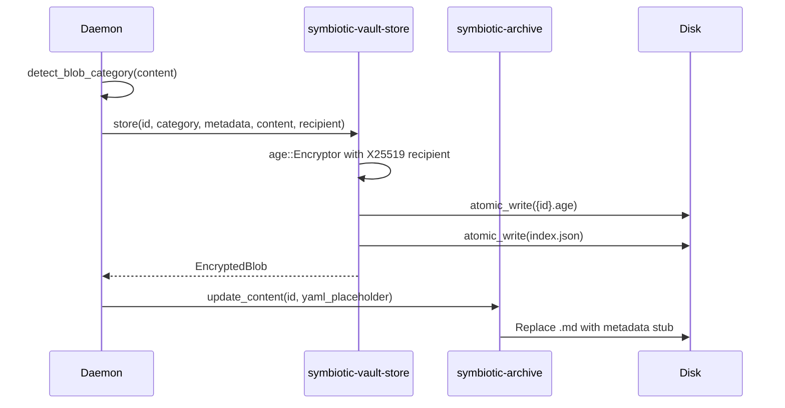
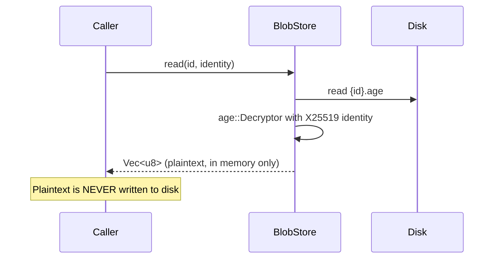
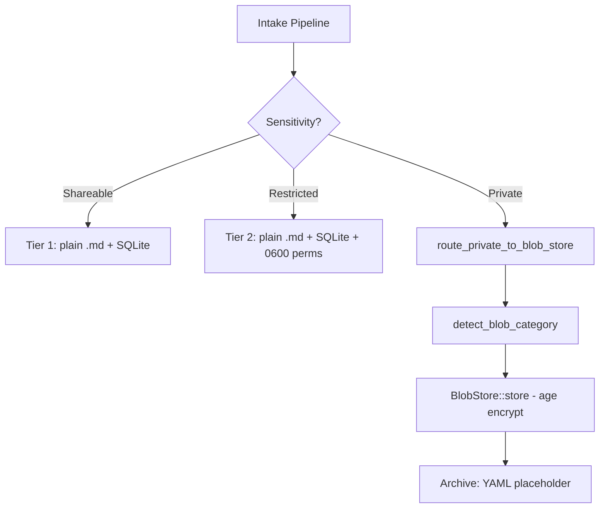
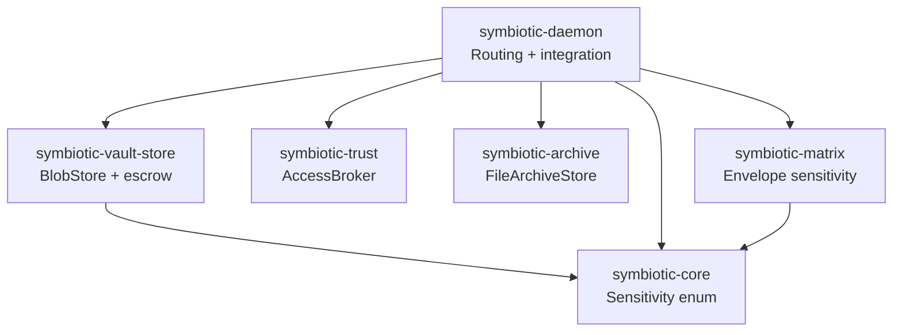
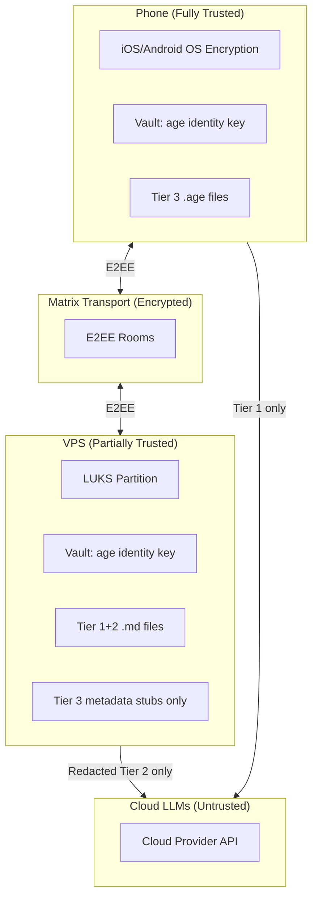

# Tiered Data Protection

> **Status**: Implemented (core), Phase 4 pending
> **Task**: `tasks/TASKS.md` -- T104
> **Replaces**: T89 (SQLCipher Encryption for Memory Store)
> **Related**: T67 (Privacy & Security Layer), T82 (Redaction Policy Engine), T101 (AI Provider Management)
> **Companion doc**: `docs/design/blob-key-escrow.md` (disaster recovery)
> **Architecture doc**: `docs/architecture/tiered-data-protection.md` (implemented behavior)

## Overview

Symbiotic uses a three-tier data protection model that maps the existing `Sensitivity` enum (`Shareable`, `Restricted`, `Private`) to progressively stronger storage, encryption, and access controls. Tier 1 and Tier 2 data are stored as plain Markdown files protected by LUKS full-disk encryption on the VPS. Tier 3 (Private) data is individually encrypted using the [age](https://age-encryption.org/) format (X25519 + ChaCha20-Poly1305) and stored in a dedicated blob store with metadata-only YAML placeholders in the Archive. A phone-only mode (default: enabled) prevents Tier 3 content from syncing to the VPS. Key escrow via Argon2id + XChaCha20-Poly1305 enables disaster recovery without compromising the security model.

## Sensitivity Tiers

### Tier 1 -- Shareable (Standard Protection)

| Aspect | Detail |
|--------|--------|
| **Content** | Public knowledge, tech notes, bookmarks, open research |
| **Storage** | Plain `.md` files in Archive store + SQLite FTS5 indexes |
| **Protection** | VPS full-disk encryption (LUKS2/dm-crypt) handles at-rest |
| **Location** | VPS + phone (synced via E2EE Matrix rooms) |
| **LLM routing** | Any provider (cloud, self-hosted, local) |
| **Filesystem** | Standard permissions (0644) |

### Tier 2 -- Restricted (Elevated Protection)

| Aspect | Detail |
|--------|--------|
| **Content** | Personal reflections, goals, relationship notes, work context |
| **Storage** | Plain `.md` files + SQLite indexes (same format as Tier 1) |
| **Protection** | LUKS full-disk encryption + hardened filesystem permissions (0600) |
| **Location** | VPS + phone |
| **LLM routing** | Local or SelfHosted providers only (T101); content redacted before cloud models (T82) |
| **Access logging** | All reads logged in the trust audit trail |

### Tier 3 -- Private (Vault-Grade Protection)

| Aspect | Detail |
|--------|--------|
| **Content** | Medical records, financial data, legal documents, credentials |
| **Storage** | Age-encrypted `.age` blobs in `symbiotic-vault-store`; metadata-only YAML placeholder in Archive |
| **Protection** | Per-item age encryption (X25519 + ChaCha20-Poly1305); decrypted content held only in memory |
| **Location** | Phone-only by default (`tier3_phone_only: true`); VPS receives metadata-only stubs via Matrix |
| **LLM routing** | Never sent to cloud models |
| **Access** | Requires `CredentialAccess` trust level; decrypted only when explicitly requested |

### Tier Comparison Matrix

| Property | Tier 1 (Shareable) | Tier 2 (Restricted) | Tier 3 (Private) |
|----------|-------------------|--------------------|--------------------|
| Disk encryption | LUKS | LUKS | LUKS + per-blob age |
| File permissions | 0644 | 0600 | 0600 (`.age` files) |
| Cloud LLM access | Yes | Redacted first | Never |
| Syncs to VPS | Yes | Yes | Opt-in (default: no) |
| Search without decryption | Full-text | Full-text | Metadata only |
| Key required to read | None (LUKS at boot) | None (LUKS at boot) | age identity key |
| Access audit | Standard | Enhanced | Full |

## Encryption Architecture

### Component 1: LUKS Full-Disk Encryption (VPS)

LUKS2/dm-crypt encrypts the entire data partition on the VPS. This covers all data at rest -- `.md` files, SQLite databases, config files, logs -- with zero application-level changes.

```bash
# During VPS provisioning (one-time)
cryptsetup luksFormat /dev/sdb                    # data partition
cryptsetup luksOpen /dev/sdb symbiotic-data
mkfs.ext4 /dev/mapper/symbiotic-data
mount /dev/mapper/symbiotic-data /var/lib/symbiotic
```

**LUKS key management options** (user chooses during setup wizard):

| Method | Security | Convenience | When |
|--------|----------|-------------|------|
| Passphrase at boot | High | Low (manual unlock on reboot) | Self-hosted, infrequent reboots |
| Key file on separate volume | Medium | Medium | Managed hosting |
| Network-bound (Tang/Clevis) | Medium | High (auto-unlock on trusted network) | Always-on VPS |
| Vault-sealed (TPM) | High | High | Hardware with TPM |

### Component 2: Age-Encrypted Blob Store (Tier 3)

Individual sensitive entries are encrypted using age (X25519 key agreement + ChaCha20-Poly1305 AEAD). The `symbiotic-vault-store` crate provides the encrypted blob store.

**Encryption flow:**



**Decryption flow** (on-demand, in-memory only):



### Component 3: Key Escrow (Disaster Recovery)

The age identity key is backed up via password-derived key escrow. See `docs/design/blob-key-escrow.md` for the full design.

**Summary**: The identity key is encrypted with Argon2id(passphrase) + XChaCha20-Poly1305 and stored as a ~153-byte escrow blob. The blob is safe to store on any untrusted medium (VPS, USB, cloud) because it is useless without the passphrase.

### Component 4: Sensitivity-Driven Storage Routing

The intake pipeline routes data to the correct storage tier based on the `Sensitivity` classification:



### Component 5: Phone-Only Mode for Tier 3

When `tier3_phone_only: true` (default), Private content stays on the device:

- **Send path**: `redact_to_placeholder()` strips content from outbound Matrix envelopes, replacing it with `"[Private content -- phone only]"`.
- **Receive path**: `should_skip_tier3_event()` filters out incoming events tagged with `private` sensitivity.
- The phone stores `.age` files locally, with iOS/Android filesystem encryption as the base layer.

## Rust Types & Traits

### `symbiotic-core` -- Sensitivity Enum (existing)

```rust
// submodules/runtime/crates/symbiotic-core/src/lib.rs

/// Content sensitivity level for routing decisions.
#[derive(Debug, Clone, Copy, PartialEq, Eq, PartialOrd, Ord, Hash, Serialize, Deserialize)]
#[serde(rename_all = "lowercase")]
pub enum Sensitivity {
    Shareable,
    Restricted,
    Private,
}
```

### `symbiotic-vault-store` -- Blob Store Types

```rust
// submodules/runtime/crates/symbiotic-vault-store/src/types.rs

#[derive(Debug, Clone, PartialEq, Eq, Hash, Serialize, Deserialize)]
#[serde(rename_all = "lowercase")]
pub enum BlobCategory {
    Medical,
    Financial,
    Legal,
    Credential,
    Custom(String),
}

#[derive(Debug, Clone, PartialEq, Eq, Serialize, Deserialize)]
pub struct BlobMetadata {
    pub title: String,
    pub tags: Vec<String>,
    pub size_bytes: u64,
    pub content_type: String,
}

#[derive(Debug, Clone, PartialEq, Eq, Serialize, Deserialize)]
pub struct EncryptedBlob {
    pub id: String,
    pub category: BlobCategory,
    pub created_at: u64,
    pub metadata: BlobMetadata,
}
```

### `symbiotic-vault-store` -- BlobStore

```rust
// submodules/runtime/crates/symbiotic-vault-store/src/store.rs

pub struct BlobStore {
    root: PathBuf,
}

impl BlobStore {
    pub fn new(root: PathBuf) -> Result<Self, VaultStoreError>;

    /// Encrypt and store content. Upserts on same id.
    pub fn store(
        &self,
        id: &str,
        category: BlobCategory,
        metadata: BlobMetadata,
        content: &[u8],
        recipient: &Recipient,
    ) -> Result<EncryptedBlob, VaultStoreError>;

    /// Decrypt and read. Plaintext in memory only.
    pub fn read(&self, id: &str, identity: &Identity) -> Result<Vec<u8>, VaultStoreError>;

    /// List by optional category filter. No decryption.
    pub fn list(&self, category: Option<&BlobCategory>) -> Result<Vec<EncryptedBlob>, VaultStoreError>;

    /// Delete blob and .age file from disk.
    pub fn delete(&self, id: &str) -> Result<(), VaultStoreError>;

    /// Re-encrypt all blobs: decrypt with old key, encrypt with new.
    pub fn rotate_key(
        &self,
        old_identity: &Identity,
        new_recipient: &Recipient,
    ) -> Result<u32, VaultStoreError>;

    pub fn root(&self) -> &Path;
}
```

### `symbiotic-vault-store` -- Error Type

```rust
// submodules/runtime/crates/symbiotic-vault-store/src/error.rs

#[derive(Debug, Error)]
pub enum VaultStoreError {
    #[error("I/O error: {0}")]           Io(#[from] std::io::Error),
    #[error("JSON error: {0}")]          Json(#[from] serde_json::Error),
    #[error("encryption error: {0}")]    Encrypt(String),
    #[error("decryption error: {0}")]    Decrypt(String),
    #[error("blob not found: {0}")]      NotFound(String),
    #[error("blob file missing on disk: {0}")] FileMissing(String),
    #[error("no recipients provided for encryption")] NoRecipients,
}
```

### `symbiotic-vault-store` -- Key Escrow

```rust
// submodules/runtime/crates/symbiotic-vault-store/src/escrow.rs

#[derive(Debug, Clone)]
pub struct EscrowKdfParams {
    pub memory_kib: u32,    // default: 262_144 (256 MiB)
    pub iterations: u32,    // default: 3
    pub parallelism: u32,   // default: 4
}

#[derive(Debug, Error)]
pub enum EscrowError {
    InvalidFormat,
    UnsupportedVersion(String),
    DecryptionFailed,
    PassphraseTooWeak(String),
    Kdf(String),
    Encrypt(String),
}

/// Create escrow blob: "SYMESC1" || salt(32) || nonce(24) || ciphertext+tag
pub fn create_escrow(identity: &Identity, passphrase: &str, params: &EscrowKdfParams) -> Result<Vec<u8>, EscrowError>;

/// Recover identity from escrow blob + passphrase
pub fn recover_escrow(escrow_blob: &[u8], passphrase: &str, params: &EscrowKdfParams) -> Result<Identity, EscrowError>;

/// Validate passphrase: >= 12 chars OR >= 4 words
pub fn validate_passphrase(passphrase: &str) -> Result<(), EscrowError>;

/// Re-encrypt escrow blob with new passphrase
pub fn change_passphrase(blob: &[u8], old: &str, new: &str, params: &EscrowKdfParams) -> Result<Vec<u8>, EscrowError>;
```

### `symbiotic-matrix` -- Sensitivity on Envelopes

```rust
// Envelope sensitivity methods (existing)
impl MatrixEventEnvelope {
    pub fn with_sensitivity(self, sensitivity: &str) -> Self;
    pub fn sensitivity(&self) -> Option<&str>;
    pub fn is_private(&self) -> bool;
    pub fn redact_to_placeholder(mut self) -> Self;
}
```

### Daemon Integration Functions

```rust
// submodules/runtime/services/symbiotic-daemon/src/lib.rs

/// Initialize blob store from config. Returns (None, None) on failure (graceful degradation).
pub fn init_blob_store(config: &DaemonConfig) -> (Option<BlobStore>, Option<AgeRecipient>);

/// Classify content into a BlobCategory by keyword matching.
pub fn detect_blob_category(content: &str) -> BlobCategory;

/// Route a Private document to the age-encrypted blob store, replacing archive content
/// with a metadata-only YAML placeholder.
pub fn route_private_to_blob_store(
    archive: &mut FileArchiveStore,
    blob_store: &BlobStore,
    recipient: &AgeRecipient,
    record_id: &str,
    content: &str,
    title: &str,
) -> Result<()>;
```

## Module Layout

```
submodules/runtime/
├── crates/
│   ├── symbiotic-core/src/
│   │   └── lib.rs              # Sensitivity enum, harden_file_permissions()
│   ├── symbiotic-vault-store/  # NEW CRATE for T104
│   │   ├── Cargo.toml          # deps: age, serde, serde_json, uuid, thiserror, tempfile,
│   │   │                       #       argon2, chacha20poly1305, rand
│   │   └── src/
│   │       ├── lib.rs           # Re-exports BlobStore, types, keys module
│   │       ├── store.rs         # BlobStore: encrypt, decrypt, rotate, CRUD
│   │       ├── types.rs         # BlobCategory, BlobMetadata, EncryptedBlob
│   │       ├── error.rs         # VaultStoreError
│   │       └── escrow.rs        # Key escrow: create, recover, change passphrase
│   ├── symbiotic-trust/src/     # Existing: AccessBroker, CapabilityToken, AgentTrustLevel
│   ├── symbiotic-archive/src/   # Existing: FileArchiveStore (update_content for placeholders)
│   └── symbiotic-matrix/src/    # Existing: MatrixEventEnvelope sensitivity methods
└── services/
    └── symbiotic-daemon/src/
        └── lib.rs               # init_blob_store(), detect_blob_category(),
                                 # route_private_to_blob_store()
```

### Crate Dependency Graph



## Integration Plan

### How it connects to existing code

1. **Intake pipeline** (`symbiotic-daemon/src/lib.rs`): After `run_intake_embeddings()` classifies a document's sensitivity, `route_private_to_blob_store()` is called for Private entries. This encrypts the content and replaces the archive entry with a YAML placeholder.

2. **Archive store** (`symbiotic-archive`): `FileArchiveStore::update_content()` overwrites the `.md` file with a metadata-only YAML stub:
   ```yaml
   ---
   blob_id: {record_id}
   status: encrypted
   category: {category}
   title: {title}
   ---
   > This entry is Tier 3 (Private). Content is stored in the age-encrypted blob store.
   ```
   The title is prefixed with `[encrypted]` and the tag `tier3/encrypted` is added.

3. **Matrix transport** (`symbiotic-matrix`): `MatrixEventEnvelope::with_sensitivity()` tags outbound events. When `tier3_phone_only` is true, `redact_to_placeholder()` strips Private content before sending. `should_skip_tier3_event()` filters inbound Private events.

4. **Provider routing** (`symbiotic-providers`): The `ProviderRouter` already routes Restricted content to Local/SelfHosted providers and blocks Private content from cloud models. No changes needed.

5. **Redaction engine** (`symbiotic-redaction`, T82): Handles PII stripping for Restricted content before cloud access. Independent of and complementary to tiered data protection.

6. **Trust system** (`symbiotic-trust`): Tier 3 decryption requires `CredentialAccess` trust level. The AccessBroker gates blob read operations.

## Config Schema

### Daemon Configuration

```rust
pub struct DaemonConfig {
    // ... existing fields ...

    /// Root directory for the age-encrypted blob store (Tier 3).
    /// Default: "data/blob-store"
    pub blob_store_root: PathBuf,

    /// Path to the age identity (secret key) file for blob store encryption.
    /// When None, Tier 3 encryption is disabled (graceful degradation).
    pub blob_store_key_file: Option<PathBuf>,

    /// When true (default), Tier 3 content stays on the phone only.
    /// The daemon redacts outbound Private envelopes and filters inbound ones.
    pub tier3_phone_only: bool,
}
```

### Environment Variables

```bash
# Blob store configuration
SYMBIOTIC_BLOB_STORE_ROOT="data/blob-store"
SYMBIOTIC_BLOB_STORE_KEY_FILE="data/blob-store.key"
SYMBIOTIC_TIER3_PHONE_ONLY="true"
```

### User Settings (`providers.toml`)

```toml
[data_protection]
tier3_sync_to_vps = false    # inverse of tier3_phone_only; default false
tier3_categories = ["medical", "financial", "legal", "credential"]
```

### Age Key Generation

```bash
# Generate a new age X25519 identity key
age-keygen -o data/blob-store.key
# File contains: AGE-SECRET-KEY-1...
# Parsed by age::x25519::Identity::from_str()
# Public key (recipient) derived at startup: identity.to_public()
```

## Threat Model

### What Each Tier Protects Against

| Threat | Tier 1 (Shareable) | Tier 2 (Restricted) | Tier 3 (Private) |
|--------|-------------------|--------------------|--------------------|
| **Disk theft / snapshot** | LUKS blocks access | LUKS blocks access | LUKS + age blocks access |
| **VPS runtime compromise (root)** | NOT protected | NOT protected (read file) | Protected -- attacker needs age key from Vault |
| **Cloud LLM data leak** | N/A (shareable) | Redacted before cloud access | Never sent to cloud |
| **Network eavesdrop** | E2EE Matrix | E2EE Matrix | E2EE Matrix + not synced to VPS |
| **Hosting provider insider** | LUKS blocks raw disk reads | LUKS blocks raw disk reads | LUKS + age; content not on VPS (phone-only) |
| **Decommissioned hardware** | LUKS renders data unreadable | LUKS renders data unreadable | LUKS + age, double protection |
| **Prompt injection exfiltration** | Content is public anyway | Redaction removes PII | Content never reaches LLM |

### Trust Boundaries



### What is NOT Protected (and Why)

| Gap | Reason | Mitigation |
|-----|--------|------------|
| Tier 1+2 data visible to root on running VPS | LUKS only protects at-rest, not runtime | Future: Confidential Computing (AMD SEV/Intel TDX) |
| Tier 3 metadata (titles, tags, categories) visible without decryption | Needed for search/listing without key access | Use generic titles for maximum privacy |
| VPS operator can observe Matrix traffic patterns (not content) | E2EE protects content but not metadata | Future: transport padding, Tor integration |
| User forgets escrow passphrase + loses all devices | Intentional -- no backdoor by design | Paper backup of raw identity key; passphrase in password manager |
| Compromised phone has full Tier 3 access | Phone is the highest-trust device | iOS/Android OS-level protections; biometric app lock |

## Migration Plan

### For Existing Unencrypted Data

**Phase 1: LUKS** -- No data migration needed. LUKS encrypts the underlying partition transparently. Existing files are protected immediately after LUKS setup.

**Phase 2: Age blobs** -- Existing entries classified as Private need one-time migration:

```rust
/// One-time migration: scan archive for entries tagged as Private,
/// encrypt their content, replace with placeholders.
pub async fn migrate_private_entries(
    archive: &mut FileArchiveStore,
    blob_store: &BlobStore,
    recipient: &AgeRecipient,
) -> Result<MigrationReport> {
    let mut report = MigrationReport::default();
    for record in archive.list_all()? {
        if record.sensitivity == Some(Sensitivity::Private) {
            if let Some(content) = archive.read_content(&record.id)? {
                let category = detect_blob_category(&content);
                let metadata = BlobMetadata::from_archive_record(&record);
                blob_store.store(&record.id, category, metadata, content.as_bytes(), recipient)?;
                archive.update_content(&record.id, &yaml_placeholder(&record))?;
                report.migrated += 1;
            }
        }
    }
    Ok(report)
}
```

**Phase 3: Sensitivity routing** -- No migration. New entries are routed automatically. Existing entries without sensitivity classification default to `Shareable`.

**Phase 4: Phone-only mode** -- No migration for VPS data. When phone-only mode is enabled, future Private content stays local. Existing Tier 3 data already on VPS remains encrypted (`.age` files) and is not retroactively removed (user can manually delete if desired).

### Backward Compatibility

- Daemon starts normally without `blob_store_key_file` (Tier 3 disabled, graceful degradation)
- Existing `.md` files are not modified unless explicitly migrated
- `index.json` is created empty on first run
- Archive placeholders are valid `.md` files (YAML frontmatter)

## Key Decisions

1. **LUKS over per-file encryption for Tier 1+2**: Full-disk encryption is simpler, covers all files (`.md`, SQLite, config, logs), and has zero application overhead. Per-file encryption adds complexity without proportional benefit when the threat model is at-rest disk access.

2. **age over GPG/PGP for Tier 3**: age has a simpler, more auditable design with a pure Rust implementation (`age` crate). Uses X25519 key agreement + ChaCha20-Poly1305 AEAD. No keyring complexity, no legacy algorithm baggage.

3. **Keyword-based category detection (no LLM dependency)**: `detect_blob_category()` uses simple keyword matching (e.g., "diagnosis", "tax return", "contract", "password"). Security-critical classification must be deterministic, fast, and free of prompt-injection risk.

4. **Metadata stored unencrypted**: Blob metadata (title, tags, category) is stored in plaintext `index.json` to allow search/listing without decryption. Content is encrypted. Users who need metadata privacy can use generic titles.

5. **Phone-only default for Tier 3**: Sensitive data stays on device unless explicitly opted in to VPS sync. Defense in depth -- even if VPS is compromised, Tier 3 data is absent.

6. **No SQLCipher**: SQLCipher adds a C dependency (OpenSSL fork), only encrypts one SQLite database, doesn't cover `.md` files, and LUKS provides stronger at-rest protection for all files. This decision archives T89.

7. **Argon2id for escrow key derivation**: Memory-hard KDF (256 MiB / 3 iterations) resists GPU and ASIC brute-force. ~1 second on modern mobile hardware. Impractical for offline brute-force with >= 40 bits passphrase entropy.

8. **XChaCha20-Poly1305 for escrow encryption**: 192-bit nonce (safe for random generation without collision risk). Standard AEAD. Pure Rust via `chacha20poly1305` crate (RustCrypto).

9. **Graceful degradation**: Missing key file or invalid identity does not crash the daemon. `init_blob_store()` returns `(None, None)` and logs a warning; all Tier 3 routing is skipped. The daemon remains functional.

10. **Atomic writes**: Both `.age` files and `index.json` use write-to-temp-then-rename, preventing partial writes from corrupting the store.

## Implementation Phases

### Phase 1 -- LUKS Setup (VPS provisioning) [NOT YET STARTED]
- Add LUKS partition setup to VPS provisioning scripts (T85/T92)
- Add key management options to setup wizard
- Document manual LUKS setup for self-hosters
- **No runtime code changes** -- LUKS is transparent to applications

### Phase 2 -- Age-Encrypted Blob Store [IMPLEMENTED]
- `symbiotic-vault-store` crate with `BlobStore`, types, error handling
- `age` crate dependency (Apache-2.0/MIT, pure Rust)
- Key generation integrated into daemon startup
- 24 unit tests covering CRUD, rotation, wrong-key, edge cases
- Wired into daemon for Tier 3 storage routing

### Phase 3 -- Sensitivity-Driven Routing [IMPLEMENTED]
- Intake pipeline routes by sensitivity
- `detect_blob_category()` keyword-based classification
- Metadata-only indexing for Tier 3 entries
- Archive placeholder system
- Matrix envelope sensitivity tagging
- Phone-only mode (send-path redaction + receive-path filtering)

### Phase 4 -- Key Escrow [IMPLEMENTED (core), UI PENDING]
- `escrow.rs` module: `create_escrow()`, `recover_escrow()`, `validate_passphrase()`, `change_passphrase()`
- 20 unit tests covering roundtrip, wrong passphrase, corruption, strength validation
- **Pending**: Flutter UI for escrow creation during setup wizard
- **Pending**: Flutter UI for recovery flow
- **Pending**: Matrix event storage for escrow blob sync

### Phase 5 -- Phone-Only Mode Flutter Integration [NOT YET STARTED]
- Local blob store on phone
- Matrix sync filter for Tier 3 exclusion
- UI for managing Tier 3 data location
- Settings screen for tier3_sync_to_vps toggle

## Resolved Design Decisions (Approved 2026-02-23)

1. **LUKS provisioning: Semi-automated with verification gates.** Script does heavy lifting (`setup-luks.sh`), pauses at critical points for user confirmation, verifies each step before proceeding. Falls back to manual guide if detection fails. Rationale: full automation is fragile (LUKS errors = bricked VPS), but manual guide is too much friction.

2. **Migration trigger: Explicit CLI (`symbiotic migrate-private`).** Auto-migration on startup is destructive and irreversible (replaces .md content with placeholders). Explicit command lets user verify key works first (`symbiotic blob-store test`). Migration report is logged for auditability.

3. **Metadata encryption: No.** Keep metadata in plaintext for search/listing. Add a `redact_titles: true` config option later (P3) for users who want auto-generated opaque titles. Rationale: encrypting metadata kills UX; Tier 3 is phone-only by default so VPS metadata exposure is minimal.

4. **Multi-device key sync: Multi-recipient age encryption.** Each device gets its own age keypair (stored in iOS Keychain / Android KeyStore). Blobs are encrypted to all device pubkeys: `age::Encryptor::with_recipients(vec![dev1, dev2, ...])`. Adding a new device = re-encrypt blobs with new recipient added (rotation already implemented). Rationale: avoids SSSS coupling (fragile), simpler mental model, keys never transit the network.

5. **Escrow fingerprint: Yes, include 8-byte pubkey hash.** Enables "wrong escrow blob" vs "wrong passphrase" distinction during recovery. Leaked fingerprint reveals nothing useful — pubkey is already shared with Matrix recipients. Pure UX improvement with negligible security cost.

## Task Link

`tasks/TASKS.md` -- T104 (Tiered Data Protection)
