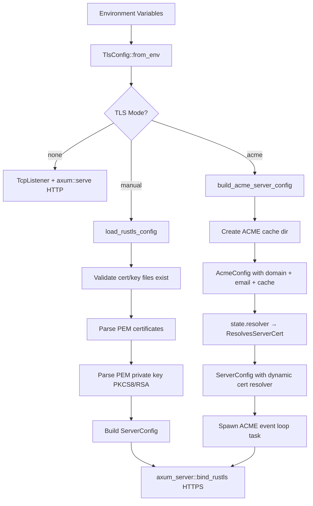

# TLS Configuration for Control-Plane API

## Overview

TLS certificate support for the control-plane API server, enabling HTTPS
with user-provided certificates or automatic Let's Encrypt provisioning.
Uses `rustls` (pure Rust) for TLS termination.

**Task**: Custom TLS certificate configuration + ACME auto-provisioning

## Scope

- **Control-plane API** (`submodules/control-plane/apps/control-api`): Full TLS support
  with manual certificate loading, ACME auto-provisioning, and HTTPS serving.
- **Daemon** (`submodules/runtime/services/symbiotic-daemon`): Not applicable. The daemon
  is a Matrix-based polling loop with no HTTP server. TLS for Matrix transport is handled
  by the Matrix homeserver (Conduit), not the daemon itself.

## TLS Modes

| Mode | Description | Environment Variables |
|------|-------------|----------------------|
| `none` (default) | Plain HTTP | None required |
| `manual` | User-provided PEM cert/key | `TLS_CERT_PATH`, `TLS_KEY_PATH` |
| `acme` | Automatic Let's Encrypt certificates | `ACME_DOMAIN`, `ACME_EMAIL` |

## Environment Variables

| Variable | Required | Description |
|----------|----------|-------------|
| `TLS_MODE` | No | `none` (default), `manual`, or `acme` |
| `TLS_CERT_PATH` | If manual | Path to PEM certificate file (full chain) |
| `TLS_KEY_PATH` | If manual | Path to PEM private key file (PKCS#8 or RSA) |
| `ACME_DOMAIN` | If acme | Domain for the certificate (e.g., `api.example.com`) |
| `ACME_EMAIL` | If acme | Contact email for Let's Encrypt notifications |
| `ACME_CACHE_DIR` | No | Certificate cache directory (default: `/var/lib/symbiotic/acme/`) |
| `ACME_STAGING` | No | Use Let's Encrypt staging (default: `true` for safety) |
| `SYMBIOTIC_ENV` | No | Set to `production` to warn when TLS is not configured |

## Key Design Decisions

- **rustls over openssl**: Pure Rust, no system dependency on libssl. Consistent
  behavior across platforms.
- **ACME via tokio-rustls-acme**: Uses the `tokio-rustls-acme` crate (v0.7) for
  automatic certificate provisioning. This crate provides a `ResolvesServerCert`
  implementation that handles TLS-ALPN-01 challenges on the same port as HTTPS
  traffic (no port 80 required).
- **Staging by default**: `ACME_STAGING=true` is the default to prevent accidentally
  hitting Let's Encrypt production rate limits during development. Must explicitly
  set `ACME_STAGING=false` for production certificates.
- **File-based certificate cache**: Certificates and account keys are cached in a
  local directory (`DirCache`) to survive restarts and avoid re-issuance.
- **Background certificate lifecycle**: A tokio task is spawned to drive the ACME
  state machine (acquisition, renewal, error handling). Certificate events are
  logged via `tracing`.
- **Fail-fast validation**: Certificate and key files are validated on startup.
  Mismatched pairs, missing files, and empty certificates produce clear error
  messages immediately.
- **No private key logging**: Private key contents are never logged or exposed
  in error messages.

## Components

| File | Purpose |
|------|---------|
| `apps/control-api/src/tls.rs` | TLS config parsing, cert loading, ACME state, rustls config |
| `apps/control-api/src/main.rs` | Conditional HTTPS/HTTP/ACME binding |

## Data Flow

## ACME Architecture

The ACME integration uses the low-level API from `tokio-rustls-acme`:

1. **AcmeConfig** — Configured with domain, contact email, cache directory, and
   Let's Encrypt directory URL (staging or production).
2. **AcmeState** — A stream that drives certificate acquisition and renewal.
   Polled by a background tokio task.
3. **ResolvesServerCertAcme** — A `rustls::server::ResolvesServerCert` implementation
   that dynamically serves the current certificate and handles TLS-ALPN-01 challenges.
4. **DirCache** — File-based persistence for account keys and certificates.

The resolver is plugged into a standard `rustls::ServerConfig` which is then passed
to `axum_server::bind_rustls`, keeping the existing server infrastructure unchanged.

### TLS-ALPN-01 Challenge

ACME uses the TLS-ALPN-01 challenge method, which means:
- No separate port 80 listener needed
- Challenge responses are served on the same port as HTTPS traffic (443)
- The ACME resolver automatically handles challenge requests during the TLS handshake

### Requirements for ACME Mode

- The server must be accessible on port 443 from the internet
- DNS must be configured to point the domain to the server's IP
- The ACME cache directory must be writable

## Error Handling

- Missing cert/key files: `bail!` with file path
- Empty certificate file: `bail!` with "no valid certificates"
- Invalid key format: `bail!` with "no valid PKCS#8 or RSA keys"
- Mismatched cert/key: `bail!` with "certificate and key may be mismatched"
- Missing ACME domain/email: `bail!` with "ACME_DOMAIN/ACME_EMAIL is required"
- ACME cache dir creation failure: `bail!` with directory path
- ACME certificate errors: logged via `tracing::error!`, server continues running
  (will retry automatically)
- All config errors prevent startup (fail fast)

## Testing

### Mode Parsing
- `tls_mode_parse_none` / `tls_mode_parse_manual` / `tls_mode_parse_acme`
- `tls_mode_parse_unknown_fails`

### ACME Configuration
- `acme_staging_url_selection` — staging vs production URL constants
- `acme_config_env_parsing` — domain/email required, staging default true,
  staging false variants, TlsConfig acme mode validation
- `tls_config_acme_build_rustls_config_errors` — build_rustls_config rejects Acme mode
- `build_acme_server_config_creates_cache_dir` — cache directory auto-creation
- `build_acme_server_config_missing_options_errors` — missing ACME options

### Manual TLS
- `load_rustls_config_missing_cert_file`
- `load_rustls_config_empty_cert_file`
- `load_rustls_config_valid_cert_and_key` (real EC P-256 cert/key)
- `tls_config_none_returns_no_rustls`
