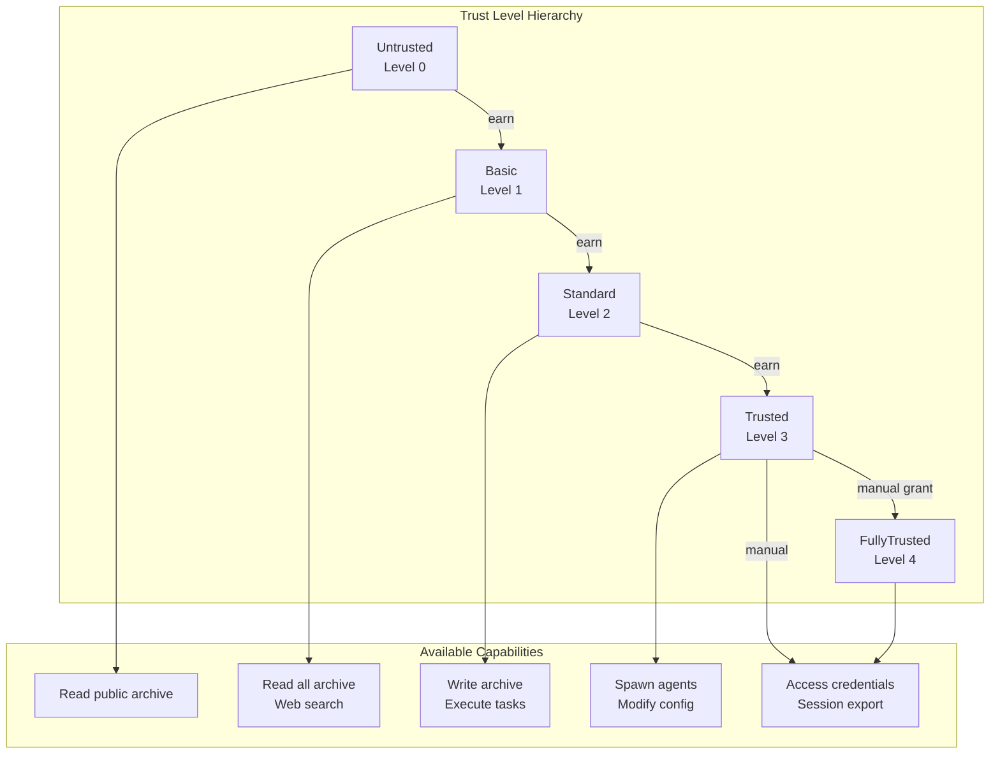
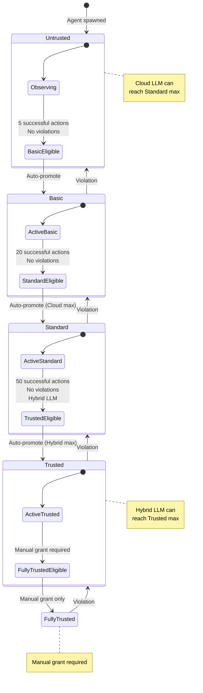
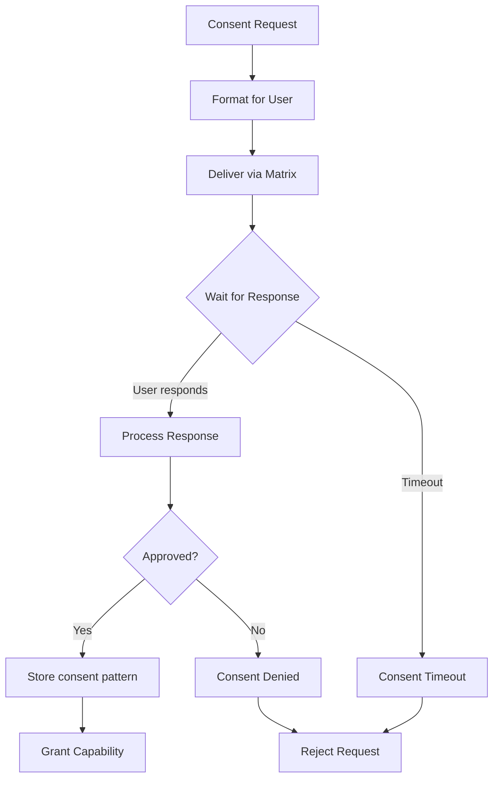
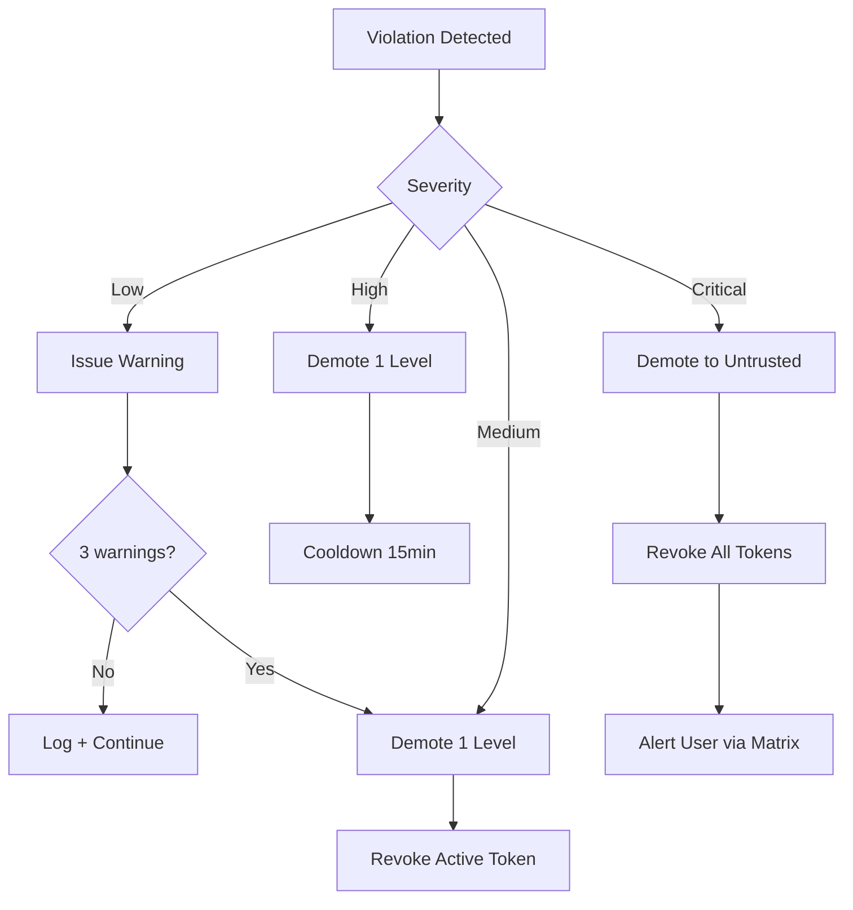
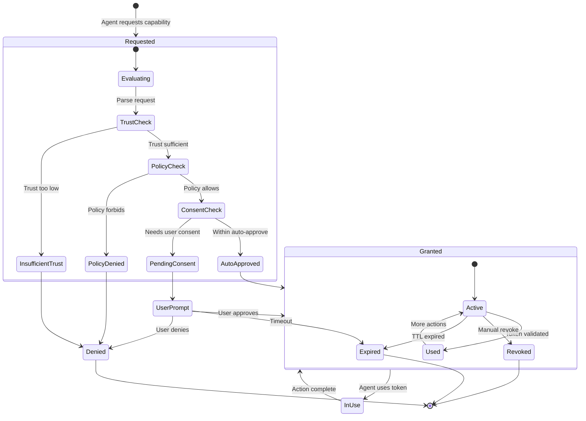
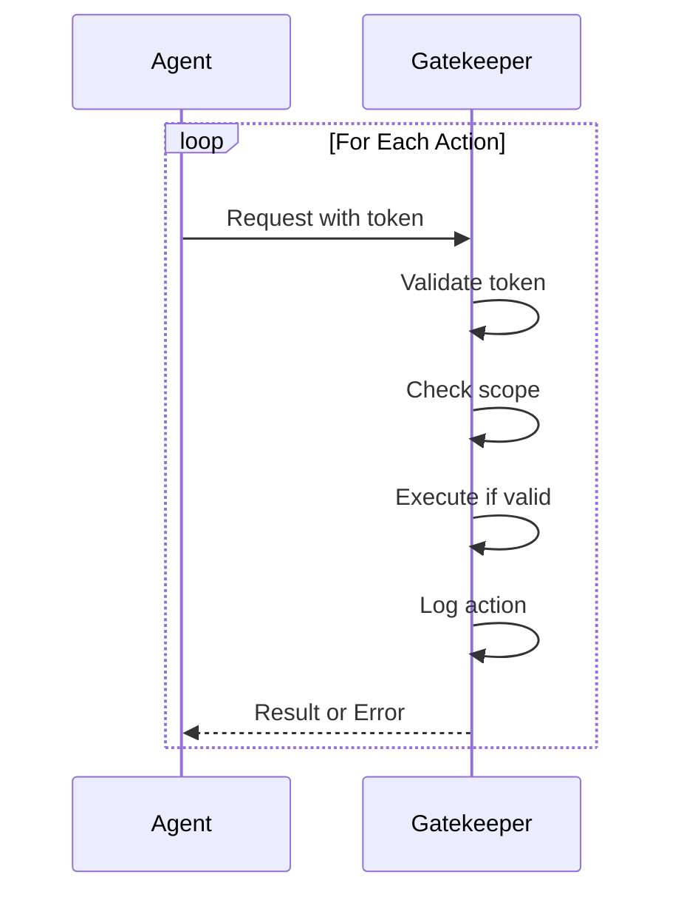
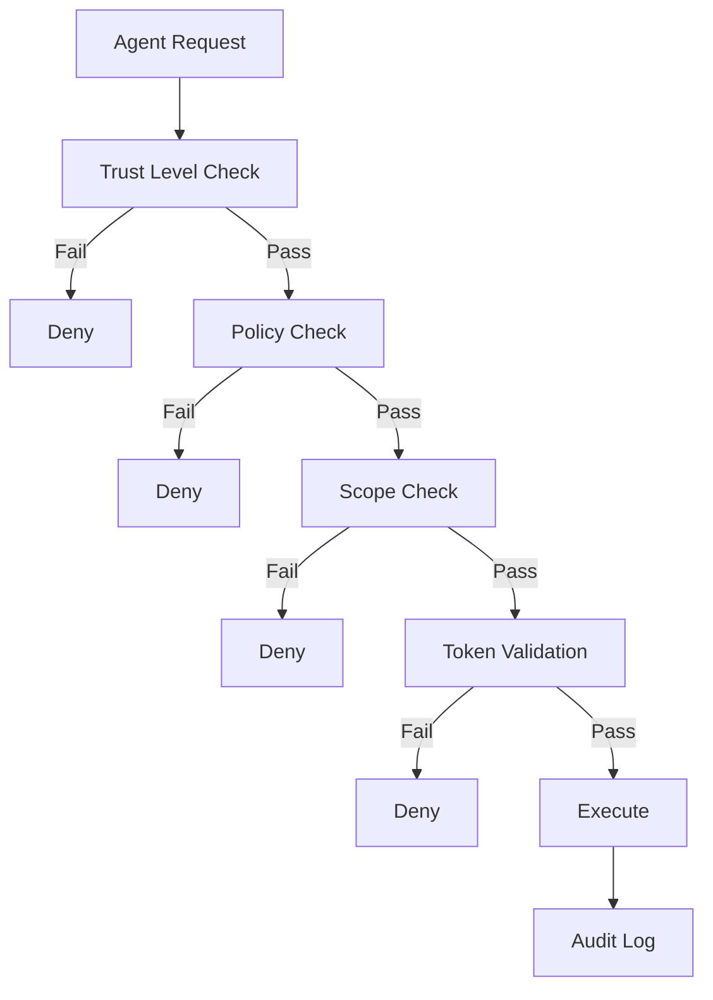
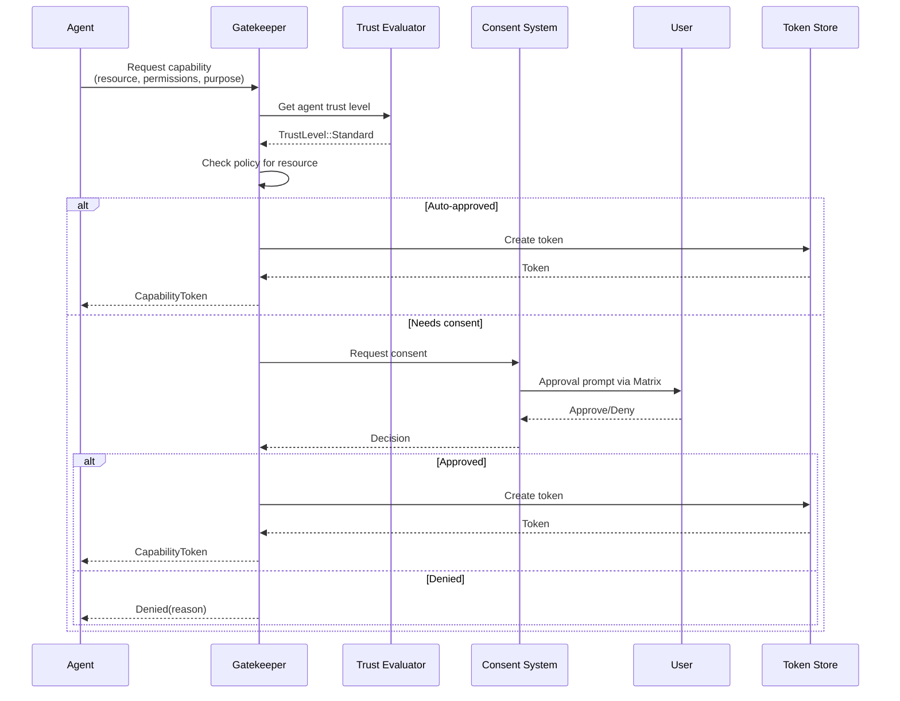
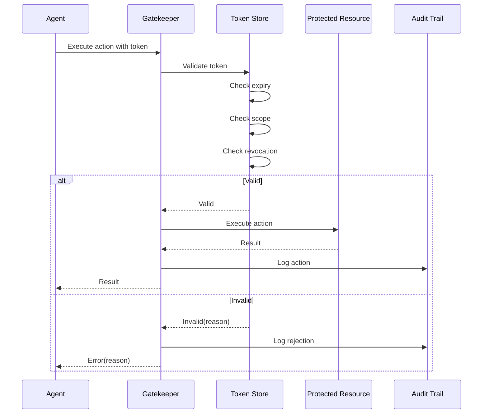
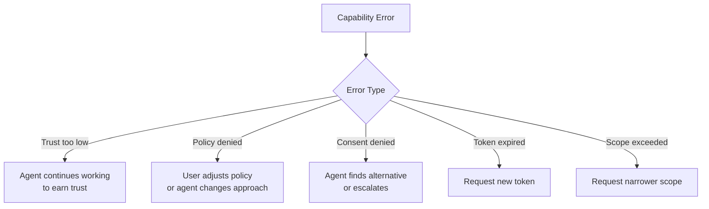

# Trust & Capabilities -- Planned Design

This document captures planned but not-yet-implemented trust and capability features. These designs extend the four-level MVP system into a richer security model with consent workflows, audit trails, trust progression, and policy-driven access control.

Current implementation: see `docs/architecture/trust-capabilities.md`

**Status**: Planned (Approved)
**Task**: T59 (Trust Level Framework)
**Depends on**: T67 (Privacy & Security Layer)

---

## Overview

The MVP implements four trust levels via the `AgentTrustLevel` enum (`ReadOnly`/`ArchiveWrite`/`CredentialAccess`/`ExternalAct`), capability tokens, and an AccessBroker (Gatekeeper) with scope/expiry/subject checks. This design doc covers the next layer:

- **5-level trust hierarchy** (`TrustLevel` enum: `Untrusted`/`Basic`/`Standard`/`Trusted`/`FullyTrusted`) with LLM-type ceilings
- **Consent system** for user approval via Matrix
- **Audit trail** for all capability events
- **Trust progression** through observed behavior
- **Policy engine** with auto-approve / require-consent / deny rules

## Components

| Component | Purpose | Status |
|-----------|---------|--------|
| **Trust Evaluator** | Determines agent trust level dynamically | Planned |
| **Consent System** | Manages user approvals via Matrix | Planned |
| **Audit Trail** | Records all capability usage | Planned |
| **Policy Engine** | Configurable rules per resource/trust level | Planned |
| **Trust Progression** | Earns/demotes trust based on behavior | Planned |

## Extended Trust Hierarchy

The MVP's four levels expand to five, adding granularity for agent management and credential handling:



### Level Details

| Level | Value | LLM Types | Auto-Approve | Manual-Approve | Never |
|-------|-------|-----------|--------------|----------------|-------|
| **Untrusted** | 0 | New agents | Public archive read | - | Everything else |
| **Basic** | 1 | Cloud Haiku | Archive read, web search | File read | Write ops |
| **Standard** | 2 | Cloud Sonnet | Archive read/write, tasks, `session:handle` | File write, external APIs | `credential:read`, `session:export`, `payment:use`, `ssh:sign` |
| **Trusted** | 3 | Hybrid | Spawn agents, config, external APIs, `session:handle` | `session:export`, `payment:use`, `ssh:sign` | `credential:read` (local-only) |
| **FullyTrusted** | 4 | Any (manual grant) | Everything | - | - |

### LLM Type Limits

Each LLM type has a ceiling on attainable trust:

```rust
impl TrustLevel {
    /// Maximum trust level attainable by LLM type
    pub fn max_for_llm(llm: &LlmType) -> Self {
        match llm {
            LlmType::Local { .. } => TrustLevel::FullyTrusted,
            LlmType::Cloud { .. } => TrustLevel::Standard,
            LlmType::Hybrid { .. } => TrustLevel::Trusted,
        }
    }
}
```

**Rationale:** Cloud LLMs face prompt injection and data exfiltration risks. Local LLMs get the highest ceiling because they have a reduced exfiltration surface (no cloud logging, no network egress by default). Credential operations are handled by the Auth Script Engine (infrastructure), not by any LLM type — so the LLM trust ceiling is about general capability access, not credential handling. Hybrid agents get an intermediate ceiling.

## Trust Progression

Agents start at Untrusted and earn trust through successful actions without violations.



**Key rules:**
- Promotion is automatic when thresholds are met (except FullyTrusted, which requires manual grant)
- Violations cause immediate demotion by one level
- LLM type ceiling is enforced regardless of action count

## Consent System

### Consent Request Flow

When a capability request falls into the "require consent" policy bucket, the system prompts the user via Matrix:



### Consent Persistence

To reduce prompt fatigue, approved consent patterns are stored and matched against future requests:

```rust
/// Persistent consent patterns to reduce prompts
#[derive(Debug, Clone)]
pub struct ConsentPattern {
    /// Resource type this applies to
    pub resource_type: ResourceType,

    /// Specific resource (e.g., domain)
    pub resource_filter: Option<String>,

    /// Permissions covered
    pub permissions: Vec<Permission>,

    /// When this consent was given
    pub consented_at: DateTime<Utc>,

    /// Expiry (if any)
    pub expires_at: Option<DateTime<Utc>>,

    /// Context when consent was given
    pub context: ConsentContext,
}

impl ConsentSystem {
    /// Check if prior consent covers this request
    fn has_prior_consent(
        &self,
        resource: &Resource,
        permissions: &[Permission],
    ) -> Option<&ConsentPattern> {
        self.patterns.iter().find(|p| {
            p.covers(resource, permissions) && !p.is_expired()
        })
    }
}
```

### Consent Timeout Policy

**Default: DENY on timeout.** If the user does not respond within the configured window, the request is rejected. This is a security-critical default -- granting on timeout would allow attackers to issue requests when users are unavailable.

```rust
pub struct ConsentConfig {
    /// How long to wait for user response before denying
    pub timeout: Duration,           // default: 5 minutes

    /// Maximum number of pending consent requests per agent
    pub max_pending_per_agent: usize, // default: 3

    /// Whether to batch similar requests
    pub batch_similar: bool,          // default: true
}

impl Default for ConsentConfig {
    fn default() -> Self {
        Self {
            timeout: Duration::from_secs(300),
            max_pending_per_agent: 3,
            batch_similar: true,
        }
    }
}
```

**Timeout behavior:**
- Timeout -> DENY (never GRANT)
- Agent receives `ConsentDenied { reason: "timeout" }`
- Event logged to audit trail as `ConsentTimeout`
- Agent may re-request after a cooldown period (default: 60s)

### Consent Persistence

**Design decisions:**
- Consent patterns are time-bounded and revocable
- Similar requests auto-approve if a matching pattern exists
- All consent events (grant, denial, auto-match) appear in the audit trail
- User can list and revoke stored patterns

## Violation Taxonomy

Violations trigger immediate trust demotion by one level and are recorded in the audit trail.

### Violation Categories

| Category | Severity | Examples | Response |
|----------|----------|----------|----------|
| **Scope Violation** | Medium | Accessing resource outside granted scope | Demote 1 level, revoke token |
| **Rate Violation** | Low | Exceeding rate limits on a resource | Warning (3 warnings = demote) |
| **Exfiltration Attempt** | Critical | Attempting to send credentials to external endpoint | Demote to Untrusted, revoke all tokens, alert user |
| **Unauthorized Escalation** | High | Requesting capabilities above LLM ceiling | Demote 1 level, cooldown period |
| **Policy Bypass** | Critical | Attempting to access resources without token | Demote to Untrusted, revoke all tokens |
| **Consent Manipulation** | Critical | Re-requesting denied consent within cooldown | Demote to Untrusted, alert user |

### Violation Response Actions

```rust
#[derive(Debug, Clone, Serialize, Deserialize)]
pub struct Violation {
    pub id: Uuid,
    pub timestamp: DateTime<Utc>,
    pub agent_id: AgentId,
    pub category: ViolationCategory,
    pub severity: ViolationSeverity,
    pub details: String,
    pub action_taken: ViolationAction,
}

#[derive(Debug, Clone, Copy, Serialize, Deserialize)]
pub enum ViolationSeverity {
    Low,      // warning, 3 accumulate to Medium
    Medium,   // immediate 1-level demotion
    High,     // immediate 1-level demotion + cooldown
    Critical, // demote to Untrusted + revoke all + alert
}

#[derive(Debug, Clone, Copy, Serialize, Deserialize)]
pub enum ViolationCategory {
    ScopeViolation,
    RateViolation,
    ExfiltrationAttempt,
    UnauthorizedEscalation,
    PolicyBypass,
    ConsentManipulation,
}

#[derive(Debug, Clone, Serialize, Deserialize)]
pub enum ViolationAction {
    Warning { warning_count: u32 },
    Demotion { from: TrustLevel, to: TrustLevel },
    TokenRevocation { token_ids: Vec<Uuid> },
    Cooldown { duration: Duration },
    UserAlert { message: String },
}
```

### Severity-to-Action Mapping



## Audit Trail

### Audit Entry Structure

```rust
#[derive(Debug, Clone)]
pub struct AuditEntry {
    pub id: Uuid,
    pub timestamp: DateTime<Utc>,
    pub event_type: AuditEventType,
    pub token_id: Option<Uuid>,
    pub agent_id: Option<AgentId>,
    pub resource: Option<Resource>,
    pub operation: Option<Operation>,
    pub result: AuditResult,
    pub context: serde_json::Value,
}

#[derive(Debug, Clone)]
pub enum AuditEventType {
    CapabilityGranted,
    CapabilityDenied,
    CapabilityUsed,
    CapabilityRevoked,
    CapabilityExpired,
    TrustLevelChanged,
    PolicyViolation,
}

#[derive(Debug, Clone)]
pub enum AuditResult {
    Success,
    Denied(String),
    Error(String),
}
```

### Audit Storage

```rust
impl AuditTrail {
    /// Log an audit entry
    pub async fn log(&self, entry: AuditEntry) -> Result<()> {
        // Append to daily JSONL file
        let log_path = self.log_dir.join(format!(
            "audit-{}.jsonl",
            entry.timestamp.format("%Y-%m-%d")
        ));

        let line = serde_json::to_string(&entry)?;
        fs::append(&log_path, format!("{}\n", line)).await?;

        // Also store in searchable index
        self.index.insert(&entry).await?;

        Ok(())
    }

    /// Query audit history
    pub async fn query(&self, filter: AuditFilter) -> Result<Vec<AuditEntry>> {
        self.index.query(filter).await
    }
}
```

### Audit Storage Format

**Format:** Append-only JSON Lines (JSONL) files, one per day.

**Location:** `data/audit/audit-YYYY-MM-DD.jsonl`

**Example line:**
```json
{"id":"550e8400-e29b-41d4-a716-446655440000","timestamp":"2026-02-06T14:30:00Z","event_type":"CapabilityGranted","token_id":"a1b2c3","agent_id":"agent-web-search","resource":{"type":"Web","domains":["example.com"]},"operation":"Read","result":"Success","context":{"trust_level":"Standard","policy":"auto_approve"}}
```

**Retention:** 90 days local, then compressed to `.jsonl.zst` archives.

**Integrity:** Each file includes a trailing SHA-256 checksum line prefixed with `#checksum:` to detect tampering. The checksum covers all preceding lines.

**Index:** SQLite index at `data/audit/audit-index.db` for queries. Rebuilt from JSONL files on startup if missing or corrupt.

**Design decisions:**
- Daily JSONL files for append-only durability
- Separate searchable SQLite index for queries (rebuilt from source JSONL on demand)
- Every capability grant, denial, use, revocation, and expiry is logged
- Trust level changes and policy violations are also audit events
- Checksum per file for tamper detection

## Policy Engine

### Policy Structure

```rust
#[derive(Debug, Clone)]
pub struct AccessPolicy {
    /// Resource type this policy applies to
    pub resource_type: ResourceType,

    /// Rules for each trust level
    pub rules: HashMap<TrustLevel, PolicyRule>,

    /// Default TTL for tokens
    pub default_ttl: Duration,

    /// Maximum TTL for tokens
    pub max_ttl: Duration,
}

#[derive(Debug, Clone)]
pub struct PolicyRule {
    /// Permissions that are auto-approved
    pub auto_approve: Vec<Permission>,

    /// Permissions that require consent
    pub require_consent: Vec<Permission>,

    /// Permissions that are always denied
    pub deny: Vec<Permission>,

    /// Scope limits
    pub scope_limits: ScopeLimits,
}
```

### Default Policy Matrix

| Resource | Untrusted | Basic | Standard | Trusted | FullyTrusted |
|----------|-----------|-------|----------|---------|--------------|
| **Archive Read** | Auto | Auto | Auto | Auto | Auto |
| **Archive Write** | Deny | Consent | Auto | Auto | Auto |
| **File Read** | Deny | Consent | Auto | Auto | Auto |
| **File Write** | Deny | Deny | Consent | Auto | Auto |
| **Web Fetch** | Deny | Auto (limited) | Auto | Auto | Auto |
| **Credentials** | Deny | Deny | Deny | Deny | Auto |
| **Spawn Agent** | Deny | Deny | Consent | Auto | Auto |

## Extended Capability Token

The MVP token structure expands with richer resource/permission types and scope limits:

```rust
pub struct CapabilityToken {
    pub id: Uuid,
    pub grantee: Grantee,
    pub resource: Resource,
    pub permissions: Vec<Permission>,
    pub purpose: String,
    pub created_at: DateTime<Utc>,
    pub expires_at: DateTime<Utc>,
    pub scope: Scope,
    pub revoked: bool,
}

pub enum Grantee {
    Agent(AgentId),
    User(UserId),
    System,
}

pub enum Resource {
    Archive { filter: Option<TagFilter> },
    Filesystem { paths: Vec<PathBuf> },
    Web { domains: Vec<String> },
    Api { endpoints: Vec<String> },
    Credential { domain: String },
    Agent { operations: Vec<AgentOp> },
}

pub enum Permission {
    Read,
    Write,
    Execute,
    Delete,
    Create,
    Spawn,
}

pub struct Scope {
    pub max_uses: Option<u32>,
    pub use_count: u32,
    pub max_size: Option<u64>,
    pub rate_limit: Option<RateLimit>,
    pub constraints: Vec<Constraint>,
}
```

## Gatekeeper API (Extended)

The MVP AccessBroker becomes a full Gatekeeper with async policy/consent evaluation:

```rust
impl AccessBroker {
    /// Request a capability grant (with policy + consent)
    pub async fn request_grant(
        &self,
        grantee: Grantee,
        resource: Resource,
        permissions: Vec<Permission>,
        purpose: String,
    ) -> Result<CapabilityToken> {
        let trust = self.trust_evaluator.evaluate(&grantee).await?;
        let policy = self.policy_for(&resource);

        if !policy.allows(trust, &permissions) {
            return Err(CapabilityError::PolicyDenied);
        }

        if policy.requires_consent(trust, &permissions) {
            let consent = self.consent_system
                .request_consent(&grantee, &resource, &permissions, &purpose)
                .await?;
            if !consent.approved {
                return Err(CapabilityError::ConsentDenied(consent.reason));
            }
        }

        let token = CapabilityToken::new(
            grantee, resource, permissions, purpose, policy.default_ttl,
        );
        self.token_store.store(&token).await?;
        self.audit.log_grant(&token).await?;
        Ok(token)
    }

    /// Validate token and execute action (with audit)
    pub async fn request_access(
        &self,
        token: &CapabilityToken,
        operation: Operation,
    ) -> Result<OperationResult> {
        let validation = self.token_store.validate(token).await?;
        if !validation.valid {
            self.audit.log_rejection(token, &operation, &validation.reason).await?;
            return Err(CapabilityError::InvalidToken(validation.reason));
        }
        if !token.scope.allows(&operation) {
            self.audit.log_rejection(token, &operation, "scope exceeded").await?;
            return Err(CapabilityError::ScopeExceeded);
        }

        let result = self.execute_operation(token, operation).await?;
        self.token_store.record_use(token).await?;
        self.audit.log_action(token, &operation, &result).await?;
        Ok(result)
    }
}
```

## Capability Lifecycle



## Security Patterns

### Continuous Mediation

Every action goes through the Gatekeeper, not just the first:



### Least Privilege

Agents request only what they need:

```rust
// Good: Specific scope
let token = broker.request_grant(
    grantee,
    Resource::Filesystem { paths: vec!["src/specific_file.rs".into()] },
    vec![Permission::Read],
    "Need to read one file for context".to_string(),
).await?;

// Bad: Overly broad -- this should be denied by policy
let token = broker.request_grant(
    grantee,
    Resource::Filesystem { paths: vec!["/".into()] },
    vec![Permission::Read, Permission::Write],
    "Just in case".to_string(),
).await?;
```

### Defense in Depth

Multiple layers protect resources:



## Sequence Diagrams

### Capability Request with Consent



### Capability Usage with Audit



## Error Handling

| Error | Response | User Notification |
|-------|----------|-------------------|
| Trust too low | Request denied | "Agent lacks required trust level" |
| Policy denied | Request denied | "Policy forbids this action" |
| Consent denied | Request denied | "User denied permission" |
| Token expired | Re-request needed | "Session expired, re-authorize" |
| Scope exceeded | Action blocked | "Action exceeds granted scope" |

### Recovery Flows



## Key Decisions

### 1. Five-Level Hierarchy

**Decision:** Expand from 4 MVP levels to 5 (Untrusted/Basic/Standard/Trusted/FullyTrusted).

**Rationale:**
- Separates "new unknown agent" (Untrusted) from "known limited agent" (Basic)
- Cloud LLMs cap at Standard; hybrid at Trusted; only local reaches FullyTrusted
- FullyTrusted requires manual grant -- never automatic

### 2. Trust Earned Through Behavior

**Decision:** Agents start Untrusted and progress through successful actions.

**Rationale:**
- New agents are inherently risky
- Observation before trust mirrors real-world patterns
- Automatic demotion on violation provides accountability
- Threshold counts (5/20/50) are tunable per deployment

### 3. Consent via Matrix

**Decision:** User approval prompts are delivered through Matrix rooms.

**Rationale:**
- Matrix is already the command-and-control channel
- Supports mobile notifications for time-sensitive approvals
- Consent patterns reduce repeated prompts
- All consent events are auditable

### 4. Consent Persistence

**Decision:** Store consent patterns to reduce prompt fatigue.

**Rationale:**
- Repeated prompts for the same resource type annoy users
- Patterns are time-bounded and revocable
- Still logged in audit trail for accountability
- User can review and revoke patterns at any time

### 5. Per-Action Validation

**Decision:** Validate token on every action, not just at grant time.

**Rationale:**
- Token could be revoked between actions
- Token could expire mid-task
- Scope could be exhausted (max_uses reached)
- Continuous mediation is a security best practice

## Future Enhancements

1. **Capability Delegation:** Allow agents to delegate a subset of their capabilities to sub-agents
2. **Group Policies:** Policies for agent categories rather than individual agents
3. **Risk Scoring:** Dynamic trust adjustment based on action risk level
4. **Capability Analytics:** Dashboard for capability usage patterns
5. **Hardware Attestation:** Use TPM for token binding on local machines

## Related Components

| Component | Relationship |
|-----------|--------------|
| [Agent Orchestration](../architecture/agent-orchestration.md) | Uses capabilities for agent task execution |
| [Credential Sandbox](../architecture/credential-sandbox.md) | Protected by FullyTrusted level |
| [Matrix Channels](../architecture/matrix-channels.md) | Consent delivery and audit notifications |
