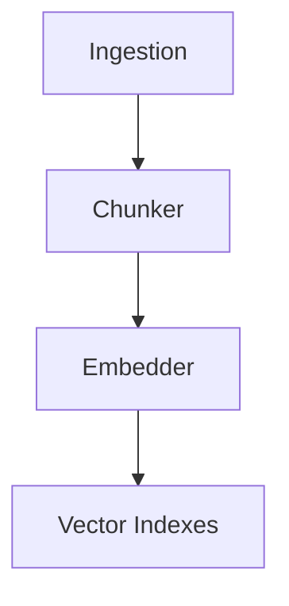
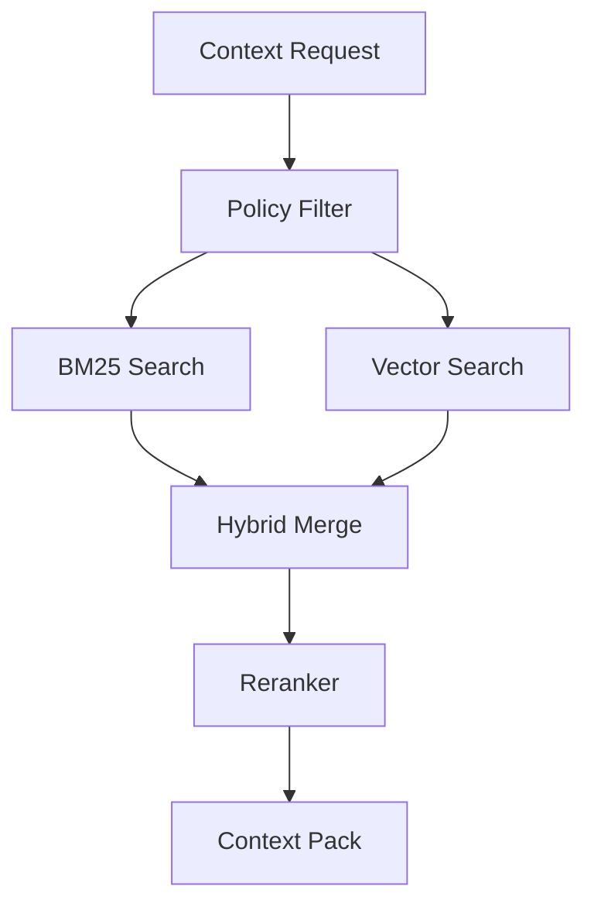
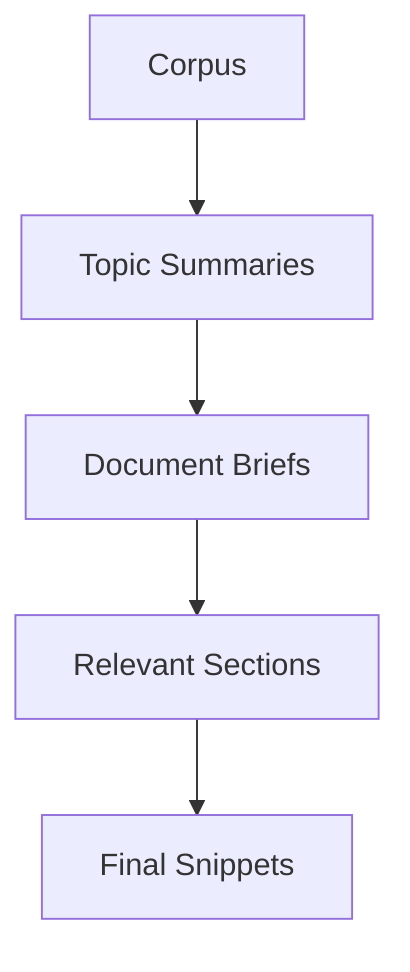

# Vector Search & Retrieval (Design)


## Overview

This document describes the planned evolution from keyword-only retrieval to a full hybrid search stack with vector embeddings, BM25, reranking, and hierarchical retrieval. These enhancements are tracked in Task 32 (Vector Embeddings) and Task 53 (Hierarchical Retrieval).

**Current implementation**: see `docs/architecture/vector-search.md` for the keyword retrieval system in `RecallGateway`.

**Status**: Planned (Approved)
**Task**: T32 (Vector Embeddings + Semantic Search)
**Depends on**: ---

**Note**: Many teams have moved away from vector-only search in favor of BM25 or hybrid pipelines. We should **benchmark** our Archive on keyword vs hybrid vs pure vector before locking in the final retrieval stack.

## Embedding Model Selection

| Criterion | Decision |
|-----------|----------|
| Model | `nomic-embed-text` via Ollama |
| Dimensions | 768 |
| Provider | Ollama (local-only, no cloud dependency) |
| Max tokens | 8192 (handles full chunks without truncation) |
| Quantization | Q4_0 for speed, F16 for quality-critical indexes |

**Rationale**: nomic-embed-text provides a good quality/speed tradeoff at 768 dimensions. It runs locally via Ollama, keeping all embeddings private. Its 8192 token context window exceeds our 512-token chunk size. Alternatives considered: `bge-large-en-v1.5` (1024-dim, higher memory), `all-MiniLM-L6-v2` (384-dim, lower quality), `mxbai-embed-large` (1024-dim, heavier).

### Rust Types

```rust
use serde::{Deserialize, Serialize};

#[derive(Debug, Clone, Serialize, Deserialize)]
pub struct EmbeddingConfig {
    pub model_name: String,        // "nomic-embed-text"
    pub dimensions: usize,         // 768
    pub ollama_endpoint: String,   // "http://localhost:11434"
    pub batch_size: usize,         // 32
    pub quantization: Quantization,
}

#[derive(Debug, Clone, Copy, Serialize, Deserialize)]
#[serde(rename_all = "snake_case")]
pub enum Quantization {
    Q4_0,
    F16,
}

impl Default for EmbeddingConfig {
    fn default() -> Self {
        Self {
            model_name: "nomic-embed-text".to_string(),
            dimensions: 768,
            ollama_endpoint: "http://localhost:11434".to_string(),
            batch_size: 32,
            quantization: Quantization::Q4_0,
        }
    }
}
```

### Embedding API

```rust
use anyhow::Result;
use thiserror::Error;

#[derive(Debug, Error)]
pub enum EmbedError {
    #[error("ollama unavailable: {0}")]
    OllamaUnavailable(String),
    #[error("model not loaded: {0}")]
    ModelNotLoaded(String),
    #[error("embedding dimension mismatch: expected {expected}, got {actual}")]
    DimensionMismatch { expected: usize, actual: usize },
    #[error("chunk too large: {tokens} tokens exceeds max {max}")]
    ChunkTooLarge { tokens: usize, max: usize },
    #[error("batch failed: {0}")]
    BatchFailed(String),
}

#[async_trait::async_trait]
pub trait Embedder: Send + Sync {
    /// Embed a single text chunk, returning a vector of `dimensions` floats.
    async fn embed(&self, text: &str) -> Result<Vec<f32>, EmbedError>;

    /// Embed a batch of text chunks.
    async fn embed_batch(&self, texts: &[&str]) -> Result<Vec<Vec<f32>>, EmbedError>;

    /// Return the model name for metadata storage.
    fn model_name(&self) -> &str;

    /// Return the expected embedding dimensions.
    fn dimensions(&self) -> usize;
}
```

## Planned: Embedding Pipeline



Chunking and embedding rules: `docs/design/embedding-chunking.md`.

## Planned: Hybrid BM25 + Vector Search

Merge keyword and vector search results before reranking. BM25 handles exact match lookups; vector search handles semantic similarity.



### Hybrid Scoring Formula

Combined score for each result:

```
score = alpha * bm25_norm + (1 - alpha) * cosine_sim
```

Where:
- `alpha = 0.4` (keyword weight; tunable per query type)
- `bm25_norm` = BM25 score normalized to `[0.0, 1.0]` by dividing by max BM25 score in result set
- `cosine_sim` = cosine similarity from vector search, already in `[0.0, 1.0]`

**Routing heuristic**: both searches run in parallel. If BM25 returns >= 5 results with score > 0.5, vector results are used only for reranking. If BM25 returns < 5 results, vector results fill the gap.

```rust
#[derive(Debug, Clone, Copy)]
pub struct HybridConfig {
    /// Weight for BM25 scores (0.0 to 1.0). Vector weight = 1.0 - alpha.
    pub alpha: f32,
    /// Maximum candidates from each search before merge.
    pub max_candidates_per_source: usize,
    /// Minimum BM25 results before vector backfill kicks in.
    pub bm25_sufficiency_threshold: usize,
}

impl Default for HybridConfig {
    fn default() -> Self {
        Self {
            alpha: 0.4,
            max_candidates_per_source: 50,
            bm25_sufficiency_threshold: 5,
        }
    }
}

/// A merged search result with hybrid score.
#[derive(Debug, Clone)]
pub struct HybridResult {
    pub chunk_id: String,
    pub source_id: String,
    pub bm25_score: Option<f32>,
    pub vector_score: Option<f32>,
    pub hybrid_score: f32,
}

/// Merge BM25 and vector results using reciprocal rank fusion as fallback
/// when scores are not directly comparable.
pub fn merge_results(
    bm25_results: &[ScoredChunk],
    vector_results: &[ScoredChunk],
    config: &HybridConfig,
) -> Vec<HybridResult> {
    // Implementation: normalize BM25, compute hybrid_score, deduplicate by chunk_id
    todo!()
}
```

## Planned: Reranker

An optional semantic rerank step after hybrid merge. The reranker re-scores the top-K merged results using a cross-encoder or similar model to improve precision.

- Reranker runs locally to avoid leaking content to cloud.
- Top-K is configurable (default: 20 candidates, return top 5).
- If reranker is unavailable, fall back to score-based ordering from the hybrid merge.

### Reranker Fallback Chain

1. **Primary**: Local cross-encoder reranker (if available and loaded)
2. **Fallback 1**: Hybrid score ordering (no reranking)
3. **Fallback 2**: BM25-only ordering (if vector search also fails)

```rust
#[derive(Debug, Clone, Copy)]
pub struct RerankerConfig {
    /// Number of candidates to rerank.
    pub top_k_input: usize,
    /// Number of results to return after reranking.
    pub top_k_output: usize,
    /// Timeout for reranker inference in milliseconds.
    pub timeout_ms: u64,
}

impl Default for RerankerConfig {
    fn default() -> Self {
        Self {
            top_k_input: 20,
            top_k_output: 5,
            timeout_ms: 5000,
        }
    }
}

#[derive(Debug, Error)]
pub enum RerankerError {
    #[error("reranker model not available")]
    ModelUnavailable,
    #[error("reranker timed out after {0}ms")]
    Timeout(u64),
    #[error("reranker inference failed: {0}")]
    InferenceFailed(String),
}

#[async_trait::async_trait]
pub trait Reranker: Send + Sync {
    /// Rerank candidates given the original query. Returns reordered results.
    async fn rerank(
        &self,
        query: &str,
        candidates: Vec<HybridResult>,
        config: &RerankerConfig,
    ) -> Result<Vec<HybridResult>, RerankerError>;
}
```

## Planned: Hierarchical Retrieval

To prevent semantic collapse at scale, retrieval is hierarchical:



**Rule**: Always return the **smallest sufficient unit** (snippet > section > doc > topic > corpus).

This prevents the context pack from being filled with large documents when a single snippet would suffice.

## Planned: Sensitivity-Partitioned Indexes

Separate vector indexes by sensitivity level. Each index is a standalone collection to prevent cross-sensitivity leakage.

| Index | Contents | Access | Storage |
|-------|----------|--------|---------|
| `shareable` | Public/shareable entries | Cloud + local models | May mirror remotely |
| `restricted` | Internal entries | Local models only | Local-only, encrypted at rest |
| `private` | Private entries | Local models only | Local-only, encrypted at rest |

### Index Management

```rust
use std::path::PathBuf;

#[derive(Debug, Clone, Serialize, Deserialize)]
pub struct VectorIndexConfig {
    /// Base directory for all vector indexes.
    pub index_dir: PathBuf,
    /// Sensitivity level this index serves.
    pub sensitivity: Sensitivity,
    /// Embedding dimensions (must match model).
    pub dimensions: usize,
    /// Maximum entries before index rebuild/compaction.
    pub max_entries: usize,
}

#[derive(Debug, Error)]
pub enum IndexError {
    #[error("index not found for sensitivity {0:?}")]
    IndexNotFound(Sensitivity),
    #[error("dimension mismatch: index expects {expected}, got {actual}")]
    DimensionMismatch { expected: usize, actual: usize },
    #[error("index corrupted: {0}")]
    Corrupted(String),
    #[error("index full: {count} entries exceeds max {max}")]
    Full { count: usize, max: usize },
    #[error("io error: {0}")]
    Io(#[from] std::io::Error),
}

/// Operations on a single sensitivity-partitioned vector index.
#[async_trait::async_trait]
pub trait VectorIndex: Send + Sync {
    /// Insert a chunk embedding into the index.
    async fn insert(&self, chunk_id: &str, embedding: &[f32]) -> Result<(), IndexError>;

    /// Search for the top-k nearest neighbors.
    async fn search(&self, query_embedding: &[f32], top_k: usize) -> Result<Vec<ScoredChunk>, IndexError>;

    /// Remove a chunk from the index.
    async fn remove(&self, chunk_id: &str) -> Result<(), IndexError>;

    /// Rebuild the index from scratch (e.g., after corruption).
    async fn rebuild(&self) -> Result<(), IndexError>;

    /// Return the number of indexed chunks.
    fn count(&self) -> usize;
}

/// A chunk with its similarity score from vector search.
#[derive(Debug, Clone)]
pub struct ScoredChunk {
    pub chunk_id: String,
    pub score: f32,
}
```

### Query Routing by Sensitivity

```rust
/// Determine which indexes to query based on the context request.
pub fn select_indexes(
    model_class: ModelClass,
    sensitivity_max: Sensitivity,
) -> Vec<Sensitivity> {
    match model_class {
        ModelClass::Cloud => vec![Sensitivity::Shareable],
        ModelClass::Hybrid => match sensitivity_max {
            Sensitivity::Shareable => vec![Sensitivity::Shareable],
            Sensitivity::Restricted => vec![Sensitivity::Shareable, Sensitivity::Restricted],
            Sensitivity::Private => vec![Sensitivity::Shareable, Sensitivity::Restricted, Sensitivity::Private],
        },
        ModelClass::Local => match sensitivity_max {
            Sensitivity::Shareable => vec![Sensitivity::Shareable],
            Sensitivity::Restricted => vec![Sensitivity::Shareable, Sensitivity::Restricted],
            Sensitivity::Private => vec![Sensitivity::Shareable, Sensitivity::Restricted, Sensitivity::Private],
        },
    }
}
```

## Integration with Recall Gateway

The existing `RecallGateway` in `submodules/runtime/crates/symbiotic-context/src/lib.rs` gains an optional `VectorSearchProvider`:

```rust
pub struct RecallGateway {
    provider: Arc<dyn ArchiveProvider>,
    audit: Arc<dyn AuditSink>,
    /// Optional vector search — degrades to keyword-only when None.
    vector: Option<Arc<dyn VectorSearchProvider>>,
    hybrid_config: HybridConfig,
}

#[async_trait::async_trait]
pub trait VectorSearchProvider: Send + Sync {
    async fn search(
        &self,
        query: &str,
        sensitivity_levels: &[Sensitivity],
        top_k: usize,
    ) -> Result<Vec<ScoredChunk>, IndexError>;
}
```

When `vector` is `Some`, the gateway runs hybrid search. When `None`, it falls back to keyword-only (current behavior), ensuring backward compatibility.

## Test Strategy

| Test | Type | Description |
|------|------|-------------|
| Embedding round-trip | Unit | Embed text, verify dimensions and non-zero values |
| Hybrid merge dedup | Unit | Same chunk from BM25 and vector merged without duplicates |
| Sensitivity routing | Unit | `select_indexes` returns correct indexes per model class |
| Reranker fallback | Unit | Verify fallback ordering when reranker is unavailable |
| Score normalization | Unit | BM25 normalization to [0,1] with edge cases (all zero, single result) |
| Full pipeline | Integration | Ingest doc, embed, hybrid search, verify relevant result in top 5 |
| Keyword-only degradation | Integration | With vector=None, verify keyword-only path works unchanged |
| Index rebuild | Integration | Corrupt index, rebuild, verify search still works |

## Key Decisions

1. **BM25-first routing**: keyword search handles most lookups; vector search is fallback.
2. **Sensitivity partitioning**: separate indexes per level; private/restricted remain local; shareable may mirror remotely.
3. **Hybrid retrieval**: `score = 0.4 * bm25_norm + 0.6 * cosine_sim` with tunable alpha.
4. **Token budgets enforced at pack build**: Recall Gateway trims by relevance and size.
5. **Evidence-linked memory**: memory hits must reference Archive evidence (`article_id`, `source_url`).
6. **Benchmark before committing**: validate hybrid vs keyword-only on real archive data.
7. **Model choice**: nomic-embed-text via Ollama (768-dim, 8192 token window, local-only).
8. **Reranker fallback**: hybrid score ordering when reranker unavailable, BM25-only as last resort.

## Error Handling

| Error | Handling |
|-------|----------|
| Embedding failure | Store chunk without embedding and mark for retry |
| Ollama unavailable | Degrade to keyword-only search; log warning |
| Index corruption | Rebuild index from source data |
| Policy violation | Drop results and request user approval |
| Token overflow | Truncate by relevance or return Briefs |
| Missing embeddings | Fallback to keyword search |
| Reranker unavailable | Use score-based ordering from hybrid merge |
| Dimension mismatch | Reject embedding and log error; do not store |

## Related Docs

- `docs/architecture/vector-search.md` (current implementation)
- `docs/architecture/context-delivery.md`
- `docs/design/embedding-chunking.md`
